# 如何在 Gmail 中创建文件夹

> 原文：<https://www.javatpoint.com/how-to-create-folders-in-gmail>

**类似问题:**

*   如何在 Gmail 中制作文件夹

我们可以使用电脑在 Gmail 中轻松创建文件夹。

我们无法使用手机应用程序创建标签或文件夹。但是，我们可以通过 [Gmail](gmail) 手机应用程序移动或更改电子邮件的标签。

**Gmail 中有哪些文件夹？**

文件夹是对收到的电子邮件进行分类和管理的一种方式。我们还可以将电子邮件分组到不同的文件夹中。文件夹是使用标签创建的。

Gmail 中的标签类似于文件夹的创建方式。我们可以轻松地添加和删除我们最喜欢的文件夹中的电子邮件。

在这里，所选的电子邮件用指定的标签标记。我们也可以创建多个文件夹。

让我们从步骤开始。

### 使用计算机在 Gmail 中创建文件夹

在 Gmail 中为文件夹创建标签的步骤如下:

1.打开 Gmail 帐户，使用 Gmail ID 和密码登录。
我们可以直接使用[网址](https://www.javatpoint.com/url-full-form):[https://mail.google.com/](https://mail.google.com/)。

2.在主页上，有各种电子邮件。拖动鼠标，右键单击我们要添加到文件夹中的电子邮件，如下所示:

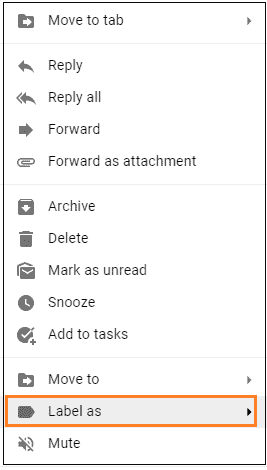

该电子邮件将被自动选择。

3.点击**“标签为”**选项，如上图。

4.“标签为”选项前面会出现一个小对话框。点击**“新建”**选项，如下图:

5.将出现一个对话框，指定文件夹或标签的名称，如下所示:

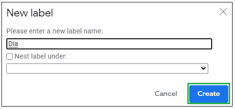

在这里，我们指定了名称 **Dia** 。我们可以根据自己的选择指定任何名字。

6.指定名称后点击**‘创建’**按钮，如上图。

7.标签将出现在选定的电子邮件上，如下所示:

让我们用相同的标签标记另一封电子邮件。步骤如下:

1.拖动鼠标右键点击另一封邮件->点击**“标签为”**选项- >选择 **Dia** ，如下图:

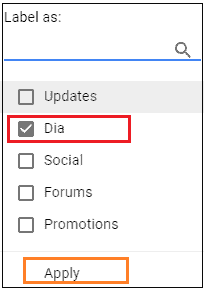

这里，我们选择了 Dia，因为我们想将电子邮件添加到 Dia 文件夹中。

2.点击**‘应用’**按钮，如上图。

现在，我们已经创建了一个标签为 **Dia** 的群组，其中包括两封电子邮件。让我们打开文件夹重新检查一下。

*   打开带有标签 **Dia** 的邮件。
*   在顶部，单击块(此处为直径)，如下所示:

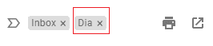

运筹学

*   在页面顶部的搜索栏中输入**标签:直径**，如下图所示:

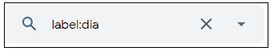

包含两封电子邮件的 Dia 文件夹将显示为:

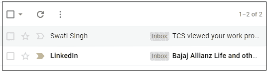

#### 注意:如果我们删除任何具有相同标签的群组，它只会删除标签，而不会删除其中的电子邮件。

### 嵌套标签

嵌套标签帮助我们创建子标签，子标签可以嵌套在父标签下。

我们也可以创建嵌套标签。让我们讨论这个。

下面列出了为组创建嵌套标签的步骤:

1.拖动鼠标，右键单击要标记为嵌套标签的电子邮件。

2.点击**“标签为”**选项- >点击**新建**选项。

3.将出现一个对话框。指定**新标签名** - >点击**下的【巢标】框- >选择**父标签名**，如下图:**

**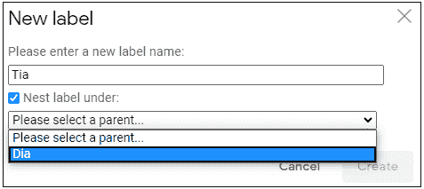

4.点击**创建**按钮保存。

5.带有嵌套标签的电子邮件将显示为:

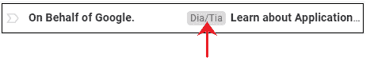

下面列出了在移动设备中创建文件夹的步骤:

### 通过移动应用程序移动或更改标签

如上所述，我们无法使用 Gmail 手机应用程序创建标签。但是，我们可以使用手机在 Gmail 应用程序上更改或移动标签。

让我们讨论一下步骤。

**更换标签**

更改组标签的步骤如下:

1.打开 Gmail 手机应用。

2.转到我们要更改标签的电子邮件。

3.点击电子邮件图标进行选择，如下所示:

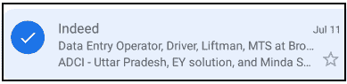

4.点击显示屏右上角的三个垂直点，如下所示:

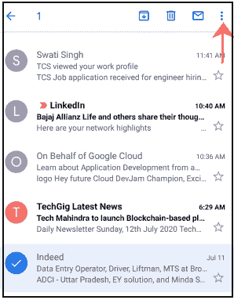

5.将出现一个小的下拉框。点击**“更改标签”**选项，如下图:

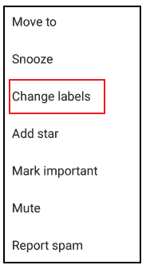

6.选择标签名称，点击**确定**按钮，如下图:

这里我们选择了标签名称 **Dia** 。选定的电子邮件将被视为 Dia 文件夹的电子邮件。

如果我们希望电子邮件保留在收件箱和 Dia 中，我们需要选择两个标签名称，如下所示:

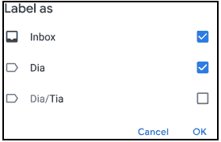

**如何移动标签？**

移动组标签的步骤如下:

1.打开 Gmail 手机应用。

2.转到我们要更改其标签的电子邮件。

3.点击电子邮件图标选择它。

4.单击显示屏右上角的三个垂直点。

5.将出现一个小的下拉框。点击“移动到”选项，如下所示:

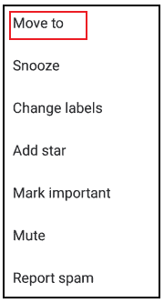

6.选择标签名称。

* * ***