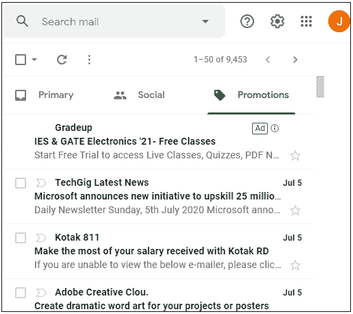
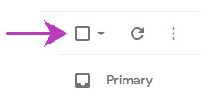
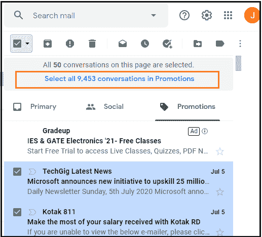
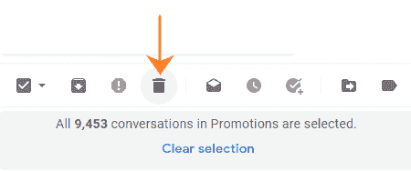
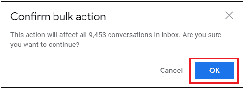
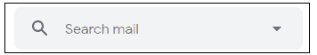
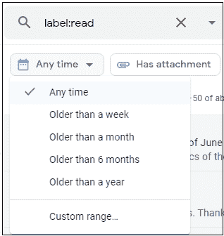
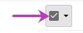
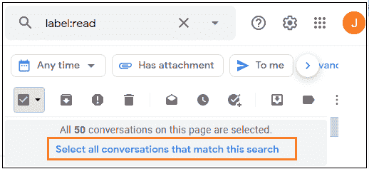
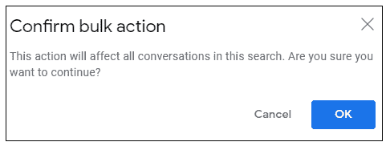

# 如何删除 Gmail 中的所有电子邮件

> 原文：<https://www.javatpoint.com/how-to-delete-all-emails-in-gmail>

**类似问题:**

*   如何删除 Gmail 应用中的所有电子邮件
*   如何在 Gmail 上一次删除所有邮件
*   如何在 Gmail 上批量删除邮件

我们可以轻松地从电脑上删除所有电子邮件。

#### 注意:我们无法从 Gmail 应用程序中删除所有电子邮件。

**删除所有邮件意味着**

这意味着我们想删除我们的 [Gmail](gmail) 账户中的所有电子邮件。我们 Gmail 帐户中的所有电子邮件都被分为**社交、促销和收件箱**文件夹。

我们可以一次快速删除特定文件夹(社交、促销和收件箱)中的所有电子邮件。

**删除所有邮件会怎样？**

从**收件箱**中删除所有电子邮件也会删除星号和重要消息。我们还可以删除任何文件夹中的所有电子邮件，如**已发送、草稿、垃圾邮件**等。使用相同的过程。

从任何文件夹中删除所有电子邮件后，它就会变成空的。这意味着那个文件夹里没有任何一封电子邮件了。

我们开始吧。

**一个文件夹的首页包含多少对话或电子邮件？**

任何文件夹的首页都包括 **50** 封电子邮件或对话。

### 在计算机中一次删除所有电子邮件

The steps to delete all emails from Gmail at once are listed below:

1.打开 Gmail 帐户，使用 Gmail ID 和密码登录。
我们可以直接使用[网址](https://www.javatpoint.com/url-full-form):[https://mail.google.com/](https://mail.google.com/)。

2.在我们帐户的主页上，选择要删除所有电子邮件的文件夹。
在这里，我们选择**‘促销’**文件夹。它将显示为:

3.点击**主**文件夹正上方的小方框，如下图所示:

4.它现在将显示为:

5.因为我们希望删除促销文件夹中的所有电子邮件，而不是单页上的 50 个对话。
要删除，点击**在促销选项中选择所有 xxx 对话**。这里，xxx 是一个文件夹中的电子邮件数量，因帐户而异。

有 9453 封电子邮件在促销。因此，该选项将显示为**“选择促销活动中的所有 9453 个对话”**，如下所示:

我们需要点击上面的选项。

6.现在，点击顶部的**删除**图标，如下图所示:

7.将出现一个小对话框。我们需要**确认批量删除**后才能继续。
那么，点击**【确定】**按钮，如下图:

8.装载将开始。批量电子邮件可能需要几秒钟才能被删除。

9.屏幕现在将显示为:

“促销”文件夹中的所有电子邮件现在都已删除。

### 删除所有已读或未读的电子邮件

我们也可以删除**已读**和**未读**邮件。我们也可以指定任何关键字。

让我们讨论一下步骤。

1.打开 Gmail 帐户，使用电脑上的 Gmail ID 和密码登录。

2.转到我们的 Gmail 帐户主页顶部的搜索栏。键入**标签:已读/未读**。例如，**标签:阅读**

#### 注意:标签:是根据指定的关键字过滤电子邮件的标准。例如，标签:垃圾邮件将显示所有的垃圾邮件。

搜索栏如下图所示:

3.该页面将显示所有已读消息。

4.我们也可以从顶部的**‘任意时间’**选项中选择时间。当我们点击“任何时间”选项时，会出现一个小的下拉框。我们需要从下拉框中选择时间，如下所示:

5.之后，点击**主**文件夹正上方的小方框。

6.点击选项**“选择所有与本次搜索匹配的对话”**删除所有已读邮件，如下图:

7.我们需要点击上面的选项。

8.现在，点击顶部的**删除**图标。

9.将出现一个小对话框。我们需要**确认批量删除**后才能继续。
那么，点击**【确定】**按钮，如下图:

同样，我们可以删除未读邮件、垃圾邮件等。，使用 label:命令。

* * *