# 如何在 Gmail 中安排电子邮件

> 原文：<https://www.javatpoint.com/how-to-schedule-an-email-in-gmail>

我们可以轻松地在电脑和移动设备上安排一封电子邮件。

**安排一封邮件是什么意思？**

Gmail 提供了一种安排电子邮件的方法。我们可以为邮件选择合适的**日期**和**时间**。

选定的电子邮件将在指定的日期和时间自动发送。

这是一个可以在未来发出的信息。我们可以提前写一条消息，设置延迟时间以便消息必须在指定的时间发送。

计划的电子邮件根据指定的时区发送。

**什么时候有用？**

在以下情况下，电子邮件的时间安排非常有用:

*   我们需要在特定的时间发送一封重要的电子邮件。
*   我们想说点什么，但时间不相关。我们可以安排在合适的时间发送消息。
*   我们经常忘记按时发邮件。
*   我们可以在将来有空的时候安排电子邮件，以节省时间。

**我们可以取消预定的邮件吗？**

是的。

我们可以在 Gmail 中取消预定的电子邮件。本主题将讨论进一步的步骤。

**我们可以编辑预定的电子邮件吗？**

是的。

我们可以在 Gmail 中编辑预定的电子邮件。本主题将讨论进一步的步骤。

**我们的 Gmail 账户中可以有多少个日程安排邮件？**

我们的 Gmail 帐户中预定电子邮件的数量限制为 100 封。

让我们从以下步骤开始:

### 在计算机上安排电子邮件

在计算机上的 Gmail 中安排电子邮件的步骤如下:

1.打开 Gmail 帐户，使用 Gmail ID 和密码登录。

我们可以直接使用网址:[https://mail.google.com/](https://mail.google.com/)登录 Gmail。

2.在我们的 Gmail 账户主页上，点击屏幕左上角的**‘撰写’**按钮，如下图所示:

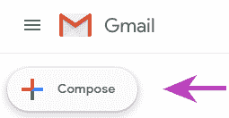

3.将出现一个新的消息框。指定要发送的**收件人、主题和信息**，如下所示:

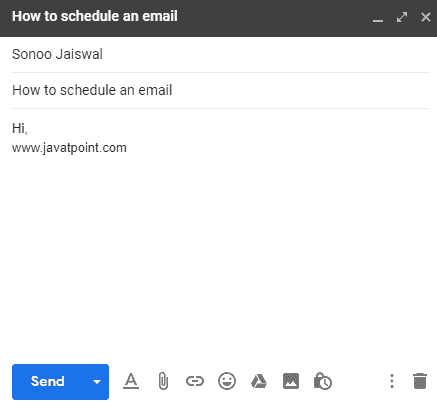

4.点击底部**【发送】**按钮前的小箭头，如下图:

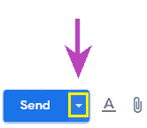

5.将出现一个下拉框。点击**“日程发送”**选项，如下图:

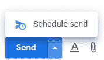

6.将出现一个对话框，指定日期和时间，如下所示:

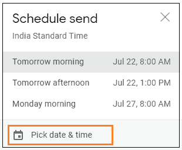

7.点击**“选择日期&时间**选项，如上图所示。

8.将出现一个对话框。根据要求指定日期和时间。

在这里，我们指定了**日期**(7 月 31 日)和**时间**(下午 5:40)。如下所示:

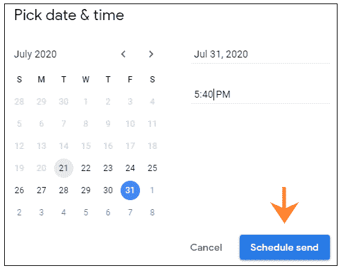

9.点击方框底部的**“计划发送”**选项，如上图所示。

10.现在，电子邮件已安排好，将在指定的日期和时间自动发送。

### 编辑预定的电子邮件

编辑预定电子邮件的步骤如下:

1.打开 Gmail 帐户，使用 Gmail ID 和密码登录。

2.点击主页左上角的**主菜单**图标(三条横线)，如下图:

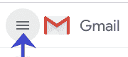

3.点击**日程**选项。如下所示:

4.将打开计划文件夹，如下所示:

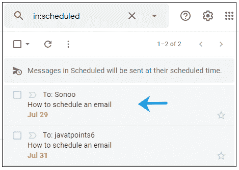

5.点击我们想要编辑的电子邮件。

在这里，我们将首先打开**邮件，如下图所示:**

**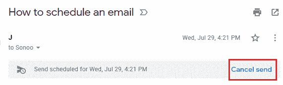

6.点击右侧的**取消发送**选项，如上图所示。

7.计划的时间将被取消，包含所有信息的消息框将重新出现。

按照上述步骤指定更改并再次安排电子邮件。

### 删除预定的电子邮件

删除预定电子邮件的步骤如下:

1.打开 Gmail 帐户，使用 Gmail ID 和密码登录。

2.点击主页左上角的**主菜单**图标(三条横线)，如下图:

3.点击**日程**选项。如下所示:

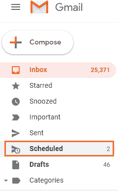

4.计划的文件夹将被打开。单击我们想要删除的任何预定电子邮件。如下所示:

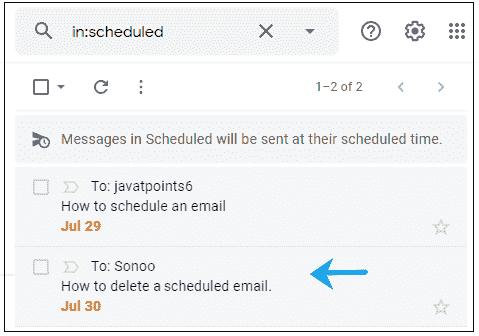

在这里，我们将删除第二封电子邮件，如上所示。

5.点击邮件后面的小方框，如下图:

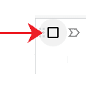

6.它现在将显示为:

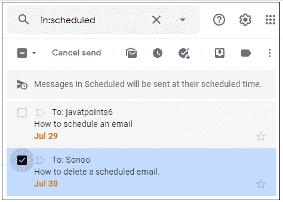

7.点击顶部的**取消发送**选项，如上图。

8.选定的电子邮件将被删除。

#### 注意:已更改或已删除的预定电子邮件始终还原到草稿文件夹。

### 通过 Gmail 应用程序安排电子邮件

通过 Gmail 应用程序安排电子邮件的步骤如下:

1.打开 Gmail 应用程序。

2.在我们的 Gmail 帐户主页上，点击屏幕右下角的**撰写**按钮，如下图所示:

3.将出现一个新的消息框。指定要发送的**收件人、主题和信息**，如下所示:

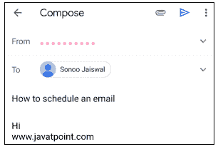

4.点击页面右上角的三个点，如下所示:

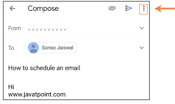

5.将出现一个对话框。点击对话框顶部的**日程发送**选项，如下图所示:

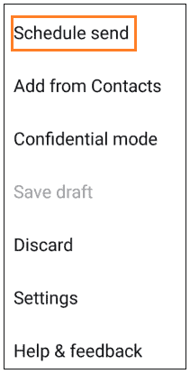

6.将出现一个对话框，指定日期和时间，如下所示:

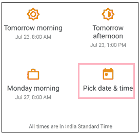

7.点击**“选择日期&时间**选项，如上图所示。

8.将出现一个对话框。根据要求指定日期和时间。

在这里，我们指定了**日期**(7 月 31 日)和**时间**(下午 5:11)。如下所示:

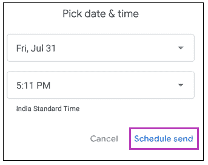

9.点击方框底部的**“计划发送”**选项，如上图所示。

10.现在，电子邮件已安排好，将在指定的日期和时间自动发送。

### 编辑预定的电子邮件

通过 Gmail 应用程序编辑预定电子邮件的步骤如下:

1.打开 Gmail 应用程序。

2.点击首页左上角的**菜单**图标(显示为三条横线)，如下图:

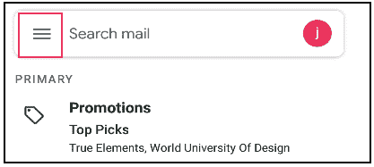

3.向下滚动，点击**“日程”**选项，如下图:

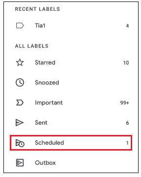

4.“计划”文件夹将打开所有计划的电子邮件。打开我们要编辑的电子邮件。

在这里，我们已经打开了邮件，如下所示:

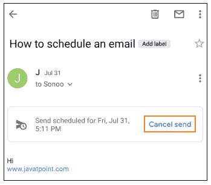

5.点击**“取消发送”**选项，如上图。

6.所选电子邮件将被取消并恢复到**草稿**文件夹。我们可以很容易地编辑草稿文件夹中的电子邮件，并相应地重新安排。

### 删除预定的电子邮件

通过 Gmail 应用程序编辑预定电子邮件的步骤如下:

1.打开 Gmail 应用程序。

2.点击首页左上角的**菜单**图标(显示为三条横线)，如下图:

3.向下滚动，点击**“日程”**选项，如下图:

4.“计划”文件夹将会打开。点击我们要删除的电子邮件后面的图标，如下所示:

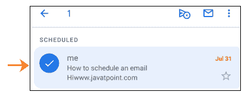

5.点击顶部**取消日程发送**选项，如下图:

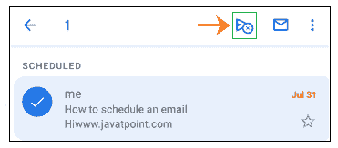

6.选定的预定电子邮件将被删除。

* * ***