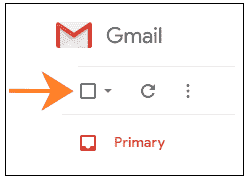
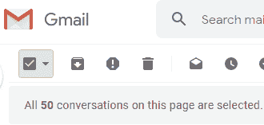
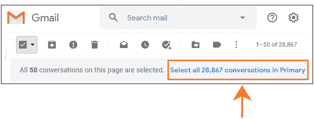
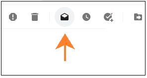
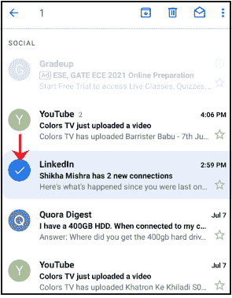
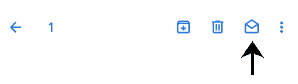
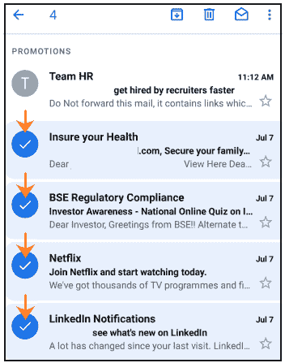
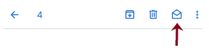

# 如何在 Gmail 中将所有电子邮件标记为已读

> 原文：<https://www.javatpoint.com/how-to-mark-all-emails-as-read-in-gmail>

我们可以在电脑上轻松地将所有邮件标记为在 Gmail 中阅读。

Gmail 应用程序上没有这样的选项。但是，我们可以通过 Gmail 应用程序将一封或多封电子邮件标记为已读。

**将所有电子邮件标记为已读是什么意思？**

这意味着我们希望将文件夹中的所有对话或电子邮件标记为已读。已读消息表示我们已经阅读了该消息。这条消息不需要任何关注。

未读消息和已读消息看起来不同，以获得用户的注意。我们可以选择任何文件夹，如主文件夹、社交文件夹、更新文件夹等。从收件箱中。

### 将所有电子邮件标记为在计算机上阅读

我们来讨论一下过程。

将所有电子邮件标记为在电脑上的 Gmail 中阅读的步骤如下:

1.打开 Gmail 帐户，使用 Gmail ID 和密码登录。

我们可以直接使用网址:[https://mail.google.com/](https://mail.google.com/)。

2.在我们帐户的主页上，从收件箱中选择任何文件夹。

在这里，我们将选择**‘主’**文件夹。

3.点击右上角的主选择按钮，如下所示:

它将选择出现在首页的所有对话，即 50 个。如下所示:

4.要选择任何类别中的所有对话(此处为主要对话)，请单击蓝色的**“选择主要对话中的所有 xxx 对话”**选项，如下所示:

在这里，有 28，867 个初级对话。因此，所有 28，867 个对话将被标记为已读。

5.点击顶部的**“标记为已读”**图标，如下图所示:

6.选定的对话将被标记为已读。

### 将电子邮件标记为通过 Gmail 应用程序阅读

将一封或多封电子邮件标记为通过 Gmail 应用程序阅读的步骤如下:

1.转到 Gmail 应用程序。

2.转到我们要标记为已读的电子邮件。

3.点击邮件后面的图标进行选择，如下图所示:

4.点击顶部的**标记为已读**图标，如下图所示:

5.选定的电子邮件将被标记为已读。

**将多封邮件标记为已读的步骤如下:**

1.转到 Gmail 应用程序。

2.转到我们要标记为已读的电子邮件。

3.点击邮件后面的图标进行选择，如下图所示:

4.点击顶部的**标记为已读**图标，如下图所示:

5.选定的电子邮件将被标记为已读。

* * *