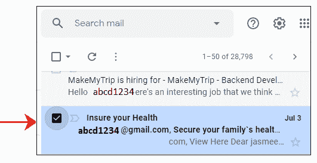
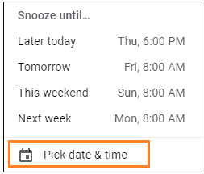
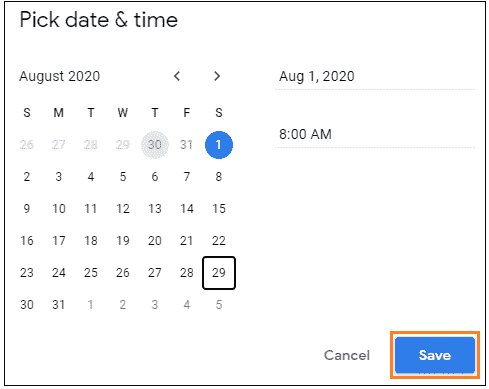
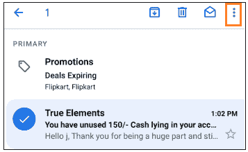
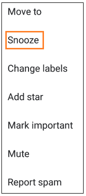
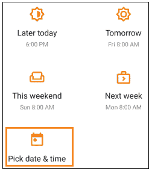
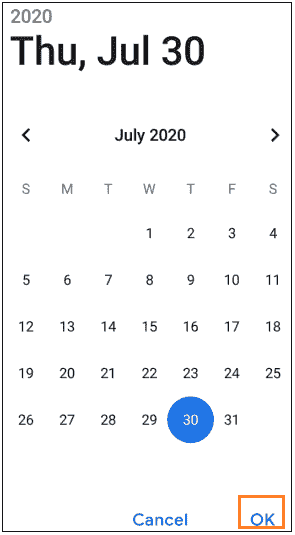
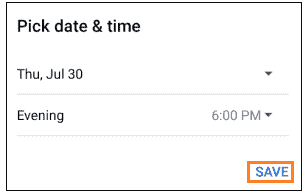

# 如何在 Gmail 中推迟邮件

> 原文：<https://www.javatpoint.com/how-to-snooze-an-email-in-gmail>

**Gmail 中的贪睡是什么意思？**

*   Gmail 中的“暂停”选项会暂时将这些电子邮件从我们的收件箱中删除，并在指定时间显示为弹出窗口。
*   它会将选定的电子邮件保存到以后。
*   选定的电子邮件将在指定的日期和时间返回到我们的收件箱顶部。

我们可以在电脑和移动设备上轻松设置电子邮件的日期和时间。

让我们从步骤开始。

### 窥探电脑上的电子邮件

在电脑上的 Gmail 中暂停电子邮件的步骤如下:

1.打开您的 Gmail 帐户，并使用您的 Gmail ID 和密码登录。

我们可以直接使用网址:[https://mail.google.com/](https://mail.google.com/)

2.打开我们要从中选择要监听的电子邮件的文件夹。在这里，我们将打开**‘Primary’**文件夹。

3.点击我们要删除的邮件后面出现的**小方块**，如下图:

4.它现在将显示为:

5.点击顶部的**暂停**图标，如下图所示:

6.将出现一个用于设置日期和时间的下拉框。点击**设置日期&时间**选项，如下图:

7.将出现指定**日期和时间**的对话框。选择日期和时间，点击**【保存】**按钮，如下图:

8.选定的电子邮件将暂时从收件箱中删除，并在指定的日期和时间重新出现在顶部。

### 通过 Gmail 应用程序窥探电子邮件

通过 Gmail 应用程序在 Gmail 中暂停电子邮件的步骤如下:

1.打开 Gmail 应用程序。

2.单击电子邮件后面要标记为“暂停”的图标。它将选择电子邮件，如下所示:

我们同样可以通过点击多个电子邮件的图标来选择它们。

3.点击页面右上角的三个点，如上图所示。

4.将出现一个下拉框。点击**暂停**选项，如下图:

5.将出现一个设置时间和日期的对话框。点击**设置日期&时间**选项，如下图:

6.将出现一个指定日期的对话框。选择日期，点击底部的**‘确定’**按钮，如下图:

7.将出现一个指定时间的对话框。选择时间，点击**【保存】**按钮，如下图:

8.选定的电子邮件将暂时从收件箱中删除，并在指定的日期和时间重新出现在顶部。

* * *