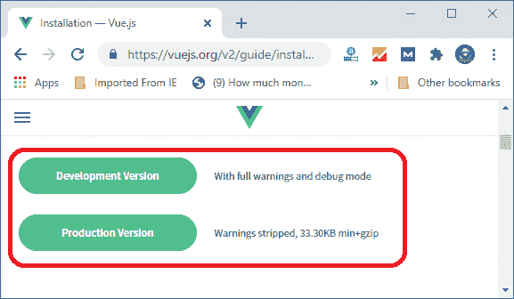
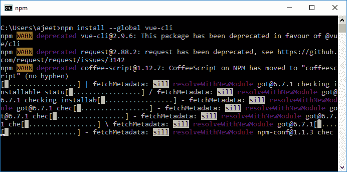
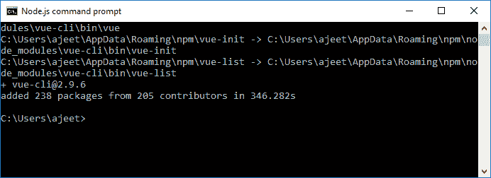
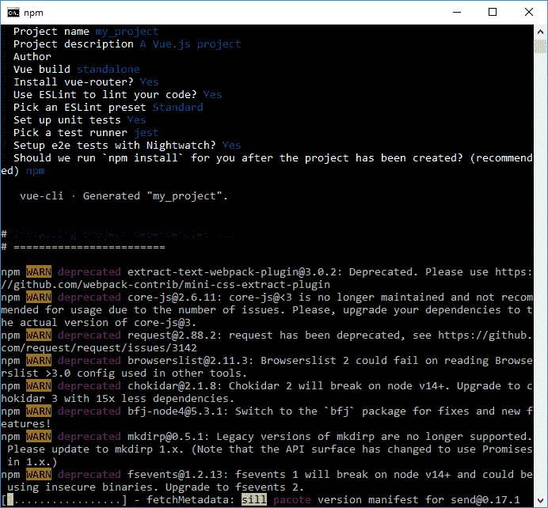
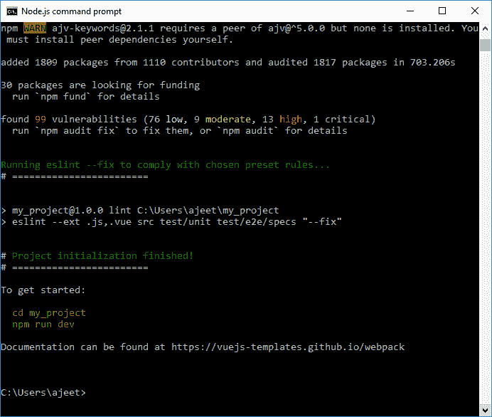
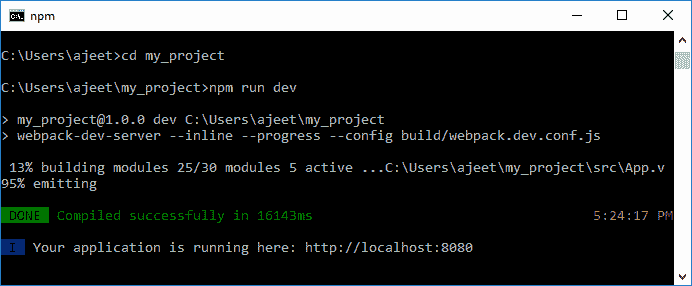
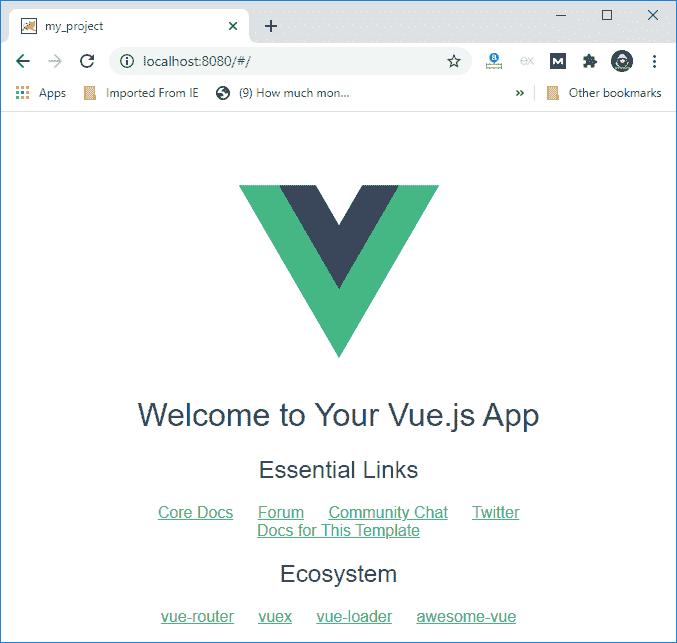

# vue . js 安装

> 哎哎哎:# t0]https://www . javatppoint . com/view-js-installation

### 兼容性检查

在项目中安装和使用 Vue.js 之前，您应该检查兼容性问题。Vue 不支持 IE8 及以下版本的 IE，因为它使用了 IE8 不支持的 ECMAScript 5 功能。它支持所有符合 ECMAScript 5 的浏览器。

### 如何安装 Vue.js？

有几种方法可以使用 Vue.js。你可以通过去它的官方网站来安装它，或者也可以从 CDN 库中开始使用 Vue.js 文件。在这里，我们将讨论一些如何在您的项目中安装和使用 Vue.js 的方法。

### 通过在 HTML 文件中直接使用

如果你想直接在你的 [HTML](https://www.javatpoint.com/html-tutorial) 文件中使用 Vue.js 的 [<脚本>标签](https://www.javatpoint.com/html-script-tag)，那么你必须从官方网站下载。

```

<html>
   <head>
      <script type = "text/javascript" src = "vue.min.js"></script>
   </head>
   <body></body>
</html>

```

让我们继续前进到 vue . js[https://vuejs.org/v2/guide/installation.html](https://vuejs.org/v2/guide/installation.html)官网，根据您的要求下载 [vue.js](vue-js) 。在这里，您将获得两个版本的 Vue.js 来使用——开发版本和生产版本。

**下图为两个版本:**



开发版本最适合在您的项目中使用，因为它没有最小化，并且在项目开发期间帮助您处理警告和调试模式。另一方面，生产版本被最小化，如上图所示。

Vue.js 建议您在开发过程中不要使用迷你版本，因为它不会显示项目开发过程中常见错误的警告。

### 通过使用 CDN

您也可以在应用程序中使用 CDN 库中的 Vue.js 文件。在你的应用中使用<脚本>元素内的[https://unpkg.com/vue](https://unpkg.com/vue)这个链接，你会得到最新版本的 Vue.js。

**例 1:**

```

<!DOCTYPE html>
<html>
<head>
  <title>My first Vue app</title>
  <script src="https://unpkg.com/vue"></script>
</head>
<body>
  <div id="app">
    {{ message }}
  </div>
  <script>
    var app = new Vue({
      el: '#app',
      data: {
        message: 'Vue.js example with CDN'
      }
    })
  </script>
</body>
</html>

```

**输出:**

```
Vue.js example with CDN 

```

您也可以在 jsdelivr(https://cdn . jsdelivr . net/NPM/view/dist/view . js)和 cdnjs(https://cdnjs . cloudflare . com/Ajax/libs/view/2 . 4 . 0/view . js)上找到 view . js。

**例 2:**

```

<!DOCTYPE html>
<html>
<head>
  <title>My first Vue app</title>
<script src="https://cdn.jsdelivr.net/npm/vue/dist/vue.js"></script>  
</head>
<body>
  <div id="app">
    {{ message }}
  </div>
  <script>
    var app = new Vue({
      el: '#app',
      data: {
        message: 'Vue.js second example with CDN'
      }
    })
  </script>
</body>
</html>

```

**输出:**

```
Vue.js second example with CDN 

```

### 通过使用 NPM

如果你想用 VueJS 做一个大规模的应用，建议使用 NPM。使用以下命令使用 npm 包安装 Vue.js。它附带了浏览器和网络包，以及其他使开发变得容易的必要工具。

```

npm install vue 

```

#### 注意:如果你还不熟悉基于 Node.js 的构建工具，不要使用这个方法。

### 通过使用命令行界面命令行

您也可以使用命令行界面安装 Vue.js，并开始激活服务器。使用以下命令使用命令行界面安装 Vue.js:

```

npm install --global vue-cli 

```



安装 Vue.js cli 需要几分钟时间。一旦完成，它将显示 Vue.js 的 CLI 版本。

```

+ vue-cli@2.9.6
added 238 packages from 205 contributors in 346.282s 

```



### 使用 Webpack 创建项目

使用以下命令使用 Webpack 创建一个项目。在这里，我们要创建一个名为**“my _ project”的项目。**

```

vue init webpack my_project 

```

在此过程中，您将被要求键入 Y/n。键入 Y 并继续。它将自动下载模板和所有依赖项。



成功创建项目后，您将看到如下截图所示的消息。



### 启动项目和服务器

*   现在，项目创建完毕。使用以下命令转到项目目录:

```

cd my_project

```

*   使用以下命令启动服务器:

```

npm run dev 

```



您可以看到，在运行 npm 运行 dev 命令后，服务器启动了。现在，打开兼容的浏览器即 Google Chrome，运行 localhost http://localhost:8080/#/打开你的项目。



* * *