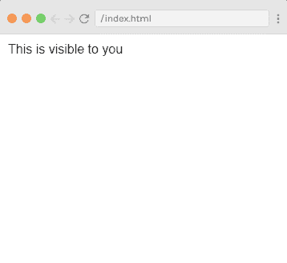
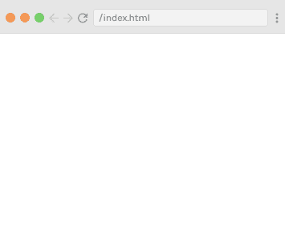
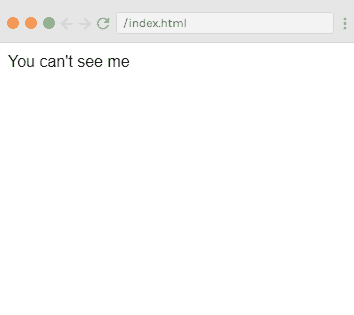
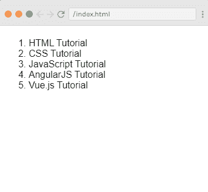
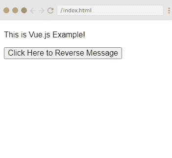
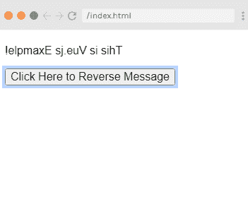
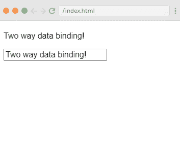
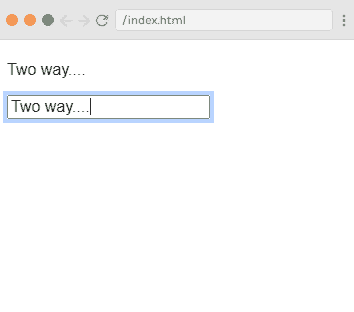
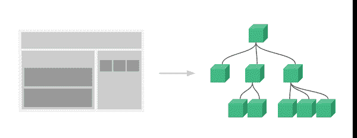
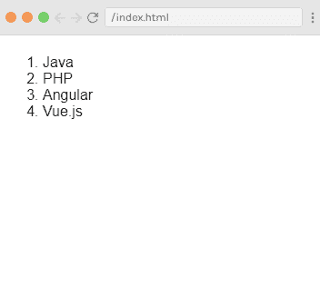

# Vue.js 条件和循环

> 原文：<https://www.javatpoint.com/vue-js-conditions-and-loops>

所有编程语言都使用条件和循环来提供重复的控制结构。他们可以根据条件重复一个或多个不同的步骤。同样的我们可以用在 [Vue.js](https://www.javatpoint.com/vue-js) 的情况下。

### 垂直中频指令示例

**Index.html 文件:**

```

<html>
    <head>
        <link rel="stylesheet" href="index.css">
        <script src="https://cdn.jsdelivr.net/npm/vue/dist/vue.js"></script>
    </head>
    <body>       
        <div id="app">
<span v-if="seen">This is visible to you</span>
        </div>           
        <script src="index.js"></script>
    </body>
</html>

```

**Index.js 文件:**

```

var app = new Vue({
  el: '#app',
  data: {
    seen: true
  }
})

```

#### 注意:在这里，我们使用了一个简单的 CSS 文件来使输出更加吸引人。以下所有示例的 CSS 文件都是相同的。

**Index.css 文件:**

```

html, body {
    margin: 5px;
    padding: 0;
}

```

**输出:**

```
This is visible to you

```



在上例中，如果输入**app 3 . seed = false**，会看到消息消失。

### 示例 2:

**Index.html 文件:**

```

<html>
    <head>
        <link rel="stylesheet" href="index.css">
        <script src="https://cdn.jsdelivr.net/npm/vue/dist/vue.js"></script>
    </head>
    <body>       
        <div id="app">
<span v-if="seen">This is visible to you</span>
        </div>           
        <script src="index.js"></script>
    </body>
</html>

```

**Index.js 文件:**

```

var app = new Vue({
  el: '#app',
  data: {
    seen: false
  }
})

```

**输出:**



在上面的例子中，您可以看到，您不仅可以将数据绑定到文本和属性，还可以绑定到 DOM 的结构。Vue 还提供了强大的过渡效果系统，当 Vue 插入、更新或移除元素时，可以自动应用过渡效果。

### v- else-if 指令示例

在上面的例子中，我们可以使用 v- else-if 指令来提供 else 功能。通过使用这个指令，如果条件不满足或不为真，那么它将返回您为程序设置的 else 语句。我们来看一个例子。

**Index.html 文件:**

```

<html>
    <head>
        <link rel="stylesheet" href="index.css">
        <script src="https://cdn.jsdelivr.net/npm/vue/dist/vue.js"></script>
    </head>
    <body>       
        <div id="app">
            <span v-if="seen">Now you see me</span>
            <span v-else-if=>You can't see me </span>
        </div>           
        <script src="index.js"></script>
    </body>
</html>

```

**Index.js 文件:**

```

var app = new Vue({
  el: '#app',
  data: {
    seen: false 
  }
})

```

**输出:**

```
You can't see me

```



在上面的例子中，可以看到输出显示为“你看不到我”，设置为 v-else-if 语句。Vue.js 中还有一些其他指令可以用于它们自己的特殊功能。

### 五-指令示例

v-for 指令用于使用数组中的数据显示项目列表。请参见以下示例。

**Index.html 文件:**

```

<html>
    <head>
        <link rel="stylesheet" href="index.css">
        <script src="https://cdn.jsdelivr.net/npm/vue/dist/vue.js"></script>
    </head>
    <body>       
<div id="app-4">
  <ol>
    <li v-for="todo in todos">
      {{ todo.text }}
    </li>
  </ol>
</div>
        <script src="index.js"></script>
    </body>
</html>

```

**Index.js 文件:**

```

var app4 = new Vue({
  el: '#app-4',
  data: {
    todos: [
      { text: 'HTML Tutorial' },
      { text: 'CSS Tutorial' },
      { text: 'JavaScript Tutorial' },
      { text: 'AngularJS Tutorial' },
      { text: 'Vue.js Tutorial' }
    ]
  }
})

```

**输出:**

```

1.  HTML 教程
2.  CSS 教程
3.  JavaScript 教程
4.  angularjs 教程
5.  js tutorial-js 教学课程

```

**输出:**



### 处理用户输入

v-on 指令便于用户与您的 Vue.js 应用程序进行交互。它用于附加调用 Vue 实例上的方法的事件侦听器。让我们看一个 v-on 指令的例子。

### 指令示例

**Index.html 文件:**

```

<html>
    <head>
        <link rel="stylesheet" href="index.css">
        <script src="https://cdn.jsdelivr.net/npm/vue/dist/vue.js"></script>
    </head>
    <body>      
        <div id="app">
            <p>{{ message }}</p>
            <button v-on:click="reverseMessage">Click Here to Reverse Message</button>
        </div>       
        <script src="index.js"></script>
    </body>
</html>

```

**Index.js 文件:**

```

var app = new Vue({
  el: '#app',
  data: {
    message: 'This is  Vue.js Example!'
  },
  methods: {
    reverseMessage: function () {
      this.message = this.message.split('').reverse().join('')
    }
  }
})

```

**输出:**



点击“点击此处反转消息”按钮后，上述字符串将被反转。



在上面的例子中，app 的状态是在不接触 DOM 的情况下更新的。所有的 DOM 操作都由 Vue 自己处理。

### v 型指令示例

v-model 指令用于在表单输入和应用程序状态之间进行双向数据绑定。请参见以下示例:

**Index.html 文件:**

```

<html>
    <head>
        <link rel="stylesheet" href="index.css">
        <script src="https://cdn.jsdelivr.net/npm/vue/dist/vue.js"></script>
    </head>
    <body>       
        <div id="app">
  <p>{{ message }}</p>
  <input v-model="message">
</div>        
        <script src="index.js"></script>
    </body>
</html>

```

**Index.js 文件:**

```

var app6 = new Vue({
  el: '#app',
  data: {
    message: 'Two way data binding!'
  }
})

```

**输出:**



您将在上面的示例中看到数据的自动同步。当您更改一个组件中的数据时，更改将反映在两个组件中。请参见下面的示例:



### 使用组件进行合成

当我们想要构建由小型、独立且通常可重用的组件组成的大规模应用程序时，使用组件系统。一个大的应用程序接口可以抽象成一个组件树:



这里，我们使用 v-bind 指令在重复组件中传递值。请参见以下示例:

**Index.html 文件:**

```

<html>
    <head>
        <link rel="stylesheet" href="index.css">
        <script src="https://cdn.jsdelivr.net/npm/vue/dist/vue.js"></script>
    </head>
    <body>      
        <div id="app">
  <ol>
    <todo-course
      v-for="course in courseList"
      v-bind:todo="course"
      v-bind:key="course.id"
    ></todo-course>
  </ol>
</div>        
        <script src="index.js"></script>
    </body>
</html>

```

**Index.js 文件:**

```

Vue.component('todo-course', {
  props: ['todo'],
  template: '<li>{{ todo.text }}</li>'
})
var app = new Vue({
  el: '#app',
  data: {
    courseList: [
      { id: 0, text: 'Java' },
      { id: 1, text: 'PHP' },
      { id: 2, text: 'Angular' },
      { id: 3, text: 'Vue.js' }
    ]
  }
})

```

**输出:**



* * *