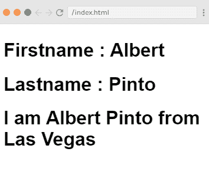
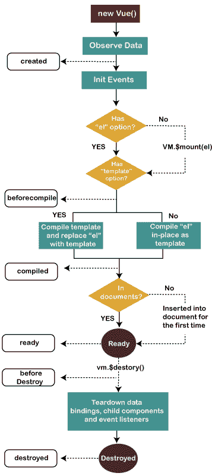

# Vue.js instance-检视. js 执行处理

> 哎哎哎:# t0]https://www . javatppoint . com/view-js-instance

要启动 Vue 应用程序，您必须使用 Vue 函数创建一个新的 Vue 实例。每当我们创建一个新的 Vue 项目时，默认情况下，Vue 实例会在 main.js 文件中被激活。它也被称为根 Vue 实例。

### 语法:

```

var vm = new Vue({
  // options
})

```

Vue 的应用程序设计灵感来自 MVVM 模式。按照惯例，我们必须使用变量 ViewModel 的缩写)来引用我们的 Vue 实例。创建 Vue 实例时，必须传入一个 options 对象。在本文中，您将学习如何使用这些选项来创建您想要的行为。

Vue 应用程序包含一个用新 Vue 创建的根 Vue 实例。它被组织成嵌套和可重用组件的树。例如，如果您创建了一个 todo 应用程序，那么它的组件树可能如下图所示:


#### 注意:所有 Vue 组件也是 Vue 实例。

让我们举一个例子来看看 Vue 构造函数需要具备哪些条件。

**Index.html 文件:**

```

<html>
    <head>
        <link rel="stylesheet" href="index.css">
        <script src="https://cdn.jsdelivr.net/npm/vue/dist/vue.js"></script>
    </head>
    <body>       
<div id = "app">
         <h1>Firstname : {{firstname}}</h1>
         <h1>Lastname : {{lastname}}</h1>
         <h1>{{mydetails()}}</h1>
      </div>
        <script src="index.js"></script>
    </body>
</html>

```

**Index.js 文件:**

```

var  vm = new Vue({
   el: '#app',
   data: {
      firstname : "Albert",
      lastname : "Pinto",
      address : "Las Vegas"
   },
   methods: {
      mydetails : function() {
         return "I am "+this.firstname +" "+ this.lastname +" from "+ this.address;
      }
   }
})

```

让我们用一个简单的 [CSS](https://www.javatpoint.com/css-tutorial) 文件，让输出更有吸引力。

**Index.css 文件:**

```

html, body {
    margin: 5px;
    padding: 0;
}

```

程序执行后，您将看到以下输出:

**输出:**

```
Firstname : Albert
Lastname : Pinto
I am Albert Pinto from Las Vegas

```



### 示例说明

在上例中，可以看到我们使用了一个名为 **el** 的参数。这个**“El”**参数用来携带 DOM 元素的 id。在上面的例子中，我们有 id #app。这是 Index.html 文件中显示的 div 元素的 id。

```

<div id = "app"></div>

```

现在，我们上面程序的逻辑将只影响 div 元素，不影响它之外的任何东西。

在定义了 id 之后，我们已经定义了数据对象。在数据对象中，我们定义了一些值，如名字和姓氏。这也是在 [< div >](https://www.javatpoint.com/html-div-tag) 元素内部定义的。例如，

```

<div id = "app">
   <h1>Firstname : {{firstname}}</h1>
   <h1>Lastname : {{lastname}}</h1>
</div> 

```

这里，**名字:{{firstname}}** 值指定数据对象中存储数据的名字。当您执行该程序时，它将在插值内部被替换，即{{}}替换为数据对象中分配的值，即 Albert。

姓氏与**姓氏相同:{{lastname}}** 值指定数据对象中存储数据的姓氏。当您执行程序时，它将在插值内部被替换，即{{}}替换为数据对象中分配的值，即 Pinto。

在定义了数据对象之后，我们有了定义名为“mydetails”的函数并返回值的方法。它也在

元素中定义为

```

<h1>{{mydetails()}}</h1>

```

因此，您可以看到函数 mydetails 是在{{} }内部调用的。您可以看到 Vue 实例中返回的值打印在{{}}内部。

### 实例生命周期挂接视图

每个 Vue 实例都要经历一系列初始化步骤。当您创建一个实例时，它需要设置数据观察，编译模板，将实例装载到 DOM，并在数据发生变化时更新 DOM。这个过程被称为 Vue 实例的生命周期。

### Vue 实例的生命周期图



### Vue 实例生命周期钩子的解释

下面是 Vue 实例经历的所有事件或钩子的列表。 [Vue.js](https://www.javatpoint.com/vue-js) 实例生命周期有八个生命周期事件/方法或钩子:

1.  在创建钩子之前
2.  创建钩子
3.  安装挂钩前
4.  安装钩
5.  更新挂钩前
6.  更新挂钩
7.  在摧毁钩子之前
8.  毁坏的钩子

**beforeCreate()钩子:**before create()钩子是创建过程中发生的第一个事件或钩子。它便于开发人员在组件被添加到 DOM 之前就执行操作。我们无法访问该事件内部的 DOM。在这个钩子中，数据仍然不是反应性的，在组件生命周期中发生的事件还没有被设置。

**created()钩子:**created()钩子用于在创建实例后运行代码。它方便您访问反应性数据，但是模板和虚拟 DOM 的安装或呈现尚未完成。在这个钩子中，事件是活动的，并且虽然模板还没有被装载或呈现，但是对反应性数据的访问是启用的。

**beforeMount()钩子:**before mount()钩子用于在初始渲染发生之前以及模板或渲染函数编译完成之后执行。它是在模板被编译和虚拟 DOM 被 Vue 更新后调用的。这是很少使用的事件，在大多数情况下，您不需要使用这个事件。

**挂载()钩子:**挂载()钩子是最常用的事件或钩子。这个钩子提供了对这个钩子中的反应组件、模板和渲染的 DOM 的完全访问；您可以完全访问反应组件、模板和渲染的 DOM。

**beforeUpdate()钩子:**before update()钩子刚好在组件上的数据更改和更新周期开始之前执行。它就在 DOM 被修补和重新呈现之前运行。

**更新的()钩子:**更新的()钩子用于在组件上的数据发生变化并且 DOM 重新呈现后执行。如果您想在属性更改后访问 DOM，这是完成此操作的最佳位置。

**beforeDestroy()钩子:**before destroy()钩子用于在拆除实例之前执行。这是 Vue Instance 生命过程的第二个也是最后一个步骤，如果您不得不这样做，这是清理事件或被动订阅的合适位置。

**销毁的()钩子:**销毁的()钩子是 Vue.js Instance 生命过程的最后一步，用于做任何最后一分钟的清理。

* * *