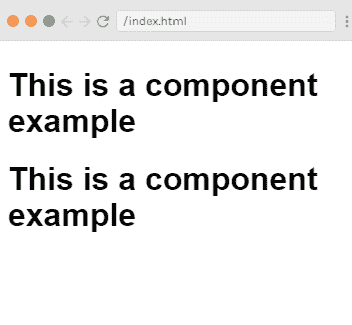
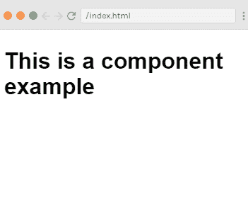
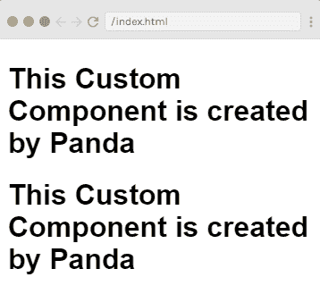
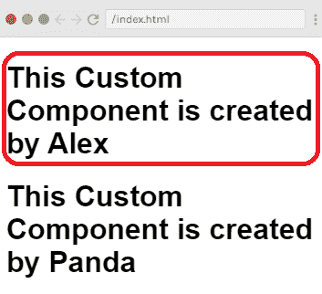
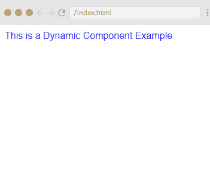

# view . js component-检视. js 元件

> 哎哎哎:# t0]https://www . javatppoint . com/view-js-component

Vue.js 组件是 Vue.js 最重要的特性之一，用于创建可在 [HTML](https://www.javatpoint.com/html-tutorial) 中重用的自定义元素。组件是具有名称的可重用 Vue.js 实例。我们可以在根 [Vue.js 实例](vue-js-instance)中使用一个组件作为定制元素。

以下是创建组件的语法。

**语法:**

```

Vue.component('nameofthecomponent',{ // options});

```

让我们创建一个组件来更好地理解组件如何与 [Vue.js](https://www.javatpoint.com/vue-js) 一起工作。请参见以下示例:

**Index.html 文件:**

```

<html>
   <head>
      <title>Vue.js Component</title>
      <link rel="stylesheet" href="index.css">
        <script src="https://cdn.jsdelivr.net/npm/vue/dist/vue.js"></script>
    </head>
    <body>
      <div id = "component_test1">
         <testcomponent></testcomponent>
      </div>
      <div id = "component_test2">
         <testcomponent></testcomponent>
      </div>
      <script src="index.js"></script>
   </body>
</html>

```

**Index.js 文件:**

```

Vue.component('testcomponent',{
   template : '<div><h1>This is a component example</h1></div>'
});
var vm = new Vue({
   el: '#component_test1'
});
var vm1 = new Vue({
   el: '#component_test2'
});

```

让我们使用一个简单的 CSS 文件来使输出更加吸引人。

**Index.css 文件:**

```

html, body {
    margin: 5px;
    padding: 0;
}

```

程序执行后，您将看到以下输出:

**输出:**

```
This is a component example
This is a component example

```



### 示例说明

在上面的例子中，我们在**Index.html 文件中创建了两个 div，id 分别为 **component_test1** 和 **component_test2** 。**一旦创建了一个组件，该组件的名称就变成了自定义元素，我们可以在创建的 Vue 实例元素中使用这个自定义元素，即在 div 内部使用 ids component_test1 和 component_test2。这里，我们使用了一个测试组件作为组件的名称，并且在 div 中使用了相同的名称作为定制元素。

```

<div id = "component_test1">
   <testcomponent></testcomponent>
</div>
<div id = "component_test2">
   <testcomponent></testcomponent>
</div>

```

在**索引中。js 文件**，我们已经用各自的 div ids 创建了两个 Vue.js 实例。

```

var vm = new Vue({
   el: '#component_test1'
});
var vm1 = new Vue({
   el: '#component_test2'

```

我们已经创建了一个用于两个视图实例的公共组件。

```

Vue.component('testcomponent',{
   template : '<div><h1>This is a component example</h1></div>' 

```

### 组件的本地注册

通过使用 Index.js 文件中的以下代码，我们可以直接使组件成为 vue.js 实例的一部分。这种方法称为本地注册。在这里，组件将只是创建的 vue 实例的一部分。

```

var vm = new Vue({
   el: '#component_test1',
   components:{
      'testcomponent': {
        template : '<div><h1>This is a component example</h1></div>' 
      }
   }
});

```

程序执行后，您将看到以下输出:

**输出:**



### 具有更多选项的 Vue.js 组件

我们可以给 Vue.js 组件添加一些更多的选项，比如数据和方法。这与我们向 Vue.js 实例添加数据和方法是一样的。请参见以下示例:

**Index.html 文件:**

```

<html>
   <head>
      <title>Vue.js Component</title>
      <link rel="stylesheet" href="index.css">
        <script src="https://cdn.jsdelivr.net/npm/vue/dist/vue.js"></script>
    </head>
    <body>
      <div id = "component_test1">
         <testcomponent></testcomponent>
      </div>
      <div id = "component_test2">
         <testcomponent></testcomponent>
      </div>
      <script src="index.js"></script>
   </body>
</html>

```

**Index.js 文件:**

```

Vue.component('testcomponent',{
   template : '<div v-on:mouseover = "changename()" v-on:mouseout = "originalname();"><h1>This Custom Component is created by <span id = "name">{{name}}</span></h1></div>',
   data: function() {
      return {
         name : "Panda"
      }
   },
   methods:{
      changename : function() {
         this.name = "Alex";
      },
      originalname: function() {
         this.name = "Panda";
      }
   }
});
var vm = new Vue({
   el: '#component_test1'
});
var vm1 = new Vue({
   el: '#component_test2'
});

```

在上面的 Index.js 文件中，我们以返回对象的函数的形式添加了一个数据。该对象有一个名称属性，该属性分配了值“熊猫”。请参见示例中使用的以下模板。

```

template : '<div v-on:mouseover = "changename()" v-on:mouseout = "originalname();"><h1>This Custom Component is created by <span id = "name">{{name}}</span></h1></div>',
   data: function() {
      return {
         name : "Panda"
      }

```

这里，我们在组件中使用数据作为函数，并且我们也使用它的属性，就像我们使用直接 Vue 实例一样。这里我们用了两种方法，**改名**和**原名**。在 changename 中，我们正在更改 name 属性，在 originalname 中，我们正在将其重置回原始名称。

我们还在 div 上添加了两个事件，**鼠标悬停在**上和**鼠标悬停在**上。这里，mouseover 事件用于调用 changename 方法，mouseout 事件用于调用 originalname 方法。

现在，执行上面的程序来查看输出。程序执行后，您将看到以下输出:

**输出:**



您可以看到输出显示了我们在 Index.js 文件的 data 属性中设置的指定名称“Panda”。我们还在 div 上分配了一个鼠标悬停和一个 mouseout 事件。所以在鼠标悬停时，您会看到组件的名称更改为 Alex，当鼠标移出时，它将保持与熊猫相同。



### 动态组件

动态组件是指在构建时应用程序中没有定义位置的组件。我们没有在任何 Vue.js 模板中定义它。相反，动态组件在运行时被实例化并放置在应用程序中。在 Vue.js 中，使用关键字创建一个动态组件，并使用一个属性对其进行绑定。让我们举个例子来清楚地理解它。

**Index.html 文件:**

```

<html>
   <head>
      <title>Vue.js Component</title>
      <link rel="stylesheet" href="index.css">
        <script src="https://cdn.jsdelivr.net/npm/vue/dist/vue.js"></script>
    </head>
    <body>
      <div id = "databinding">
         <component v-bind:is = "view"></component>
      </div>
      <script type = "text/javascript">
         var vm = new Vue({
            el: '#databinding',
            data: {
               view: 'component1'
            },
            components: {
               'component1': {
                 template: '<div><span style = "font-size:25;color:Blue;">This is a Dynamic Component Example</span></div>'
               }
            }
         });
      </script>
      <script src="index.js"></script>
   </body>
</html>

```

**Index.js 文件:**

```

var vm = new Vue({
   el: '#databinding',
   data: {
      view: 'component1'
   },
   components: {
      'component1': {
         template: '<div><span style = "font-size:25;color:Blue;">This is a Dynamic Component Example</span></div>'
      }
   }
});

```

让我们使用一个简单的 CSS 文件来使输出更加吸引人。

**Index.css 文件:**

```

html, body {
    margin: 5px;
    padding: 0;
}

```

程序执行后，您将看到以下输出:

**输出:**

这是一个动态组件示例



### 示例说明

在上面的示例中，您可以看到动态组件是使用以下语法创建的。

```

<component v-bind:is = "view"></component>

```

这里有**v-bind:is =“view”，**给它分配了一个值视图。视图在 Vue 实例中的定义如下。

```

var vm = new Vue({
   el: '#databinding',
   data: {
      view: 'component1'
   },
   components: {
      'component1': {
         template: '<div><span style = "font-size:25;color:red;">Dynamic Component</span></div>'
      }
   }
});

```

执行后，您可以看到模板在浏览器中显示“这是一个动态组件示例”。

* * *