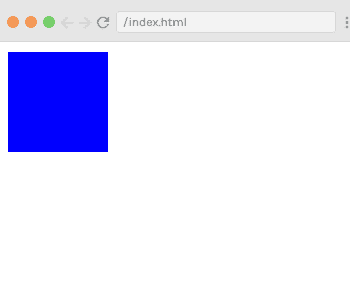

# view . js events-检视. js 事件

> 哎哎哎:# t0]https://www . javatppoint . com/view-js-events

在 Vue.js 中，事件用于响应一个动作。假设，您必须使用 Vue.js 构建一个动态网站，那么您很可能希望它能够响应事件。

例如，如果你的 Vue.js 网站有可点击的按钮、表单等。，您肯定会希望，如果用户单击按钮、提交表单，甚至移动鼠标，Vue.js 网站都会以某种方式做出响应。

### 事件处理

为了用 [Vue.js](https://www.javatpoint.com/vue-js) 处理一个事件，我们必须将 v-on 指令添加到相关的 DOM 元素中。例如，如果您想要处理按钮元素的点击，那么您应该将以下代码添加到您的 Vue 模板中:

**语法:**

```

<button v-on:click="clickHandler"></button> 

```

也可以用方便的简写 **@** 代替 v-on 指令。它看起来像这样:

```

<button @click="clickHandler"></button>

```

我们向 v-on 指令添加一个参数，它将是我们想要处理的事件的名称。在上面的例子中，它是一个点击事件。之后，我们必须将表达式绑定到指令，这通常是您想要用来处理事件的方法。在这种情况下，我们称之为 clickHandler。

### 您可以处理的 Vue.js 事件的类型

除了 click 之外，还可以处理很多其他的 Vue.js DOM 事件。Vue.js 可以处理任何类型的 web 或移动原生事件以及自定义事件。通常用于处理的最常见事件:

*   使服从
*   好好享受吧
*   拖
*   卷起
*   错误
*   流产
*   鼠标悬停
*   鼠标移出
*   负载等。

## 事件处理方法

让我们看一些简单的例子来部署事件处理方法。

### 单击事件

参见下面的例子来演示 Vue.js 中的点击事件处理。

**Index.html 文件:**

```

<html>
   <head>
      <title>Vue.js Event Handling</title>
      <link rel="stylesheet" href="index.css">
        <script src="https://cdn.jsdelivr.net/npm/vue/dist/vue.js"></script>
    </head>
    <body>
      <div id="app">
  <button v-on:click = "displaynumbers">Click Me to Add No.</button>
         <h2> Add Number 100 + 200 = {{total}}</h2>
      </div>
      <script src="index.js"></script>
   </body>
</html>

```

**Index.js 文件:**

```

var vm = new Vue({
            el: "#app",
            data: {
               num1: 50,
               num2 : 100,
               total : ''
            },
            methods : {
               displaynumbers : function(event) {
                  console.log(event);
                  return this.total =  this.num1+ this.num2;
               }
            },
         })

```

让我们使用一个简单的 CSS 文件来使输出更加吸引人。

**Index.css 文件:**

```

html, body {
    margin: 5px;
    padding: 0;
}

```

程序执行后，您将看到以下输出:

**输出:**


当你点击上面的按钮时，你可以看到它已经添加了号码。查看输出:


### 示例说明

在上面的例子中，我们为 DOM 元素分配了下面的点击事件。

```

<button v-on:click = "displaynumbers">Click Me to Add No.</button> 

```

当你点击按钮时，它会调用方法“**显示数字**”，该方法接收事件，我们看到输出。

我们也可以指定一个简写的 **@** 来代替 v-on 指令。你可以调用下面的事件，结果是一样的。

```

<button @click = "displaynumbers">Click ME</button>

```

### 鼠标悬停和鼠标移出事件

现在，让我们检查两个名为**的新 Vue.js 事件，鼠标悬停在** & **鼠标悬停在**上。请参见以下示例。

**Index.html 文件:**

```

<html>
   <head>
      <title>Vue.js Event Handling</title>
      <link rel="stylesheet" href="index.css">
        <script src="https://cdn.jsdelivr.net/npm/vue/dist/vue.js"></script>
    </head>
    <body>
      <div id = "databinding">
         <div v-bind:style = "styleobj" v-on:mouseover = "changebgcolor" v-on:mouseout = "originalcolor"></div>
      </div>
      <script src="index.js"></script>
   </body>
</html>

```

**Index.js 文件:**

```

         var vm = new Vue({
            el: '#databinding',
            data: {
               num1: 100,
               num2 : 200,
               total : '',
               styleobj : {
                  width:"100px",
                  height:"100px",
                  backgroundColor:"red"
               }
            },
            methods : {
               changebgcolor : function() {
                  this.styleobj.backgroundColor = "blue";
               },
               originalcolor : function() {
                  this.styleobj.backgroundColor = "brown";
               }
            },
         })

```

程序执行后，您将看到以下输出:

**输出:**


在输出中可以看到默认的背景颜色是**红色**。现在，将鼠标光标移动到方框上，方框颜色将变为**蓝色**。查看输出。



现在，将鼠标光标移出方框，方框颜色将变为**棕色**。查看输出。


### 示例说明

在上面的例子中，我们创建了一个宽度和高度为 100px 的 div 元素。这个 div 的默认背景色是红色。在**鼠标悬停时，**背景颜色变为蓝色，在**鼠标退出**时，背景颜色变为棕色。

在鼠标悬停期间，一个方法被称为 changebgcolor，一旦我们将鼠标移出 div，一个方法被称为 originalcolor。

```

<div v-bind:style = "styleobj" v-on:mouseover = "changebgcolor" v-on:mouseout = "originalcolor"></div> 

```

这里，我们使用了两个事件 mouseover 和 mouseout，并将它们分配给 div。我们已经创建了一个 styleobj 变量，并给出了分配给 div 的所需样式。

使用 **v-bind:style = "styleobj"** 将同一个变量绑定到 div。在 changebgcolor 中，我们使用以下代码将颜色更改为绿色。

```

changebgcolor : function() {
   this.styleobj.backgroundColor = "blue";
}

```

使用 stylobj 变量，颜色变为绿色。同样，我们使用以下代码将颜色更改为棕色

```

originalcolor : function() {
   this.styleobj.backgroundColor = "brown"; 

```

### 事件修饰符

Vue.js 提供了一些在 v-on 属性上可用的事件修饰符。我们可以非常容易地在事件处理程序中调用 event.preventDefault()或 event.stopPropagation()。给你。预防和。stop 是事件修饰符。

这些修饰符是用点表示的指令后缀。以下是 v-on 属性中最常见的修改器列表:

*   。一次
*   。预防
*   。停止
*   。捕获
*   。自己
*   。消极的

### 那个。一次事件修改器

它只允许事件执行一次。

**语法:**

```

<button v-on:click.once = "buttonclicked">Click Once</button>

```

您必须在调用修饰符时添加点运算符，如上面的语法所示。

让我们看一个简单的例子来理解曾经修饰语的概念和作用。

**例**

**Index.html 文件:**

```

<html>
   <head>
      <title>Vue.js Event Handling</title>
      <link rel="stylesheet" href="index.css">
        <script src="https://cdn.jsdelivr.net/npm/vue/dist/vue.js"></script>
    </head>
    <body>
      <div id = "eg_2">
         <button v-on:click.once = "buttonclickedonce" v-bind:style = "styleobj">Just once clickable</button>
         Output:{{clicknum}}
         <br/><br/>
         <button v-on:click = "buttonclicked"  v-bind:style = "styleobj">Click Me anytime</button>
         Output:{{clicknum1}}
      </div>
      <script src="index.js"></script>
   </body>
</html>

```

**Index.js 文件:**

```

var vm = new Vue({
            el: '#eg_2',
            data: {
               clicknum : 0,
               clicknum1 :0,
               styleobj: {
                  backgroundColor: '#2196F3!important',
                  cursor: 'pointer',
                  padding: '8px 16px',
                  verticalAlign: 'middle',
               }
            },
            methods : {
               buttonclickedonce : function() {
                  this.clicknum++;
               },
               buttonclicked : function() {
                  this.clicknum1++;
               }
            }
         })

```

程序执行后，您将看到以下输出:

**输出:**


您可以看到，在上面的示例中，我们已经创建了两个按钮。带有“只点击一次”标签的按钮添加了“只点击一次”修改器，另一个按钮没有任何修改器。

```

<button v-on:click.once = "buttonclickedonce" v-bind:style = "styleobj">Just once clickable</button>
<button v-on:click = "buttonclicked"  v-bind:style = "styleobj">Click Me anytime</button>

```

当你点击第一个按钮时，它调用方法“buttonclickedonce”，点击第二个按钮后，它调用方法“buttonclicked”。

```

buttonclickedonce : function() {
   this.clicknum++;
},
buttonclicked : function() {
   this.clicknum1++;
}

```

我们还在**点击数**和**点击数 1** 中定义了两个变量。单击按钮时，两者都将递增。两个变量都初始化为 0。你可以在上面的输出中看到。

当您单击第一个按钮时，变量 clicknum 将增加 1。第二次单击时，该数字不会增加，因为修饰符会阻止它执行或执行在单击按钮时分配的任何操作项。

当您单击第二个按钮时，会执行相同的操作，即变量递增。每次单击时，该值都会递增并显示。请参见以下输出:


点击两个按钮五次后，可以看到第一个按钮只显示一次，第二个按钮显示五次。

### 那个。防止事件修改器

那个。当您不想通过单击按钮来打开特定的 id 或 url 时，可以使用阻止事件修饰符。

**语法:**

```

<a href = "An specific url" v-on:click.prevent = "clickme">Click Me</a>

```

让我们看两个例子，一个没有。防止事件修饰语，并与它一起清楚地理解它。

**Index.html 文件:**

```

<html>
   <head>
      <title>Vue.js Event Handling</title>
      <link rel="stylesheet" href="index.css">
        <script src="https://cdn.jsdelivr.net/npm/vue/dist/vue.js"></script>
    </head>
    <body>
      <div id = "eg_3">
         <a href = "http://www.google.com" v-on:click = "clickme" target = "_blank" v-bind:style = "styleobj">Click Me</a>
      </div>
      <script src="index.js"></script>
   </body>
</html>

```

**Index.js 文件:**

```

var vm = new Vue({
            el: '#eg_3',
            data: {
               clicknum : 0,
               clicknum1 :0,
               styleobj: {
                  color: '#4CAF50',
                  marginLeft: '20px',
                  fontSize: '30px'
               }
            },
            methods : {
               clickme : function() {
                  alert("Anchor tag is clicked");
               }
            }
         })

```

程序执行后，您将看到以下输出:

**输出:**


当你点击“点击我”按钮时，你会看到一个弹出消息。见下图。


点击“确定”按钮后，目标网址将打开如下图:


现在，我们将使用。防止事件修饰符查看结果。在 Index.html 文件中添加以下代码。

```

<a href = "http://www.google.com" v-on:click.prevent = "clickme" target = "_blank" v-bind:style = "styleobj">Click Me</a>

```

一旦你添加了代码，如果我们点击按钮，它将发送一条警告消息，但不会再打开网址。

**用以下代码替换 Index.html 文件:**

```

<html>
   <head>
      <title>Vue.js Event Handling</title>
      <link rel="stylesheet" href="index.css">
        <script src="https://cdn.jsdelivr.net/npm/vue/dist/vue.js"></script>
    </head>
    <body>
      <div id = "eg_3">
        <a href = "http://www.google.com" v-on:click.prevent = "clickme" target = "_blank" v-bind:style = "styleobj">Click Me</a>
      </div>
      <script src="index.js"></script>
   </body>
</html>

```

**输出:**


点击“点击我”按钮，您将看到弹出框打开。


现在，点击“确定”按钮，您将看到指定的网址不再打开。

### 事件键修饰符

在 Vue.js 中，键修饰符用于处理和控制事件处理。在监听键盘事件时，我们需要检查特定的按键。Vue.js 提供了一种在监听关键事件时为 v-on 添加关键修饰符的方法。

例如，假设您有一个文本框，并且只想在我们按下回车键时调用该方法。您可以通过向事件添加如下关键修饰符来实现这一点。

**语法:**

```

<input type = "text"  v-on: event_name.key_name= "showinputvalue"/> 

```

**示例:**如果要将 keyup 和 enter 按钮应用到您的事件中，可以使用以下代码来实现:

```

<input type = "text"  v-on:keyup.enter = "showinputvalue"/> 

```

#### 注意:您也可以对事件使用多个注释记号。例如:让我们使用快捷键，ctrl，然后输入 keynames。

```

<input type = "text"  v-on.keyup.ctrl.enter= "showinputvalue"/> 

```

让我们看一个用 Vue.js 事件演示关键修饰符的例子，并很好地理解它。

**Index.html 文件:**

```

<html>
   <head>
      <title>Vue.js Event Handling</title>
      <link rel="stylesheet" href="index.css">
        <script src="https://cdn.jsdelivr.net/npm/vue/dist/vue.js"></script>
    </head>
    <body>
     <div id = "key_1">
         <input type = "text" v-on:keyup.enter = "showinputvalue" v-bind:style = "styleobj" placeholder = "Type your name here.."/>
         <h3> {{name}}</h3>
      </div>
      <script src="index.js"></script>
   </body>
</html>

```

**Index.js 文件:**

```

var vm = new Vue({
            el: '#key_1',
            data: {
               name:'',
               styleobj: {
                  width: "100%",
                  padding: "12px 20px",
                  margin: "8px 0",
                  boxSizing: "border-box"
               }
            },
            methods : {
               showinputvalue : function(event) {
                  this.name=event.target.value;
               }
            }
         })

```

程序执行后，您将看到以下输出:

**输出:**


在文本框中写一些东西，然后查看结果。


在上面的输出中，您可以看到，即使在文本框中键入了名称，它也不会出现在结果中。现在，按回车键，将显示名称。请参见以下输出:


您可以在事件中使用以下关键修饰符。

*   。进入
*   。标签
*   。删除(它同时显示“删除”和“退格”键)
*   。转义字符
*   。空间
*   。起来
*   。向下
*   。左边的
*   。正确

### 自定义事件

当我们需要告诉父组件我们想要对子组件进行更改时，使用自定义事件。父组件可以使用 prop 属性向其组件传递数据。

父组件可以使用 **v-on** 属性监听子组件事件。

让我们看一个例子:

**Index.html 文件:**

```

<html>
   <head>
      <title>Vue.js Event Handling</title>
      <link rel="stylesheet" href="index.css">
        <script src="https://cdn.jsdelivr.net/npm/vue/dist/vue.js"></script>
    </head>
    <body>
     <div id = "eg_2">
         <div id = "custom-event-example">
            <p style = "font-size:25px;">Language displayed : <b>{{ languageclicked }}</b></p>
            <button-counter
            v-for = "(item, index) in languages"
            v-bind:item = "item"
            v-bind:index = "index"
            v-on:showlanguage = "languagedisp">
            </button-counter>
         </div>
      </div>
      <script src="index.js"></script>
   </body>
</html>

```

**Index.js 文件:**

```

vue.component('button-counter', {
            template: '<button v-on:click = "displayLanguage(item)"><span style = "font-size:25px;">{{ item }}</span></button>',
            data: function () {
               return {
                  counter: 0
               }
            },
            props:['item'],
            methods: {
               displayLanguage: function (lng) {
                  console.log(lng);
                  this.$emit('showlanguage', lng);
               }
            },
         });
         var vm = new Vue({
            el: '#eg_2',
            data: {
               languageclicked: "",
               languages : ["Java", "C", "C++", "Python", "Javascript", "Angular", "Data Structure", "jQuery"]
            },
            methods: {
               languagedisp: function (a) {
                  this.languageclicked = a;
               }
            }
         })

```

程序执行后，您将看到以下输出:

**输出:**


如果您单击任何按钮，它将显示在输出中。让我们点击 Python 按钮，看看结果。


### 示例说明

上面的示例显示了父组件和子组件之间的数据传输。父组件使用以下代码创建。

```

<button-counter
   v-for = "(item, index) in languages"
   v-bind:item = "item"
   v-bind:index = "index"
   v-on:showlanguage = "languagedisp">
</button-counter>

```

这里，v-for 属性将循环使用包含语言列表的 languages 数组。我们必须将细节发送给子组件，因此数组的值存储在项和索引中。

```

v-bind:item = "item"
v-bind:index = "index"

```

要使用数组的值，首先将其绑定到变量，然后使用 props 属性引用变量:

```

vue.component('button-counter', {
   template: '<button v-on:click = "displayLanguage(item)"><span style = "font-size:25px;">{{ item }}</span></button>',
   data: function () {
      return {
         counter: 0
      }
   },
   props:['item'],
   methods: {
      displayLanguage: function (lng) {
         console.log(lng);
         this.$emit('showlanguage', lng);
      }
   },
});

```

事件的名称是 **showlanguage** ，它调用一个名为 **languagedisp** 的方法，我们已经在 Vue 实例中定义了这个方法。

在组件中，模板定义如下-

```

template: '<button v-on:click = "displayLanguage(item)"><span style = "font-size:25px;">{{ item }}</span></button>',

```

方法 **displayLanguage** 用来调用这个。$emit('showlanguage '，LNG)；

**$emit** 用于调用父组件方法。方法**显示语言**是在部件上用 **v-on** 给出的事件名称。

现在，我们已经传递了一个参数。传递的参数是主父 Vue 实例的方法所单击的语言的名称。其定义如下:

```

var vm = new Vue({
   el: '#databinding',
   data: {
      languageclicked: "",
      languages : ["Java", "C", "C++", "Python", "Javascript", "Angular", "Data Structure", "jQuery"]
   },
   methods: {
      languagedisp: function (a) {
         this.languageclicked = a;
      }
   }
})

```

现在，emit 触发 showlanguage，show language 又从 Vue 实例方法中调用 languagedisp。它将单击的按钮值分配给变量 languageclicked，然后单击的值语言显示在您在上面的图像中看到的输出中。

* * *