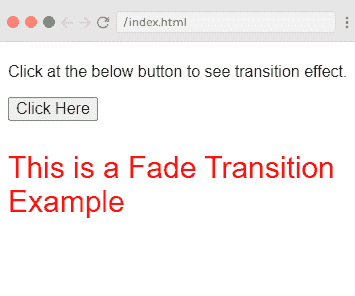
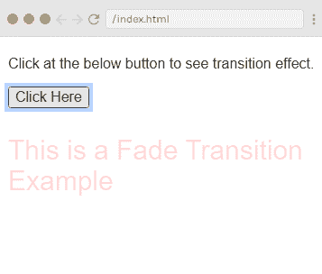
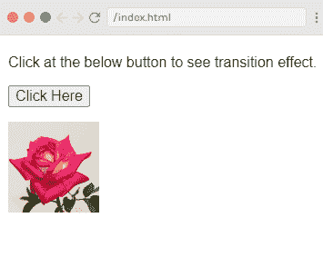
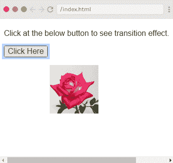

# 过渡和动画

> 原文：<https://www.javatpoint.com/vue-js-transition-and-animation>

Vue.js 提供了几种方法，当您在 DOM 中插入、更新或移除项目时，可以将过渡和动画效果应用于应用程序。这些过渡和动画效果用于使应用程序对用户具有吸引力和交互性。

它还提供了一些工具来完成以下任务:

*   它提供类，并自动将这些类应用于 CSS 过渡和动画。
*   它可以集成第三方 CSS 动画库，例如 Animate.css。
*   它可以在转换钩子的过程中直接使用 JavaScript 来操作 DOM。
*   它可以集成第三方 JavaScript 动画库，例如 Velocity.js。

### view . js transition-检视. js 转换

当您在 DOM 中插入、更新或移除项目时，有许多方法可以将过渡应用到 [HTML](https://www.javatpoint.com/html-tutorial) 元素。 [Vue.js](https://www.javatpoint.com/vue-js) 提供了一个内置的转换包装器组件，当你进入/离开任何元素或组件的转换时，你必须使用它。请参见过渡效果的语法。

**语法:**

```

<transition name = "name_of_the_transition">
   <div></div>
</transition>

```

让我们看一个简单的例子来理解过渡效应的概念和工作原理。

### vue . js 淡入淡出转场

**例 1**

**Index.html 文件:**

```

<html>
   <head>
      <title>Vue.js Transition</title>
      <link rel="stylesheet" href="index.css">
        <script src="https://cdn.jsdelivr.net/npm/vue/dist/vue.js"></script>
    </head>
    <body>
     <style>
         .fade-enter-active, .fade-leave-active {
            transition: opacity 3s
         }
         .fade-enter, .fade-leave-to /* .fade-leave-active below version 2.1.8 */ {
            opacity: 0
         }
      </style>
      <div id = "databinding">
          <p> Click at the below button to see transition effect.</p>
         <button v-on:click = "show = !show">Click Here</button>
         <transition name = "fade">
            <p v-show = "show" v-bind:style = "styleobj">This is a Fade Transition Example</p>
         </transition>
      </div>
      </script>
      <script src="index.js"></script>
   </body>
</html>

```

**Index.js 文件:**

```

var vm = new Vue({
            el: '#databinding',
            data: {
               show:true,
               styleobj :{
                  fontSize:'30px',
                  color:'red'
               }
            },
            methods : {
            }
         })

```

让我们用一个简单的 [CSS](https://www.javatpoint.com/css-tutorial) 文件，让输出更有吸引力。

**Index.css 文件:**

```

html, body {
    margin: 5px;
    padding: 0;
}

```

程序执行后，您将看到以下输出:

**输出:**



当您单击按钮时，文本将在 3 秒内消失。请参见下图:



### 示例说明

在上面的例子中，我们创建了一个名为“单击此处”的按钮，我们可以将变量 show 的值从 true 更改为 false，反之亦然。我们已经在 p 标记中编写了 v-show 指令，它只在变量为真时才显示文本元素。p 标签用如下过渡元素包装:

```

<transition name = "fade">
   <p v-show = "show" v-bind:style = "styleobj">This is a Fade Transition Example</p>
</transition> 

```

这是一个渐变过渡的例子。以下是在转换中使用的一些标准类的列表:

**v-enter:** 在元素更新或添加到 HTML 元素之前，最初会调用这个过渡类。这指定了开始状态。

**v-enter-active:** 该过渡类用于定义进入过渡阶段的延迟、持续时间和缓和曲线。此类指定整个阶段的活动状态，并且在整个进入阶段始终可用。

**v-leave:** 当离开跃迁被触发或移除时，该跃迁类被添加。

**v-leave-active:** 此过渡类在离开阶段使用。转换完成后，此类将自动移除。此类指定离开阶段的延迟、持续时间和缓和曲线。

每个转换类都将以转换名称作为前缀。例如，对于渐变过渡，类的名称应该是。fade_enter，。淡入激活。fade_leave，。淡入淡出激活。

在上面的示例中，我们定义了。淡出进入激活状态。fade_leave_active 类，它在开始和离开阶段应用一个转换。

这里，不透明度属性在 3 秒内更改为 0。

### vue . js shiftx 过渡

让我们举另一个例子，当点击按钮时，我们使用一个图像在 x 轴上移动。

这里，我们使用的是 **shiftx** 过渡。该变换属性将图像在 x 轴上移动 100 像素。请参见以下示例:

**例 2**

**Index.html 文件:**

```

<html>
   <head>
      <title>Vue.js Transition</title>
      <link rel="stylesheet" href="index.css">
        <script src="https://cdn.jsdelivr.net/npm/vue/dist/vue.js"></script>
    </head>
    <body>
     <style>
         .shiftx-enter-active, .shiftx-leave-active {
            transition: all 2s ease-in-out;
         }
         .shiftx-enter, .shiftx-leave-to /* .fade-leave-active below version 2.1.8 */ {
            transform :  translateX(100px);
         }
      </style>
      <div id = "databinding">
          <p> Click at the below button to see transition effect.</p>
         <button v-on:click = "show = !show">Click Here</button>
         <transition name = "shiftx">
            <p v-show = "show">
               
            </p>
         </transition>
      </div>
      </script>
      <script src="index.js"></script>
   </body>
</html>

```

**Index.js 文件:**

```

var vm = new Vue({
            el: '#databinding',
            data: {
               show:true
            },
            methods : {
            }
         })

```

程序执行后，您将看到以下输出:

**输出:**



当你点击按钮时，图像将向右移动 100 像素。请参见以下输出:



* * *