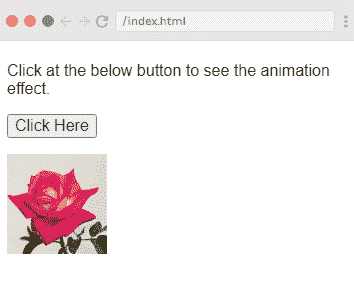
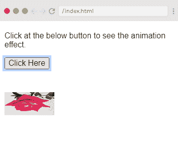
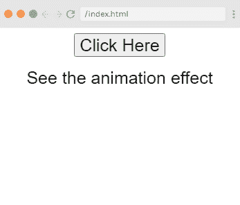
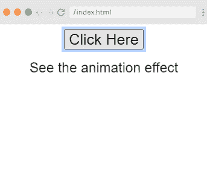
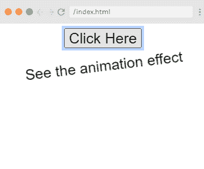

# Vue.js 动画

> 哎哎哎:# t0]https://www . javatppoint . com/view-js 动画

在 Vue.js 应用程序中，我们可以像在前面的例子中应用过渡一样应用动画。动画也有你必须声明才能获得动画效果的类。

Vue.js 过渡和 Vue.js 动画的唯一区别是，在 Vue.js 动画中，插入元素后不会立即移除 v-enter，而是在动画结束事件中移除。

让我们举一个例子来理解动画的概念，看看动画在应用程序中是如何工作的。

### 例子

**Index.html 文件:**

```

<html>
   <head>
      <title>Vue.js Animation</title>
      <link rel="stylesheet" href="index.css">
        <script src="https://cdn.jsdelivr.net/npm/vue/dist/vue.js"></script>
    </head>
    <body>
    <style>
         .shiftx-enter-active {
            animation: shift-in 2s;
         }
         .shiftx-leave-active {
            animation: shift-in 2s reverse;
         }
         @keyframes shift-in {
            0%   {transform:rotateX(0deg);}
            25%  {transform:rotateX(90deg);}
            50%  {transform:rotateX(120deg);}
            75%  {transform:rotateX(180deg);}
            100% {transform:rotateX(360deg);}
         }
      </style>
      <div id = "databinding">
      <p> Click at the below button to see the animation effect.</p>
         <button v-on:click = "show = !show">Click Here</button>
         <transition name = "shiftx">
            <p v-show = "show">
               
            </p>
         </transition>
      </div>
      </script>
      <script src="index.js"></script>
   </body>
</html>

```

**Index.js 文件:**

```

var vm = new Vue({
            el: '#databinding',
            data: {
               show:true
            },
            methods : {
            }
         })

```

让我们用一个简单的 [CSS](https://www.javatpoint.com/css-tutorial) 文件，让输出更有吸引力。

**Index.css 文件:**

```

html, body {
    margin: 5px;
    padding: 0;
}

```

程序执行后，您将看到以下输出:

**输出:**



当你点击“点击这里”按钮，你可以看到动画效果。图像将从 0 度旋转到 360 度，最后消失。请参见以下图像:


**另一张截图:**



### 示例说明

在上面的例子中，您可以看到我们使用了与过渡效果相同的类。这里，我们在 p 标签中附上了如下图像:

```

<transition name = "shiftx">
            <p v-show = "show">
               
            </p>
         </transition>

```

这里，转换的名称是 **shiftx** ，该类应用如下 CSS 代码:

```

<style>
   .shiftx-enter-active {
      animation: shift-in 2s;
   }
   .shiftx-leave-active {
      animation: shift-in 2s reverse;
   }
   @keyframes shift-in {
      0%   {transform:rotateX(0deg);}
      25%  {transform:rotateX(90deg);}
      50%  {transform:rotateX(120deg);}
      75%  {transform:rotateX(180deg);}
      100% {transform:rotateX(360deg);}
   }
</style> 

```

在上面的代码中，类是在转换名中定义的，即 **shiftx-enter-active 和。shiftx-离开-激活。**

动画由从 0%到 100% 的**关键帧定义，其中变换在每个关键帧定义，程度如下:**

```

   @keyframes shift-in {
      0%   {transform:rotateX(0deg);}
      25%  {transform:rotateX(90deg);}
      50%  {transform:rotateX(120deg);}
      75%  {transform:rotateX(180deg);}
      100% {transform:rotateX(360deg);}
   }

```

### 自定义过渡类

[Vue.js](https://www.javatpoint.com/vue-js) 通过提供以下属性，方便您指定自己的自定义转换类。这些属性可以添加到过渡元素中。

*   输入类别
*   输入-活动-类别
*   进入类别(在版本 2.1.8+中添加)
*   休假类
*   离开活动班级
*   留级(在版本 2.1.8+中添加)

当我们想要使用一个外部 CSS 库，比如 animate.css 时，通常会用到自定义类。

让我们举一个例子来理解自定义转换类的概念，看看它们在应用程序中是如何工作的。

### 例子

**Index.html 文件:**

```

<html>
   <head>
      <title>Vue.js Animation</title>
      <link href = "https://cdn.jsdelivr.net/npm/animate.css@3.5.1" rel = "stylesheet" type = "text/css">
        <script src="https://cdn.jsdelivr.net/npm/vue/dist/vue.js"></script>
      <script type = "text/javascript" src = "js/vue.js"></script>
    </head>
    <body>
     <div id = "animation" style = "text-align:center">
         <button @click = "show = !show"><span style = "font-size:25px;">Click Here</span></button>
         <transition
            name = "custom-classes-transition"
            enter-active-class = "animated swing"
            leave-active-class = "animated bounceIn">
            <p v-if = "show"><span style = "font-size:25px;">See the animation effect</span></p>
         </transition>
      </div>
      </script>
      <script src="index.js"></script>
   </body>
</html>

```

**Index.js 文件:**

```

var vm =  new Vue({
            el: '#animation',
            data: {
               show: true
            }
         })

```

程序执行后，您将看到以下输出:

**输出:**



当你点击“点击这里”按钮时，你可以看到两种类型的动画。第一个应用于上面例子的动画是:

```

enter-active-class = "animated swing" 

```

**输出:**



**第二个动画是:**

```

leave-active-class = "animated bounceIn"

```

**输出:**



这里，我们使用了第三方库 **animate.css** 来展示示例中自定义动画类的使用。

```

<link href = "https://cdn.jsdelivr.net/npm/animate.css@3.5.1" rel = "stylesheet" type = "text/css">

```

* * *