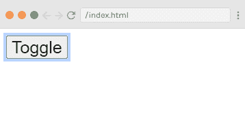
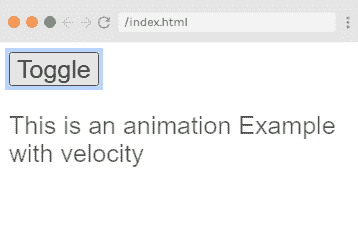
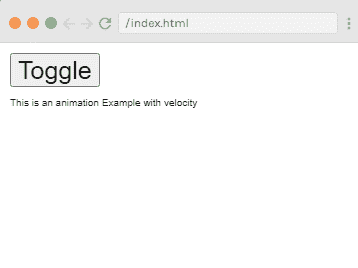
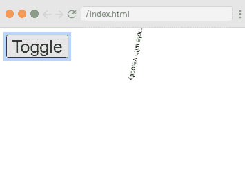
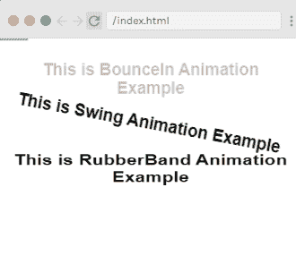

# 一起使用过渡和动画

> 原文：<https://www.javatpoint.com/vue-js-using-transitions-and-animations-together>

Vue.js 需要附加事件侦听器，以便在转换结束时知道它。可能是**过渡到**或者**动画化到**，取决于你申请的 [CSS](https://www.javatpoint.com/css-tutorial) 。如果您只使用第一种或第二种类型，Vue.js 可以自动检测正确的类型。但是，在必须同时使用过渡和动画的情况下，可以显式声明类型。

在某些情况下，您可能希望两者都在同一个元素上，例如，由 Vue.js 触发的 [CSS 动画](https://www.javatpoint.com/css-animation)，以及悬停时的 [CSS 过渡](https://www.javatpoint.com/css-transition)效果。在这些情况下，您必须在类型属性中显式声明您希望 Vue.js 关注的类型，值可以是动画或转换。

### 显式过渡持续时间

这是在[Vue.js](https://www.javatpoint.com/vue-js)2 . 2 . 0+版本中引入的新功能。这用于使用 Vue.js 在元素上应用过渡和动画。默认情况下，Vue.js 必须等待 transionend 和 animationend 事件来检测动画或过渡是否完成。在这种情况下，当转换导致延迟时，我们可以按如下方式显式应用持续时间:

```

<transition :duration = "1000"></transition>

```

duration 属性与 transition 元素上的:符号一起使用，如上面的代码所示。

如果要分别指定进入和离开案例的持续时间，可以按如下方式指定:

```

<transition :duration = "{ enter: 500, leave: 800 }">...</transition> 

```

### JavaScript 钩子

过渡类可以用 [JavaScript](https://www.javatpoint.com/javascript-tutorial) 作为方法调用。您可以在属性中定义 JavaScript 钩子。让我们看一个例子来很好地理解这个概念:

**Index.html 文件:**

```

<html>
   <head>
      <title>Vue.js Animation</title>
      <link rel="stylesheet" href="index.css">
        <script src="https://cdn.jsdelivr.net/npm/vue/dist/vue.js"></script>
        <script src = "https://cdnjs.cloudflare.com/ajax/libs/velocity/1.2.3/velocity.min.js"></script>
    </head>
    <body>
    <div id = "trans">
         <button @click = "show = !show">
            <span style = "font-size:25px;">Toggle</span>
         </button>
         <transition  v-on:before-enter = "beforeEnter"
            v-on:enter = "enter"
            v-on:leave = "leave"
            v-bind:css = "false">
            <p v-if = "show" style = "font-size:25px;">This is an animation Example with velocity</p>
         </transition>
      </div>
      </script>
      <script src="index.js"></script>
   </body>
</html>

```

**Index.js 文件:**

```

var vm = new Vue({
            el: '#trans',
            data: {
               show: false
            },
            methods: {
               beforeEnter: function (el) {
                  el.style.opacity = 0
               },
               enter: function (el, done) {
                  Velocity(el, { opacity: 1, fontSize: '25px' }, { duration: 1000 })
                  Velocity(el, { fontSize: '10px' }, { complete: done })
               },
               leave: function (el, done) {
                  Velocity(el, { translateX: '15px', rotateZ: '50deg' }, { duration: 1500 })
                  Velocity(el, { rotateZ: '100deg' }, { loop: 2 })
                  Velocity(el, {
                     rotateZ: '45deg',
                     translateY: '30px',
                     translateX: '30px',
                     opacity: 0
                  }, { complete: done })
               }
            }
         })

```

让我们使用一个简单的 CSS 文件来使输出更加吸引人。

**Index.css 文件:**

```

html, body {
    margin: 5px;
    padding: 0;
}

```

程序执行后，您将看到以下输出:

**输出:**



点击**“切换”**按钮，可以看到过渡和动画。请参见以下输出:





### 示例说明

在上面的例子中，使用 js 方法对转换元素执行动画。过渡方法应用如下:

```

<transition  v-on:before-enter = "beforeEnter"
   v-on:enter = "enter"
   v-on:leave = "leave"
   v-bind:css = "false">
   <p v-if = "show" style = "font-size:25px;">Animation Example with velocity</p>
</transition> 

```

事件名称前添加前缀 **v-on** 。我们还在 transition 上添加了一个属性 **v-bind:css = "false"** ，这样 Vue.js 就可以将其理解为一个 JavaScript 的 transition。

这些方法在 Vue.js 实例中定义如下:

```

methods: {
   beforeEnter: function (el) {
      el.style.opacity = 0
   },
   enter: function (el, done) {
      Velocity(el, { opacity: 1, fontSize: '25px' }, { duration: 1000 })
      Velocity(el, { fontSize: '10px' }, { complete: done })
   },
   leave: function (el, done) {
      Velocity(el, { translateX: '15px', rotateZ: '50deg' }, { duration: 1500 })
      Velocity(el, { rotateZ: '100deg' }, { loop: 2 })
      Velocity(el, {
         rotateZ: '45deg',
         translateY: '30px',
         translateX: '30px',
         opacity: 0
      }, { complete: done })
   }
}

```

我们已经在上述每种方法中应用了所需的转换。不透明度动画应用于点击按钮，当动画完成。第三方库也用于动画。

### 初始渲染时的过渡

如果您想在开始时添加动画，您必须向过渡元素添加“出现”属性。请参见下面的示例以更好地理解它:

**Index.html 文件:**

```

<html>
   <head>
      <title>Vue.js Animation</title>
      <link rel="stylesheet" href="index.css">
      <link href = "https://cdn.jsdelivr.net/npm/animate.css@3.5.1" rel = "stylesheet" type = "text/css">
        <script src="https://cdn.jsdelivr.net/npm/vue/dist/vue.js"></script>
        <script src = "https://cdnjs.cloudflare.com/ajax/libs/velocity/1.2.3/velocity.min.js"></script>
    </head>
    <body>
        <div id = "trans_2" style = "text-align:center">
         <transition
            appear
            appear-class = "custom-appear-class"
            appear-active-class = "animated bounceIn">
            <h3>This is BounceIn Animation Example</h3>
         </transition>
         <transition
            appear
            appear-class = "custom-appear-class"
            appear-active-class = "animated swing">
            <h3>This is Swing Animation Example</h3>
         </transition>
         <transition
            appear
            appear-class = "custom-appear-class"
            appear-active-class = "animated rubberBand">
            <h3>This is RubberBand Animation Example</h3>
         </transition>
      </div>
      </script>
      <script src="index.js"></script>
   </body>
</html>

```

**Index.js 文件:**

```

var vm =  new Vue({
            el: '#trans_2',
            data: {
               show: true
            }
         })

```

程序执行后，您将看到以下输出:

**输出:**



* * *