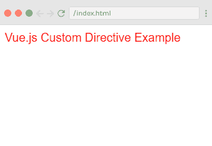
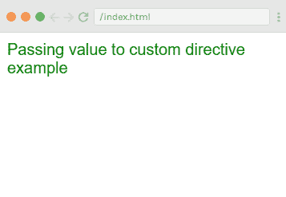
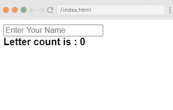
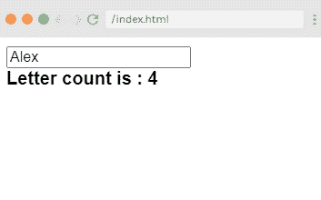

# vue . js 自定义准则

> 哎哎哎:# t0]https://www . javatppoint . com/view-js-custom-guidelines

Vue.js 指令在 Vue.js 应用程序中使用，以使它们可重用且简单明了。指令就像指令一样，可以在 [Vue.js](https://www.javatpoint.com/vue-js) 应用程序中使用，以特定的方式做事。我们已经使用了简单的条件指令，如 v-if、v-show、v-else、v-for、v-bind、v-model、v-on 等。在我们的[https://www.javatpoint.com/vue-js-conditions-and-loops](https://www.javatpoint.com/vue-js-conditions-and-loops)页面。

在这里，我们将学习如何创建自定义和全局指令，并像在 Vue 中一样使用它们。js 组件[https://www.javatpoint.com/vue-js-component](https://www.javatpoint.com/vue-js-component)因为 Vue.js 允许我们创建自己的定制指令。

**语法:**

```

Vue.directive('name_of_the_directive', {
   bind(e1, binding, vnode) {
   }
}) 

```

要创建自定义指令，我们必须使用 Vue.directive 和指令的名称，如上面的语法所示。让我们看一个例子来演示如何创建自定义指令以及如何使用它。

**Index.html 文件:**

```

<html>
   <head>
      <title>Vue.js Custom Directive</title>
      <link rel="stylesheet" href="index.css">
        <script src="https://cdn.jsdelivr.net/npm/vue/dist/vue.js"></script>
    </head>
    <body>
      <div id = "directive">
          <div v-changestyle>Vue.js Custom Directive Example</div>
      </div>
       <script type = "text/javascript">
         Vue.directive("changestyle",{
            bind(e1,binding, vnode) {
               console.log(e1);
               e1.style.color = "red";
               e1.style.fontSize = "20px";
            }
         });
         var vm = new Vue({
            el: '#directive',
            data: {
            },
            methods : {
            },
         });
      </script>
      <script src="index.js"></script>
   </body>
</html>

```

**Index.js 文件:**

```

var vm = new Vue({
            el: '#directive',
            data: {
            },
            methods : {
            },
         })

```

让我们使用一个简单的 CSS 文件来使输出更加吸引人。

**Index.css 文件:**

```

html, body {
    margin: 5px;
    padding: 0;
}

```

程序执行后，您将看到以下输出:

**输出:**



### 示例说明

在上面的示例中，您可以看到我们创建了一个名为“changestyle”的自定义指令，如下所示:

```

Vue.directive("changestyle",{
   bind(e1,binding, vnode) {
      console.log(e1);
      e1.style.color = "red";
      e1.style.fontSize = "20px";
   }
});

```

现在，自定义指令“changestyle”被分配给一个 div，如下所示:

```

<div v-changestyle>Vue.js Custom Directive Example</div>

```

### 如何将值传递给自定义指令？

我们可以通过将值绑定到自定义指令来将值传递给它们。绑定就像传递给自定义指令的参数。

**语法:**

```

v-changestyle = "{color:'the_color_name'}". 

```

让我们举一个例子来演示如何将值传递给自定义指令。

**Index.html:**

```

<html>
   <head>
      <title>Vue.js Custom Directive</title>
      <link rel="stylesheet" href="index.css">
        <script src="https://cdn.jsdelivr.net/npm/vue/dist/vue.js"></script>
    </head>
    <body>
      <div id = "directive">
          <div v-changestyle = "{color:'green'}">Passing value to custom directive example</div>
      </div>
      <script type = "text/javascript">
         Vue.directive("changestyle",{
            bind(e1,binding, vnode) {
               console.log(e1);
               console.log(binding.value.color);
               console.log(vnode);
               e1.style.color=binding.value.color;
               e1.style.fontSize = "20px";
            }
         });
      </script>
      <script src="index.js"></script>
   </body>
</html>

```

**Index.js:**

```

var vm = new Vue({
            el: '#directive',
            data: {
            },
            methods : {
            },
         })

```

程序执行后，您将看到以下输出:

**输出:**



您可以看到该值在指令中传递，并且文本的颜色更改为绿色。该值通过使用以下代码传递:

```

<div v-changestyle = "{color:'green'}">Passing value to custom directive example</div> 

```

使用以下代码可以访问它:

```

Vue.directive("changestyle",{
   bind(e1,binding, vnode) {
      console.log(e1);
      console.log(binding.value.color);
      console.log(vnode);
      e1.style.color=binding.value.color;
      e1.style.fontSize = "20px";
   }
});

```

### 使用带有自定义指令的过滤器

Vue.js 支持可用于文本格式的过滤器。过滤器通常与 v-bind 和插值一起使用({{}})。我们要求在过滤器的 JavaScript 表达式的末尾使用管道符号。

让我们看一个例子来演示过滤器在自定义指令中的使用。

**Index.html 文件:**

```

<html>
   <head>
      <title>Vue.js Custom Directive</title>
      <link rel="stylesheet" href="index.css">
        <script src="https://cdn.jsdelivr.net/npm/vue/dist/vue.js"></script>
    </head>
    <body>
      <div id = "directive">
                  <input  v-model = "name" placeholder = "Enter Your Name" /><br/>
         <span style = "font-size:20px;"><b>Letter count is : {{name | countletters}}</b></span>
      </div>
      </script>
      <script src="index.js"></script>
   </body>
</html>

```

**Index.js 文件:**

```

var vm = new Vue({
            el: '#directive',
           data: {
               name : ""
            },
            filters : {
               countletters : function(value) {
                  return value.length;
               }
            }
         })

```

程序执行后，您将看到以下输出:

**输出:**



当您在上面的框中键入任何文本时，您可以获得如下字母计数:



### 示例说明

在上例中，可以看到我们创建了一个名为**“count letters”的简单过滤器。****count letters**过滤器计算文本框中输入的字符数。我们必须使用 filter 属性，并按如下方式定义使用的过滤器:

```

filters : {
   countletters : function(value) {
      return value.length;
   }
}

```

这里，我们定义了方法**计算字母**，然后返回输入字符串的长度。

现在，我们已经使用管道操作符和过滤器的名称**“count letters”**在输出中显示过滤器的结果:

```

<span style = "font-size:20px;"><b>Letter count is : {{name | countletters}}</b></span>

```

* * *