# Vue.js 路由

> 哎哎哎:# t0]https://www . javatppoint . com/view-js 路由

Vue.js 没有内置路由器功能，但是您可以使用推荐的和官方支持的 vue-router 库轻松创建支持路由的单页应用程序。

在 Vue.js 中安装路由器需要遵循一些步骤，可以直接从 CDN 下载或者使用 NPM 或者使用 [Github](https://www.javatpoint.com/github) 来使用路由器。

### 直接从 CDM 下载

可以直接从 CDN 下载最新版本的 vue-router。在[https://unpkg.com/vue-router/dist/vue-router.js](https://unpkg.com/vue-router/dist/vue-router.js)有售。

unpkg.com 包含基于国家预防机制的 cdn 链接，并始终更新到最新版本。下载 unpkg.com 文件后，将其托管到服务器，并与 [Vue.js](https://www.javatpoint.com/vue-js) 一起使用脚本标签，如下所示。

```

<script src = "/path/to/vue.js"></script>
<script src = "/path/to/vue-router.js"></script>

```

如果您想在不下载的情况下使用它，可以按如下方式使用:

```

<script src="https://unpkg.com/vue-router/dist/vue-router.js"></script>

```

### 使用 NPM 安装路由器

打开 Node.js 命令提示符，运行以下命令安装 vue 路由器。

```

npm  install vue-router

```

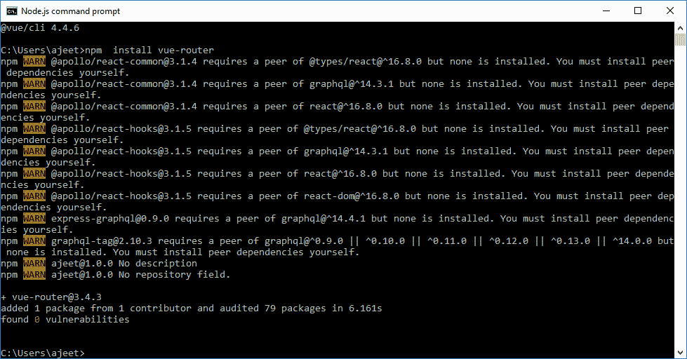

### 使用 GitHub 安装路由器

运行以下命令从 GitHub 克隆路由器存储库:

```

git clone https://github.com/vuejs/vue-router.git node_modules/vue-router
cd node_modules/vue-router
npm install
npm run build

```

让我们举一个简单的例子来理解 Vue.js 中的路由概念:

### 例子

**Index.html 文件:**

```

<html>
   <head>
      <title>Vue.js Routing</title>
      <link rel="stylesheet" href="index.css">
        <script src="https://cdn.jsdelivr.net/npm/vue/dist/vue.js"></script>
<script src="https://unpkg.com/vue/dist/vue.js"></script>
 <script src="https://unpkg.com/vue-router/dist/vue-router.js"></script>
    </head>
    <body>
      <div id = "router_1">
         <h2>This is Routing Example</h2>
         <p>
<!-- use router-link component for navigation. -->
<!-- `<router-link>` will be rendered as an `<a>` tag by default -->
            <router-link to = "/route1">Click on Router Link 1</router-link>
            <router-link to = "/route2"> Click on Router Link 2</router-link>
         </p>
         <!-- route outlet -->
         <!-- component matched by the route will render here -->
         <router-view></router-view>
      </div>
      <script type = "text/javascript">
         const Route1 = { template: '<div style = "border-radius:30px;background-color:lightpink;width:300px;height:100px;margin:10px;font-size:25px;padding:10px;">You are seeing router link 1</div>' }
         const Route2 = { template: '<div style = "border-radius:20px;background-color:lightgreen;width:300px;height:100px;margin:10px;font-size:25px;padding:10px;"> You are seeing router link 2</div>' }
         const routes = [
            { path: '/route1', component: Route1 },
            { path: '/route2', component: Route2 }
         ];
         const router = new VueRouter({
            routes // short for `routes: routes`
         });
      </script>
      <script src="index.js"></script>
   </body>
</html>

```

**Index.js 文件:**

```

var vm = new Vue({
            el: '#router_1',
            router
         })

```

让我们使用一个简单的 CSS 文件来使输出更加吸引人。

**Index.css 文件:**

```

html, body {
    margin: 5px;
    padding: 0;
}

```

程序执行后，您将看到以下输出:

**输出:**

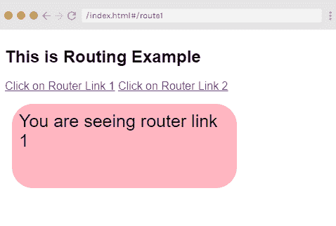

单击路由器链接 2，您将看到它被重定向到以下结果。

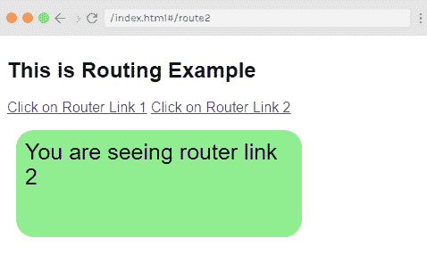

### 示例说明

在上面的例子中，您可以看到我们添加了 vue-router.js 文件，如下所示:

```

<script src="https://unpkg.com/vue/dist/vue.js"></script>
 <script src="https://unpkg.com/vue-router/dist/vue-router.js"></script>4

```

在下面的代码中，我们创建了两条路由器链路。我们在正文部分对这些路由器链路的定义如下:

```

<router-link to = "/route1">Click on Router Link 1</router-link>
 <router-link to = "/route2"> Click on Router Link 2</router-link>

```

这里， **<路由器链接>** 是一个用来导航到 HTML 内容并显示给用户的组件。**至**属性指定目的地。例如，显示链接的文件，您必须单击该文件。

路由器在脚本部分初始化，其中创建了两个常量，如下所示:

```

const Route1 = { template: '<div style = "border-radius:30px;background-color:lightpink;width:300px;height:100px;margin:10px;font-size:25px;padding:10px;">You are seeing router link 1</div>' }
         const Route2 = { template: '<div style = "border-radius:20px;background-color:lightgreen;width:300px;height:100px;margin:10px;font-size:25px;padding:10px;"> You are seeing router link 2</div>' }

```

在上面的代码中，我们指定了当您单击路由器链接时将显示的模板。

接下来是路由常量，我们已经定义了必须在 URL 中显示的路径。

```

const routes = [
   { path: '/route1', component: Route1 },
   { path: '/route2', component: Route2 }
];

```

路径用于定义路径和组件。当用户点击路由器链接时，路径将显示在输出中。

该组件采用要显示的模板的名称。路由的路径需要与属性的路由器链接相匹配。

例如，

```

<router-link to = "name_of_-the_path"></router-link>

```

现在，我们已经使用以下代码创建了 VueRouter 实例:

```

const router = new VueRouter({
   routes // short for `routes: routes`
});

```

VueRouter 构造函数以路由为参数。我们使用以下代码将路由器对象分配给主 Vue 实例。

```

var vm = new Vue({
            el: '#router_1',
            router
         })

```

执行上述示例后，您将在浏览器中看到输出。如果您可以检查路由器链接，我们会发现它为活动元素添加了类。添加的类是 class =“路由器-链路-精确-活动路由器-链路-活动”。

### 将道具传递给路由器链接

让我们看看如何将属性传递给路由器链接。在上面的例子中，我们向路由器链接传递了一个属性“to”，如下所示:

```

<router-link to = "/route1">Click on Router Link 1</router-link>
<router-link to = "/route2"> Click on Router Link 2</router-link>

```

该属性可以通过许多其他方式传递给路由器链路。

### 道具

用于指定给<router-link>的目的路径。当你点击链接时，它会在内部将值传递给 **router.push()** 。该值必须是字符串或位置对象。有三种方法可以使用“**将值传递给“**属性。</router-link>

**例 1:**

```

<router-link to = "/route1">Click on Router Link 1</router-link>
It is rendered as: 
<a href = "#/route">Router Link </a>

```

**例 2:**

```

<router-link v-bind:to = "{path:'/route1'}">Click on Router Link 2</router-link> // When using an object, it is recommended to bind it as shown in e.g. 2.

```

**例 3:**

```

<router-link v-bind:to = "{path:'/route1', query: { name: 'Alex' }}">Click on Router Link 3</router-link>//You can pass a query string  as shown in e.g. 3\. This is an example of router link with query string.

```

我们在上述示例中使用了示例 1 方法。让我们看看下面例子中的第二个和第三个方法。

**Index.html 文件:**

```

<html>
   <head>
      <title>Vue.js Routing</title>
      <link rel="stylesheet" href="index.css">
        <script src="https://cdn.jsdelivr.net/npm/vue/dist/vue.js"></script>
<script src="https://unpkg.com/vue/dist/vue.js"></script>
 <script src="https://unpkg.com/vue-router/dist/vue-router.js"></script>
    </head>
    <body>
      <div id = "router_1">
         <h2>This is Routing Example</h2>
         <p>
<!-- use router-link component for navigation. -->
<!-- `<router-link>` will be rendered as an `<a>` tag by default -->
            <router-link v-bind:to = "{path:'/route2'}">Click on Router Link 2</router-link> 
            <router-link v-bind:to = "{path:'/route3', query: { name: 'Alex' }}">Click on Router Link 3</router-link>
         </p>
         <!-- route outlet -->
         <!-- component matched by the route will render here -->
         <router-view></router-view>
      </div>
      <script type = "text/javascript">
         const Route2 = { template: '<div style = "border-radius:30px;background-color:lightpink;width:300px;height:100px;margin:10px;font-size:25px;padding:10px;">You are seeing router link 2</div>' }
         const Route3 = { template: '<div style = "border-radius:20px;background-color:lightgreen;width:300px;height:100px;margin:10px;font-size:25px;padding:10px;"> You are seeing router link 3</div>' }
         const routes = [
            { path: '/route2', component: Route2 },
            { path: '/route3', component: Route3 }
         ];
         const router = new VueRouter({
            routes // short for `routes: routes`
         });
      </script>
      <script src="index.js"></script>
   </body>
</html>

```

**Index.js 文件:**

```

var vm = new Vue({
            el: '#router_1',
            router
         })

```

程序执行后，您将看到以下输出:

**输出:**

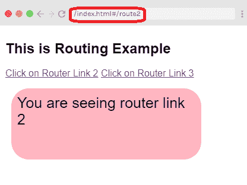

现在，点击路由器链接 3，您将在 url 中看到设置名称作为查询字符串。查看输出:

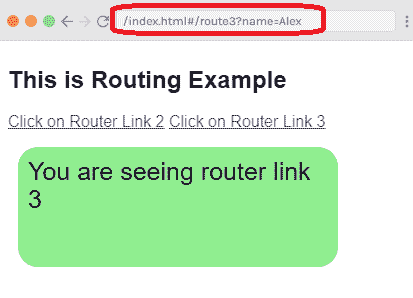

### 替换道具

replace 属性用于替换路由器链接并调用路由器。replace()而不是 router.push()。如果您使用更换道具，导航历史不会被存储。

**Index.html 文件:**

```

<html>
   <head>
      <title>Vue.js Routing</title>
      <link rel="stylesheet" href="index.css">
        <script src="https://cdn.jsdelivr.net/npm/vue/dist/vue.js"></script>
<script src="https://unpkg.com/vue/dist/vue.js"></script>
 <script src="https://unpkg.com/vue-router/dist/vue-router.js"></script>
    </head>
    <body>
      <div id = "router_1">
         <h2>This is Routing Example</h2>
         <p>
<!-- use router-link component for navigation. -->
<!-- `<router-link>` will be rendered as an `<a>` tag by default -->
            <router-link v-bind:to = "{path:'/route2'}">Click on Router Link 2</router-link> 
            <router-link v-bind:to = "{path:'/route3', query: { name: 'Panda' }}"   replace>This link is Replaced</router-link>
         </p>
         <!-- route outlet -->
         <!-- component matched by the route will render here -->
         <router-view></router-view>
      </div>
      <script type = "text/javascript">
         const Route2 = { template: '<div style = "border-radius:30px;background-color:lightpink;width:300px;height:100px;margin:10px;font-size:25px;padding:10px;">You are seeing router link 2</div>' }
         const Route3 = { template: '<div style = "border-radius:20px;background-color:lightgreen;width:300px;height:100px;margin:10px;font-size:25px;padding:10px;"> You are seeing router link 3</div>' }
         const routes = [
            { path: '/route2', component: Route2 },
            { path: '/route3', component: Route3 }
         ];
         const router = new VueRouter({
            routes // short for `routes: routes`
         });
      </script>
      <script src="index.js"></script>
   </body>
</html>

```

**Index.js 文件**也会一样。

程序执行后，您将看到以下输出:

**输出:**

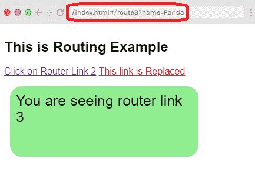

您可以看到，当您点击“此链接已被替换”链接时，网址中的名称会发生变化。

### 附加道具

追加标签用于添加 <router-link><router-link>链接，使路径相对。</router-link></router-link>

**Index.html 文件:**

```

<html>
   <head>
      <title>Vue.js Routing</title>
      <link rel="stylesheet" href="index.css">
        <script src="https://cdn.jsdelivr.net/npm/vue/dist/vue.js"></script>
<script src="https://unpkg.com/vue/dist/vue.js"></script>
 <script src="https://unpkg.com/vue-router/dist/vue-router.js"></script>
    </head>
    <body>
      <div id = "router_1">
         <h2>This is Routing Example</h2>
         <p>
<!-- use router-link component for navigation. -->
<!-- `<router-link>` will be rendered as an `<a>` tag by default -->
            <router-link v-bind:to = "{path:'/route2'}">Click on Router Link 2</router-link> 
            <router-link v-bind:to = "{ path: '/route3'}" append>This is an appended link</router-link>
         </p>
         <!-- route outlet -->
         <!-- component matched by the route will render here -->
         <router-view></router-view>
      </div>
      <script type = "text/javascript">
         const Route2 = { template: '<div style = "border-radius:30px;background-color:lightpink;width:300px;height:100px;margin:10px;font-size:25px;padding:10px;">You are seeing router link 2</div>' }
         const Route3 = { template: '<div style = "border-radius:20px;background-color:lightgreen;width:300px;height:100px;margin:10px;font-size:25px;padding:10px;"> You are seeing the appended link router</div>' }
         const routes = [
            { path: '/route2', component: Route2 },
            { path: '/route3', component: Route3 }
         ];
         const router = new VueRouter({
            routes // short for `routes: routes`
         });
      </script>
      <script src="index.js"></script>
   </body>
</html>

```

**Index.js 文件:**

```

var vm = new Vue({
            el: '#router_1',
            router
         })

```

让我们使用一个简单的 CSS 文件来使输出更加吸引人。

**Index.css 文件:**

```

html, body {
    margin: 5px;
    padding: 0;
}

```

程序执行后，您将看到以下输出:

**输出:**

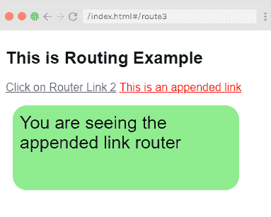

### 附加道具

追加标签用于与<router-link>相加，使路径相对。举个例子吧。</router-link>

**示例:**

**Index.html 文件:**

```

<html>
   <head>
      <title>Vue.js Routing</title>
      <link rel="stylesheet" href="index.css">
        <script src="https://cdn.jsdelivr.net/npm/vue/dist/vue.js"></script>
<script src="https://unpkg.com/vue/dist/vue.js"></script>
 <script src="https://unpkg.com/vue-router/dist/vue-router.js"></script>
    </head>
    <body>
      <div id = "router_1">
         <h2>This is Routing Example</h2>
         <p>
<!-- use router-link component for navigation. -->
<!-- `<router-link>` will be rendered as an `<a>` tag by default -->
            <router-link v-bind:to = "{path:'/route2'}">Click on Router Link 2</router-link> 
            <router-link v-bind:to = "{ path: '/route3'}" append>This is an appended link</router-link>
         </p>
         <!-- route outlet -->
         <!-- component matched by the route will render here -->
         <router-view></router-view>
      </div>
      <script type = "text/javascript">
         const Route2 = { template: '<div style = "border-radius:30px;background-color:lightpink;width:300px;height:100px;margin:10px;font-size:25px;padding:10px;">You are seeing router link 2</div>' }
         const Route3 = { template: '<div style = "border-radius:20px;background-color:lightgreen;width:300px;height:100px;margin:10px;font-size:25px;padding:10px;"> You are seeing the appended link router</div>' }
         const routes = [
            { path: '/route2', component: Route2 },
            { path: '/route3', component: Route3 }
         ];
         const router = new VueRouter({
            routes // short for `routes: routes`
         });
      </script>
      <script src="index.js"></script>
   </body>
</html>

```

**Index.js 文件:**

```

var vm = new Vue({
            el: '#router_1',
            router
         })

```

让我们使用一个简单的 CSS 文件来使输出更加吸引人。

**Index.css 文件:**

```

html, body {
    margin: 5px;
    padding: 0;
}

```

程序执行后，您将看到以下输出:

**输出:**


### 标签道具

<router-link>被渲染为标签。当您想要将标记作为其他标记呈现时，可以使用标记道具。例如，如果要将<router-link>渲染为“跨度”，则应将其指定为**标记=“跨度”。**举个简单的例子。</router-link></router-link>

**示例:**

**Index.html 文件:**

```

<html>
   <head>
      <title>Vue.js Routing</title>
      <link rel="stylesheet" href="index.css">
        <script src="https://cdn.jsdelivr.net/npm/vue/dist/vue.js"></script>
<script src="https://unpkg.com/vue/dist/vue.js"></script>
 <script src="https://unpkg.com/vue-router/dist/vue-router.js"></script>
    </head>
    <body>
      <div id = "router_1">
         <h2>This is Routing Example</h2>
         <p>
             <router-link v-bind:to = "{ path: '/route2'}" tag = "span">Click on Router Link 2</router-link> 
            <router-link v-bind:to = "{ path: '/route3'}" tag = "span">Click on Router Link 3</router-link>
         </p>
         <!-- route outlet -->
         <!-- component matched by the route will render here -->
         <router-view></router-view>
      </div>
      <script type = "text/javascript">
         const Route2 = { template: '<div style = "border-radius:30px;background-color:lightpink;width:300px;height:100px;margin:10px;font-size:25px;padding:10px;">You are seeing router link 2</div>' }
         const Route3 = { template: '<div style = "border-radius:20px;background-color:lightgreen;width:300px;height:100px;margin:10px;font-size:25px;padding:10px;"> You are seeing router link 3</div>' }
         const routes = [
            { path: '/route2', component: Route2 },
            { path: '/route3', component: Route3 }
         ];
         const router = new VueRouter({
            routes // short for `routes: routes`
         });
      </script>
      <script src="index.js"></script>
   </body>
</html>

```

**Index.js 文件:**

index.js 文件将与我们在前面的示例中使用的相同。

程序执行后，您将看到以下输出:

**输出:**

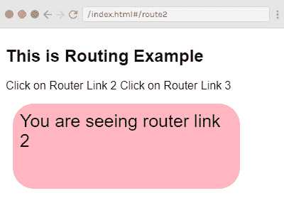

在上例中，可以看到现在显示的标签是 [span 标签](https://www.javatpoint.com/html-span-tag)。它们不会被视为可点击的链接，但您可以点击它们。现在，点击路由器链接 3 并查看结果。

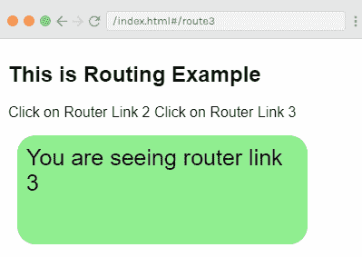

### 现役道具

当你想要激活时，激活类属性被添加到<router-link>中。它用于显示路由器链路处于活动状态。添加为**活动类=“_ 活动”。**</router-link>

下面的代码指定如何在示例中使用它。

**语法:**

```

<style>
   ._active{
      background-color : red;
   }
</style>
<p>
<router-link v-bind:to = "{ path: '/route2'}" active-class = "._active">Click on Router Link 2</router-link>
<router-link v-bind:to = "{ path: '/route3'}" tag = "span">Click on Router Link 3</router-link>
</p>

```

它将使“点击路由器链接 2”路径处于活动状态，而“点击路由器链接 3”将保持不变。

### 精确活动类道具

精确活动类配置链接活动时应用的活动 CSS 类。默认的确切活动类别被应用为路由器-链路-确切活动。

下面的代码指定如何在示例中使用它。

**语法:**

```

<style>
   ._active{
      background-color : red;
   }
</style>
<p>
<router-link v-bind:to = "{ path: '/route2'}" exact-active-class = "._active">Click on Router Link 2</router-link>
<router-link v-bind:to = "{ path: '/route3'}" tag = "span">Click on Router Link 3</router-link>
</p>

```

### 活动道具

在前面的示例中，您已经看到路由器链接的默认事件是 click 事件。当您单击链接时，会显示路由器链接。您可以使用事件属性来更改这一点。请参见以下示例:

**示例:**

**Index.html 文件:**

```

<html>
   <head>
      <title>Vue.js Routing</title>
      <link rel="stylesheet" href="index.css">
        <script src="https://cdn.jsdelivr.net/npm/vue/dist/vue.js"></script>
<script src="https://unpkg.com/vue/dist/vue.js"></script>
 <script src="https://unpkg.com/vue-router/dist/vue-router.js"></script>
    </head>
    <body>
      <div id = "router_1">
         <h2>This is Routing Example</h2>
<style>
   ._active{
      background-color : red;
   }
</style>
<p>
<router-link v-bind:to = "{ path: '/route2'}" event = "mouseover">Hover this link</router-link>
            <router-link v-bind:to = "{ path: '/route3'}" tag = "span">Click on Router Link 3</router-link>
         </p>
         <!-- route outlet -->
         <!-- component matched by the route will render here -->
         <router-view></router-view>
      </div>
      <script type = "text/javascript">
         const Route2 = { template: '<div style = "border-radius:30px;background-color:lightpink;width:300px;height:100px;margin:10px;font-size:25px;padding:10px;">You are seeing router link 2</div>' }
         const Route3 = { template: '<div style = "border-radius:20px;background-color:lightgreen;width:300px;height:100px;margin:10px;font-size:25px;padding:10px;"> You are seeing router link 3</div>' }
         const routes = [
            { path: '/route2', component: Route2 },
            { path: '/route3', component: Route3 }
         ];
         const router = new VueRouter({
            routes // short for `routes: routes`
         });
      </script>
      <script src="index.js"></script>
   </body>
</html>

```

**Index.js 文件:**

Index.js 文件将与上面的示例相同。

程序执行后，您将看到以下输出:

**输出:**

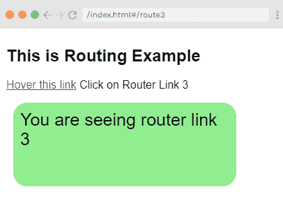

当您将鼠标光标悬停在第一个链接上时，您将看到以下结果。

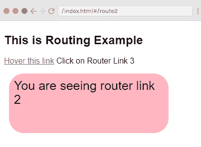

* * *