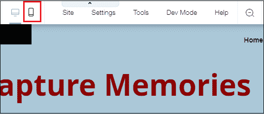

# 登陆页面教程

> 原文：<https://www.javatpoint.com/landing-pages>

*   登录页面是**独立网页**，旨在将访问者转化为潜在客户。
*   登陆页面是专门为营销人员设计的，以从营销活动中获得更多流量。
*   它可以是任何东西，例如我们网站的主页、博客文章、线索捕获页面等等。
*   它是游客购买、创造产品或服务并从中赚取收入的地方。

**例:** Shopify、bencht、Wistia、Nauto、Unbounce、Bills.com、产业实力营销等。

用户可以在登录页面上做以下事情-

*   购买
*   打电话给我们
*   通过聊天联系我们
*   订阅时事通讯或电子邮件列表
*   注册参加活动

在我们的登录页教程中，我们将讨论以下主题-

*   [登陆页面类型](#Types)
*   [登陆页面的优势](#Advantages)
*   [登陆页面的缺点](#Disadvantages)
*   [登陆页面组件](#Components)
*   [如何创建吸引人的登陆页面](#Attractive)
*   [最受欢迎的登陆页面工具](#Tools)

* * *

## 登录页面的类型

有以下类型的登录页面-

### 1.潜在顾客生成登录页面

潜在客户生成登录页面也称为“**潜在客户生成**或“**潜在客户捕获**”页面。它主要用于捕获**访客的信息**，如**他/她的姓名、电子邮件地址、联系电话、公司规模**等等。通过使用销售线索生成登录页面，我们还可以生成有关产品和服务的必要详细信息。

在登录页面上有以下方法可以改进和产生销售线索-

*   保持表格的简短和吸引力
*   继续关注消息传递策略
*   写入可扫描副本
*   创建具有高质量和相关视觉效果的内容
*   为登录页面实现一个聊天系统
*   包括信任和隐私信号
*   排除一切干扰
*   免费试用注册

### 2.点进登陆页面

点进登陆页面也被称为**“跳转页面”**主要由**电商**和**软件即服务(SaaS)营销商**使用。开发点击率页面的主要目标是**“预热**”你试图销售产品或服务的客户。

**谷歌云平台(GCP)、Moz Pro、Animoto、Lumosity、Sallie Mae** 、以及**全国宠物保险**都是点击率登陆页面最受欢迎的例子。

### 3.病毒登陆页面

病毒登陆页面是登陆页面的基本类型。顾名思义，它通过**口碑[社交媒体营销](https://www.javatpoint.com/social-media-marketing)网络**帮助组织推广业务。病毒登陆页面的主要目标不仅是让访问者注册，而且是告诉其他人他们到底发现了什么。

一些最受欢迎的病毒登陆页面例子是 **Wistia，Unbounce，IMPACT 品牌&设计，钳制**，和**Bills.com**。

* * *

## 登陆页面的优势

正如我们所知，登陆页面有助于我们改进营销策略，并在我们的[网站](https://www.javatpoint.com/website)上产生更多流量。

登录页面的优势列表如下-

### 1.推广新产品和服务以增加销售额

登录页面帮助我们推广产品和服务，以增加我们组织的销售额。它还允许我们使用各种社交媒体平台，如**脸书、Instagram、Twitter** 等来推广我们的产品。

### 2.提高SEO排名

登陆页面通过将正常点击转化为在网站上产生更多流量的线索，帮助我们提高 [SEO](https://www.javatpoint.com/seo-tutorial) 排名。登陆页面还允许我们使用特定于 SEO 的登陆页面，这有助于我们有机地提高网站排名。

### 3.提高品牌知名度

登录页面帮助我们使用各种广告技巧来提高品牌知名度。

### 4.增加搜索流量

登陆页面提供了一个**搜索友好平台**，帮助我们定位关键词，并遵循SEO技术来驱动更多的有机流量。

### 5.易于管理

登陆页面管理起来非常快捷方便。当我们运行一部分具有不同变化的登录页面时，登录页面会出现困难。

### 6.特定工具

登录页面包含各种在线营销工具，帮助访问者轻松访问我们的网站，并收集更多与我们的产品相关的信息，如我们向快乐的客户提供哪些特定产品。

* * *

## 登陆页面的缺点

登录页有以下缺点-

### 1.数据可移植性

这是登陆页面构建器最大的缺点，因为有时候很难从一个平台切换到另一个平台，很难将页面从一个页面构建器导出到标准的 [HTML](https://www.javatpoint.com/html-tutorial) 。

### 2.没有全局编辑

页面构建者很难进行全局编辑，这意味着如果你有一些编辑来制作 10 个不同的页面，那么你就不能这样做，因为这样做你必须逐个进行编辑。

### 3.有限定制

大多数页面构建者都在努力变得越来越灵活，但没有一个人被提供 100%灵活的定制设计和开发环境。

* * *

## 登录页面的组件

作为一个有吸引力和好看的页面帮助我们产生更多的流量，所以登录页面使用各种必要的组件来使我们的页面或网站更有吸引力和好看。

下面给出了一些最重要和最有效的登录页组件-

### 1.主标题

主标题是登录页的第一个也是最重要的组成部分。这有助于访问者清楚地了解他们从整个页面中获取知识的主题。尽量使主标题**简短、独特、吸引人**、**信息丰富**来吸引游客的兴趣，并告知游客我们的产品或服务是什么。

#### 注意:总要尽量把主标题写在 20 字以内。主标题最合适的长度是 10 个字。

### 2.独特而吸引人的图像

吸引人的图片在登录页面中也扮演着最重要的角色。它有助于访问者更好地了解(比文本快 6 万倍以上)我们向定期访问的客户提供什么产品和服务。

将图片放在登录页面上时，您会记住以下内容-

*   图像应该清晰，像素不要太大或太短。
*   图片应该是信息丰富的，并且与您的产品和服务相关。
*   图片应该是吸引人的，好看的，容易在我们的页面上抓住访问者的注意力。
*   图像需要独特和高质量。

### 3.关键词

**有效的**和**信息丰富的**关键词帮助我们将访问者带到我们的登陆页面，并增加我们的网站在谷歌和其他搜索引擎上的排名。关键词帮助我们构建、定制和发布有效的登录页面。

### 4.使用强有力的行动号召

行动号召是创建高质量转换登录页面的重要组成部分。它可以是点击登录页面上独立按钮的一部分，也可以是销售线索生成表单的一部分。永远记住，行动号召应该是**有价值的、易于使用的、突出的**，以及**面向行动的**。

### 5.社会证明

社交证明是最强大的登录页面组件之一，它帮助我们向访问者展示我们提供的产品和服务。登录页面上还使用社交证明来统计使用来自公共网络的社交信号注册的人数。

社会证明在登陆页面上有多种形式-

*   客户直接报价
*   个案研究
*   视频采访或证明
*   客户公司的标志
*   查看来自亚马逊或 Yelp 网站的分数

### 6.辩论终结

当登录页关闭时，结束参数写在登录页的末尾。这是与客户交流我们为他们提供的产品和服务的最后机会。

### 7.社交媒体共享选项

登陆页面还包括社交媒体分享选项，帮助我们在社交媒体平台上**传播优惠、促销、活动**，以及**其他信息**。这也有助于我们根据访问者在社交媒体平台上的喜欢、评论和分享来了解他们对我们产品的看法。总是尝试设计一个 100%可点击且设计良好的社交媒体分享按钮，它会吸引访问者对我们分享按钮的关注。

### 8.形式

表单是获取客户有价值信息的最佳方式。仅在表单中创建有价值的字段，如**姓名、联系电话、电子邮件地址、居住地址**和**提交按钮**。始终尝试保持数据库更新意味着当客户填写完所有信息并点击提交按钮时，数据库能够立即生成新的销售线索。

### 9.隐私策略

在登录页面上添加隐私政策是一个好主意，可以确保我们的客户的个人信息是安全的。这也有助于我们在登录页面上获得客户的满意和信任。

### 10.感谢页面

一旦访问者完成了我们的行动呼吁，并填写了联系表中的所有细节，并签署了他/她的帐户，那么请始终记得对他们说“谢谢。!"

* * *

## 如何创建吸引人的登录页面

众所周知，一个有效的登陆页面有助于我们增加在线市场，所以要始终努力打造**好看、有吸引力、信息丰富的**登陆页面，这有助于我们从访问者那里攫取更多的注意力。一个吸引人的登陆页面包括**对颜色的巧妙运用、醒目的图像、视频、有效的布局、简单的导航**等等。

#### 注意:在我们的教程中，我们将使用 WiX.com 创建一个登陆页面

按照以下步骤创建一个吸引人的登录页面。

**第一步:**点击或复制/粘贴任意搜索引擎上的以下链接，访问[Wix.com](https://www.wix.com/)网站，创建登陆页面。

**第二步:**一旦 wix.com 官方页面出现在屏幕上，点击**开始**。

**第三步:**屏幕出现以下页面。如果你已经有了一个 Wix 账号，那么只需点击**登录**即可，否则**输入你的邮箱地址**和**密码**然后点击**注册**。你也可以使用脸书和谷歌帐户注册。

**第四步:**一旦注册成功，屏幕上会出现以下屏幕，其中有两个选项**让 Wix ADI 为您创建网站**(设计用于回答简单问题)或**使用编辑器**创建您的网站(设计用于创建我们自己的网站)，根据您的要求选择选项并点击**选择模板**。

**第五步:**滚动左上角的滑块，选择**类别**。在类别中，屏幕上会出现各种不同类别的列表。您只需选择**“登陆页面**”。

**第 6 步:**屏幕上出现登陆页面列表，在列表中根据您的需求选择模板。选择模板后，将鼠标悬停在其中，屏幕上会出现两个选项，点击**查看**。

**第七步:**下面的截图显示创建了一个新的登陆页面模板。

### 编辑登录页面模板

一旦您创建了登录页面视图，您还可以根据您的需求编辑它的视图，并使它对访问者更有吸引力，以获得更多的流量。

要编辑登录页面的视图，请按照以下步骤操作-

**第一步:**选择模板，点击屏幕右上角的**编辑本网站**。

**第二步:**屏幕上出现如下画面，有各种编辑选项。

### 编辑背景

背景帮助我们使我们的登陆页面更有吸引力。Wix.com 允许我们在登陆页面上**添加背景色、预定义背景图像**和**视频**。

要编辑登录页面背景，请单击左侧选项窗格中的背景。

单击背景后，屏幕上会出现一个小框，其中包含颜色、图像、视频按钮和选定背景的列表。您可以从列表中选择任何图像，只需在屏幕上拖动即可。

下面的截图显示背景图像发生了变化。

### 编辑文本

要编辑文本，点击要编辑的文本，屏幕上会出现一个小的**编辑文本按钮**。点击**编辑文本**按钮。

屏幕上将出现文本设置窗口。您可以通过单击与标题相关联的下拉按钮来更改标题的大小，通过单击与字体相关联的下拉按钮来更改字体的大小。选择文本的字体大小和标题后，双击要编辑的文本并开始书写要添加的文本。

下面的截图显示文本被更改。

### 添加动画文本

**第一步:**选择想要添加动画的文本，屏幕上出现三个图标，其中点击**动画图标**，如下图截图所示。

**第二步:**屏幕出现动画窗口列表，根据需要选择动画，点击窗口底部的**自定义**按钮。

**第三步:**屏幕上出现一个小的**动画设置**窗口。根据你的要求制作一个动画。

**第四步:**验证动画是否添加，点击屏幕右上角的**预览**。

### 在登录页面上添加图像

**第一步:**在登陆页面添加图片，点击屏幕左上角的**添加图标**。

**第二步:**点击+ Add 后，屏幕出现如下窗口，点击**图像**选择**图像采集**，然后双击**自由 Wix 图像。**

**第三步:**屏幕上出现一个**选择图像窗口**，选择图像和类别，根据您的要求选择图像，然后点击屏幕底部的**添加到页面**。

下面的截图显示图像被添加到登录页面。

#### 注意:您也可以使用添加动画文本中提到的步骤向图像添加动画。

### 在登录页面上创建联系人表单

联系表帮助我们收集客户信息，如他/她的**姓名、电子邮件地址、联系电话**和**位置**。

在登录页面上创建联系人表单有以下步骤-

**第一步:**在登陆页面创建联系人表单，点击右窗格的**+添加**，选择**联系人表单**。屏幕上会出现一个联系人表单列表，请根据您的要求选择表单。

#### 注意:在我们的例子中，我们将创建一个订阅表单。

下面的截图显示，表单已添加到提货单页面。

### 收集访客信息

当任何用户填写联系表时，我们也可以通过以下步骤收集他/她的信息-

**步骤 1:** 双击表单，屏幕上出现一个**表单设置**按钮。点击它。

**第二步:**屏幕出现流动弹出窗口，点击**提交消息。**

**第三步:**点击提交消息后，屏幕上出现如下窗口，选择**链接至外部[网址](https://www.javatpoint.com/url-full-form)** ，然后点击**选择一个链接**。

**第 4 步:**现在，输入您想要推广或发送给您的电子邮件订户的代销商优惠，并输入您的网址(URL)，然后单击完成。

### 查看移动设备上的登录页面

由于现在大多数用户都想在手机上访问登陆页面，所以在将你的登陆页面发布到网络上之前，一定要在手机上查看它。

要在手机上看到你的登陆页面，点击屏幕顶部的手机图标**。**

下面的截图显示了您在移动设备上的登录页面视图。

### 在网上发布登陆页面

一旦你创建了你的登陆页面，现在你需要在网上发布它。要在网上发布您的登陆页面，点击屏幕右上角的**发布**按钮。

一旦点击发布，屏幕上将出现以下**祝贺**窗口，在该窗口中输入您的**站点名称**，并点击窗口底部的**完成**。

* * *

## 最受欢迎的登录页面工具

众所周知，登录页面是在网络上产生销售线索的最重要工具。它使用各种工具，使用图像、视频、联系人表单、按钮等创建一个吸引人且用户友好的页面。

最受欢迎的登录页面工具列表如下-

### 1.取消装箱

Unbounce 是第一个也是最流行的登陆页面工具。它提供了通用的、用户友好的、易于使用的拖放编辑器，无需任何技术知识即可创建登录页面。

**定价:**unbound 的价格为基本计划每月 74 美元，高级计划每月 149 美元，企业计划每月 399 美元。

**拆箱**的特点

*   它为基于网络和社交媒体的登录页面使用了 100 多个页面模板。
*   它可以轻松地与 WordPress、MailChimp、AWeber 和其他客户关系管理以及分析工具集成。
*   它允许我们在页面上添加粘性标题、弹出窗口和地图。
*   它帮助我们提高性能并减少创建登录页面的时间。
*   它提供内置的音频/视频测试。

点击以下链接，注册 https://unbounce.com/

### 2.Instapage

Instapge 是用户友好、高性能、易于使用和最强大的登录页面工具。它使用各种图像、视频、按钮、链接、购物车结账和感谢页面来吸引访问者。

**定价:**核心计划每月 149 美元，代理和团队计划每月 200 美元。

**insta page 的特性**

*   Instapage 允许我们使用**“拖放”**技术来创建漂亮的登录页面，而不需要技术开发人员。
*   它使用 200 多个用户友好和移动响应的页面模板。
*   它提供内置的音频/视频测试。
*   它提供了向页面添加自定义代码的能力。
*   它很容易与谷歌广告词、脸书、推特、Zoho、Mailchimp 和谷歌分析集成。

点击以下链接注册 insta page-[https://instapage.com/](https://instapage.com/)

### 3.前导页

Leadpages 是创建登录页面的最佳工具之一。

**定价:**标准计划每月 25 美元，专业计划每月 48 美元，高级计划每月 199 美元。

**引线页的特性**

*   它与脸书等社交媒体平台整合。
*   使用拖放技术轻松移动内容。
*   有 160 多个模板可供选择。
*   它帮助我们以最简单的方式捕捉线索。
*   它可以与 WordPress 集成。

点击以下链接，注册 Leadpages-[https://www.leadpages.net/](https://www.leadpages.net/)

### 4.轮毂点

Hubspot 是由布莱恩·哈利根和达姆什·沙阿于 2006 年在麻省理工学院创立的。它为数字营销人员提供了各种工具来创建富有创意和令人印象深刻的登录页面。

**定价:**最便宜的等级价格为 50 美元/月。

**轮毂点**的特征

Hubspot 包括各种功能。以下列出了一些重要的轮毂点功能-

*   它提供了简单易用的页面模板。
*   它提供各种博客和内容创建工具。
*   它允许我们添加视频、跟踪代码、图像、表单等。登陆页面。
*   它帮助我们移动内容并在线开展业务。

点击以下链接注册 Hubspot-[https://www.hubspot.com/](https://www.hubspot.com/)

### 5.叉池

Wishpond 是最重要和最强大的登陆页面构建工具之一。它允许我们创建、编辑和管理登录页面。

**定价:**49 美元/月，最多 1500 个线索，99 美元/月，最多 2500 个线索，10000 个线索，S199 美元/月。

**叉塘**的特点

*   Wishpond 集成了各种营销平台。
*   它提供各种营销自动化工具、销售线索生成工具、在线表单和销售线索管理工具。
*   对于非技术用户来说非常容易使用。
*   默认情况下，它会创建移动响应页面。

点击以下链接注册 wish pond:[https://www.wishpond.com/v2/](https://www.wishpond.com/v2/)

### 6.启动基石

初创公司使用 Launchrock 来创建登录页面。使用在线工具非常简单和免费。它包括构建、推广和分析等工具，以确保产品发布的成功。

**定价:**每月 29 美元，每年 249 美元，终身接入 349 美元。

**发射岩石的特征**

*   Launchrock 包括有趣的社交功能，允许我们与其他人共享页面。
*   它有能力使用我们自己的域名。
*   它帮助我们创建一个 100%响应的网站。
*   它包括注册捕获和预售电子商务工具。
*   它提供了一个现代的基于块的构建器，具有所见即所得和自定义 HTML 块。
*   观众发现

点击以下链接注册 Launchrock:[http://help.launchrock.com/support/home](https://help.launchrock.com/support/home)

### 7.你好吧

Hello Bar 是帮助我们为网站访问者设计消息的最佳登陆页面工具。它是吸引游客的最佳工具之一。

**定价:**免费试用。

**哈啰吧**功能

Hello Bar 包含以下功能列表，使页面更具吸引力-

*   这有助于我们增加游客的关注。
*   它包括社交媒体按钮。
*   空调测试
*   它提供了很高的转化率。
*   它利用脸书、推特、领英、Pinterest 和 Buffer 等各种社交媒体平台进行产品推广。
*   它降低了网站的跳出率。

点击以下链接注册哈啰吧-[https://www.hellobar.com/](https://www.hellobar.com/)

### 8 .疯狂蛋

CrazyEgg 是一个在线应用程序，帮助我们了解客户对特定产品或服务的兴趣。易贝、戴尔、雅虎、英特尔和希尔顿等大型和小型组织都使用它。

**定价:**CrazyEgg 9 美元/月。

**CrazyEgg 的特性**

*   它提供了更好的 UX 和更大的游客满意度
*   它帮助我们通过改进的SEO来提高搜索引擎排名。
*   它包括各种眼睛跟踪工具，如热图、滚动图等，使我们的网站更有吸引力。

点击以下链接注册 CrazyEgg:[https://www.crazyegg.com/](https://www.crazyegg.com/)

### 9.取响应

GetResponse 帮助我们创建高转化率、移动响应的登录页面。它帮助我们使用拖放环境创建登陆页面。

**定价:**电子邮件计划每月 15 美元，专业版每月 49 美元，最大版每月 165 美元，企业版每月 1，199 美元。

**最佳 GetResponse 的特性**

点击以下链接注册 GetResponse -

*   它集成了各种平台，如必应、谷歌广告词、KissMetrics、等。
*   它提供内置的音频/视频测试。
*   它包含一个贝宝按钮，帮助我们执行与支付相关的操作。
*   它包括 1000 多个模板。

[https://www.getresponse.com/](https://www.getresponse.com/)

### 10.点击漏斗

点击漏斗旨在在线销售我们的产品。它提供了一个开箱即用的解决方案，可以在几分钟内轻松设置。点击漏斗包括三个主要目标:产生销售线索、产生销售和运行在线活动。

**定价:**97 美元/月+

**点击漏斗的特点**

*   它帮助我们轻松添加视频、跟踪代码、图像等。
*   它提供了简单易用的模板。
*   它通过移动内容来帮助我们改善在线业务。
*   设计一个页面花费的时间更少。
*   它包括各种类型的预制漏斗。

点击以下链接，注册点击漏斗。

* * *