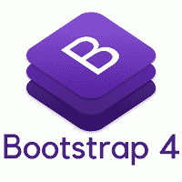

# 什么是 Bootstrap 4？

> 原文：<https://www.javatpoint.com/bootstrap-4>

Bootstrap 4 是 Bootstrap 的最新版本。 [Bootstrap](https://www.javatpoint.com/bootstrap-tutorial) 可以定义为一个自由开源的框架，可以用来创建响应迅速、移动优先的前端网页。

### 引导的优点:

**Bootstrap 有各种不同的优点，下面给出几个:**

1.  使用 Bootstrap 的首要优势是它非常易于使用和实现。如果一个人对 HTML 和 CSS 有一些基本的了解，那么这个用户可以很容易地使用 Bootstrap。
2.  Bootstrap 可以适应任何手机、平板、台式机等尺寸的事实也是一个非常有趣的特性。
3.  Bootstrap 4 也很有用，因为它兼容所有现代浏览器，包括谷歌 Chrome、火狐、互联网浏览器 10+、Edge、Safari 和 Opera。
4.  它也产生较少的跨浏览器错误。
5.  它重量轻，因此可以广泛用作创建响应站点的框架。
6.  最后，Bootstrap 4 是一个非常简单但非常有效的网格系统。

### 为什么要使用 Bootstrap？

**原因有很多，比如:**

1.  这是一种更快、更简单的网站开发方式。
2.  它可以创建独立于平台的网页。
3.  它还可以创建响应性网页。
4.  使用 Bootstrap 4 创建的网页可以很容易地做出响应。

### Bootstrap 4 在当今世界有哪些主要用途？

Bootstrap 4 有多种主要用途，示例如下:

1.  **各种浏览器支持**:每个浏览器都可以支持。
2.  **启动和实现简单**:当用户对 HTML 和 CSS 有相当多的知识时，启动和实现非常容易。除此之外，文档也可以在官方网站上找到。
3.  **响应性设计和外观**:使用 Bootstrap 框架创建的网页具有响应性，可以适应移动、桌面等任何屏幕尺寸。
4.  **轻松定制**:它还提供了一些内置的组件和功能，可以用来轻松定制网页。

### bootstrap 4 有哪些缺点？

**Bootstrap 4 也有很多缺点；这些缺点如下:**

1.  在许多情况下，对于需要大量投资的企业来说，Bootstrap 不能被认为非常实用。
2.  此外，Bootstrap 4 创建一个网站可能需要很多时间。因此，在没有投资的情况下使用 bootstrap 4 并不是一个非常聪明的想法。
3.  一个使用 Bootstrap 4 的人，即使投资后也不太可能赚到钱。
4.  这也是为什么用户很容易负债累累的原因之一。

## 自举 3 vs Bootstrap4

| 自举 3 | Bootstrap4 |
| 在引导 3 中，CSS 源文件是 LESS(更精简的样式表)。 | 在 Bootstrap4 中，CSS 源文件是 SCSS。 |
| 这里，网格系统有 4 层，分别是 xs、sm、md 和 lg。 | 这里，网格系统有 5 层，分别是 xs、sm、md、lg 和 xl。 |
| CSS 的单位是 px。 | CSS 单元是 rem。 |
| 下拉结构是在

*   Created with the help of.

 | 借助

创建下拉结构

 |
| 班级。img-response 用于创建响应图像。 | 班级。img-fluid 用于创建响应图像。 |
| 对于图标，用户可以使用磷脂。 | Bootstrap 4 中不支持磷脂酰胆碱。 |
| 有许多类用于媒体对象，例如。媒体，。媒体机构。媒体对象，。媒体标题等等。 | 媒体对象只有一个类别，那就是媒体。 |
| Bootstrap 3 不支持暗表或反向表 | 用户可以在使用的帮助下创建暗表或逆表。桌面黑暗类。 |
| 唯一可以用来创建按钮的类是。BTN-默认和。BTN-信息 | 引入了许多可用于创建按钮的新类，例如-。btn-light，。BTN-次要的。BTN-成功。黑暗。而且，上课。BTN-默认值已删除。 |
| 在的帮助下，可以创建一个非常小的按钮。btn-xs 类。 | 特大号按钮在 Bootstrap 4 中不再可用。唯一可用的课程是。btn-sm 和。btn-lg。 |
| 复选框或单选框是在类的帮助下创建的，如。收音机。直列收音机。复选框，以及。复选框-内嵌。 | 复选框和单选按钮是在使用类的帮助下创建的，例如。表格检查。表格-检查-标签，。表单检查输入。表单-检查-内嵌。 |
| 借助于使用，表格的大小可以增加或减少。输入-lg 和。输入 sm 类。 | 借助于使用，表格的大小可以增加或减少。表单控件 lg 和。表单控制 sm 类。 |
| 菜单标题可以在使用的帮助下创建。li 标签的下拉标题类。 | 菜单标题是在使用的帮助下创建的。带有 h1 到 h2 标签的下拉标题类。 |
| 为了划分部分，类。li 元素中使用了分频器。 | 为了划分部分，一个类。下拉分隔符可以用在 div 元素中。 |
| 这些页面可以在的帮助下对齐。以前的和。下节课。 | 课程。以前的和。这不支持 next。 |
| 给你。jumbotron-fluid 类不能用于创建全宽 jumbotron。 | Bootstrap 4 允许用户使用。jumbotron-fluid 类创建全宽 jumbotron。 |
| 班级。项目用于创建转盘项目。 | 班级。转盘-项目用于转盘项目。 |
| 在 Bootstrap 3 中，支持井、面板和缩略图。 | 在 Bootstrap 4 中，不支持井、面板和缩略图。可以用卡片来代替。 |

## 先决条件

在学习 Bootstrap 4 之前，您应该对 HTML 和 CSS 有一个基本的了解。

## 观众

我们的 Bootstrap 4 教程旨在帮助愿意学习 Bootstrap 4 概念并成为前端开发人员的初学者和软件专业人员。到本教程结束时，您将获得 Bootstrap 4 的中级专业知识。

## 问题

我们向您保证，您不会发现 Bootstrap4 教程有任何问题。但如有错误，请将问题贴在联系单上。

* * *