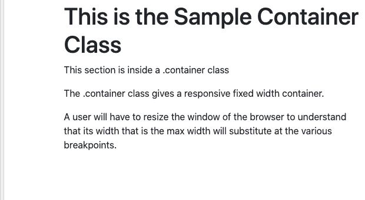
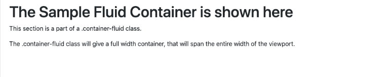

# 引导 4 -布局

> 原文：<https://www.javatpoint.com/bootstrap-4-layouts>

Bootstrap 4 是 Bootstrap 的最新版本。Bootstrap 是一个免费使用的完全开源的 CSS 框架，旨在进行响应性的、移动优先的前端 web 开发。它包含基于 CSS 和 JavaScript 的设计模板，用于排版、表单、按钮、导航和其他界面组件，这是最流行的 [HTML](https://www.javatpoint.com/html-tutorial) 、 [CSS](https://www.javatpoint.com/css-tutorial) 和 [JavaScript](https://www.javatpoint.com/javascript-tutorial) 框架，用于开发响应迅速、移动优先的网站。Bootstrap 4 完全可以免费下载和使用。

## 引导 4 中的布局

在 [Bootstrap 4](bootstrap-4) 中，有一些容器类通常用于包装页面中的不同内容。基本上有两个容器类可以用于各种不同的活动-

1.  。这个容器类可以用来表示一个固定宽度的容器。
2.  。容器-流体-该容器可用于表示全宽容器。

## 容器

那个。 [Bootstrap](https://www.javatpoint.com/bootstrap-tutorial) 4 中的容器类可以应用到网页中，目的是以固定的宽度包装页面内容。此外，通过使用容器类，在使用。**集装箱**班如下图所示。

**这个类的语法如下:**

```

<div class = "container">   
......
</div>

```

显示固定宽度容器类的简单网页示例可以在下面给出的代码中看到:

```

<!DOCTYPE html>
<html lang="en">
<head>
  <title>Bootstrap Example</title>
  <meta charset="utf-8">
  <meta name="viewport" content="width=device-width, initial-scale=1">
  <link rel="stylesheet" href="https://maxcdn.bootstrapcdn.com/bootstrap/4.5.2/css/bootstrap.min.css">
  <script src="https://ajax.googleapis.com/ajax/libs/jquery/3.5.1/jquery.min.js"></script>
  <script src="https://cdnjs.cloudflare.com/ajax/libs/popper.js/1.16.0/umd/popper.min.js"></script>
  <script src="https://maxcdn.bootstrapcdn.com/bootstrap/4.5.2/js/bootstrap.min.js"></script>
</head>
<body>
<div class="container">
  <h1>This is the Sample Container Class</h1>
  <p>This section is inside a .container class</p> 
  <p>The .container class gives a responsive fixed width container.</p>
  <p>A user will have to resize the window of the browser to understand that its width that is the max width will substitute at the various breakpoints.</p>
</div>
</body>
</html>

```

[Test it Now](https://www.javatpoint.com/oprweb/test.jsp?filename=bootstrap-4-layouts1)

以下程序的输出如下所示-

**输出:**



## 液体容器

在本节中，用户可以借助**构建全宽容器。容器-流体**类。

语法如下:

```

<div class = "container-fluid"> 
...
</div>

```

下面给出了这个类的例子，下面的例子显示了一个包含全宽容器的简单网页

**示例:**

```

<!DOCTYPE html>
<html lang="en">
<head>
  <title>Bootstrap Example</title>
  <meta charset="utf-8">
  <meta name="viewport" content="width=device-width, initial-scale=1">
  <link rel="stylesheet" href="https://maxcdn.bootstrapcdn.com/bootstrap/4.5.2/css/bootstrap.min.css">
  <script src="https://ajax.googleapis.com/ajax/libs/jquery/3.5.1/jquery.min.js"></script>
  <script src="https://cdnjs.cloudflare.com/ajax/libs/popper.js/1.16.0/umd/popper.min.js"></script>
  <script src="https://maxcdn.bootstrapcdn.com/bootstrap/4.5.2/js/bootstrap.min.js"></script>
</head>
<body>

<div class="container-fluid">
  <h1>The Sample Fluid Container is shown here</h1>
  <p>This section is a part of a .container-fluid class.</p>
  <p>The .container-fluid class will give a full width container, that will span the entire width of the viewport.</p>           
</div> 
</body>
</html>

```

[Test it Now](https://www.javatpoint.com/oprweb/test.jsp?filename=bootstrap-4-layouts2)

以下程序的输出如下所示-

**输出:**



* * *