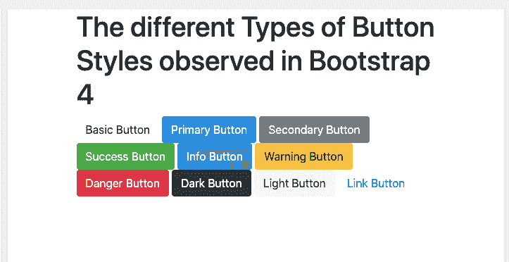
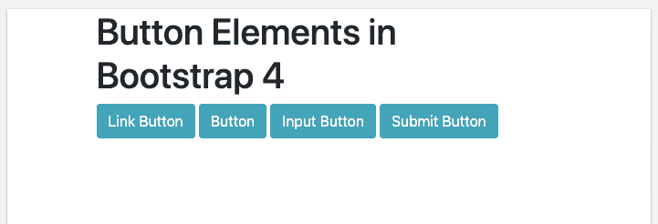
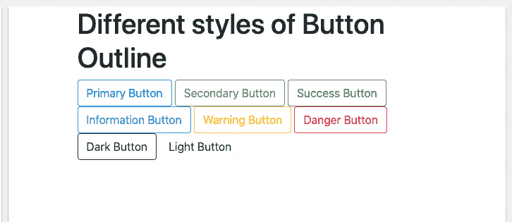
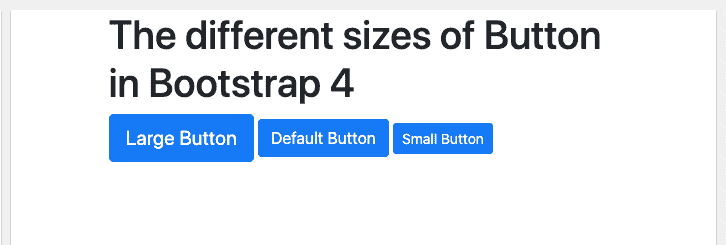
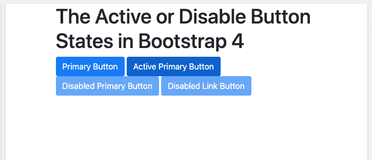
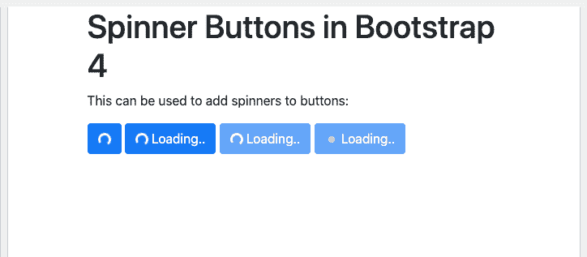

# 自举 4 -按钮

> 原文：<https://www.javatpoint.com/bootstrap-4-buttons>

在 Bootstrap 4 中，用户还可以向他们的网页添加按钮。有各种不同类型的按钮可以应用于网页。下面列出了这些按钮:

1.  基本按钮
2.  主按钮
3.  辅助按钮
4.  成功按钮
5.  信息按钮
6.  警告按钮
7.  危险按钮
8.  黑色按钮
9.  光键
10.  链接按钮

**显示所有这些按钮样式的示例代码如下:**

```

<!DOCTYPE html>
<html lang="en">
<head>
  <title>Bootstrap Example</title>
  <meta charset="utf-8">
  <meta name="viewport" content="width=device-width, initial-scale=1">
  <link rel="stylesheet" href="https://maxcdn.bootstrapcdn.com/bootstrap/4.5.2/css/bootstrap.min.css">
  <script src="https://ajax.googleapis.com/ajax/libs/jquery/3.5.1/jquery.min.js"></script>
  <script src="https://cdnjs.cloudflare.com/ajax/libs/popper.js/1.16.0/umd/popper.min.js"></script>
  <script src="https://maxcdn.bootstrapcdn.com/bootstrap/4.5.2/js/bootstrap.min.js"></script>
</head>
<body>
<div class="container">
  <h1>The different Types of Button Styles observed in Bootstrap 4</h1>
  <button type="button" class="btn">Basic Button</button>
  <button type="button" class="btn btn-primary">Primary Button</button>
  <button type="button" class="btn btn-secondary">Secondary Button</button>
  <button type="button" class="btn btn-success">Success Button</button>
  <button type="button" class="btn btn-info">Info Button</button>
  <button type="button" class="btn btn-warning">Warning Button</button>
  <button type="button" class="btn btn-danger">Danger Button</button>
  <button type="button" class="btn btn-dark">Dark Button</button>
  <button type="button" class="btn btn-light">Light Button</button>
  <button type="button" class="btn btn-link">Link Button</button>      
</div>
</body>
</html>

```

[Test it Now](https://www.javatpoint.com/oprweb/test.jsp?filename=bootstrap-4-buttons1)

**上述给定样本代码的输出将是:**



## 带有元素的按钮:

除此之外，这些按钮有时还可以与诸如[<【a】>](https://www.javatpoint.com/html-anchor)用于链接、 [<输入>](https://www.javatpoint.com/html-input-tag) 用于输入按钮等元素一起使用。

**例如:**

```

<!DOCTYPE html>
<html lang="en">
<head>
  <title>Bootstrap Example</title>
  <meta charset="utf-8">
  <meta name="viewport" content="width=device-width, initial-scale=1">
  <link rel="stylesheet" href="https://maxcdn.bootstrapcdn.com/bootstrap/4.5.2/css/bootstrap.min.css">
  <script src="https://ajax.googleapis.com/ajax/libs/jquery/3.5.1/jquery.min.js"></script>
  <script src="https://cdnjs.cloudflare.com/ajax/libs/popper.js/1.16.0/umd/popper.min.js"></script>
  <script src="https://maxcdn.bootstrapcdn.com/bootstrap/4.5.2/js/bootstrap.min.js"></script>
</head>
<body>
<div class="container">
  <h1>Button Elements in Bootstrap 4</h1>
  <a href="#" class="btn btn-info" role="button">Link Button</a>
  <button type="button" class="btn btn-info">Button</button>
  <input type="button" class="btn btn-info" value="Input Button">
  <input type="submit" class="btn btn-info" value="Submit Button">
</div>
</body>
</html>

```

[Test it Now](https://www.javatpoint.com/oprweb/test.jsp?filename=bootstrap-4-buttons2)

**本例的输出为:**



## 带轮廓的按钮:

在[引导程序 4](bootstrap-4) 中，用户也可以只给按钮添加轮廓。目前[自举](https://www.javatpoint.com/bootstrap-tutorial) 4 共有 8 种带轮廓的按钮。悬停在这些按钮上时，用户将看到按钮内部轮廓的颜色。

不同类型的轮廓按钮如下所示:

1.  主大纲按钮
2.  辅助大纲按钮
3.  成功大纲按钮
4.  信息大纲按钮
5.  警告大纲按钮
6.  危险轮廓按钮
7.  深色轮廓按钮
8.  灯光轮廓按钮

**显示这些轮廓按钮的示例代码如下:**

```

<!DOCTYPE html>
<html lang="en">
<head>
  <title>Bootstrap Example</title>
  <meta charset="utf-8">
  <meta name="viewport" content="width=device-width, initial-scale=1">
  <link rel="stylesheet" href="https://maxcdn.bootstrapcdn.com/bootstrap/4.5.2/css/bootstrap.min.css">
  <script src="https://ajax.googleapis.com/ajax/libs/jquery/3.5.1/jquery.min.js"></script>
  <script src="https://cdnjs.cloudflare.com/ajax/libs/popper.js/1.16.0/umd/popper.min.js"></script>
  <script src="https://maxcdn.bootstrapcdn.com/bootstrap/4.5.2/js/bootstrap.min.js"></script>
</head>
<body>
<div class="container">
  <h1>Different styles of Button Outline</h1>
  <button type="button" class="btn btn-outline-primary">Primary Button</button>
  <button type="button" class="btn btn-outline-secondary">Secondary Button</button>
  <button type="button" class="btn btn-outline-success">Success Button</button>
  <button type="button" class="btn btn-outline-info">Information Button</button>
  <button type="button" class="btn btn-outline-warning">Warning Button</button>
  <button type="button" class="btn btn-outline-danger">Danger Button</button>
  <button type="button" class="btn btn-outline-dark">Dark Button</button>
  <button type="button" class="btn btn-outline-light text-dark">Light Button</button>
</div>
</body>
</html>

```

[Test it Now](https://www.javatpoint.com/oprweb/test.jsp?filename=bootstrap-4-buttons3)

**该样本代码的输出将是:**



## 不同尺寸的按钮:

用户也可以在类的帮助下调整按钮的大小。BTN-大，用于扩大按钮和类别的大小。btn-sm 用于减小按钮的尺寸。

**例如:**

```

<!DOCTYPE html>
<html lang="en">
<head>
  <title>Bootstrap Example</title>
  <meta charset="utf-8">
  <meta name="viewport" content="width=device-width, initial-scale=1">
  <link rel="stylesheet" href="https://maxcdn.bootstrapcdn.com/bootstrap/4.5.2/css/bootstrap.min.css">
  <script src="https://ajax.googleapis.com/ajax/libs/jquery/3.5.1/jquery.min.js"></script>
  <script src="https://cdnjs.cloudflare.com/ajax/libs/popper.js/1.16.0/umd/popper.min.js"></script>
  <script src="https://maxcdn.bootstrapcdn.com/bootstrap/4.5.2/js/bootstrap.min.js"></script>
</head>
<body>
<div class="container">
  <h1>The different sizes of Button in Bootstrap 4</h1>
  <button type="button" class="btn btn-primary btn-lg">Large Button</button>
  <button type="button" class="btn btn-primary btn-md">Default Button</button>    
  <button type="button" class="btn btn-primary btn-sm">Small Button</button>
</div>
</body>
</html>

```

[Test it Now](https://www.javatpoint.com/oprweb/test.jsp?filename=bootstrap-4-buttons4)

**上述给定代码的输出将是:**



## 活动按钮或禁用按钮:

在 Bootstrap 4 中，按钮可以显示为活动(看起来被按下)或禁用(看起来不可点击)状态。

对于活动按钮，类。active 用于使按钮看起来被按下，disabled 属性使按钮不可选择。

但是，

**激活按钮或禁用按钮的样本类别为:**

```

<!DOCTYPE html>
<html lang="en">
<head>
  <title>Bootstrap Example</title>
  <meta charset="utf-8">
  <meta name="viewport" content="width=device-width, initial-scale=1">
  <link rel="stylesheet" href="https://maxcdn.bootstrapcdn.com/bootstrap/4.5.2/css/bootstrap.min.css">
  <script src="https://ajax.googleapis.com/ajax/libs/jquery/3.5.1/jquery.min.js"></script>
  <script src="https://cdnjs.cloudflare.com/ajax/libs/popper.js/1.16.0/umd/popper.min.js"></script>
  <script src="https://maxcdn.bootstrapcdn.com/bootstrap/4.5.2/js/bootstrap.min.js"></script>
</head>
<body>
<div class="container">
  <h1>The Active or Disable Button States in Bootstrap 4</h1>
  <button type="button" class="btn btn-primary">Primary Button</button>
  <button type="button" class="btn btn-primary active">Active Primary Button</button>
  <button type="button" class="btn btn-primary" disabled>Disabled Primary Button</button>
  <a href="#" class="btn btn-primary disabled">Disabled Link Button</a>
</div>
</body>
</html>

```

[Test it Now](https://www.javatpoint.com/oprweb/test.jsp?filename=bootstrap-4-buttons5)

**上述给定代码的输出将是:**



## 微调按钮:

用户可以在按钮中以及在 Bootstrap 4 中添加微调器。

**微调按钮的示例代码如下:**

```

<!DOCTYPE html>
<html>
<head>
  <title>Bootstrap Example</title>
  <meta name="viewport" content="width=device-width, initial-scale=1">
  <link rel="stylesheet" href="https://maxcdn.bootstrapcdn.com/bootstrap/4.5.2/css/bootstrap.min.css">
  <script src="https://ajax.googleapis.com/ajax/libs/jquery/3.5.1/jquery.min.js"></script>
  <script src="https://cdnjs.cloudflare.com/ajax/libs/popper.js/1.16.0/umd/popper.min.js"></script>
  <script src="https://maxcdn.bootstrapcdn.com/bootstrap/4.5.2/js/bootstrap.min.js"></script>
</head>
<body>
<div class="container">
  <h1>Spinner Buttons in Bootstrap 4</h1>
  <p>This can be used to add spinners to buttons:</p>

  <button class="btn btn-primary">
    <span class="spinner-border spinner-border-sm"></span>
  </button>
  <button class="btn btn-primary">
    <span class="spinner-border spinner-border-sm"></span>
    Loading..
  </button>  
  <button class="btn btn-primary" disabled>
    <span class="spinner-border spinner-border-sm"></span>
    Loading..
  </button> 
  <button class="btn btn-primary" disabled>
    <span class="spinner-grow spinner-grow-sm"></span>
    Loading..
  </button>
</div>
</body>
</html>

```

[Test it Now](https://www.javatpoint.com/oprweb/test.jsp?filename=bootstrap-4-buttons6)

**上述给定代码的输出将是:**



* * *