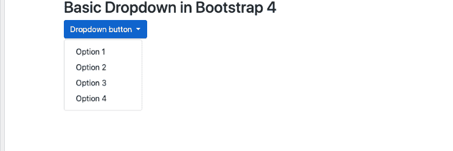
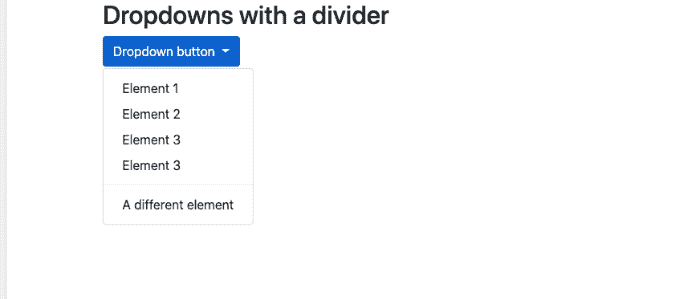
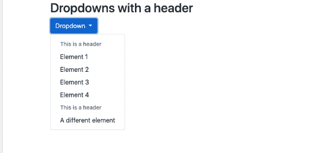
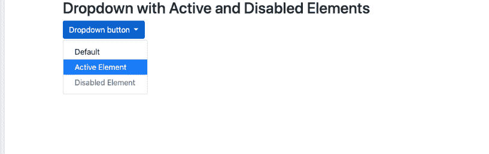
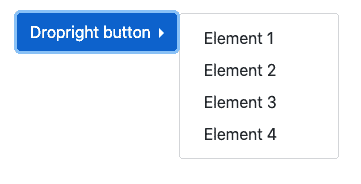
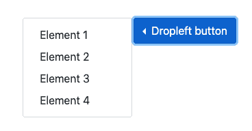
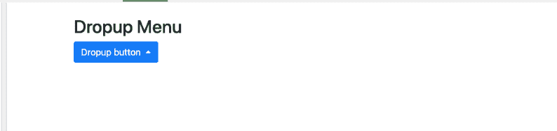
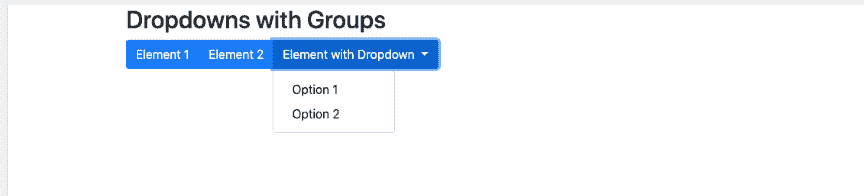

# Bootstrap4 -下拉

> 原文：<https://www.javatpoint.com/bootstrap-4-dropdowns>

**下拉列表或下拉菜单**可以定义为图形控制元素，有点类似于列表框，允许用户从列表或菜单中选择一个值。

在 [Bootstrap 4](bootstrap-4) 中，可以使用不同类型的下拉列表，列表如下:

1.  基本下拉列表
2.  带分隔符的下拉列表
3.  带标题的下拉列表
4.  包含禁用和活动元素的下拉列表
5.  任何位置的下拉菜单，即右、左和上
6.  带下拉菜单的组按钮

## 基本下拉列表:

基本下拉菜单是可切换的下拉菜单，允许用户从预定义的选项列表中选择一个选项。在基本下拉菜单中，**。下拉菜单**类用于指示下拉菜单。

用户也可以使用按钮或带有类别**的链接打开下拉菜单。下拉-切换**和数据-切换=“下拉”属性。

用户必须添加**。下拉菜单**类到一个 [< div >](https://www.javatpoint.com/html-div-tag) 元素来实际构建下拉菜单。然后添加。**下拉项目**分类到每个元素，如下拉菜单中的链接或按钮。

**基本下拉菜单示例代码如下:**

```

<!DOCTYPE html>
<html>
<head>
  <title>Bootstrap Example</title>
  <meta name="viewport" content="width=device-width, initial-scale=1">
  <link rel="stylesheet" href="https://maxcdn.bootstrapcdn.com/bootstrap/4.5.2/css/bootstrap.min.css">
  <script src="https://ajax.googleapis.com/ajax/libs/jquery/3.5.1/jquery.min.js"></script>
  <script src="https://cdnjs.cloudflare.com/ajax/libs/popper.js/1.16.0/umd/popper.min.js"></script>
  <script src="https://maxcdn.bootstrapcdn.com/bootstrap/4.5.2/js/bootstrap.min.js"></script>
</head>
<body>
<div class="container">
  <h2>Basic Dropdown in Bootstrap 4</h2>                                     
  <div class="dropdown">
    <button type="button" class="btn btn-primary dropdown-toggle" data-toggle="dropdown">
      Dropdown button
    </button>
    <div class="dropdown-menu">
      <a class="dropdown-item" href="#">Option 1</a>
      <a class="dropdown-item" href="#">Option 2</a>
      <a class="dropdown-item" href="#">Option 3</a>
      <a class="dropdown-item" href="#">Option 4</a>
    </div>
  </div>
</div>
</body>
</html>

```

[Test it Now](https://www.javatpoint.com/oprweb/test.jsp?filename=bootstrap-4-dropdowns1)

**输出为:**



## 带分隔符的下拉列表:

通过使用带有分隔线的下拉菜单，用户可以使用分隔线创建单独的相关菜单项组。分离是借助一条细水平线显示的。

**带分隔符的下拉列表示例代码如下:**

```

<!DOCTYPE html>
<html>
<head>
  <title>Bootstrap Example</title>
  <meta name="viewport" content="width=device-width, initial-scale=1">
  <link rel="stylesheet" href="https://maxcdn.bootstrapcdn.com/bootstrap/4.5.2/css/bootstrap.min.css">
  <script src="https://ajax.googleapis.com/ajax/libs/jquery/3.5.1/jquery.min.js"></script>
  <script src="https://cdnjs.cloudflare.com/ajax/libs/popper.js/1.16.0/umd/popper.min.js"></script>
  <script src="https://maxcdn.bootstrapcdn.com/bootstrap/4.5.2/js/bootstrap.min.js"></script>
</head>
<body>
<div class="container">
  <h2>Dropdowns with a divider</h2>
  <div class="dropdown">
    <button type="button" class="btn btn-primary dropdown-toggle" data-toggle="dropdown">
      Dropdown button
    </button>
    <div class="dropdown-menu">
      <a class="dropdown-item" href="#">Element 1</a>
      <a class="dropdown-item" href="#">Element 2</a>
      <a class="dropdown-item" href="#">Element 3</a>
      <a class="dropdown-item" href="#">Element 3</a>
      <div class="dropdown-divider"></div>
      <a class="dropdown-item" href="#">A different element</a>
    </div>
  </div>
</div>
</body>
</html>

```

[Test it Now](https://www.javatpoint.com/oprweb/test.jsp?filename=bootstrap-4-dropdowns2)

**样本代码的输出将是:**



## 带标题的下拉列表:

用户可以使用**在下拉菜单中添加标题。下拉标题**类。

**带标题的下拉列表示例代码如下:**

```

<!DOCTYPE html>
<html>
<head>
  <title>Bootstrap Example</title>
  <meta name="viewport" content="width=device-width, initial-scale=1">
  <link rel="stylesheet" href="https://maxcdn.bootstrapcdn.com/bootstrap/4.5.2/css/bootstrap.min.css">
  <script src="https://ajax.googleapis.com/ajax/libs/jquery/3.5.1/jquery.min.js"></script>
  <script src="https://cdnjs.cloudflare.com/ajax/libs/popper.js/1.16.0/umd/popper.min.js"></script>
  <script src="https://maxcdn.bootstrapcdn.com/bootstrap/4.5.2/js/bootstrap.min.js"></script>
</head>
<body>
<div class="container">
  <h2>Dropdowns with a header</h2>
  <div class="dropdown">
    <button type="button" class="btn btn-primary dropdown-toggle" data-toggle="dropdown">
      Dropdown
    </button>
    <div class="dropdown-menu">
      <h5 class="dropdown-header">This is a header</h5>
      <a class="dropdown-item" href="#">Element 1</a>
      <a class="dropdown-item" href="#">Element 2</a>
      <a class="dropdown-item" href="#">Element 3</a>
      <a class="dropdown-item" href="#">Element 4</a>
      <h5 class="dropdown-header">This is a header</h5>
      <a class="dropdown-item" href="#">A different element</a>
    </div>
  </div>
</div>
</body>
</html>

```

[Test it Now](https://www.javatpoint.com/oprweb/test.jsp?filename=bootstrap-4-dropdowns3)

**样本代码的输出将是:**



## 包含禁用和活动元素的下拉列表:

在禁用和激活元素的下拉列表中，元素用**突出显示特定的下拉项目。通过添加蓝色背景色激活**类。

同样，为了禁用下拉菜单中的某个项目，用户必须使用。禁用类，获得浅灰色文本颜色和悬停时的“禁止停车”图标。

**禁用和激活元素的下拉列表示例代码如下:**

```

<!DOCTYPE html>
<html>
<head>
  <title>Bootstrap Example</title>
  <meta name="viewport" content="width=device-width, initial-scale=1">
  <link rel="stylesheet" href="https://maxcdn.bootstrapcdn.com/bootstrap/4.5.2/css/bootstrap.min.css">
  <script src="https://ajax.googleapis.com/ajax/libs/jquery/3.5.1/jquery.min.js"></script>
  <script src="https://cdnjs.cloudflare.com/ajax/libs/popper.js/1.16.0/umd/popper.min.js"></script>
  <script src="https://maxcdn.bootstrapcdn.com/bootstrap/4.5.2/js/bootstrap.min.js"></script>
</head>
<body>
<div class="container">
  <h2>Dropdown with Active and Disabled Elements</h2>
  <div class="dropdown">
    <button type="button" class="btn btn-primary dropdown-toggle" data-toggle="dropdown">
      Dropdown button
    </button>
    <div class="dropdown-menu">
      <a class="dropdown-item" href="#">Default</a>
      <a class="dropdown-item active" href="#">Active Element</a>
      <a class="dropdown-item disabled" href="#">Disabled Element</a>
    </div>
  </div>
</div>
</body>
</html>

```

[Test it Now](https://www.javatpoint.com/oprweb/test.jsp?filename=bootstrap-4-dropdowns4)

**样本代码的输出将是:**



## 任何位置的下拉菜单，即右、左和上:

用户还可以通过添加**来创建“向右拖放”或“向左拖放”菜单。dropright** 或**。将**类拖放到下拉元素中。

除此之外，如果用户希望下拉菜单向上扩展而不是向下扩展，请将带有 class =“drop down”的

元素更改为“dropup”

插入符号/箭头会自动添加到该下拉列表中。

**任意位置(即右侧或左侧)下拉列表的示例代码:**

```

Dropright Button - <div class="dropdown dropright">

```

**输出:**



```

Dropleft Button - <div class="dropdown dropleft">

```

**输出:**



**下拉菜单示例代码如下:**

```

<!DOCTYPE html>
<html>
<head>
  <title>Bootstrap Example</title>
  <meta name="viewport" content="width=device-width, initial-scale=1">
  <link rel="stylesheet" href="https://maxcdn.bootstrapcdn.com/bootstrap/4.5.2/css/bootstrap.min.css">
  <script src="https://ajax.googleapis.com/ajax/libs/jquery/3.5.1/jquery.min.js"></script>
  <script src="https://cdnjs.cloudflare.com/ajax/libs/popper.js/1.16.0/umd/popper.min.js"></script>
  <script src="https://maxcdn.bootstrapcdn.com/bootstrap/4.5.2/js/bootstrap.min.js"></script>
</head>
<body>
<br>
<div class="container">
  <h2>Dropup Menu</h2>
  <div class="dropup">
    <button type="button" class="btn btn-primary dropdown-toggle" data-toggle="dropdown">
      Dropup button
    </button>
    <div class="dropdown-menu">
      <a class="dropdown-item" href="#">Element 1</a>
      <a class="dropdown-item" href="#">Element 2</a>
      <a class="dropdown-item" href="#">Element 3</a>
      <a class="dropdown-item" href="#">Element 4</a>
    </div>
  </div>
</div>
</body>
</html>

```

[Test it Now](https://www.javatpoint.com/oprweb/test.jsp?filename=bootstrap-4-dropdowns5)

**样本代码的输出将是:**



## 带下拉菜单的组按钮:

对于带有下拉功能的分组按钮，用户必须添加几个按钮，并在其中一个按钮上添加下拉功能。

**带下拉的组按钮示例代码如下:**

```

<!DOCTYPE html>
<html lang="en">
<head>
  <title>Bootstrap Example</title>
  <meta charset="utf-8">
  <meta name="viewport" content="width=device-width, initial-scale=1">
  <link rel="stylesheet" href="https://maxcdn.bootstrapcdn.com/bootstrap/4.5.2/css/bootstrap.min.css">
  <script src="https://ajax.googleapis.com/ajax/libs/jquery/3.5.1/jquery.min.js"></script>
  <script src="https://cdnjs.cloudflare.com/ajax/libs/popper.js/1.16.0/umd/popper.min.js"></script>
  <script src="https://maxcdn.bootstrapcdn.com/bootstrap/4.5.2/js/bootstrap.min.js"></script>
</head>
<body>
<div class="container">
  <h2>Dropdowns with Groups</h2>
  <div class="btn-group">
    <button type="button" class="btn btn-primary">Element 1</button>
    <button type="button" class="btn btn-primary">Element 2</button>
    <div class="btn-group">
      <button type="button" class="btn btn-primary dropdown-toggle" data-toggle="dropdown">
      Element with Dropdown
      </button>
      <div class="dropdown-menu">
        <a class="dropdown-item" href="#">Option 1</a>
        <a class="dropdown-item" href="#">Option 2</a>
      </div>
    </div>
  </div>
</div>
</body>
</html>

```

[Test it Now](https://www.javatpoint.com/oprweb/test.jsp?filename=bootstrap-4-dropdowns6)

**样本代码的输出将是:**



用户还可以创建垂直对齐的按钮下拉列表。下面给出了一个例子:

```

<div class="container">
  <h2>Vertically Aligned Button Group with Dropdown</h2>
  <div class="btn-group-vertical">
    <button type="button" class="btn btn-primary">Element 1</button>
    <button type="button" class="btn btn-primary">Element 2</button>
    <div class="btn-group">
      <button type="button" class="btn btn-primary dropdown-toggle" data-toggle="dropdown">
        Element with Dropdown
      </button>
      <div class="dropdown-menu">
        <a class="dropdown-item" href="#">Option 1</a>
        <a class="dropdown-item" href="#">Option 2</a>
      </div>
    </div>
  </div>

```

**该代码的输出为:**


* * *