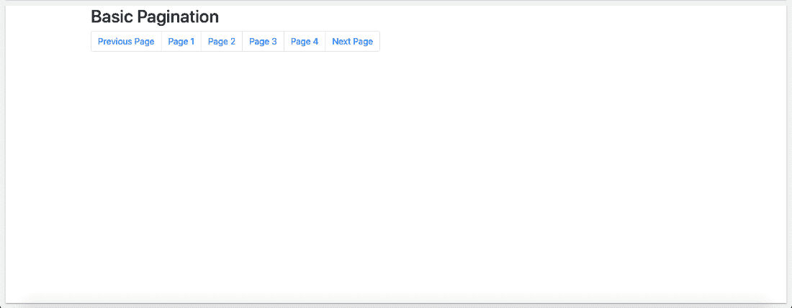
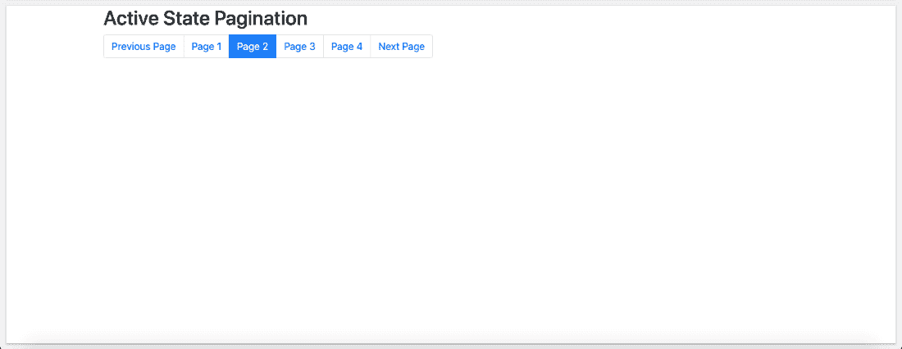
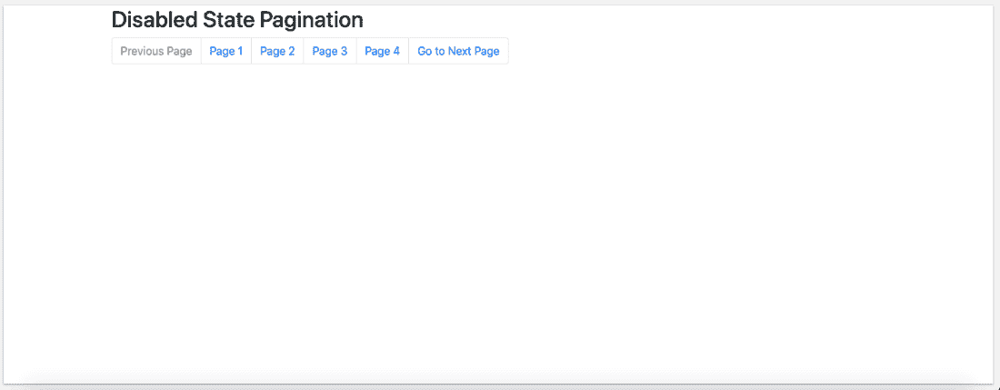
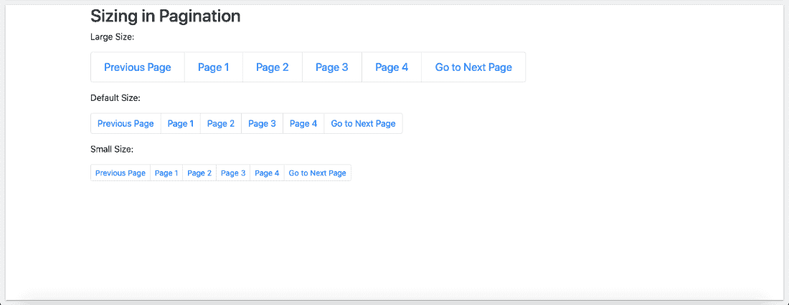
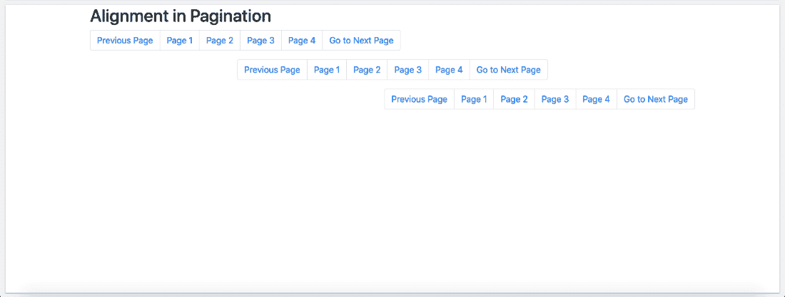
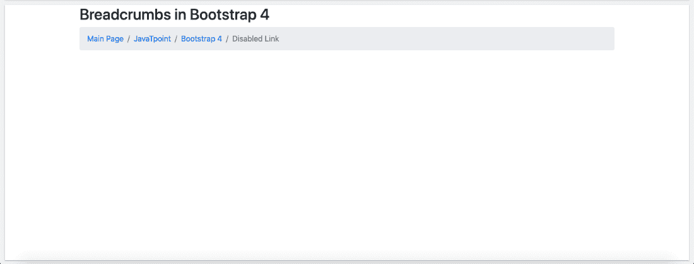

# 引导 4 -分页

> 原文：<https://www.javatpoint.com/bootstrap-4-pagination>

当一个网站有很多页面，用户想添加页码时，就使用 Bootstrap 中的分页。

[Bootstrap 4](https://www.javatpoint.com/bootstrap-4) 中基本上可以观察到不同类型的分页，列表如下:

1.  基本分页
2.  活动状态分页
3.  禁用状态分页
4.  分页中的大小调整
5.  分页中的对齐

## 基本分页:

为了创建基本的分页，用户必须将**包括在内。分页**类到一个 [< ul >](https://www.javatpoint.com/html-unordered-list) 元素。之后，用户必须添加**。页面项目**到每个< li >元素和一个**。page-link** 类到 [< li >](https://www.javatpoint.com/html-lists) 里面的每个链接。

**例如:**

```

<!DOCTYPE html>
<html lang="en">
<head>
  <title>Bootstrap Example</title>
  <meta charset="utf-8">
  <meta name="viewport" content="width=device-width, initial-scale=1">
  <link rel="stylesheet" href="https://maxcdn.bootstrapcdn.com/bootstrap/4.5.2/css/bootstrap.min.css">
  <script src="https://ajax.googleapis.com/ajax/libs/jquery/3.5.1/jquery.min.js"></script>
  <script src="https://cdnjs.cloudflare.com/ajax/libs/popper.js/1.16.0/umd/popper.min.js"></script>
  <script src="https://maxcdn.bootstrapcdn.com/bootstrap/4.5.2/js/bootstrap.min.js"></script>
</head>
<body>
<div class="container">
  <h2>Basic Pagination</h2>                 
  <ul class="pagination">
    <li class="page-item"><a class="page-link" href="#">Previous Page</a></li>
    <li class="page-item"><a class="page-link" href="#">Page 1</a></li>
    <li class="page-item"><a class="page-link" href="#">Page 2</a></li>
    <li class="page-item"><a class="page-link" href="#">Page 3</a></li>
    <li class="page-item"><a class="page-link" href="#">Page 4</a></li>
    <li class="page-item"><a class="page-link" href="#">Next Page</a></li>
  </ul>
</div>
</body>
</html>

```

[Test it Now](https://www.javatpoint.com/oprweb/test.jsp?filename=bootstrap-4-pagination1)

**输出将是:**



## 活动状态分页:

为了使活动状态分页，**。活动的**类可以用来高亮当前页面。

**例如:**

```

<!DOCTYPE html>
<html lang="en">
<head>
  <title>Bootstrap Example</title>
  <meta charset="utf-8">
  <meta name="viewport" content="width=device-width, initial-scale=1">
  <link rel="stylesheet" href="https://maxcdn.bootstrapcdn.com/bootstrap/4.5.2/css/bootstrap.min.css">
  <script src="https://ajax.googleapis.com/ajax/libs/jquery/3.5.1/jquery.min.js"></script>
  <script src="https://cdnjs.cloudflare.com/ajax/libs/popper.js/1.16.0/umd/popper.min.js"></script>
  <script src="https://maxcdn.bootstrapcdn.com/bootstrap/4.5.2/js/bootstrap.min.js"></script>
</head>
<body>
<div class="container">
  <h2>Active State Pagination</h2>
  <ul class="pagination">
    <li class="page-item"><a class="page-link" href="#">Previous Page</a></li>
    <li class="page-item"><a class="page-link" href="#">Page 1</a></li>
    <li class="page-item active"><a class="page-link" href="#">Page 2</a></li>
    <li class="page-item"><a class="page-link" href="#">Page 3</a></li>
    <li class="page-item"><a class="page-link" href="#">Page 4</a></li>    
    <li class="page-item"><a class="page-link" href="#">Next Page</a></li>
  </ul>
</div>
</body>
</html>

```

[Test it Now](https://www.javatpoint.com/oprweb/test.jsp?filename=bootstrap-4-pagination2)

**输出将是:**



## 禁用状态分页:

禁用状态用于创建不可选择的链接。这种情况下使用的类是**。禁用**类。

**例如:**

```

<!DOCTYPE html>
<html lang="en">
<head>
  <title>Bootstrap Example</title>
  <meta charset="utf-8">
  <meta name="viewport" content="width=device-width, initial-scale=1">
  <link rel="stylesheet" href="https://maxcdn.bootstrapcdn.com/bootstrap/4.5.2/css/bootstrap.min.css">
  <script src="https://ajax.googleapis.com/ajax/libs/jquery/3.5.1/jquery.min.js"></script>
  <script src="https://cdnjs.cloudflare.com/ajax/libs/popper.js/1.16.0/umd/popper.min.js"></script>
  <script src="https://maxcdn.bootstrapcdn.com/bootstrap/4.5.2/js/bootstrap.min.js"></script>
</head>
<body>
<div class="container">
  <h2>Disabled State Pagination</h2>
  <ul class="pagination">
    <li class="page-item disabled"><a class="page-link" href="#">Previous Page</a></li>
    <li class="page-item"><a class="page-link" href="#">Page 1</a></li>
    <li class="page-item"><a class="page-link" href="#">Page 2</a></li>
    <li class="page-item"><a class="page-link" href="#">Page 3</a></li>
    <li class="page-item"><a class="page-link" href="#">Page 4</a></li>
    <li class="page-item"><a class="page-link" href="#">Go to Next Page</a></li>
  </ul>
</div>
</body>
</html>

```

[Test it Now](https://www.javatpoint.com/oprweb/test.jsp?filename=bootstrap-4-pagination3)

**输出将是:**



## 分页中的大小调整:

不同分页的大小可以改变。换句话说，分页块的大小也可以更大或更小。

**例如:**

```

<!DOCTYPE html>
<html lang="en">
<head>
  <title>Bootstrap Example</title>
  <meta charset="utf-8">
  <meta name="viewport" content="width=device-width, initial-scale=1">
  <link rel="stylesheet" href="https://maxcdn.bootstrapcdn.com/bootstrap/4.5.2/css/bootstrap.min.css">
  <script src="https://ajax.googleapis.com/ajax/libs/jquery/3.5.1/jquery.min.js"></script>
  <script src="https://cdnjs.cloudflare.com/ajax/libs/popper.js/1.16.0/umd/popper.min.js"></script>
  <script src="https://maxcdn.bootstrapcdn.com/bootstrap/4.5.2/js/bootstrap.min.js"></script>
</head>
<body>
<div class="container">
  <h2>Sizing in Pagination</h2>
  <p>Large:</p>
  <ul class="pagination pagination-lg">
    <li class="page-item"><a class="page-link" href="#">Previous Page</a></li>
    <li class="page-item"><a class="page-link" href="#">Page 1</a></li>
    <li class="page-item"><a class="page-link" href="#">Page 2</a></li>
    <li class="page-item"><a class="page-link" href="#">Page 3</a></li>
    <li class="page-item"><a class="page-link" href="#">Page 4</a></li>
    <li class="page-item"><a class="page-link" href="#">Go to Next Page</a></li>
  </ul>
  <p>Default:</p>
  <ul class="pagination">
    <li class="page-item"><a class="page-link" href="#">Previous Page</a></li>
    <li class="page-item"><a class="page-link" href="#">Page 1</a></li>
    <li class="page-item"><a class="page-link" href="#">Page 2</a></li>
    <li class="page-item"><a class="page-link" href="#">Page 3</a></li>
    <li class="page-item"><a class="page-link" href="#">Page 4</a></li>
    <li class="page-item"><a class="page-link" href="#">Go to Next Page</a></li>
  </ul>
  <p>Small:</p>
  <ul class="pagination pagination-sm">
    <li class="page-item"><a class="page-link" href="#">Previous Page</a></li>
    <li class="page-item"><a class="page-link" href="#">Page 1</a></li>
    <li class="page-item"><a class="page-link" href="#">Page 2</a></li>
    <li class="page-item"><a class="page-link" href="#">Page 3</a></li>
    <li class="page-item"><a class="page-link" href="#">Page 4</a></li>
    <li class="page-item"><a class="page-link" href="#">Go to Next Page</a></li>
  </ul>
</div>
</body>
</html>

```

[Test it Now](https://www.javatpoint.com/oprweb/test.jsp?filename=bootstrap-4-pagination4)

**输出将是:**



## 分页中的对齐:

分页中的对齐使用实用程序类来更改分页的对齐方式。

**例如:**

```

<!DOCTYPE html>
<html lang="en">
<head>
  <title>Bootstrap Example</title>
  <meta charset="utf-8">
  <meta name="viewport" content="width=device-width, initial-scale=1">
  <link rel="stylesheet" href="https://maxcdn.bootstrapcdn.com/bootstrap/4.5.2/css/bootstrap.min.css">
  <script src="https://ajax.googleapis.com/ajax/libs/jquery/3.5.1/jquery.min.js"></script>
  <script src="https://cdnjs.cloudflare.com/ajax/libs/popper.js/1.16.0/umd/popper.min.js"></script>
  <script src="https://maxcdn.bootstrapcdn.com/bootstrap/4.5.2/js/bootstrap.min.js"></script>
</head>
<body>
<div class="container">
  <h2>Alignment in Pagination</h2>                 
  <ul class="pagination">
    <li class="page-item"><a class="page-link" href="javascript:void(0);">Previous Page</a></li>
    <li class="page-item"><a class="page-link" href="javascript:void(0);">Page 1</a></li>
    <li class="page-item"><a class="page-link" href="javascript:void(0);">Page 2</a></li>
    <li class="page-item"><a class="page-link" href="javascript:void(0);">Page 3</a></li>
    <li class="page-item"><a class="page-link" href="javascript:void(0);">Page 4</a></li>
    <li class="page-item"><a class="page-link" href="javascript:void(0);">Go to Next Page</a></li>
  </ul>
  <ul class="pagination justify-content-center">
    <li class="page-item"><a class="page-link" href="javascript:void(0);">Previous Page</a></li>
    <li class="page-item"><a class="page-link" href="javascript:void(0);">Page 1</a></li>
    <li class="page-item"><a class="page-link" href="javascript:void(0);">Page 2</a></li>
    <li class="page-item"><a class="page-link" href="javascript:void(0);">Page 3</a></li>
    <li class="page-item"><a class="page-link" href="javascript:void(0);">Page 4</a></li>
    <li class="page-item"><a class="page-link" href="javascript:void(0);">Go to Next Page</a></li>
  </ul>
  <ul class="pagination justify-content-end">
    <li class="page-item"><a class="page-link" href="javascript:void(0);">Previous Page</a></li>
    <li class="page-item"><a class="page-link" href="javascript:void(0);">Page 1</a></li>
    <li class="page-item"><a class="page-link" href="javascript:void(0);">Page 2</a></li>
    <li class="page-item"><a class="page-link" href="javascript:void(0);">Page 3</a></li>
    <li class="page-item"><a class="page-link" href="javascript:void(0);">Page 4</a></li>
    <li class="page-item"><a class="page-link" href="javascript:void(0);">Go to Next Page</a></li>
  </ul>
</div>
</body>
</html>

```

[Test it Now](https://www.javatpoint.com/oprweb/test.jsp?filename=bootstrap-4-pagination5)

**输出将是:**



## 引导程序 4 中的面包屑

Bootstrap 4 中的面包屑可用于显示网站基于层次的信息，并指定导航层次内当前页面的位置。用户必须使用**。面包屑**类为了将列表定义成面包屑。这个类还在 CSS 的帮助下给列表添加了一个分隔符。

换句话说，面包屑可以被定义为在网站中向用户显示当前位置的导航方案。

面包屑导航非常有用，因为它有助于提高由许多页面组成或具有复杂导航层次结构的网站的可访问性。

除此之外，用户还可以通过简单地使用类**使用 Bootstrap 创建静态面包屑布局。有序列表上的面包屑**。

**面包屑示例如下:**

```

<!DOCTYPE html>
<html>
<head>
  <meta name="viewport" content="width=device-width, initial-scale=1">
  <link rel="stylesheet" href="https://maxcdn.bootstrapcdn.com/bootstrap/4.5.2/css/bootstrap.min.css">
  <script src="https://ajax.googleapis.com/ajax/libs/jquery/3.5.1/jquery.min.js"></script>
  <script src="https://cdnjs.cloudflare.com/ajax/libs/popper.js/1.16.0/umd/popper.min.js"></script>
  <script src="https://maxcdn.bootstrapcdn.com/bootstrap/4.5.2/js/bootstrap.min.js"></script>
</head>
<body>
<div class="container">
  <h2>Breadcrumb in Bootstrap 4</h2>                 
  <ul class="breadcrumb">
    <li class="breadcrumb-item"><a href="#">Main Page</a></li>
    <li class="breadcrumb-item"><a href="#">JavaTpoint</a></li>
    <li class="breadcrumb-item"><a href="#">Bootstrap 4</a></li>
    <li class="breadcrumb-item active">Disabled Link</li>
  </ul>
</div>
</body>
</html>

```

[Test it Now](https://www.javatpoint.com/oprweb/test.jsp?filename=bootstrap-4-pagination6)

**输出将是:**



#### 注意:在面包屑中，默认的面包屑分隔符是“/”。但是，用户可以在添加一些自定义 CSS 的帮助下修改它。

* * *