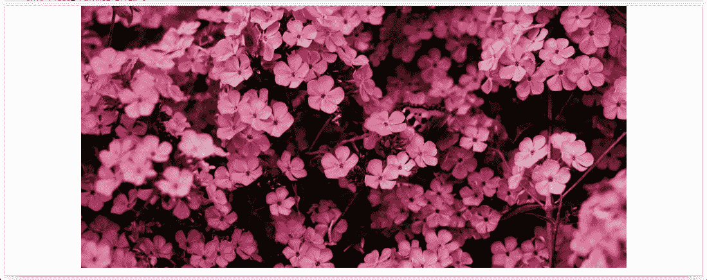
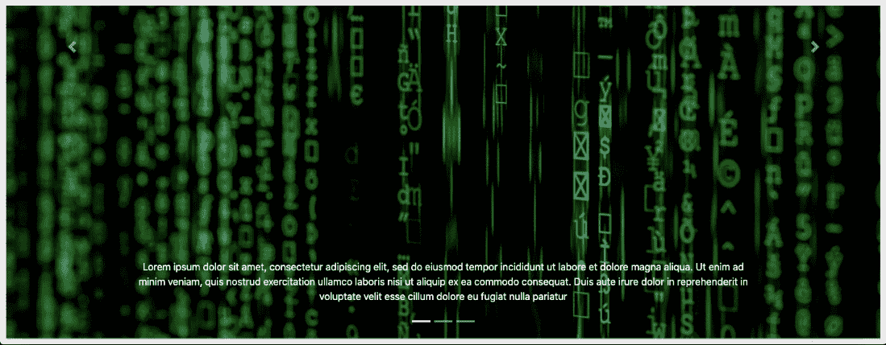

# 自举 4 -转盘

> 原文：<https://www.javatpoint.com/bootstrap-4-carousel>

Bootstrap 4 中的轮播可以定义为幻灯片放映，用于放映一系列内容，向观众展示内容并增强网站。旋转木马也可以称为幻灯片或图像滑块。它可以被视为在网页的小空间内显示大量内容的最佳方式之一。

转盘可以通过四种主要方式创建，它们是:

1.  仅使用幻灯片
2.  使用控件
3.  有了指标
4.  带字幕

### 仅使用幻灯片:

这个转盘只包含幻灯片。班级**。转盘-内部**用于向转盘添加不同的载玻片。

**例如:**

```

<!DOCTYPE html>
<html lang="en">
<head>
<meta charset="utf-8">
<meta name="viewport" content="width=device-width, initial-scale=1, shrink-to-fit=no">
<title>Bootstrap 4 Carousel</title>
<link rel="stylesheet" href="https://stackpath.bootstrapcdn.com/bootstrap/4.5.2/css/bootstrap.min.css">
<link rel="stylesheet" href="https://maxcdn.bootstrapcdn.com/font-awesome/4.7.0/css/font-awesome.min.css">
<script src="https://code.jquery.com/jquery-3.5.1.min.js"></script>
<script src="https://cdn.jsdelivr.net/npm/popper.js@1.16.1/dist/umd/popper.min.js"></script>
<script src="https://stackpath.bootstrapcdn.com/bootstrap/4.5.2/js/bootstrap.min.js"></script>
<style>
.carousel{
    background: #2f4357;
    margin-top: 20px;
}
.carousel-item{
    text-align: center;
    min-height: 280px;
}
</style>
</head>
<body>
<div class="container-lg my-3">
    <div id="carouselExampleSlidesOnly" class="carousel slide" data-ride="carousel">
  <div class="carousel-inner">
    <div class="carousel-item active">
      
    </div>
    <div class="carousel-item">
      
    </div>
    <div class="carousel-item">
      
    </div>
  </div>
</div>

```

[Test it Now](https://www.javatpoint.com/oprweb/test.jsp?filename=bootstrap-4-carousel1)

**输出将是:**



### 使用控件:

在这种情况下，将在幻灯片上添加两个小箭头，这可以帮助用户手动切换到转盘中的任何幻灯片。使用的类别如下:

1.  **。转盘-控制-上一个类:**它在转盘上插入一个左按钮或上一个按钮，这将允许用户在幻灯片之间返回。
2.  **。转盘-控制-下一个类:**它在转盘上插入一个向右或下一个按钮，这将允许用户在幻灯片之间前进。
3.  **。转盘-控制-上一个图标类:**它可以和。转盘-控制-上一页，以创建一个前一个按钮。
4.  **。转盘-控制-下一个图标类:**它可以和。转盘-控制-下一步创建“下一步”按钮

**例如:**

```

<!DOCTYPE html>
<html lang="en">
<head>
<meta charset="utf-8">
<meta name="viewport" content="width=device-width, initial-scale=1, shrink-to-fit=no">
<title>Bootstrap 4 Carousel</title>
<link rel="stylesheet" href="https://stackpath.bootstrapcdn.com/bootstrap/4.5.2/css/bootstrap.min.css">
<link rel="stylesheet" href="https://maxcdn.bootstrapcdn.com/font-awesome/4.7.0/css/font-awesome.min.css">
<script src="https://code.jquery.com/jquery-3.5.1.min.js"></script>
<script src="https://cdn.jsdelivr.net/npm/popper.js@1.16.1/dist/umd/popper.min.js"></script>
<script src="https://stackpath.bootstrapcdn.com/bootstrap/4.5.2/js/bootstrap.min.js"></script>
<style>
.carousel{
    background: #2f4357;
    margin-top: 20px;
}
.carousel-item{
    text-align: center;
    min-height: 280px;
}
</style>
</head>
<body>
<div id="carouselExampleControls" class="carousel slide" data-ride="carousel">
  <div class="carousel-inner">
    <div class="carousel-item active">
      
    </div>
    <div class="carousel-item">
      
    </div>
    <div class="carousel-item">
      
    </div>
  </div>
  <a class="carousel-control-prev" href="#carouselExampleControls" role="button" data-slide="prev">
    <span class="carousel-control-prev-icon" aria-hidden="true"></span>
    <span class="sr-only">Previous</span>
  </a>
  <a class="carousel-control-next" href="#carouselExampleControls" role="button" data-slide="next">
    <span class="carousel-control-next-icon" aria-hidden="true"></span>
    <span class="sr-only">Next</span>
  </a>
</div>
</body>
</html>

```

[Test it Now](https://www.javatpoint.com/oprweb/test.jsp?filename=bootstrap-4-carousel2)

**输出将是:**


### 使用指示器:

**。转盘-指示器**是可用于为转盘添加指示器的类。此类别中的指示器用于指示转盘中有多少张幻灯片，以及用户当前正在查看哪张幻灯片。

**例如:**

```

<!DOCTYPE html>
<html lang="en">
<head>
  <title>Bootstrap Example</title>
  <meta charset="utf-8">
  <meta name="viewport" content="width=device-width, initial-scale=1">
  <link rel="stylesheet" href="https://maxcdn.bootstrapcdn.com/bootstrap/4.5.2/css/bootstrap.min.css">
  <script src="https://ajax.googleapis.com/ajax/libs/jquery/3.5.1/jquery.min.js"></script>
  <script src="https://cdnjs.cloudflare.com/ajax/libs/popper.js/1.16.0/umd/popper.min.js"></script>
  <script src="https://maxcdn.bootstrapcdn.com/bootstrap/4.5.2/js/bootstrap.min.js"></script>
  <style>
  /* Make the image fully responsive */
  .carousel-inner img {
    width: 100%;
    height: 100%;
  }
  </style>
</head>
<body>
<div id="demo" class="carousel slide" data-ride="carousel">
  <!-- Indicators -->
  <ul class="carousel-indicators">
    <li data-target="#demo" data-slide-to="0" class="active"></li>
    <li data-target="#demo" data-slide-to="1"></li>
    <li data-target="#demo" data-slide-to="2"></li>
  </ul>
  <!-- The slideshow -->
  <div class="carousel-inner">
    <div class="carousel-item active">
      
    </div>
    <div class="carousel-item">
      
    </div>
    <div class="carousel-item">
      
    </div>
  </div>
  <!-- Left and right controls -->
  <a class="carousel-control-prev" href="#demo" data-slide="prev">
    <span class="carousel-control-prev-icon"></span>
  </a>
  <a class="carousel-control-next" href="#demo" data-slide="next">
    <span class="carousel-control-next-icon"></span>
  </a>
</div>
</body>
</html>

```

[Test it Now](https://www.javatpoint.com/oprweb/test.jsp?filename=bootstrap-4-carousel3)

**输出将是:**


### 带标题:

用户也可以在[引导 4](https://www.javatpoint.com/bootstrap-4) 中为他们的幻灯片添加标题。标题可以很容易地用来向网站的观众传达转盘中到底发生了什么。为了添加标题，用户必须在每个< div class="carousel-item" >内的<div class = " carousel-caption ">内添加元素，以便为每个幻灯片创建标题。

**例如:**

```

<!DOCTYPE html>
<html lang="en">
<head>
  <title>Bootstrap Example</title>
  <meta charset="utf-8">
  <meta name="viewport" content="width=device-width, initial-scale=1">
  <link rel="stylesheet" href="https://maxcdn.bootstrapcdn.com/bootstrap/4.5.2/css/bootstrap.min.css">
  <script src="https://ajax.googleapis.com/ajax/libs/jquery/3.5.1/jquery.min.js"></script>
  <script src="https://cdnjs.cloudflare.com/ajax/libs/popper.js/1.16.0/umd/popper.min.js"></script>
  <script src="https://maxcdn.bootstrapcdn.com/bootstrap/4.5.2/js/bootstrap.min.js"></script>
  <style>
  /* Make the image fully responsive */
  .carousel-inner img {
    width: 100%;
    height: 100%;
  }
  </style>
</head>
<body>
<div id="demo" class="carousel slide" data-ride="carousel">
  <ul class="carousel-indicators">
    <li data-target="#demo" data-slide-to="0" class="active"></li>
    <li data-target="#demo" data-slide-to="1"></li>
    <li data-target="#demo" data-slide-to="2"></li>
  </ul>
  <div class="carousel-inner">
    <div class="carousel-item active">
      
      <div class="carousel-caption">
        <p>This is the sample text. This is the sample text. This is the sample text. This is the sample text. This is the sample text. This is the sample text. This is the sample text. This is the sample text. This is the sample text. </p>
      </div>   
    </div>
    <div class="carousel-item">
      
      <div class="carousel-caption">
        <p> This is the sample text. This is the sample text. This is the sample text. This is the sample text. This is the sample text. This is the sample text. This is the sample text. This is the sample text. This is the sample text. </p>
      </div>   
    </div>
    <div class="carousel-item">
      
      <div class="carousel-caption">
        <p> This is the sample text. This is the sample text. This is the sample text. This is the sample text. This is the sample text. This is the sample text. This is the sample text. This is the sample text. This is the sample text. </p>
      </div>   
    </div>
  </div>
  <a class="carousel-control-prev" href="#demo" data-slide="prev">
    <span class="carousel-control-prev-icon"></span>
  </a>
  <a class="carousel-control-next" href="#demo" data-slide="next">
    <span class="carousel-control-next-icon"></span>
  </a>
</div>
</body>
</html>

```

[Test it Now](https://www.javatpoint.com/oprweb/test.jsp?filename=bootstrap-4-carousel4)

**输出将是:**



* * *