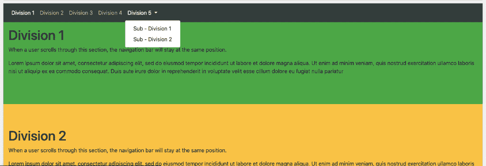

# 引导Rails 4 - Scrollspy

> 原文：<https://www.javatpoint.com/bootstrap-4-scrollspy>

Bootstrap 4 - Scrollspy 是 Bootstrap 中一个非常有趣的特性。Scrollspy 是一个引导功能，可以用来根据当前滚动位置自动更新导航列表中的链接。

scrollspy 可以垂直放置，也可以水平放置。

**例如[Bootstrap4](https://www.javatpoint.com/bootstrap-4) - Scrollspy(水平放置):**

```

<!DOCTYPE html>
<html lang="en">
<head>
  <title>Bootstrap Example</title>
  <meta charset="utf-8">
  <meta name="viewport" content="width=device-width, initial-scale=1">
  <link rel="stylesheet" href="https://maxcdn.bootstrapcdn.com/bootstrap/4.5.2/css/bootstrap.min.css">
  <script src="https://ajax.googleapis.com/ajax/libs/jquery/3.5.1/jquery.min.js"></script>
  <script src="https://cdnjs.cloudflare.com/ajax/libs/popper.js/1.16.0/umd/popper.min.js"></script>
  <script src="https://maxcdn.bootstrapcdn.com/bootstrap/4.5.2/js/bootstrap.min.js"></script>
  <style>
  body {
      position: relative; 
  }
  </style>
</head>
<body data-spy="scroll" data-target=".navbar" data-offset="50">
<nav class="navbar navbar-expand-sm bg-dark navbar-dark fixed-top">  
  <ul class="navbar-nav">
    <li class="nav-item">
      <a class="nav-link" href="#section1">Division 1</a>
    </li>
    <li class="nav-item">
      <a class="nav-link" href="#section2">Division 2</a>
    </li>
    <li class="nav-item">
      <a class="nav-link" href="#section3">Division 3</a>
    </li>
    <li class="nav-item">
      <a class="nav-link" href="#section3">Division 4</a>
    </li>
    <li class="nav-item dropdown">
      <a class="nav-link dropdown-toggle" href="#" id="navbardrop" data-toggle="dropdown">
        Division 4
      </a>
      <div class="dropdown-menu">
        <a class="dropdown-item" href="#section41">Sub - Division 1</a>
        <a class="dropdown-item" href="#section42">Sub - Division 2</a>
      </div>
    </li>
  </ul>
</nav>
<div id="section1" class="container-fluid bg-success" style="padding-top:70px;padding-bottom:70px">
  <h1>Division 1</h1>
  <p>When a user scrolls through this section, the navigation bar will stay at the same position.</p>
  <p>Some text. Some text. Some text. Some text. Some text. Some text. Some text. Some text. Some text. Some text. Some text. Some text. Some text. Some text. Some text. Some text. Some text. Some text. Some text. </p>
</div>
<div id="section2" class="container-fluid bg-warning" style="padding-top:70px;padding-bottom:70px">
  <h1>Division 2</h1>
  <p>When a user scrolls through this section, the navigation bar will stay at the same position.</p>
  <p>Some text. Some text. Some text. Some text. Some text. Some text. Some text. Some text. Some text. Some text. Some text. Some text. Some text. Some text. Some text. Some text. Some text. Some text. Some text. </p>
</div>
<div id="section3" class="container-fluid bg-secondary" style="padding-top:70px;padding-bottom:70px">
  <h1>Division 3</h1>
  <p>When a user scrolls through this section, the navigation bar will stay at the same position.</p>
  <p>Some text. Some text. Some text. Some text. Some text. Some text. Some text. Some text. Some text. Some text. Some text. Some text. Some text. Some text. Some text. Some text. Some text. Some text. Some text. </p>
</div>
<div id="section4" class="container-fluid bg-warning" style="padding-top:70px;padding-bottom:70px">
  <h1>Division 4</h1>
  <p>When a user scrolls through this section, the navigation bar will stay at the same position.</p>
  <p>Some text. Some text. Some text. Some text. Some text. Some text. Some text. Some text. Some text. Some text. Some text. Some text. Some text. Some text. Some text. Some text. Some text. Some text. Some text. </p>
</div>
<div id="section5" class="container-fluid bg-warning" style="padding-top:70px;padding-bottom:70px">
  <h1>Division 5</h1>
  <p>When a user scrolls through this section, the navigation bar will stay at the same position.</p>
  <p>Some text. Some text. Some text. Some text. Some text. Some text. Some text. Some text. Some text. Some text. Some text. Some text. Some text. Some text. Some text. Some text. Some text. Some text. Some text. Some text. </p>
</div>
<div id="section51" class="container-fluid bg-danger" style="padding-top:70px;padding-bottom:70px">
  <h1>Division 5  Sub - Division 1</h1>
  <p>When a user scrolls through this section, the navigation bar will stay at the same position.</p>
  <p>Some text. Some text. Some text. Some text. Some text. Some text. Some text. Some text. Some text. Some text. Some text. Some text. Some text. Some text. Some text. Some text. Some text. Some text. Some text. </p>
</div>
<div id="section52" class="container-fluid bg-info" style="padding-top:70px;padding-bottom:70px">
  <h1>Division 5 Submenu 2</h1>
  <p>When a user scrolls through this section, the navigation bar will stay at the same position.</p>
  <p>Some text. Some text. Some text. Some text. Some text. Some text. Some text. Some text. Some text. Some text. Some text. Some text. Some text. Some text. Some text. Some text. Some text. Some text. Some text. </p>
</div>
</body>
</html>

```

[Test it Now](https://www.javatpoint.com/oprweb/test.jsp?filename=bootstrap-4-scrollspy1)

**这个例子的解释是:**

用户必须将 data-spy =“scroll”添加到必须用作可滚动区域的元素中，该区域通常是元素。

然后，用户必须添加数据目标属性，其值为导航栏的 id 或类名，即**类。navbar** 。这样做是为了确保导航栏与可滚动区域相连。

但是，应该注意的是，可滚动元素必须与导航栏列表项中的链接标识相匹配(

与[相匹配)。](#section1)

此外，在 scrollspy 中，可选的 data - offset 属性指定计算滚动位置时从顶部偏移的像素数。当用户觉得导航栏内的链接在跳转到可滚动元素时过早或过早地改变了活动状态时，这是非常有用和相关的。默认情况下，它是 10 像素。

**输出将是:**



**Bootstrap 4-scroll spy 示例(垂直放置):**

```

<!DOCTYPE html>
<html lang="en">
<head>
  <title>Bootstrap Example</title>
  <meta charset="utf-8">
  <meta name="viewport" content="width=device-width, initial-scale=1">
  <link rel="stylesheet" href="https://maxcdn.bootstrapcdn.com/bootstrap/4.5.2/css/bootstrap.min.css">
  <script src="https://ajax.googleapis.com/ajax/libs/jquery/3.5.1/jquery.min.js"></script>
  <script src="https://cdnjs.cloudflare.com/ajax/libs/popper.js/1.16.0/umd/popper.min.js"></script>
  <script src="https://maxcdn.bootstrapcdn.com/bootstrap/4.5.2/js/bootstrap.min.js"></script>
  <style>
  body {
    position: relative;
  }
  ul.nav-pills {
    top: 20px;
    position: fixed;
  }
  div.col-8 div {
    height: 500px;
  }
  </style>
</head>
<body data-spy="scroll" data-target="#myScrollspy" data-offset="1">

<div class="container-fluid">
  <div class="row">
    <nav class="col-sm-3 col-4" id="myScrollspy">
      <ul class="nav nav-pills flex-column">
        <li class="nav-item">
          <a class="nav-link active" href="#section1">Division 1</a>
        </li>
        <li class="nav-item">
          <a class="nav-link" href="#section2">Division 2</a>
        </li>
        <li class="nav-item">
          <a class="nav-link" href="#section3">Division 3</a>
        </li>
        <li class="nav-item">
          <a class="nav-link" href="#section4">Division 4</a>
        </li>
        <li class="nav-item dropdown">
          <a class="nav-link dropdown-toggle" data-toggle="dropdown" href="#">Division 5</a>
          <div class="dropdown-menu">
            <a class="dropdown-item" href="#section51">Link 1</a>
            <a class="dropdown-item" href="#section52">Link 2</a>
          </div>
        </li>
      </ul>
    </nav>
    <div class="col-sm-9 col-8">
      <div id="section1" class="bg-success">    
        <h1>Division 1</h1>
        <p>When a user scrolls through this section, the navigation bar will stay at the same position.</p>
        <p>Some text. Some text. Some text. Some text. Some text. Some text. Some text. Some text. Some text. Some text. Some text. Some text. Some text. Some text. Some text. Some text. Some text. Some text. Some text. </p> 
      </div>
      <div id="section2" class="bg-warning"> 
        <h1>Division 2</h1>
        <p>When a user scrolls through this section, the navigation bar will stay at the same position.</p>
        <p>Some text. Some text. Some text. Some text. Some text. Some text. Some text. Some text. Some text. Some text. Some text. Some text. Some text. Some text. Some text. Some text. Some text. Some text. Some text. </p> 
      </div>        
      <div id="section3" class="bg-secondary">         
        <h1>Division 3</h1>
        <p>When a user scrolls through this section, the navigation bar will stay at the same position.</p>
        <p>Some text. Some text. Some text. Some text. Some text. Some text. Some text. Some text. Some text. Some text. Some text. Some text. Some text. Some text. Some text. Some text. Some text. Some text. Some text. </p> 
      </div>
      <div id="section4" class="bg-info">         
        <h1>Division 4</h1>
        <p>When a user scrolls through this section, the navigation bar will stay at the same position.</p>
        <p>Some text. Some text. Some text. Some text. Some text. Some text. Some text. Some text. Some text. Some text. Some text. Some text. Some text. Some text. Some text. Some text. Some text. Some text. Some text. </p> 
      </div>
      <div id="section51" class="bg-danger">         
        <h1>Division 5 - 1</h1>
        <p>When a user scrolls through this section, the navigation bar will stay at the same position.</p>
        <p>Some text. Some text. Some text. Some text. Some text. Some text. Some text. Some text. Some text. Some text. Some text. Some text. Some text. Some text. Some text. Some text. Some text. Some text. Some text. </p> 
      </div>      
      <div id="section52" class="bg-dark">         
        <h1>Division 5 - 2</h1>
        <p>When a user scrolls through this section, the navigation bar will stay at the same position.</p>
        <p>Some text. Some text. Some text. Some text. Some text. Some text. Some text. Some text. Some text. Some text. Some text. Some text. Some text. Some text. Some text. Some text. Some text. Some text. Some text. </p> 
      </div>
    </div>
  </div>
</div>
</body>
</html>

```

[Test it Now](https://www.javatpoint.com/oprweb/test.jsp?filename=bootstrap-4-scrollspy2)

**输出将是:**


* * *