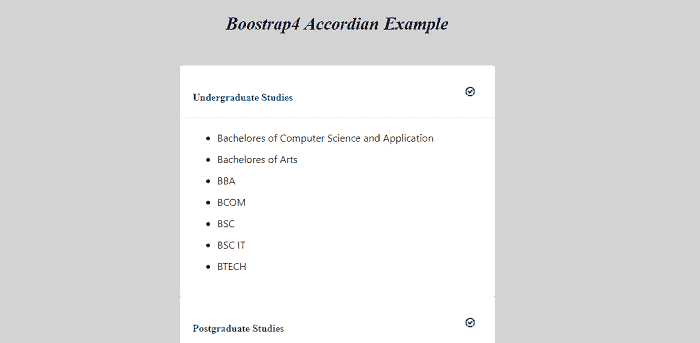
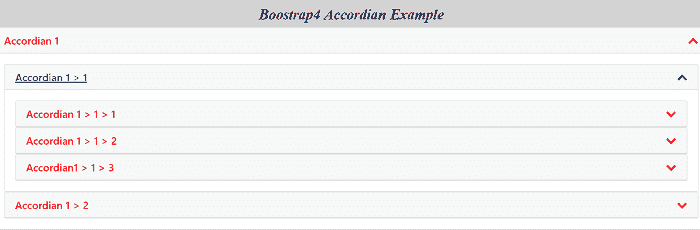

# Bootstrap4 手风琴

> 原文：<https://www.javatpoint.com/bootstrap-4-accordion>

在本文中，我们将了解 Bootstrap4 中手风琴的概念。

### 你说的 Bootstrap 4 手风琴是什么意思？

[Bootstrap](https://www.javatpoint.com/bootstrap-4) 4 是一个自由开源的框架。利用这一点，我们可以创建反应灵敏、用户友好的网站。在 bootstrap4 中，手风琴是一个由垂直堆叠的项目列表组成的图形元素。这可以通过点击来显示或隐藏与之相关的内容。在这个数字时代，每个网站都包含一个手风琴，如果他们有一个常见问题部分，至少有一个页面。使用手风琴，您可以让您的内容显示更具互动性。

### 让我们以《Bootstrap4》中手风琴的各种例子为例。

**例 1:**

### 例 1:

```

<! Doctype html>
<html lang="en">
<head>
  <meta charset="utf-8">
  <meta name="viewport" content="width=device-width, initial-scale=1, shrink-to-fit=no">
  <title> Boostrap4 accordion Example </title>
<link rel = "stylesheet" href ="https://stackpath.bootstrapcdn.com/bootstrap/4.2.1/css/bootstrap.min.css">
<link rel="stylesheet" href="https://cdnjs.cloudflare.com/ajax/libs/font-awesome/4.7.0/css/font-awesome.min.css">
<style>
.myaccordion {
  max-width: 500px;
  margin: 50px auto;
  box-shadow: 0 0 1px rgba(0,0,0,0.1);
}
body {
   background-color: lightgrey;
}
.myaccordion .card
{
  border: none;
}
.myaccordion .card:last-child .card-header {
  border: none;
}
.myaccordion .card-header {
  border-bottom-color: #EDEFF0;
  background: transparent;
}
.myaccordion .fa-stack {
  font-size: 18px;
}
.myaccordion .btn {
  width: 100%;
  font-weight: bold;
  color: #004987;
  padding: 0;
}
h2 {
 font-style: italic;
font-family: "Playfair Display", serif;
color: black; 
letter-spacing: -0.005em; 
word-spacing: 1px;
font-size: 1.75em;
font-weight: bold;
margin-top: 20px;
text-align: center;
  }
.myaccordion .btn-link:hover
{
  text-decoration: none;
}
.myaccordion .btn-link:focus {
  text-decoration: none;
}
.myaccordion li + li {
  margin-top: 10px;
}
</style>
<body>
<h2> Boostrap4 Accordian Example </h2>  
<div id="accordion" class="myaccordion">
  <div class="card">
    <div class="card-header" id="headingOne">
      <h2 class="mb-0">
        <button class="d-flex align-items-center justify-content-between btn btn-link" data-toggle="collapse" data-target="#collapseOne" aria-expanded="true" aria-controls="collapseOne">
          Undergraduate Studies
          <span class="fa-stack fa-sm">
            <i class="fa fa-check-circle-o"></i>
            <i class="fas fa-minus fa-stack-1x fa-inverse"> </i>
          </span>
        </button>
      </h2>
    </div>
    <div id="collapseOne" class ="collapse show" aria-labelledby="headingOne" data-parent="#accordion">
      <div class="card-body">
        <ul>
          <li> Bachelores of Computer Science and Application </li>
          <li> Bachelores of Arts </li>
          <li> BBA </li>
          <li> BCOM </li>
          <li> BSC </li>
		  <li> BSC IT </li>
		  <li> BTECH </li>
        </ul>
      </div>
    </div>
  </div>
  <div class="card">
    <div class="card-header" id="headingTwo">
      <h2 class="mb-0">
        <button class="d-flex align-items-center justify-content-between btn btn-link collapsed" data-toggle="collapse" data-target="#collapseTwo" aria-expanded="false" aria-controls="collapseTwo">
          Postgraduate Studies
          <span class="fa-stack fa-2x">
            <i class="fa fa-check-circle-o"> </i>
            <i class="fas fa-plus fa-stack-1x fa-inverse"> </i>
          </span>
        </button>
      </h2>
    </div>
    <div id="collapseTwo" class="collapse" aria-labelledby="headingTwo" data-parent="#accordion">
      <div class="card-body">
        <ul>
          <li> Masters in Information and Technology </li>
          <li> MCA </li>
          <li> MTECH </li>
          <li> MPHIL </li>
          <li> PHD </li>
          <li> MA </li>
        </ul>
      </div>
    </div>
  </div>
  <div class="card">
    <div class="card-header" id="headingThree">
      <h2 class="mb-0">
        <button class="d-flex align-items-center justify-content-between btn btn-link collapsed" data-toggle="collapse" data-target="#collapseThree" aria-expanded="false" aria-controls="collapseThree">
          Research
          <span class="fa-stack fa-2x">
            <i class="fa fa-check-circle-o"> </i>
            <i class="fas fa-plus fa-stack-1x fa-inverse"> </i>
          </span>
        </button>
      </h2>
    </div>
    <div id="collapseThree" class="collapse" aria-labelledby="headingThree" data-parent="#accordion">
      <div class="card-body">
        <ul>
          <li> Astrophysics </li>
	 <li> Medical </li>
          <li> Informatics </li>
          <li> Criminology </li>
          <li> Economics </li>
        </ul>
      </div>
    </div>
  </div>
</div>
<script src="https://code.jquery.com/jquery-3.3.1.min.js"> </script>
<script src="https://stackpath.bootstrapcdn.com/bootstrap/4.2.1/js/bootstrap.min.js"> </script>
<script>
$("#accordion").on("hide.bs.collapse show.bs.collapse", e => {
  $(e.target)
    .prev()
    .find("i:last-child")
    .toggleClass("fa-minus fa-plus");
});
</script>
</body>
</html>

```

**说明:**

在上面的例子中，我们在 Bootstrap 4 的帮助下创建了一个手风琴菜单。

**输出:**

下面的截图描述了这个例子的输出:



### 例 2:

```

<! Doctype html>
<html lang="en">
<head>
  <meta charset="utf-8">
  <meta name="viewport" content="width=device-width, initial-scale=1">
  <title> Boostrap4 accordion Example </title>
<link rel = "stylesheet" href ="https://stackpath.bootstrapcdn.com/bootstrap/4.2.1/css/bootstrap.min.css">
<link rel="stylesheet" href="https://cdnjs.cloudflare.com/ajax/libs/font-awesome/4.7.0/css/font-awesome.min.css">
<style>
body {
   background-color: lightgrey;
   }
   a {
   color: red;
}
.mb-0 > a {
  display: block;
  position: relative;
}
h2 {
 font-style: italic;
font-family: "Playfair Display? , serif;
color: black; 
letter-spacing: -0.005em; 
word-spacing: 1px;
font-size: 1.75em;
font-weight: bold;
margin-top: 20px;
text-align: center;
  }
.mb-0 > a:after {
  content: "\f078"; /* fa-chevron-down */
  font-family: 'FontAwesome';
  position: absolute;
  right: 0;
}
.mb-0 > a[aria-expanded="true"]:after {
  content: "\f077"; /* fa-chevron-up */
}
</style>
<body>
<h2> Boostrap4 Accordion Example </h2>  
<div id="accordion">
  <div class="card">
    <div class="card-header" id="heading-1">
      <h5 class="mb-0">
        <a role="button" data-toggle="collapse" href="#collapse-1" aria-expanded="true" aria-controls="collapse-1">
          Accordion 1
        </a>
      </h5>
    </div>
    <div id="collapse-1" class="collapse show" data-parent="#accordion" aria-labelledby="heading-1">
      <div class="card-body">
        <div id="accordion-1">
          <div class="card">
            <div class="card-header" id="heading-1-1">
              <h5 class="mb-0">
                <a class="collapsed" role="button" data-toggle="collapse" href="#collapse-1-1" aria-expanded="false" aria-controls="collapse-1-1">
                Accordion 1 > 1
                </a>
              </h5>
            </div>
            <div id="collapse-1-1" class="collapse" data-parent="#accordion-1" aria-labelledby="heading-1-1">
              <div class="card-body">
                  <div id="accordion-1-1">
                    <div class="card">
                      <div class="card-header" id="heading-1-1-1">
                        <h5 class="mb-0">
                          <a class="collapsed" role="button" data-toggle="collapse" href="#collapse-1-1-1" aria-expanded="false" aria-controls="collapse-1-1-1">
                            Accordion 1 > 1 > 1
                          </a>
                        </h5>
                      </div>
                      <div id="collapse-1-1-1" class="collapse" data-parent="#accordion-1-1" aria-labelledby="heading-1-1-1">
                        <div class="card-body">
                           Accordion 1 > 1 > 1
                        </div>
                      </div>
                    </div>
                    <div class="card">
                      <div class="card-header" id="heading-1-1-2">
                        <h5 class="mb-0">
                          <a class="collapsed" role="button" data-toggle="collapse" href="#collapse-1-1-2" aria-expanded="false" aria-controls="collapse-1-1-2">
                             Accordion 1 > 1 > 2
                          </a>
                        </h5>
                      </div>
                      <div id="collapse-1-1-2" class="collapse" data-parent="#accordion-1-1" aria-labelledby="heading-1-1-2">
                        <div class="card-body">
                          Accordion 1 > 1 > 2
                        </div>
                      </div>
                    </div>
                    <div class="card">
                      <div class="card-header" id="heading-1-1-3">
                        <h5 class="mb-0">
                          <a class="collapsed" role="button" data-toggle="collapse" href="#collapse-1-1-3" aria-expanded="false" aria-controls="collapse-1-1-3">
                             Accordian1 > 1 > 3
                          </a>
                        </h5>
                      </div>
                      <div id="collapse-1-1-3" class="collapse" data-parent="#accordion-1-1" aria-labelledby="heading-1-1-3">
                        <div class="card-body">
                          Accordion 1 > 1 > 3
                        </div>
                      </div>
                    </div>
                  </div>
              </div>
            </div>
          </div>
          <div class="card">
            <div class="card-header" id="heading-1-2">
              <h5 class="mb-0">
                <a class="collapsed" role="button" data-toggle="collapse" href="#collapse-1-2" aria-expanded="false" aria-controls="collapse-1-2">
                   Accordion 1 > 2
                </a>
              </h5>
            </div>
            <div id="collapse-1-2" class="collapse" data-parent="#accordion-1" aria-labelledby="heading-1-2">
              <div class="card-body">
                Accordion 1 > 2
              </div>
            </div>
          </div>
        </div>      
      </div>
    </div>
  </div>
  <div class="card">
    <div class="card-header" id="heading-2">
      <h5 class="mb-0">
        <a class="collapsed" role="button" data-toggle="collapse" href="#collapse-2" aria-expanded="false" aria-controls="collapse-2">
           Accordion 2
        </a>
      </h5>
    </div>
    <div id="collapse-2" class="collapse" data-parent="#accordion" aria-labelledby="heading-2">
      <div class="card-body">
         Accordion 2
      </div>
    </div>
  </div>
  <div class="card">
    <div class="card-header" id="heading-3">
      <h5 class="mb-0">
        <a class="collapsed" role="button" data-toggle="collapse" href="#collapse-3" aria-expanded="false" aria-controls="collapse-3">
           Accordion 3
        </a>
      </h5>
    </div>
    <div id="collapse-3" class="collapse" data-parent="#accordion" aria-labelledby="heading-3">
      <div class="card-body">
        Accordion 3
      </div>
    </div>
  </div>
</div>
<script src="https://code.jquery.com/jquery-3.3.1.min.js"> </script>
<script src="https://stackpath.bootstrapcdn.com/bootstrap/4.2.1/js/bootstrap.min.js"> </script>
<script>
$("#accordion").on("hide.bs.collapse show.bs.collapse", e => {
  $(e.target)
    .prev()
    .find("i:last-child")
    .toggleClass("fa-minus fa-plus");
});
</script>
</body>
</html>

```

**说明:**

在上面的例子中，我们在 Bootstrap 4 的帮助下创建了一个嵌套的手风琴菜单。

**输出:**

下面的截图描述了这个例子的输出:



* * *