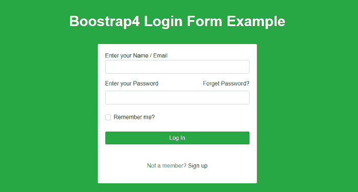
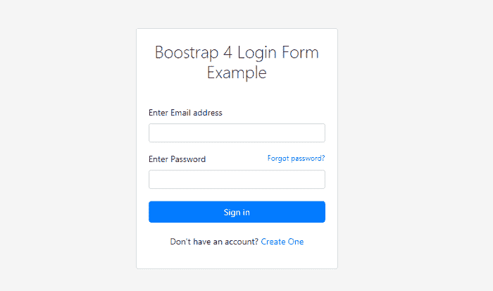
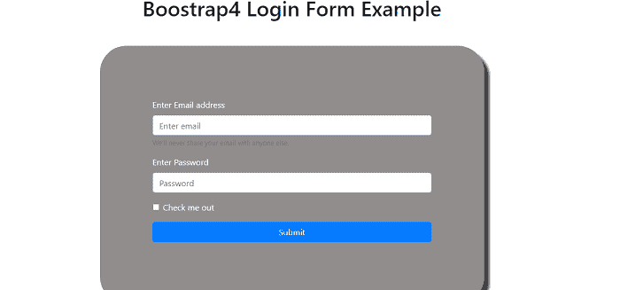
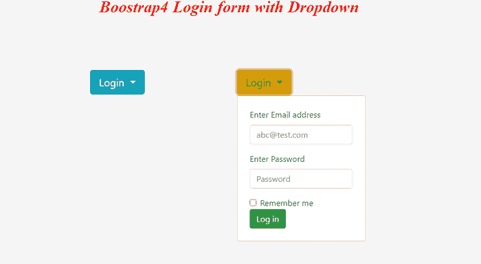

# 引导 4 登录表单

> 原文：<https://www.javatpoint.com/bootstrap-4-login-form>

在本文中，我们将在 Bootstrap4 的帮助下创建一个登录表单。

### Bootstrap 4 登录表单是什么意思？

[Bootstrap](https://www.javatpoint.com/bootstrap-tutorial) 4 是一个自由开源的框架。利用这一点，我们可以创建反应灵敏、用户友好的网站。引导数据库中的登录表单用于输入身份验证凭据以访问受限表单。此表单包含用户名和密码等字段。

**我们举几个 Bootstrap 4 登录表单的例子。**

### 例 1:

```

<! DOCTYPE html>
<html lang="en" >
<head>
  <meta charset="UTF-8">
  <title> Bootstrap 4 Login Form Example
</title>
<link rel="stylesheet" href="https://stackpath.bootstrapcdn.com/bootstrap/4.4.1/css/bootstrap.min.css">
</head>
<style>
body {
  background: #28a745 !important;
  font-family: 'Muli', sans-serif;
}
h1 {
  color: #fff;
  padding-bottom: 2rem;
  font-weight: bold;
}
a {
  color: #333;
}
a:hover {
  color: #E8D426;
  text-decoration: none;
}
.form-control:focus {
    color: #000;
    background-color: #fff;
    border: 2px solid #E8D426;
    outline: 0;
    box-shadow: none;
}
.btn {
  background: #28a745;
  border: #E8D426;
}
.btn:hover {
  background: #28a745;
  border: #E8D426;
}
</style>
<body>
<div class="pt-5">
  <h1 class="text-center"> Boostrap4 Login Form Example </h1>
<div class="container">
                <div class="row">
                    <div class="col-md-5 mx-auto">
                        <div class="card card-body">
                      <form id="submitForm" action="#" method="post" data-parsley-validate="" data-parsley-errors-messages-disabled="true" novalidate="" _lpchecked="1">
<input type="hidden" name="_csrf" value="7635eb83-1f95-4b32-8788-abec2724a9a4">
                   <div class="form-group required">
              <lSabel for="username"> Enter your Name / Email </lSabel>
             <input type="text" class="form-control text-lowercase" id="username" required="" name="username" value="">
               </div>                    
       <div class="form-group required">
    <label class="d-flex flex-row align-items-center" for="password"> Enter your Password 
     <a class="ml-auto border-link small-xl" href="#"> Forget Password? </a> </label>
<input type="password" class="form-control" required="" id="password" name="password" value="">
       </div>
     <div class="form-group mt-4 mb-4">
        <div class="custom-control custom-checkbox">
            <input type="checkbox" class="custom-control-input" id="remember-me" name="remember-me" data-parsley-multiple="remember-me">
   <label clss="custom-control-label" for="remember-me"> Remember me? </label>
                </div>
              </div>
         <div class="form-group pt-1">
      <button class="btn btn-primary btn-block" type="submit"> Log In </button>
                  </div>
               </form>
             <p class="small-xl pt-3 text-center">
       <span class="text-muted"> Not a member? </span>
        <a href="#"> Sign up </a>
                        </p>
                        </div>
                    </div>
                </div>
            </div>
</div>
</body>
</html>

```

**说明:**

在上面的例子中，我们已经创建了一个登录表单，用户在其中输入他们的姓名和密码，在添加信息后，表单被登录。

**输出:**

下面是这个例子的输出。



### 例 2:

```

<! DOCTYPE html>
<html lang="en" >
<head>
  <meta charset="UTF-8">
  <title> Bootstrap 4 Login Form Example
 </title>
<link rel="stylesheet" href="https://stackpath.bootstrapcdn.com/bootstrap/4.4.1/css/bootstrap.min.css">
</head>
<style>
html { 
	height: 100%; 
}
body { 
	height: 100%; 
}
.global-container {
	height: 100%;
	display: flex;
	align-items: center;
	justify-content: center;
	background-color: #f5f5f5;
}
form {
	padding-top: 10px;
	font-size: 14px;
	margin-top: 30px;
}
.card-title { 
font-weight: 300;
 }
.btn {
	font-size: 14px;
	margin-top: 20px;
}
.login-form { 
	width: 330px;
	margin: 20px;
}
.sign-up {
	text-align: center;
	padding: 20px 0 0;
}
.alert {
	margin-bottom: -30px;
	font-size: 13px;
	margin-top: 20px;
}
</style>
<body>
<div class="pt-5">
  <div class="global-container">
	<div class="card login-form">
	<div class="card-body">
		<h3 class="card-title text-center"> Boostrap 4 Login Form Example </h3>
		<div class="card-text">
			<form>
				<div class="form-group">
					<label for="exampleInputEmail1"> Enter Email address </label>
					<input type="email" class="form-control form-control-sm" id="exampleInputEmail1" aria-describedby="emailHelp">
				</div>
				<div class="form-group">
					<label for="exampleInputPassword1">Enter Password </label>
					<a href="#" style="float:right;font-size:12px;"> Forgot password? </a>
					<input type="password" class="form-control form-control-sm" id="exampleInputPassword1">
				</div>
				<button type="submit" class="btn btn-primary btn-block"> Sign in </button>

				<div class="sign-up">
					Don't have an account? <a href="#"> Create One </a>
				</div>
			</form>
		</div>
	</div>
</div>
</div>
</body>
</html>

```

**说明:**

在上面的例子中，我们创建了一个登录表单，用户在其中输入他们的姓名和密码，在添加信息后，表单就是登录。

**输出:**

下面是这个例子的输出。



### 例 3:

```

<! DOCTYPE html>
<html lang="en" >
<head>
  <meta charset="UTF-8">
  <title> Bootstrap 4 Login Form Example
</title>
<link rel="stylesheet" href="https://stackpath.bootstrapcdn.com/bootstrap/4.1.3/css/bootstrap.min.css">
</head>
<style>
body {
          background-repeat: no-repeat, repeat;
          background-position: center;
          background-size: cover;
          padding-top: 50px;
        }
        .login-form {
          background:#1a11117a;
          margin-top: 40px;
          margin-bottom: 100px;
          padding: 100px;
          border-radius: 50px;
          color: white;
          box-shadow: 10px 10px 5px 0px rgba(0,0,0,0.75);
        }
        .login-heading {
          text-align: center;
          margin-top: 20px;
        }
        .btn-primary {
          width: 100%;
        }
</style>
<body>
<h1 class="text-center"> Boostrap4 Login Form Example </h1>
    <div class="container">
      <div class="row">
        <div class="col-md-8 offset-md-2">
          <div class="login-form">
            <form >
              <div class="form-group">
                <label for="exampleInputEmail1">Enter Email address </label>
                <input type="email" class="form-control" id="exampleInputEmail1" aria-describedby="emailHelp" placeholder="Enter email">
                <small id="emailHelp" class="form-text text-muted"> We'll never share your email with anyone else. </small>
              </div>
              <div class="form-group">
                <label for="exampleInputPassword1"> Enter Password </label>
                <input type="password" class="form-control" id="exampleInputPassword1" placeholder="Password">
              </div>
              <div class="form-group form-check">
                <input type="checkbox" class="form-check-input" id="exampleCheck1">
                <label class="form-check-label" for="exampleCheck1"> Check me out </label>
              </div>
              <button type="submit" class="btn btn-primary"> Submit </button>
            </form>
          </div>
        </div>
      </div>
    </div>
    <script src="https://code.jquery.com/jquery-3.3.1.slim.min.js" integrity="sha384-q8i/X+965DzO0rT7abK41JStQIAqVgRVzpbzo5smXKp4YfRvH+8abtTE1Pi6jizo" crossorigin="anonymous"> </script>
    <script src="https://cdnjs.cloudflare.com/ajax/libs/popper.js/1.14.7/umd/popper.min.js" integrity="sha384-UO2eT0CpHqdSJQ6hJty5KVphtPhzWj9WO1clHTMGa3JDZwrnQq4sF86dIHNDz0W1" crossorigin="anonymous"> </script>
    <script src="https://stackpath.bootstrapcdn.com/bootstrap/4.3.1/js/bootstrap.min.js" integrity="sha384-JjSmVgyd0p3pXB1rRibZUAYoIIy6OrQ6VrjIEaFf/nJGzIxFDsf4x0xIM+B07jRM" crossorigin="anonymous"> </script>
    <script>
    </script>
  </body>
</html>

```

**说明:**

在上面的例子中，我们已经创建了一个登录表单，用户在其中输入他们的姓名和密码，在添加信息后，表单被登录。

**输出:**

下面是这个例子的输出。



### 例 4:

```

<! DOCTYPE html>
<html lang="en" >
<head>
  <meta charset="UTF-8">
  <title> Bootstrap 4 Login Form Example
</title>
<link rel="stylesheet" href="https://maxcdn.bootstrapcdn.com/bootstrap/4.0.0-beta.3/css/bootstrap.min.css" integrity="sha384-Zug+QiDoJOrZ5t4lssLdxGhVrurbmBWopoEl+M6BdEfwnCJZtKxi1KgxUyJq13dy" crossorigin="anonymous">
  <script src="https://ajax.googleapis.com/ajax/libs/jquery/3.2.1/jquery.min.js"> </script>
  <script src="https://cdnjs.cloudflare.com/ajax/libs/popper.js/1.12.6/umd/popper.min.js"> </script>
  <script src="https://maxcdn.bootstrapcdn.com/bootstrap/4.0.0-beta.3/js/bootstrap.min.js"> </script>
<style>
 h3 {
 font-style: italic;
font-family: "Playfair Display","Bookman",serif;
 color: red; 
letter-spacing: -0.005em; 
word-spacing: 1px;
font-size: 2em;
font-weight: bold;
margin-top: 30px;
  }
body {
  background-color: #f5f5f5;
}
</style>
<body>
<div class="container">
  <div class="row justify-content-center">
    <h3> Boostrap4 Login form with Dropdown </h3>
  </div>
  <div class="row justify-content-center mt-5">
    <div class="col-3 mt-5">
      <div class="dropdown">
        <button class="btn btn-info btn-lg dropdown-toggle" type="button" id="btnDropdownDemo" data-toggle="dropdown" aria-haspopup="true" aria-expanded="false">
          Login
        </button>
        <form class="dropdown-menu p-4">
        <div class="form-group">
          <label for="emailDropdown"> Enter Email address</label>
          <input type="email" class="form-control" id="emailDropdown" placeholder="abc@test.com">
        </div>
        <div class="form-group">
          <label for="passwordDropdown"> Enter Password</label>
          <input type="password" class="form-control" id="passwordDropdown" placeholder="Password">
        </div>
        <div class="form-check">
          <input type="checkbox" class="form-check-input" id="rememDemo">
          <label class="form-check-label" for="rememDemo">
            Remember me
          </label>
        </div>
        <button type="submit" class="btn btn-primary"> Log in </button>
      </form>
      </div>
    </div>
    <div class="col-3 mt-5">
      <div class="dropdown">
        <button class="btn btn-warning btn-lg dropdown-toggle" type="button" id="btnDropdownDemo" data-toggle="dropdown" aria-haspopup="true" aria-expanded="false">
          Login
        </button>
        <form class="dropdown-menu p-4">
        <div class="form-group">
          <label for="emailDropdown"> Enter Email address</label>
          <input type="email" class="form-control" id="emailDropdown" placeholder="abc@test.com">
        </div>
        <div class="form-group">
          <label for="passwordDropdown"> Enter Password</label>
          <input type="password" class="form-control" id="passwordDropdown" placeholder="Password">
        </div>
        <div class="form-check">
          <input type="checkbox" class="form-check-input" id="rememDemo">
          <label class="form-check-label" for="rememDemo">
            Remember me
          </label>
        </div>
        <button type="submit" class="btn btn-success"> Log in </button>
      </form>
      </div>
    </div>
  </div>
</div>
</body>
</html>

```

**说明:**

在上面的例子中，我们已经创建了一个下拉登录表单。用户首先点击下拉菜单，然后向用户显示登录表单，用户在该表单中输入自己的姓名和密码，添加信息后，表单即被登录。

**输出:**

下面是这个例子的输出。



* * *