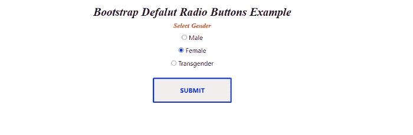
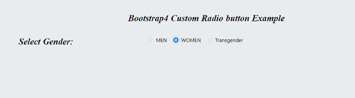
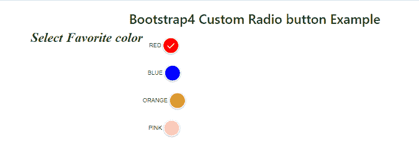
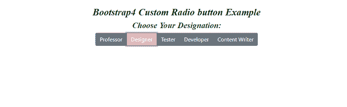

# 引导 4 单选按钮

> 原文：<https://www.javatpoint.com/bootstrap-4-radio-button>

在本文中，我们将了解如何在 Bootstrap 4 中添加单选按钮元素。

### 你说的引导 4 单选按钮是什么意思？

在[引导程序 4](https://www.javatpoint.com/bootstrap-4) 中，一个单选按钮显示可选择或取消选择的小圆形按钮。如果选择，圆圈中会出现一个小黑点；否则，该圆保持为空。单选按钮是互斥的，即访问者只能选择几个选项中的一个。因此，当访问者被问及一个只能从所有选项中选择正确的问题时，例如一个人的**性别、婚姻状况**等，就会用到它。

**我们举几个 Bootstrap 4 单选按钮的例子。**

### 例 1:

```

<! DOCTYPE html>
<html lang="en">
<head>
  <title> Bootstrap Default Radio Buttons Example </title>
  <meta charset="utf-8">
  <meta name="viewport" content="width=device-width, initial-scale=1">
  <link rel="stylesheet" href="https://maxcdn.bootstrapcdn.com/bootstrap/4.5.2/css/bootstrap.min.css">
  <script src="https://ajax.googleapis.com/ajax/libs/jquery/3.5.1/jquery.min.js"> </script>
  <script src="https://cdnjs.cloudflare.com/ajax/libs/popper.js/1.16.0/umd/popper.min.js"> </script>
  <script src="https://maxcdn.bootstrapcdn.com/bootstrap/4.5.2/js/bootstrap.min.js"> </script>
</head>
<style>
body {
text-align: center;
}
h2 {
 font-style: italic;
font-family: "Playfair Display", "Bookman",serif;
 color: black; 
letter-spacing: -0.005em; 
word-spacing: 1px;
font-size: 1.75em;
font-weight: bold;
  }
  h4 {
 font-style: italic;
font-family: "Playfair Display","Bookman",serif;
 color: red; 
letter-spacing: -0.005em; 
word-spacing: 1px;
font-size: 1em;
font-weight: bold;
  }
  input[type=submit] {  
  border: 3px solid;  
  border-radius: 2px;  
  color: ;  
  display: block;  
  font-size: 1em;  
  font-weight: bold;  
  margin: 1em auto;  
  padding: 1em 4em;  
 position: relative;  
  text-transform: uppercase;  
}  
input[type=submit]::before,  
input[type=submit]::after {  
  background: #fff;  
  content: '';  
  position: absolute;  
  z-index: -1;  
}  
input[type=submit]:hover {  
  color: #1A33FF;  
}  
</style>
<body>
<div class="container mt-3">
  <h2> Bootstrap Defalut Radio Buttons Example </h2>
  <form action="#">  
  <h4> Select Gender </h4>
    <input type="radio" id="defaultRadio" name="example2">
    <label for="defaultRadio"> Male </label>
    <br>
	 <input type="radio" id="defaultRadio" name="example2">
    <label for="defaultRadio"> Female </label>
    <br>
	 <input type="radio" id="defaultRadio" name="example2">
    <label for="defaultRadio"> Transgender </label>
    <br>
    <input type="submit" value="submit">
  </form>
</div>
</body>
</html> 

```

**说明:**

在上面的例子中，我们在 Bootstrap 4 的帮助下创建了一个默认的单选按钮。在这种情况下，用户已经从给定选项中选择了性别。

**输出:**

以下是该示例的输出:



### 例 2:

```

<! DOCTYPE html>  
<html lang="en">  
<head>  
  <title> Bootstrap4 Custom Radio Button Example </title>  
  <meta charset="utf-8">  
  <meta name="viewport" content="width=device-width, initial-scale=1">  
  <link rel="stylesheet" href="https://cdnjs.cloudflare.com/ajax/libs/twitter-bootstrap/4.1.2/css/bootstrap.min.css"> 
<link rel="stylesheet" href="https://use.fontawesome.com/releases/v5.3.1/css/all.css"> 
</head>  
<style>
.container {
  padding: 2rem 0rem;
}
body
  {
margin-top: 20px;
text-align: center;
  padding: 20px 20px 20px 20px;
  background-color: #e9ecef;
  color: black;
  }
  h2 {
 font-style: italic;
font-family: "Playfair Display","Bookman",serif;
  color: black; 
letter-spacing: -0.005em; 
word-spacing: 1px;
font-size: 1.75em;
font-weight: bold;
  }
h4 {
  font-style: italic;
font-family: "Playfair Display","Bookman",serif;
  color: black; 
letter-spacing: -0.005em; 
word-spacing: 1px;
font-size: 1.75em;
font-weight: bold;
}
  </style>
<body>  
<h2> Bootstrap4 Custom Radio button Example </h2>
<div class="container">
  <div class="row">
   <h4> Select Gender: </h4> 
    <div class="col-8">
      <div class="custom-control custom-radio custom-control-inline">
        <input type="radio" id="customRadioInline1" name="customRadioInline1" class="custom-control-input">
        <label class="custom-control-label" for="customRadioInline1"> MEN </label>
      </div>
      <div class="custom-control custom-radio custom-control-inline">
        <input type="radio" id="customRadioInline2" name="customRadioInline1" class="custom-control-input">
        <label class="custom-control-label" for="customRadioInline2"> WOMEN </label>
      </div>
	  <div class="custom-control custom-radio custom-control-inline">
        <input type="radio" id="customRadioInline3" name="customRadioInline1" class="custom-control-input">
        <label class="custom-control-label" for="customRadioInline3"> Transgender </label>
      </div>
    </div>
  </div>
</div>
</body>
</html>

```

**说明:**

在上面的例子中，我们在 Bootstrap 4 的帮助下创建了一个自定义单选按钮。在这种情况下，用户已经从给定选项中选择了性别。

**输出:**

以下是该示例的输出:



### 例 3:

```

<! DOCTYPE html>  
<html lang="en">  
<head>  
  <title> Bootstrap4 Radio Button  Example </title>  
  <meta charset="utf-8">  
  <meta name="viewport" content="width=device-width, initial-scale=1">  
  <link rel="stylesheet" href="https://cdnjs.cloudflare.com/ajax/libs/twitter-bootstrap/4.1.2/css/bootstrap.min.css"> 
<link rel="stylesheet" href="https://maxcdn.bootstrapcdn.com/bootstrap/4.3.1/css/bootstrap.min.css">
<script src="https://ajax.googleapis.com/ajax/libs/jquery/3.4.0/jquery.min.js"> </script>
<script src="https://cdnjs.cloudflare.com/ajax/libs/popper.js/1.14.7/umd/popper.min.js"> </script>
<script src="https://maxcdn.bootstrapcdn.com/bootstrap/4.3.1/js/bootstrap.min.js"> </script>
<style>
body {
  text-align: center;
  padding-top: 25px;
}
.custom-radio-button div {
  display: block;
}
.custom-radio-button input[type="radio"] {
  display: none;
}
.custom-radio-button input[type="radio"] + label {
  color: #333;
  font-family: Arial, sans-serif;
  font-size: 14px;
  margin-top: 20px;
}
.custom-radio-button input[type="radio"] + label span {
  display: inline-block;
  width: 40px;
  height: 40px;
  margin: -1px 4px 0 0;
  vertical-align: middle;
  cursor: pointer;
  border-radius: 50%;
  border: 2px solid #ffffff;
  box-shadow: 0 1px 3px 0 rgba(0, 0, 0, 0.33);
  background-repeat: no-repeat;
  background-position: center;
  text-align: center;
  line-height: 44px;
}
.custom-radio-button input[type="radio"] + label span img {
  opacity: 0;
  transition: all 0.3s ease;
}
.custom-radio-button input[type="radio"]#color-red + label span {
  background-color: red;
}
.custom-radio-button input[type="radio"]#color-blue + label span {
  background-color: blue;
}
.custom-radio-button input[type="radio"]#color-orange + label span {
  background-color: orange;
}
.custom-radio-button input[type="radio"]#color-pink + label span {
  background-color: pink;
}
 h4 {
 font-style: italic;
font-family: "Playfair Display","Bookman",serif;
 color: green; 
letter-spacing: -0.005em; 
word-spacing: 1px;
font-size: 2em;
font-weight: bold;
margin-left: 25px;
  }
.custom-radio-button input[type="radio"]:checked + label span {
  opacity: 1;
  background: url("tick.png")
    center center no-repeat;
  width: 40px;
  height: 40px;
  display: inline-block;
}
</style>
<body>
<div class="container">
<h2> Bootstrap4 Custom Radio button Example </h2>
	<div class="row">
	<h4> Select Favorite color </h4>
<div class="custom-radio-button">
  <div>
    <input type="radio" id="color-red" name="color" value="color-red" checked>
    <label for="color-red"> RED
      <span>
      </span>
    </label>
  </div>
    <div>
    <input type="radio" id="color-blue" name="color" value="color-blue">
    <label for="color-blue"> BLUE
      <span>
      </span>
    </label>
  </div>
  <div>
    <input type="radio" id="color-orange" name="color" value="color-orange">
    <label for="color-orange"> ORANGE
      <span>
      </span>
    </label>
  </div>
  <div>
    <input type="radio" id="color-pink" name="color" value="color-pink">
    <label for="color-pink"> PINK
      <span>
      </span>
    </label>
  </div>
</div>
</div>
</div>
</body>
</html>

```

**说明:**

在上面的例子中，我们在 Bootstrap 4 的帮助下创建了一个自定义单选按钮。在这种情况下，用户已经从给定的选项中选择了喜欢的颜色。

**输出:**

以下是该示例的输出:



### 例 4:

```

<! DOCTYPE html>  
<html lang="en">  
<head>  
  <title> Bootstrap4 Radio Button  Example </title>  
  <meta charset="utf-8">  
  <meta name="viewport" content="width=device-width, initial-scale=1">  
  <link rel="stylesheet" href="https://cdnjs.cloudflare.com/ajax/libs/twitter-bootstrap/4.1.2/css/bootstrap.min.css"> 
<link rel="stylesheet" href="https://maxcdn.bootstrapcdn.com/bootstrap/4.3.1/css/bootstrap.min.css">
<script src="https://ajax.googleapis.com/ajax/libs/jquery/3.4.0/jquery.min.js"> </script>
<script src="https://cdnjs.cloudflare.com/ajax/libs/popper.js/1.14.7/umd/popper.min.js"> </script>
<script src="https://maxcdn.bootstrapcdn.com/bootstrap/4.3.1/js/bootstrap.min.js"> </script>
<style>
body {
  text-align: center;
  padding-top: 25px;
}
 h2 {
 font-style: italic;
font-family: "Playfair Display","Bookman",serif;
  color: black; 
letter-spacing: -0.005em; 
word-spacing: 1px;
font-size: 1.75em;
font-weight: bold;
  }
 h4 {
 font-style: italic;
font-family: "Playfair Display","Bookman",serif;
 color: green; 
letter-spacing: -0.005em; 
word-spacing: 1px;
font-size: 1.5em;
font-weight: bold;
  }
.btn-secondary:not(:disabled):not(.disabled).active, .btn-secondary:not(:disabled):not(.disabled):active, .show>.btn-secondary.dropdown-toggle {
  background: rgba(183, 51, 106, 0.38);
  }
</style>
<body>
<div class="container">
<h2> Bootstrap4 Custom Radio button Example </h2>
	<h4> Choose Your Designation: </h4>
<div class="btn-group btn-group-toggle" data-toggle="buttons">
  <label class="btn btn-secondary active">
    <input type="radio" name="options" id="professor" checked> Professor
  </label>
  <label class="btn btn-secondary">
    <input type="radio" name="options" id="designer" > Designer
  </label>
  <label class="btn btn-secondary">
    <input type="radio" name="options" id="tester" > Tester 
  </label>
  <label class="btn btn-secondary">
    <input type="radio" name="options" id="developer" > Developer
  </label>
   <label class="btn btn-secondary">
    <input type="radio" name="options" id="contentwriter" > Content Writer
  </label>
</div>
</div>
</body>
</html>

```

**说明:**

在上面的例子中，我们在 Bootstrap 4 的帮助下创建了一个自定义单选按钮。在这种情况下，用户已经从给定选项中选择了一个指定。

**输出:**

以下是该示例的输出:



* * *