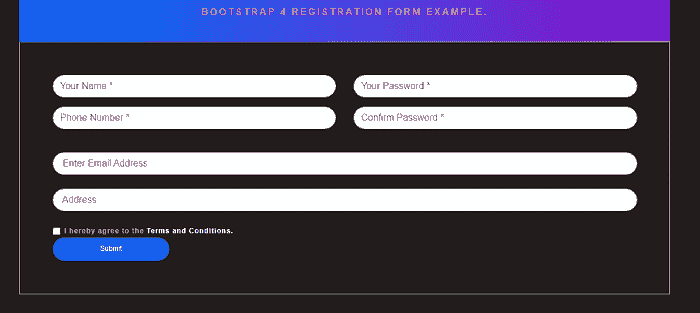
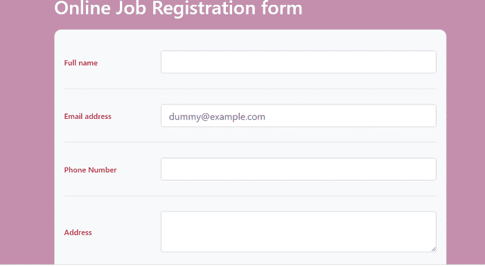

# Bootstrap 4 登记表

> 原文：<https://www.javatpoint.com/bootstrap-4-registration-form>

在本文中，我们将了解 bootstrap 4 注册表单。

### Bootstrap 4 登记表是什么意思？

在 Bootstrap 4 中，登记表是一个字段列表，用户将在其中输入数据并提交数据。它在任何需要注册的情况下都很有用。

**例如:**各种公司使用登记表为客户注册服务，或其他计划。

它也用于各种工作应用。各种门户网站都可以申请工作，如谷歌、领英等。

在学校和学院，注册表格用于注册学生的课程，学生可以填写他们的联系信息、学术历史等。

**我们来举一下 Bootstrap4 中各种登记表的例子。**

### 例 1:

```

<html lang = "en">
   <head>
      <meta charset = "utf-8">
      <meta name = "viewport" content = "width = device-width, initial-scale = 1, shrink-to-fit = no">
      <link rel = "stylesheet" 
         href = "https://stackpath.bootstrapcdn.com/bootstrap/4.1.3/css/bootstrap.min.css"
         integrity = "sha384-MCw98/SFnGE8fJT3GXwEOngsV7Zt27NXFoaoApmYm81iuXoPkFOJwJ8ERdknLPMO" 
         crossorigin = "anonymous">       
      <title> Bootstrap 4 Registration Form Example </title>
   <style>
 .note
{
    text-align: center;
    height: 80px;
    background: -webkit-linear-gradient(left, #0072ff, #8811c5);
    color: #fff;
    font-weight: bold;
    line-height: 80px;
}
body {
  margin: 0;
  font-family: 'Lato', sans-serif;
  font-size: 12px;
  line-height: 1.8em;
  text-transform: none;
  letter-spacing: .075em;
  font-weight: bold;
  font-style: normal;
  text-decoration: none;
  color: #e7bd74;
  background-color: rgba(34,28,28);
  display: block;
}
.title {
  margin-top: 2rem;
  margin-bottom: 1rem;
}
.form-content
{
    padding: 5%;
    border: 1px solid #ced4da;
    margin-bottom: 2%;
}
.form-control {
    border-radius: 1.5rem;
}
.btnSubmit
{
    border: none;
    border-radius: 1.5rem;
    padding: 1%;
    width: 20%;
    cursor: pointer;
    background: #0062cc;
    color: #fff;
}
h1 {
    font-family: sans-serif;
  display: block;
  font-size: 1rem;
  font-weight: bold;
  text-align: center;
  letter-spacing: 3px;
  color: hotpink;
 text-transform: uppercase;
padding-top: 20px;
}
a {
  text-decoration: none;
  color: #fff;
}
a:hover {
  text-decoration: none;
  color: #fff;
}

	  </style>
   </head>
   <body>
<div class="container register-form">
            <div class="form">
                <div class="note">
                    <h1> Bootstrap 4 Registration Form Example. </h1>
                </div>
                <div class="form-content">
                    <div class="row">
                        <div class="col-md-6">
                            <div class="form-group">
                                <input type="text" class="form-control" placeholder="Your Name *" value=""/>
                            </div>
                            <div class="form-group">
                                <input type="text" class="form-control" placeholder="Phone Number *" value=""/>
                            </div>
                        </div>			
                        <div class="col-md-6">
                            <div class="form-group">
                                <input type="text" class="form-control" placeholder="Your Password *" value=""/>
                            </div>
                            <div class="form-group">
                                <input type="text" class="form-control" placeholder="Confirm Password *" value=""/>
                            </div>
                        </div>
                    </div>
	<div class="row align-items-center mt-4">
            <div class="col">
              <input type="text" class="form-control" placeholder=" Enter Email Address">
            </div>
          </div> <div class="row align-items-center mt-4">
            <div class="col">
              <input type="text" class="form-control" placeholder=" Address">
            </div>
          </div>
	<div class="row justify-content-start mt-4">
            <div class="col">
              <div class="form-check">
                <label class="form-check-label">
                  <input type="checkbox" class="form-check-input">
                  I hereby agree to the <a href="/"> Terms and Conditions. </a>
                </label>
              </div>
                    <button type="button" class="btnSubmit"> Submit </button>
                </div>
            </div>
        </div>
</body>
</html>

```

**说明:**

在上面的例子中，我们在 bootstrap 4 的帮助下创建了一个简单的注册表单。此表格用于每一个用户注册申请。

**输出:**

下面是这个例子的输出。



### 例 2:

```

<html lang = "en">
   <head>
      <meta charset = "utf-8">
      <meta name = "viewport" content = "width = device-width, initial-scale = 1, shrink-to-fit = no">
      <link rel = "stylesheet" 
         href = "https://stackpath.bootstrapcdn.com/bootstrap/4.1.3/css/bootstrap.min.css"
         integrity = "sha384-MCw98/SFnGE8fJT3GXwEOngsV7Zt27NXFoaoApmYm81iuXoPkFOJwJ8ERdknLPMO" 
         crossorigin = "anonymous">       
      <title> Bootstrap 4 Registration Form Example </title>
	  <style>
	  body {
	  color: #bd2130;
	  }
	  .card {
    position: relative;
    display: -ms-flexbox;
    display: flex;
    -ms-flex-direction: column;
    flex-direction: column;
    min-width: 0;
    word-wrap: break-word;
    background-color: #f8f9fa;
    background-clip: border-box;
    border: 1px solid rgba(0,0,0,.125);
    border-radius: .15rem;
}
	  </style>
   </head>
   <body>
<section class="vh-100" style="background-color: #c48fad;">
  <div class="container h-100">
    <div class="row d-flex justify-content-center align-items-center h-100">
      <div class="col-xl-9">
        <h1 class="text-white mb-4"> Online Job Registration form </h1>
        <div class="card" style="border-radius: 15px;">
          <div class="card-body">
            <div class="row align-items-center pt-4 pb-3">
              <div class="col-md-3 ps-5">
                <h6 class="mb-0"> Full name </h6>
              </div>
              <div class="col-md-9 pe-5">
                <input type="text" class="form-control form-control-lg" />
              </div>
            </div>
            <hr class="mx-n3">
            <div class="row align-items-center py-3">
              <div class="col-md-3 ps-5">
                <h6 class="mb-0"> Email address </h6>
              </div>
              <div class="col-md-9 pe-5">
                <input type="email" class="form-control form-control-lg" placeholder="dummy@example.com" />
              </div>
            </div>
	<hr class="mx-n3">
            <div class="row align-items-center py-3">
              <div class="col-md-3 ps-5">
                <h6 class="mb-0"> Phone Number</h6>
              </div>
              <div class="col-md-9 pe-5">
                <input type="email" class="form-control form-control-lg" />
              </div>
            </div>
            <hr class="mx-n3">
            <div class="row align-items-center py-3">
              <div class="col-md-3 ps-5">
                <h6 class="mb-0"> Address </h6>
              </div>
              <div class="col-md-9 pe-5">
                <textarea class="form-control" rows="3" placeholder="Message sent to the employer"> </textarea>
              </div>
            </div>
            <hr class="mx-n3">
            <div class="row align-items-center py-3">
              <div class="col-md-3 ps-5">
                <h6 class="mb-0"> Upload CV </h6>
              </div>
              <div class="col-md-9 pe-5">
                <input class="form-control form-control-lg" id="formFileLg" type="file" />
                <div class="small text-muted mt-2"> Upload your CV/Resume or any other relevant file. Max file size 50 MB </div>
              </div>
            </div>
            <hr class="mx-n3">
            <div class="px-5 py-4">
              <button type="submit" class="btn btn-primary btn-lg"> Send application </button>
            </div>
          </div>
        </div>
      </div>
    </div>
  </div>
</section>
</body>
</html>

```

**说明:**

在上面的示例中，我们在 bootstrap 4 的帮助下创建了一个在线职务登记表。在这种情况下，员工提交他们的记录来申请在线工作。

**输出:**

下面是这个例子的输出。



### 例 3:

```

<html lang = "en">
   <head>
      <meta charset = "utf-8">
      <meta name = "viewport" content = "width = device-width, initial-scale = 1, shrink-to-fit = no">
      <link rel = "stylesheet" 
         href = "https://stackpath.bootstrapcdn.com/bootstrap/4.1.3/css/bootstrap.min.css"
         integrity = "sha384-MCw98/SFnGE8fJT3GXwEOngsV7Zt27NXFoaoApmYm81iuXoPkFOJwJ8ERdknLPMO" 
         crossorigin = "anonymous">       
      <title> Bootstrap 4 Registration Form Example </title>
	  <style>
	  body {
	  color: green;
	  }
	  </style>
   </head>
   <body>
<section class="h-100 bg-dark">
  <div class="container py-5 h-100">
    <div class="row d-flex justify-content-center align-items-center h-100">
      <div class="col">
        <div class="card card-registration my-4">
          <div class="row g-0">
            <div class="col-xl-6 d-none d-xl-block">
              
            </div>
            <div class="col-xl-6">
              <div class="card-body p-md-5 text-black">
                <h3 class="mb-5 text-uppercase"> Student registration form </h3>
                <div class="row">
                  <div class="col-md-6 mb-4">
                    <div class="form-outline">
                      <input type="text" id="form3Example1m" class="form-control form-control-lg" />
                      <label class="form-label" for="form3Example1m"> First name </label>
                    </div>
                  </div>
                  <div class="col-md-6 mb-4">
                    <div class="form-outline">
                      <input type="text" id="form3Example1n" class="form-control form-control-lg" />
                      <label class="form-label" for="form3Example1n"> Last name </label>
                    </div>
                  </div>
                </div>
                <div class="row">
                  <div class="col-md-6 mb-4">
                    <div class="form-outline">
                      <input type="text" id="form3Example1m1" class="form-control form-control-lg" />
                      <label class="form-label" for="form3Example1m1"> Mother's name </label>
                    </div>
                  </div>
                  <div class="col-md-6 mb-4">
                    <div class="form-outline">
                      <input type="text" id="form3Example1n1" class="form-control form-control-lg" />
                      <label class="form-label" for="form3Example1n1"> Father's name </label>
                    </div>
                  </div>
                </div>
                <div class="form-outline mb-4">
                  <input type="text" id="form3Example8" class="form-control form-control-lg" />
                  <label class="form-label" for="form3Example8"> Address </label>
                </div>
                  <div class="form-outline mb-4">
                  <input type="text" id="form3Example8" class="form-control form-control-lg" />
                  <label class="form-label" for="form3Example8"> Phone Number </label>
                </div>
                <div class="d-md-flex justify-content-start align-items-center mb-4 py-2">
                  <h6 class="mb-0 me-4"> Gender: </h6>
                  <div class="form-check form-check-inline mb-0 me-4">
                    <input
                      class="form-check-input"
                      type="radio"
                      name="inlineRadioOptions"
                      id="femaleGender"
                      value="option1"
                    />
                    <label class="form-check-label" for="femaleGender"> Female </label>
                  </div>
                  <div class="form-check form-check-inline mb-0 me-4">
                    <input
                      class="form-check-input"
                      type="radio"
                      name="inlineRadioOptions"
                      id="maleGender"
                      value="option2"
                    />
                    <label class="form-check-label" for="maleGender"> Male </label>
                  </div>
                  <div class="form-check form-check-inline mb-0">
                    <input
                      class="form-check-input"
                      type="radio"
                      name="inlineRadioOptions"
                      id="otherGender"
                      value="option3"
                    />
                    <label class="form-check-label" for="otherGender"> Other </label>
                  </div>
                </div>
                <div class="row">
                  <div class="col-md-6 mb-4">
                    <select class="select">
                      <option value="1"> State </option>
                      <option value="2"> Panjab </option>
                      <option value="3"> Bihar </option>
                      <option value="4"> Uttar Pradesh </option>
                    </select>
                  </div>
                  <div class="col-md-6 mb-4">
                    <select class="select">
                      <option value="1"> City </option>
                      <option value="2"> Ludhiana </option>
                      <option value="3"> Lucknow </option>
                      <option value="4"> Patna </option>
                    </select>
                  </div>
                </div>
                <div class="form-outline mb-4">
                  <input type="text" id="form3Example9" class="form-control form-control-lg" />
                  <label class="form-label" for="form3Example9"> Date of Birth </label>
                </div>
                <div class="form-outline mb-4">
                  <input type="text" id="form3Example90" class="form-control form-control-lg" />
                  <label class="form-label" for="form3Example90"> Pincode </label>
                </div>
                <div class="form-outline mb-4">
                  <input type="text" id="form3Example99" class="form-control form-control-lg" />
                  <label class="form-label" for="form3Example99"> Course </label>
                </div>
                <div class="form-outline mb-4">
                  <input type="text" id="form3Example97" class="form-control form-control-lg" />
                  <label class="form-label" for="form3Example97"> Email ID </label>
                </div>
                <div class="d-flex justify-content-end pt-3">
                  <button type="button" class="btn btn-light btn-lg"> Reset all </button>
                  <button type="button" class="btn btn-warning btn-lg ms-2"> Submit form </button>
                </div>
              </div>
            </div>
          </div>
        </div>
      </div>
    </div>
  </div>
</section>
</body>
</html>

```

**说明:**

在上面的例子中，我们在 bootstrap 4 的帮助下创建了一个学生登记表。在此帮助下，学生可以提交他们的注册记录。

**输出:**

下面是这个例子的输出。


* * *