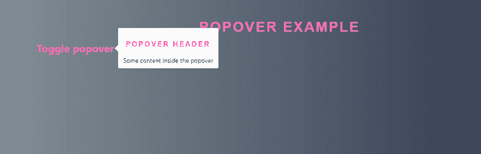
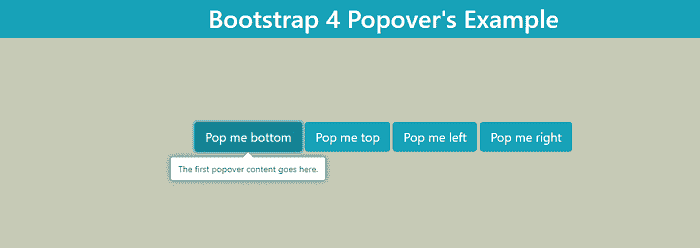
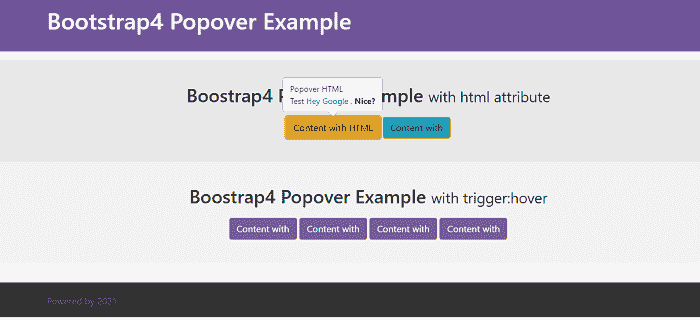

# Bootstrap 4 Popover

> 原文：<https://www.javatpoint.com/bootstrap-4-popover>

在本文中，我们将了解 Bootstrap 4 中的 popover 功能。

### bootstrap4 Popover 是什么意思？

在 Bootstrap4 中，Popover 很像一个工具提示，赋予一个带有标题的延长视图整体。为了激活弹出窗口，用户希望悬停在激活弹出窗口上。可以使用 data-toggle =“popover”特性来创建 Popover，并且可以借助于使用数据内容材料特性来为 Popover 提供内容材料。

**以下是 Bootstrap4 Popover 中使用的一些属性:**

| Sr.No | 属性名称 | 类型 | 缺省值 | 描述 |
| 1. | 动画 | 布尔 | 真实的 | 此属性将 CSS 渐变过渡应用到 Popover。 |
| 2. | 内容 | 字符串&#124;元素&#124;函数 | '' | 如果数据内容属性不存在，它将设置默认内容值。 |
| 3. | 耽搁 | 数字&#124;对象 | Zero | 此属性用于延迟对象。
**例:**
延时:{“显示”:500，“隐藏”:100 } |
| 4. | 超文本标记语言 | 布尔 | 错误的 | 该属性将 HTML 插入弹出窗口。 |
| 5. | 安置 | 字符串&#124;函数 | 对吧 | 此属性用于设置 Popover 的位置-顶部&#124;底部&#124;左侧&#124;右侧&#124;自动。 |
| 6. | 标题 | 字符串&#124;元素&#124;函数 | '' | 如果标题属性不存在，此属性设置默认标题值。 |

**我们来举几个 bootstrap4 Popover 的例子。**

### 例 1:

```

<! DOCTYPE html>
<html lang="en">
<head>
  <title> Bootstrap4 Popover  Example </title>
  <meta charset="utf-8">
  <meta name="viewport" content="width=device-width, initial-scale=1">
  <link rel="stylesheet" href="https://maxcdn.bootstrapcdn.com/bootstrap/4.5.2/css/bootstrap.min.css">
  <script src="https://ajax.googleapis.com/ajax/libs/jquery/3.5.1/jquery.min.js"> </script>
  <script src="https://cdnjs.cloudflare.com/ajax/libs/popper.js/1.16.0/umd/popper.min.js"> </script>
  <script src="https://maxcdn.bootstrapcdn.com/bootstrap/4.5.2/js/bootstrap.min.js"> </script>
<style>
h3 {
  font-family: sans-serif;
  display: block;
  font-size: 2rem;
  font-weight: bold;
  text-align: center;
  letter-spacing: 3px;
  color: hotpink;
  text-transform: uppercase;
  margin-top: 20px;
}
a:hover {
    color: #741e7e;
    text-decoration: none;
}
a {
color: hotpink;
font-weight: bold;
}
body {
    background: #283048; 
    background: -webkit-linear-gradient(to left, #283048 , #859398); 
    background: linear-gradient(to left, #283048 , #859398); 
    font-size: 15px;
    font-size: 1.5rem;
    line-height: 180%;
    padding: 1.5rem;
}
@keyframes fadeInExpand {
    0% {
        opacity: 0;
    }
    35% {
        opacity: 1;
        transform: scale(1.25);
    }
    100% {
        opacity: 1;
        transform: scale(1);
    }
}
</style>
</head>
<body>
<div class="container">
  <h3> Popover Example </h3>
  <a href="#" data-toggle="popover" title="Popover Header" data-content="Some content inside the popover"> Toggle popover </a>
</div>
<script>
$(document).ready(function() {
  $('[data-toggle="popover"]').popover();   
});
</script>
</body>
</html>

```

**说明:**

在上例中，我们创建了一个 bootstrap 4 popover 示例。

**输出:**

下面是这个例子的输出。



### 例 2:

```

<! DOCTYPE html>
<html lang="en">
<head>
  <title> Bootstrap4 Popover  Example </title>
  <meta charset="utf-8">
  <meta name="viewport" content="width=device-width, initial-scale=1">
  <link rel="stylesheet" href="https://maxcdn.bootstrapcdn.com/bootstrap/4.5.2/css/bootstrap.min.css">
  <script src="https://ajax.googleapis.com/ajax/libs/jquery/3.5.1/jquery.min.js"> </script>
  <script src="https://cdnjs.cloudflare.com/ajax/libs/popper.js/1.16.0/umd/popper.min.js"> </script>
  <script src="https://maxcdn.bootstrapcdn.com/bootstrap/4.5.2/js/bootstrap.min.js"> </script>
<style>
.popover-content {
	display: none;
}
.popover {
	-moz-box-shadow: 0 0 8px #5b7d83;
	-webkit-box-shadow: 0 0 8px #5b7d83;
	box-shadow: 0 0 8px #5b7d83;
}
body {
	margin: 1vh;
	margin-top: 35vh;
	text-align: center;
	background-color: #c6cab6;
}
</style>
<body>
<h1 class="bg-info text-white text-center p-2 fixed-top"> Bootstrap 4 Popover's Example </h1>
<button id="pover-first" class="btn btn-lg btn-info" data-toggle="popover" data-trigger="hover" data-placement="bottom"> Pop me bottom </button> 
<button id="pover-second" class="btn btn-lg btn-info" data-toggle="popover" data-trigger="focus" data-placement="top">Pop me top </button>
<button id="pover-third" class="btn btn-lg btn-info" data-toggle="popover" data-trigger="hover" data-placement="left"> Pop me left </button>
<button id="pover-card" class="btn btn-lg btn-info" data-toggle="popover" data-trigger="focus" data-placement="right"> Pop me right </button>
<div  class="popover-content"> 
<div id="popover-first"> The first popover content goes here. </div>
<div id="popover-second"> The second popover content goes here. </div>
<div id="popover-third"> The third popover content goes here. </div>
<div id="popover-card" class="">
	<div class="card text-center" style="margin: -10px -15px; border:0;">
		<div class="card-header bg-warning text-white h3">
			Popover Card
		</div>
		<div class="card-body">
			<h4 class="card-title"> Special title treatment </h4>
			<p class="card-text"> Using data-trigger="focus" causes the popover to close when you click away. Options are hover|focus|click </p>
			<a href="#" class="btn btn-secondary"> Go somewhere </a>
		</div>
		<div class="card-footer text-muted bg-warning text-right">
			<small class="text-white">
				12 days ago
			</small>
		</div>
	</div>	
</div> 	
</div>
<script>
$('[data-toggle="popover"]').popover({
  html: true,
  content: function() {
    var id = $(this).attr('id')
    return $('#po' + id).html();
  }
});
</script>
</body>
</html>

```

**说明:**

在上面的例子中，我们已经创建了一个带有放置的 bootstrap 4 popover 例子，即左、右、上和下。

**输出:**

下面是这个例子的输出。



### 例 3:

```

<! DOCTYPE html>
<html lang="en">
<head>
  <title> Bootstrap4 Popover  Example </title>
  <meta charset="utf-8">
  <meta name="viewport" content="width=device-width, initial-scale=1">
  <link rel="stylesheet" href="https://maxcdn.bootstrapcdn.com/bootstrap/4.5.2/css/bootstrap.min.css">
  <script src="https://ajax.googleapis.com/ajax/libs/jquery/3.5.1/jquery.min.js"> </script>
  <script src="https://cdnjs.cloudflare.com/ajax/libs/popper.js/1.16.0/umd/popper.min.js"> </script>
  <script src="https://maxcdn.bootstrapcdn.com/bootstrap/4.5.2/js/bootstrap.min.js"> </script>
<style>
html { min-height: 100%; position: relative; }
body { margin-bottom: 60px; }
.btn, .btn:hover, .btn:focus, .btn:active, .btn:active:focus { outline: 0; }
.btn-custom { margin-bottom: 1em; }
.no-margin { margin: 0; }
.no-padding { padding: 0; }
.no-border { border: 0; }
.no-radius { border-radius: 0; }
header { padding: 30px 0; background-color: #6f5499; color: #fff; }
  header h1 { margin: 0; }
  header h3 { margin: 0; color: rgba(255,255,255,.4); }
.navbar-default { background-color: #f5f5f5; box-shadow: 0 1px 0 0 rgba(0,0,0,0.1); }
  .navbar-default .nav>li>a:focus, 
  .navbar-default .nav>li>a:hover { background-color: #e5e5e5; }
main {}
  .i-row { padding-top: 40px; padding-bottom: 40px; }
  .i-row-odd { background-color: #f2f2f2; }
  .i-row-even { background-color: #e8e8e8; }
.section-title { margin-top: 0; margin-bottom: 0.6em; font-weight: 500; }
.section-title .fa { margin-right: 5px; color: #07a; }
footer { padding: 20px 0; background-color: #333; position: absolute; bottom: 0; width: 100%; height: 60px; }
.btn-warning {
    color: #212529;
    background-color: #17a2b8;
    border-color: #ffc107;
}
.btn-danger {
    color: #fff;
    background-color: #795c9c;
    border-color: #dc3545;
}
</style>
<body>
<header>
  <div class="container">
    <h1> Bootstrap4 Popover Example </h1>
  </div>
</header>
<nav class="navbar navbar-default no-margin no-border no-radius">
  <div class="container">
    <div class="navbar-header">
    </div>
  </div>
</nav>
<main class="home">
  <section id="two" class="i-row i-row-even">
    <div class="container">
      <div class="row">
        <div class="col-md-12 text-center">
          <h2 class="section-title"> Boostrap4 Popover Example <small> with html attribute </small> </h2>
          <div class="section-body">
            <button type="button" class="btn btn-warning" data-toggle="popover" data-placement="top" data-html="true" data-content="Popover HTML <br> Test <a href='https://www.google.com'> Hey Google </a>, <b> Nice? </b>"> Content with HTML </button>
            <button type="button" class="btn btn-warning" data-toggle="popover" data-placement="top" data-html="true" data-content="<i class='fa fa-smile-o' style='font-size: 30px;'></i>">Content with <i class="fa fa-smile-o"> </i> </button>
          </div>
        </div>
      </div>
    </div>
  </section>
  <section id="three" class="i-row i-row-odd">
    <div class="container">
      <div class="row">
        <div class="col-md-12 text-center">
          <h2 class="section-title"> Boostrap4 Popover Example <small> with trigger:hover </small></h2>
          <div class="section-body">
            <button type="button" class="btn btn-danger" data-toggle="popover" data-placement="left" data-html="true" data-content="<i class='fa fa-heart' style='font-size: 30px;'></i>" data-trigger="hover"> Content with <i class="fa fa-heart"> </i> </button>
            <button type="button" class="btn btn-danger" data-toggle="popover" data-placement="top" data-html="true" data-content="<i class='fa fa-heart' style='font-size: 30px;'></i>" data-trigger="hover"> Content with <i class="fa fa-heart"> </i> </button>
            <button type="button" class="btn btn-danger" data-toggle="popover" data-placement="bottom" data-html="true" data-content="<i class='fa fa-heart' style='font-size: 30px;'></i>" data-trigger="hover"> Content with <i class="fa fa-heart"> </i> </button>
            <button type="button" class="btn btn-danger" data-toggle="popover" data-placement="right" data-html="true" data-content="<i class='fa fa-heart' style='font-size: 30px;'></i>" data-trigger="hover"> Content with <i class="fa fa-heart"> </i> </button>
          </div>
        </div>
      </div>
    </div>
  </section>
</main>
<footer>
  <div class="container">
    <p class="text-muted no-margin"> Powered by 2021 </p>
  </div>
</footer>
<script>
$(function () {
  $('[data-toggle="popover"]').popover();
  $('[data-toggle="tooltip"]').tooltip();
});
</script>
</body>
</html>

```

**说明:**

在上面的示例中，我们创建了一个 bootstrap 4 popover 示例，在悬停时将 html 内容属性 i.e.html 添加到 popover 中。

**输出:**

下面是这个例子的输出。



* * *