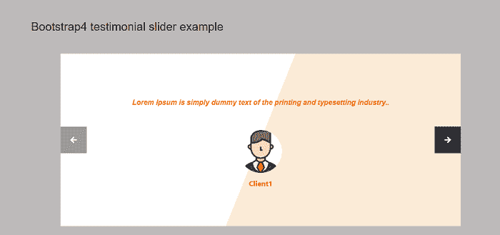
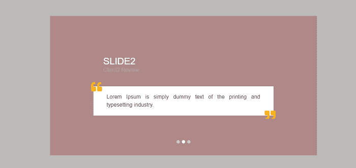
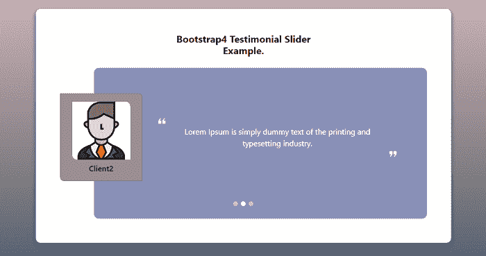

# Bootstrap 4 证明滑块

> 原文：<https://www.javatpoint.com/bootstrap-4-testimonial-slider>

在本文中，我们将了解使用 bootstrap 4 转盘滑块的 bootstrap 4 证明滑块。

**bootstrap 4 奖状滑块是什么意思？**

在 bootstrap 4 中，一个推荐滑块建议在使用客户的帮助下提交推荐文本内容。推荐书滑块包含客户反馈和评论，以一种美丽、现代和移动愉快的方式。

### 例 1:

```

<html lang = "en">
   <head>
      <meta charset = "utf-8">
      <meta name = "viewport" content = "width = device-width, initial-scale = 1, shrink-to-fit = no">
	  <link rel="stylesheet" href="https://stackpath.bootstrapcdn.com/bootstrap/4.4.1/css/bootstrap.min.css" integrity="sha384-Vkoo8x4CGsO3+Hhxv8T/Q5PaXtkKtu6ug5TOeNV6gBiFeWPGFN9MuhOf23Q9Ifjh" crossorigin="anonymous">   	 
	  <link rel = "stylesheet"  href="https://use.fontawesome.com/releases/v5.7.2/css/all.css"> 
	  <script src="https://cdnjs.cloudflare.com/ajax/libs/jquery/3.2.1/jquery.min.js"> </script>
	  <script src="https://cdn.jsdelivr.net/npm/bootstrap@4.5.3/dist/js/bootstrap.bundle.min.js" integrity="sha384-ho+j7jyWK8fNQe+A12Hb8AhRq26LrZ/JpcUGGOn+Y7RsweNrtN/tE3MoK7ZeZDyx" crossorigin="anonymous"> </script>
	   <title> Bootstrap 4 Testimonial slider Example </title>
	  </head>
<style>
body {
    min-height: 100vh;
    display: flex;
    align-items: center;
    background-color: rgb(189 186 186);
    font-family: system-ui;
}
#demo {
    background: linear-gradient(112deg, #ffffff 50%, antiquewhite 50%);
    max-width: 900px;
    margin: auto
}
h2 {

    display: inline-block;
    padding: 1.5em;
	text-align: center;
    vertical-align: top;
    font-family: 'Open Sans', sans-serif;
    font-size: 26px;
    line-height: 28px;
color: black;
}
.carousel-caption {
    position: initial;
    z-index: 10;
    padding: 5rem 8rem;
    color: rgba(78, 77, 77, 0.856);
    text-align: center;
    font-size: 1.2rem;
    font-style: italic;
    font-weight: bold;
    line-height: 2rem
}
p {
    margin:0px;
    display: inline-block;
    padding:1em;
    vertical-align: top;
    font-family: 'Open Sans', sans-serif;
    font-size: 16px;
    line-height: 28px;
color: #f06d06;
}
@media(max-width:767px) {
    .carousel-caption {
        position: initial;
        z-index: 10;
        padding: 3rem 2rem;
        color: rgba(78, 77, 77, 0.856);
        text-align: center;
        font-size: 0.7rem;
        font-style: italic;
        font-weight: bold;
        line-height: 1.5rem;
    }
}
.carousel-caption img {
    width: 6rem;
    border-radius: 5rem;
    margin-top: 2rem
}
@media(max-width:767px) {
    .carousel-caption img {
        width: 4rem;
        border-radius: 4rem;
        margin-top: 1rem;
    }
}
#image-caption {
    font-style: normal;
    font-size: 1rem;
    margin-top: 0.5rem;
	color: #f06d06;
}
@media(max-width:767px) {
    #image-caption {
        font-style: normal;
        font-size: 0.6rem;
        margin-top: 0.5rem;
    }
}
i {
    background-color: #343a40;
    padding: 1.4rem
}
@media(max-width:767px) {
    i {
        padding: 0.8rem
    }
}
.carousel-control-prev {
    justify-content: flex-start;
}
.carousel-control-next {
    justify-content: flex-end;
}
.carousel-control-prev,
{
    transition: none;
    opacity: unset;
}
.carousel-control-next {
    transition: none;
    opacity: unset;
}
</style>
<body>
<div class="container">
<h2> Bootstrap4 testimonial slider example </h2>
    <div id="demo" class="carousel slide" data-ride="carousel">
        <div class="carousel-inner">
            <div class="carousel-item active">
                <div class="carousel-caption">
                    <p> Lorem Ipsum is simply dummy text of the printing and typesetting industry. </p> 
                    <div id="image-caption"> Client1 </div>
                </div>
            </div>
            <div class="carousel-item">
                <div class="carousel-caption">
                    <p> Lorem Ipsum is simply dummy text of the printing and typesetting industry. </p> 
                    <div id="image-caption"> Client2 </div>
                </div>
            </div>
            <div class="carousel-item">
                <div class="carousel-caption">
                    <p> Lorem Ipsum is simply dummy text of the printing and typesetting industry. </p> 
                    <div id="image-caption"> Client3 </div>
                </div>
            </div>
        </div> <a class="carousel-control-prev" href="#demo" data-slide="prev"> <i class='fas fa-arrow-left'> </i> </a> <a class="carousel-control-next" href="#demo" data-slide="next"> <i class='fas fa-arrow-right'> </i> </a>
    </div>
</div>
</body>
</html>

```

**说明:**

在上面的例子中，我们在 bootstrap 4 的帮助下创建了一个推荐滑块。这只是一个客户评论滑块。

**输出:**

以下是该示例的输出:



### 例 2:

```

<html lang = "en">
   <head>
      <meta charset = "utf-8">
      <meta name = "viewport" content = "width = device-width, initial-scale = 1, shrink-to-fit = no">
	  <link rel="stylesheet" href="https://stackpath.bootstrapcdn.com/bootstrap/4.4.1/css/bootstrap.min.css" integrity="sha384-Vkoo8x4CGsO3+Hhxv8T/Q5PaXtkKtu6ug5TOeNV6gBiFeWPGFN9MuhOf23Q9Ifjh" crossorigin="anonymous">   
	  <link rel = "stylesheet"  href="https://use.fontawesome.com/releases/v5.7.2/css/all.css"> 
	  <script src="https://cdnjs.cloudflare.com/ajax/libs/jquery/3.2.1/jquery.min.js"> </script>
	  <script src="https://cdn.jsdelivr.net/npm/bootstrap@4.5.3/dist/js/bootstrap.bundle.min.js" integrity="sha384-ho+j7jyWK8fNQe+A12Hb8AhRq26LrZ/JpcUGGOn+Y7RsweNrtN/tE3MoK7ZeZDyx" crossorigin="anonymous"> </script>

	   <title> Bootstrap 4 Testimonial slider Example </title>
	  </head>
<style>
body {
    min-height: 100vh;
    display: flex;
    align-items: center;
    background-color: rgb(189 186 186);
    font-family: system-ui;
}
 @import url('https://fonts.googleapis.com/css2?family=Poppins&display=swap');
p {
    margin:0px;
    display: inline-block;
    padding:1em;
    vertical-align: top;
    font-family: 'Open Sans', sans-serif;
    font-size: 16px;
    line-height: 28px;
color: #f06d06;
}
 * {
     padding: 0;
     margin: 0;
     box-sizing: border-box;
     font-family: 'Poppins', sans-serif
 }
 .wrapper {
     background-color: #af8888;
     max-width: 800px;
     margin: 100px auto;
     padding: 110px 120px
 }
 .wrapper .content {
     padding: 10px;
     cursor: pointer
 }
 .testimonial {
     padding: 20px 40px;
     position: relative
 }
 .fa-quote-left {
     position: absolute;
     top: -15px;
     left: -6px;
     font-size: 2rem;
     color: #fab41d
 }
 .fa-quote-right {
     position: absolute;
     bottom: -15px;
     right: -6px;
     font-size: 2rem;
     color: #fab41d
 }
 .employee {
     margin-bottom: 40px;
     padding-left: 30px
 }
 .h3 {
     margin: 0
 }
 .carousel-indicators {
     bottom: -100px
 }
 .carousel-indicators li {
     width: 10px;
     height: 10px;
     border-radius: 50%
 }
 .text-jusitfy {
     font-weight: 700
 }
 .text-mute {
     color: #aaa
 }
 @media(max-width:767px) {
     .wrapper {
         padding: 80px 50px;
         margin: 50px 10px
     }
     .carousel-indicators {
         bottom: -80px
     }
 }
 @media(max-width: 420px) {
     .wrapper {
         padding: 40px 20px
     }
     .carousel-indicators {
         bottom: -45px
     }
     .employee {
         margin-bottom: 40px;
         padding-left: 15px
     }
 }
</style>
<body>
<div class="wrapper">
    <div class="carousel slide" id="mySlider" data-ride="carousel" data-interval="4000" data-pause="hover">
        <ol class="carousel-indicators">
            <li data-target="#mySlider" data-slide-to="0" class="active"> </li>
            <li data-target="#mySlider" data-slide-to="1"> </li>
            <li data-target="#mySlider" data-slide-to="2"> </li>
        </ol>
        <div class="carousel-inner text-white">
            <div class="carousel-item active">
                <div class="content">
                    <div class="employee">
                        <div class="h3 text-uppercase"> Slide1 </div>
                        <div class="h6 text-mute"> Client1 Review </div>
                    </div>
                    <div class="testimonial bg-white text-dark"> <span class="fas fa-quote-left"> </span>
                        <div class="text-justify"> Lorem Ipsum is simply dummy text of the printing and typesetting industry. </div> <span class="fas fa-quote-right"> </span>
                    </div>
                </div>
            </div>
            <div class="carousel-item">
                <div class="content">
                    <div class="employee">
                        <div class="h3 text-uppercase"> Slide2 </div>
                        <div class="h6 text-mute"> Client2 Review </div>
                    </div>
                    <div class="testimonial bg-white text-dark"> <span class="fas fa-quote-left"> </span>
                        <div class="text-justify"> Lorem Ipsum is simply dummy text of the printing and typesetting industry. </div> <span class="fas fa-quote-right"> </span>
                    </div>
                </div>
            </div>
            <div class="carousel-item">
                <div class="content">
                    <div class="employee">
                        <div class="h3 text-uppercase"> Slide3 </div>
                        <div class="h6 text-mute"> Client3 Review </div>
                    </div>
                    <div class="testimonial bg-white text-dark"> <span class="fas fa-quote-left"> </span>
                        <div class="text-justify"> Lorem Ipsum is simply dummy text of the printing and typesetting industry. </div> <span class="fas fa-quote-right"> </span>
                    </div>
                </div>
            </div>
        </div>
    </div>
</div>
</body>
</html>

```

**说明:**

在上面的例子中，我们在 bootstrap 4 的帮助下创建了一个推荐滑块。这包含一个客户端评论滑块。

**输出:**

以下是该示例的输出:



### 例 3:

```

<html lang = "en">
   <head>
      <meta charset = "utf-8">
      <meta name = "viewport" content = "width = device-width, initial-scale = 1, shrink-to-fit = no">
	  <link rel="stylesheet" href="https://stackpath.bootstrapcdn.com/bootstrap/4.4.1/css/bootstrap.min.css" integrity="sha384-Vkoo8x4CGsO3+Hhxv8T/Q5PaXtkKtu6ug5TOeNV6gBiFeWPGFN9MuhOf23Q9Ifjh" crossorigin="anonymous"> 
 <link rel = "stylesheet"  href="https://use.fontawesome.com/releases/v5.7.2/css/all.css"> 
	  <script src="https://cdnjs.cloudflare.com/ajax/libs/jquery/3.2.1/jquery.min.js"> </script>
	  <script src="https://cdn.jsdelivr.net/npm/bootstrap@4.5.3/dist/js/bootstrap.bundle.min.js" integrity="sha384-ho+j7jyWK8fNQe+A12Hb8AhRq26LrZ/JpcUGGOn+Y7RsweNrtN/tE3MoK7ZeZDyx" crossorigin="anonymous"> </script>
	   <title> Bootstrap 4 Testimonial slider Example </title>
	  </head>
<style>
body {
    min-height: 100vh;
    display: flex;
    align-items: center;
    background-color: rgb(189 186 186);
    font-family: system-ui;
}
 body {
    color: #000;
    overflow-x: hidden;
    height: 100%;
    background: linear-gradient(#ceb4b7, #5a666b);
    background-repeat: no-repeat
}
.card-main {
    padding: 50px;
    border-radius: 10px;
    margin-top: 50px;
    margin-bottom: 50px;
    box-shadow: 0px 4px 8px 0px #283593
}
.card-0 {
    color: #fff;
    background-color: #8990b7;
    position: relative;
    margin-left: 70px;
    border-radius: 10px;
    min-height: 312px
}
.carousel-indicators li {
    cursor: pointer;
    border-radius: 50% !important;
    width: 10px;
    height: 10px
}
.profile {
    color: #000;
    background-color: #9e8b8d;
    position: absolute;
    left: -70px;
    top: 17%;
    border-radius: 8px;
    border-top-left-radius: 0px;
    border-bottom-right-radius: 0px
}
.profile-pic {
    width: 120px;
    height: 120px;
    border-bottom-left-radius: 10px;
    border-top-right-radius: 10px
}
.open-quotes {
    margin-left: 130px;
    margin-top: 100px
}
.content {
    margin-left: 150px;
    margin-right: 80px
}
.close-quotes {
    margin-bottom: 100px;
    margin-right: 60px
}
@media screen and (max-width: 600px) {
    .card-main {
        padding: 50px 10px
    }

    .card-0 {
        min-height: 432px
    }
    .profile {
        top: 24%
    }
    .profile-pic {
        width: 90px;
        height: 90px
    }
    .open-quotes {
        margin-left: 100px
    }
    .content {
        margin-left: 120px;
        margin-right: 50px
    }
    .close-quotes {
        margin-right: 30px
    }
}
</style>
<body>
<div class="container-fluid px-2 px-md-4 py-5 mx-auto">
    <div class="row d-flex justify-content-center">
        <div class="col-md-10 col-lg-9 col-xl-8">
            <div class="card card-main border-0 text-center">
                <h5 class="font-weight-bold mb-4"> Bootstrap4 Testimonial Slider <br> Example. </h5>
                <div id="carouselExampleIndicators" class="carousel slide" data-ride="carousel">
                    <ol class="carousel-indicators">
                        <li data-target="#carouselExampleIndicators" data-slide-to="0"> </li>
                        <li data-target="#carouselExampleIndicators" data-slide-to="1" class="active"> </li>
                        <li data-target="#carouselExampleIndicators" data-slide-to="2"> </li>
                    </ol>
                    <div class="carousel-inner">
                        <div class="carousel-item">
                            <div class="card border-0 card-0">
                                <div class="card profile py-3 px-4">
                                    <div class="text-center">  </div>
                                    <h6 class="mb-0 mt-2"> Client1 </h6> 
                                </div> 
                                <p class="content mb-0"> Lorem Ipsum is simply dummy text of the printing and typesetting industry. </p> 
                            </div>
                        </div>
                        <div class="carousel-item active">
                            <div class="card border-0 card-0">
                                <div class="card profile py-3 px-4">
                                    <div class="text-center"> 
                     </div>
                                    <h6 class="mb-0 mt-2"> Client2 </h6>     </div> 
                                <p class="content mb-0"> Lorem Ipsum is simply dummy text of the printing and typesetting industry. </p> 
                            </div>
                        </div>
                        <div class="carousel-item">
                            <div class="card border-0 card-0">
                                <div class="card profile py-3 px-4">
                              <div class="text-center">  </div>
                                    <h6 class="mb-0 mt-2"> Client3 </h6>          </div> 
          
                                <p class="content mb-0"> Lorem Ipsum is simply dummy text of the printing and typesetting industry. </p>

                            </div>
                        </div>
                    </div>
                </div>
            </div>
        </div>
    </div>
</div>
</body>
</html>

```

**说明:**

在上面的例子中，我们在 bootstrap 4 的帮助下创建了一个推荐滑块。这包含一个客户端评论滑块。

**输出:**

以下是该示例的输出:



* * *