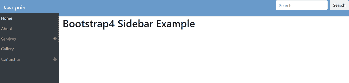
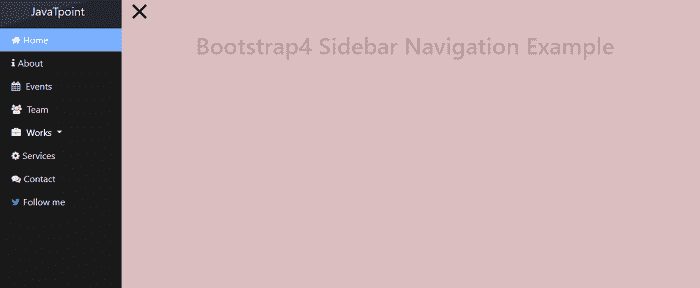

# 引导 4 侧边栏

> 原文：<https://www.javatpoint.com/bootstrap-4-sidebar>

在本文中，我们将借助各种示例来理解 Bootstrap 4 侧栏。

### 你说的 Bootstrap 4 侧边栏是什么意思？

在 Bootstrap 4 中，侧边栏是一个垂直导航组件，它提供了广泛的支持和一种清晰的方式来导航带有文本链接、下拉列表等的复杂网站。

**我们举几个 Bootstrap 4 侧边栏的例子。**

### 例 1:

```

<! DOCTYPE html>
<html lang="en">
<head>
  <title> Bootstrap 4 Sidebar Example </title>
  <meta charset="utf-8">
  <meta name="viewport" content="width=device-width, initial-scale=1">
  <link rel="stylesheet" href="https://maxcdn.bootstrapcdn.com/bootstrap/4.1.3/css/bootstrap.min.css">
  <script src="https://ajax.googleapis.com/ajax/libs/jquery/3.3.1/jquery.min.js"> </script>
  <script src="https://cdnjs.cloudflare.com/ajax/libs/popper.js/1.14.3/umd/popper.min.js"> </script>
  <script src="https://maxcdn.bootstrapcdn.com/bootstrap/4.1.3/js/bootstrap.min.js"> </script>
   <link href="https://maxcdn.bootstrapcdn.com/font-awesome/4.7.0/css/font-awesome.min.css" rel="stylesheet">
</head>
<style>
html {
    position: relative;
    min-height: 100%;
}
body {
    padding-top: 4.5rem;
    margin-bottom: 4.5rem;
}
.footer {
  position: absolute;
  bottom: 0;
  width: 100%;
  height: 3.5rem;
  line-height: 3.5rem;
  background-color: #ccc;
}
.bg-dark {
    background-color: #6a9aca!important;
}
.nav-link:hover {
  transition: all 0.4s;
}
.nav-link-collapse:after {
  float: right;
  content: '\f067';
  font-family: 'FontAwesome';
}
.nav-link-show:after {
  float: right;
  content: '\f068';
  font-family: 'FontAwesome';
}
.nav-item ul.nav-second-level {
  padding-left: 0;
}
.nav-item ul.nav-second-level > .nav-item {
  padding-left: 20px;
}
@media (min-width: 992px) {
  .sidenav {
    position: absolute;
    top: 0;
    left: 0;
    width: 230px;
    height: calc(100vh - 3.5rem);
    margin-top: 3.5rem;
    background: #343a40;
    box-sizing: border-box;
    border-top: 1px solid rgba(0, 0, 0, 0.3);
  }
  .navbar-expand-lg .sidenav {
    flex-direction: column;
  }
  .content-wrapper {
    margin-left: 230px;
  }
  .footer {
    width: calc(100% - 230px);
    margin-left: 230px;
  }
}
</style>
<body>
<nav class="navbar navbar-expand-lg navbar-dark fixed-top bg-dark">
  <a class="navbar-brand" href="#"> JavaTpoint </a>
  <button
    class="navbar-toggler"
    type="button"
    data-toggle="collapse"
    data-target="#navbarCollapse"
    aria-controls="navbarCollapse"
    aria-expanded="false"
    aria-label="Toggle navigation">
    <span class="navbar-toggler-icon"> </span>
  </button>
  <div class="collapse navbar-collapse" id="navbarCollapse">
    <ul class="navbar-nav mr-auto sidenav" id="navAccordion">
      <li class="nav-item active">
        <a class="nav-link" href="#"> Home  </a>
      </li>
      <li class="nav-item">
        <a class="nav-link" href="#"> About </a>
      </li>
      <li class="nav-item">
        <a
          class="nav-link nav-link-collapse"
          href="#"
          id="hasSubItems"
          data-toggle="collapse"
          data-target="#collapseSubItems2"
          aria-controls="collapseSubItems2"
          aria-expanded="false"> Services </a>
        <ul class="nav-second-level collapse" id="collapseSubItems2" data-parent="#navAccordion">
          <li class="nav-item">
            <a class="nav-link" href="#">
              <span class="nav-link-text">Item 2.1</span>
            </a>
          </li>
          <li class="nav-item">
            <a class="nav-link" href="#">
              <span class="nav-link-text">Item 2.2</span>
            </a>
          </li>
        </ul>
      </li>
      <li class="nav-item">
        <a class="nav-link" href="#"> Gallery </a>
      </li>
      <li class="nav-item">
        <a
          class="nav-link nav-link-collapse"
          href="#"
          id="hasSubItems"
          data-toggle="collapse"
          data-target="#collapseSubItems4"
          aria-controls="collapseSubItems4"
          aria-expanded="false"> Contact us </a>
        <ul class="nav-second-level collapse" id="collapseSubItems4" data-parent="#navAccordion">
          <li class="nav-item">
            <a class="nav-link" href="#">
              <span class="nav-link-text">Item 4.1</span>
            </a>
          </li>
          <li class="nav-item">
            <a class="nav-link" href="#">
              <span class="nav-link-text">Item 4.2</span>
            </a>
          </li>
          <li class="nav-item">
            <a class="nav-link" href="#">
              <span class="nav-link-text">Item 4.2</span>
            </a>
          </li>
        </ul>
      </li>

    </ul>
    <form class="form-inline ml-auto mt-2 mt-md-0">
      <input class="form-control mr-sm-2" type="text" placeholder="Search" aria-label="Search">
      <button class="btn  my-2 my-sm-0" type="submit">Search</button>
    </form>
  </div>
</nav>
<main class="content-wrapper">
  <div class="container-fluid">
    <h1> Bootstrap4 Sidebar Example </h1>
  </div>
</main>
<footer class="footer">
  <div class="container">
      <div class="text-center">
          <h1> Footer </h1>
      </div>
  </div>
</footer>
<script>
$(document).ready(function() {
  $('.nav-link-collapse').on('click', function() {
    $('.nav-link-collapse').not(this).removeClass('nav-link-show');
    $(this).toggleClass('nav-link-show');
  });
});
</script>
</body>
</html>

```

**说明:**

在上面的例子中，我们在 bootstrap 4 的帮助下创建了一个侧边栏菜单。

**输出:**

以下是该示例的输出:



### 例 2:

```

<html lang = "en">
   <head>
      <meta charset = "utf-8">
      <meta name = "viewport" content = "width = device-width, initial-scale = 1, shrink-to-fit = no">
	  <link rel="stylesheet" href="https://stackpath.bootstrapcdn.com/bootstrap/4.4.1/css/bootstrap.min.css" integrity="sha384-Vkoo8x4CGsO3+Hhxv8T/Q5PaXtkKtu6ug5TOeNV6gBiFeWPGFN9MuhOf23Q9Ifjh" crossorigin="anonymous">   	 
  <link rel = "stylesheet" href="https://cdnjs.cloudflare.com/ajax/libs/font-awesome/4.7.0/css/font-awesome.min.css"> 
<style>
body {
    position: relative;
    overflow-x: hidden;
    background-color: #CFD8DC;
}
body,
html { height: 100%;}
.nav .open > a, 
.nav .open > a:hover, 
.nav .open > a:focus {background-color: transparent;}
#wrapper {
    padding-left: 0;
    -webkit-transition: all 0.5s ease;
    -moz-transition: all 0.5s ease;
    -o-transition: all 0.5s ease;
    transition: all 0.5s ease;
}

#wrapper.toggled {
    padding-left: 220px;
}

#sidebar-wrapper {
    z-index: 1000;
    left: 220px;
    width: 0;
    height: 100%;
    margin-left: -220px;
    overflow-y: auto;
    overflow-x: hidden;
    background: #1a1a1a;
    -webkit-transition: all 0.5s ease;
    -moz-transition: all 0.5s ease;
    -o-transition: all 0.5s ease;
    transition: all 0.5s ease;
}

#sidebar-wrapper::-webkit-scrollbar {
  display: none;
}

#wrapper.toggled #sidebar-wrapper {
    width: 220px;
}

#page-content-wrapper {
    width: 100%;
    padding-top: 70px;
}

#wrapper.toggled #page-content-wrapper {
    position: absolute;
    margin-right: -220px;
}
.navbar {
  padding: 0;
}

.sidebar-nav {
    position: absolute;
    top: 0;
    width: 220px;
    margin: 0;
    padding: 0;
    list-style: none;
}

.sidebar-nav li {
    position: relative; 
    line-height: 20px;
    display: inline-block;
    width: 100%;
}

.sidebar-nav li:before {
    content: '';
    position: absolute;
    top: 0;
    left: 0;
    z-index: -1;
    height: 100%;
    width: 3px;
    background-color: #1c1c1c;
    -webkit-transition: width .2s ease-in;
      -moz-transition:  width .2s ease-in;
       -ms-transition:  width .2s ease-in;
            transition: width .2s ease-in;

}
.sidebar-nav li:first-child a {
    color: #fff;
    background-color: #1a1a1a;
}
.sidebar-nav li:nth-child(5n+1):before {
    background-color: #ec1b5a;   
}
.sidebar-nav li:nth-child(5n+2):before {
    background-color: #79aefe;   
}
.sidebar-nav li:nth-child(5n+3):before {
    background-color: #314190;   
}
.sidebar-nav li:nth-child(5n+4):before {
    background-color: #279636;   
}
.sidebar-nav li:nth-child(5n+5):before {
    background-color: #7d5d81;   
}

.sidebar-nav li:hover:before,
.sidebar-nav li.open:hover:before {
    width: 100%;
    -webkit-transition: width .2s ease-in;
      -moz-transition:  width .2s ease-in;
       -ms-transition:  width .2s ease-in;
            transition: width .2s ease-in;

}
.sidebar-nav li a {
    display: block;
    color: #ddd;
    text-decoration: none;
    padding: 10px 15px 10px 30px;    
}
.sidebar-nav li a:hover,
.sidebar-nav li a:active,
.sidebar-nav li a:focus,
.sidebar-nav li.open a:hover,
.sidebar-nav li.open a:active,
.sidebar-nav li.open a:focus{
    color: #fff;
    text-decoration: none;
    background-color: transparent;
}
.sidebar-header {
    text-align: center;
    font-size: 20px;
    position: relative;
    width: 100%;
    display: inline-block;
}
.sidebar-brand {
    height: 65px;
    position: relative;
    background:#212531;
    background: linear-gradient(to right bottom, #2f3441 50%, #212531 50%);
   padding-top: 1em;
}
.sidebar-brand a {
    color: #ddd;
}
.sidebar-brand a:hover {
    color: #fff;
    text-decoration: none;
}
.dropdown-header {
    text-align: center;
    font-size: 1em;
    color: #ddd;
    background:#212531;
    background: linear-gradient(to right bottom, #2f3441 50%, #212531 50%);
}
.sidebar-nav .dropdown-menu {
    position: relative;
    width: 100%;
    padding: 0;
    margin: 0;
    border-radius: 0;
    border: none;
    background-color: #222;
    box-shadow: none;
}
.dropdown-menu.show {
    top: 0;
}
.nav.sidebar-nav li a::before {
    font-family: fontawesome;
    content: "\f12e";
    vertical-align: baseline;
    display: inline-block;
    padding-right: 5px;
}
a[href*="#home"]::before {
  content: "\f015" !important;
}
a[href*="#about"]::before {
  content: "\f129" !important;
}
a[href*="#events"]::before {
  content: "\f073" !important;
}
a[href*="#events"]::before {
  content: "\f073" !important;
}
a[href*="#team"]::before {
  content: "\f0c0" !important;
}
a[href*="#works"]::before {
  content: "\f0b1" !important;
}
a[href*="#pictures"]::before {
  content: "\f03e" !important;
}
a[href*="#videos"]::before {
  content: "\f03d" !important;
}
a[href*="#books"]::before {
  content: "\f02d" !important;
}
a[href*="#art"]::before {
  content: "\f1fc" !important;
}
a[href*="#awards"]::before {
  content: "\f02e" !important;
}
a[href*="#services"]::before {
  content: "\f013" !important;
}
a[href*="#contact"]::before {
  content: "\f086" !important;
}
a[href*="#followme"]::before {
  content: "\f099" !important;
  color: #0084b4;
}
.hamburger {
  position: fixed;
  top: 20px;  
  z-index: 999;
  display: block;
  width: 32px;
  height: 32px;
  margin-left: 15px;
  background: transparent;
  border: none;
}
.hamburger:hover,
.hamburger:focus,
.hamburger:active {
  outline: none;
}
.hamburger.is-closed:before {
  content: '';
  display: block;
  width: 100px;
  font-size: 14px;
  color: #fff;
  line-height: 32px;
  text-align: center;
  opacity: 0;
  -webkit-transform: translate3d(0,0,0);
  -webkit-transition: all .35s ease-in-out;
}
.hamburger.is-closed:hover:before {
  opacity: 1;
  display: block;
  -webkit-transform: translate3d(-100px,0,0);
  -webkit-transition: all .35s ease-in-out;
}

.hamburger.is-closed .hamb-top,
.hamburger.is-closed .hamb-middle,
.hamburger.is-closed .hamb-bottom,
.hamburger.is-open .hamb-top,
.hamburger.is-open .hamb-middle,
.hamburger.is-open .hamb-bottom {
  position: absolute;
  left: 0;
  height: 4px;
  width: 100%;
}
.hamburger.is-closed .hamb-top,
.hamburger.is-closed .hamb-middle,
.hamburger.is-closed .hamb-bottom {
  background-color: #1a1a1a;
}
.hamburger.is-closed .hamb-top { 
  top: 5px; 
  -webkit-transition: all .35s ease-in-out;
}
.hamburger.is-closed .hamb-middle {
  top: 50%;
  margin-top: -2px;
}
.hamburger.is-closed .hamb-bottom {
  bottom: 5px;  
  -webkit-transition: all .35s ease-in-out;
}

.hamburger.is-closed:hover .hamb-top {
  top: 0;
  -webkit-transition: all .35s ease-in-out;
}
.hamburger.is-closed:hover .hamb-bottom {
  bottom: 0;
  -webkit-transition: all .35s ease-in-out;
}
.hamburger.is-open .hamb-top,
.hamburger.is-open .hamb-middle,
.hamburger.is-open .hamb-bottom {
  background-color: #1a1a1a;
}
.hamburger.is-open .hamb-top,
.hamburger.is-open .hamb-bottom {
  top: 50%;
  margin-top: -2px;  
}
.hamburger.is-open .hamb-top { 
  -webkit-transform: rotate(45deg);
  -webkit-transition: -webkit-transform .2s cubic-bezier(.73,1,.28,.08);
}
.hamburger.is-open .hamb-middle { display: none; }
.hamburger.is-open .hamb-bottom {
  -webkit-transform: rotate(-45deg);
  -webkit-transition: -webkit-transform .2s cubic-bezier(.73,1,.28,.08);
}
.hamburger.is-open:before {
  content: '';
  display: block;
  width: 100px;
  font-size: 14px;
  color: #fff;
  line-height: 32px;
  text-align: center;
  opacity: 0;
  -webkit-transform: translate3d(0,0,0);
  -webkit-transition: all .35s ease-in-out;
}
.hamburger.is-open:hover:before {
  opacity: 1;
  display: block;
  -webkit-transform: translate3d(-100px,0,0);
  -webkit-transition: all .35s ease-in-out;
}
.overlay {
    position: fixed;
    display: none;
    width: 100%;
    height: 100%;
    top: 0;
    left: 0;
    right: 0;
    bottom: 0;
    background-color: #deb9b9cc;
    z-index: 1;
}
</style>
<body>
<div id="wrapper">
   <div class="overlay"></div>
    <nav class="navbar navbar-inverse fixed-top" id="sidebar-wrapper" role="navigation">
     <ul class="nav sidebar-nav">
       <div class="sidebar-header">
       <div class="sidebar-brand">
         <a href="#"> JavaTpoint </a> </div> </div>
       <li><a href="#home">Home</a></li>
       <li><a href="#about">About</a></li>
       <li><a href="#events"> Events </a> </li>
       <li><a href="#team"> Team </a> </li>
       <li class="dropdown">
       <a href="#works" class="dropdown-toggle? data-toggle="dropdown"> Works </a>
     <ul class="dropdown-menu animated fadeInLeft" role="menu">
      <div class="dropdown-header">Dropdown heading</div>
      <li><a href="#pictures">Pictures</a></li>
      <li><a href="#videos">Videeos</a></li>
      <li><a href="#books">Books</a></li>
      <li><a href="#art">Art</a></li>
      <li><a href="#awards">Awards</a></li>
      </ul>
      </li>
      <li><a href="#services">Services</a></li>
      <li><a href="#contact">Contact</a></li>
      <li><a href="#followme">Follow me</a></li>
      </ul>
  </nav>

        <div id="page-content-wrapper">
            <button type="button" class="hamburger animated fadeInLeft is-closed" data-toggle="offcanvas">
                <span class="hamb-top"></span>
    			<span class="hamb-middle"></span>
				<span class="hamb-bottom"></span>
            </button>
            <div class="container">
                <div class="row">
                    <div class="col-lg-8 col-lg-offset-2">
                        <h1> Bootstrap4 Sidebar Navigation Example </h1>
                     </div>
                </div>
            </div>
        </div>  
    </div>
	<script src="https://ajax.aspnetcdn.com/ajax/jQuery/jquery-3.2.1.min.js"> </script>
	<script>
	$(document).ready(function () {
  var trigger = $('.hamburger'),
      overlay = $('.overlay'),
     isClosed = false;
    trigger.click(function () {
      hamburger_cross();      
    });
    function hamburger_cross() {
      if (isClosed == true) {          
        overlay.hide();
        trigger.removeClass('is-open');
        trigger.addClass('is-closed');
        isClosed = false;
      } else {   
        overlay.show();
        trigger.removeClass('is-closed');
        trigger.addClass('is-open');
        isClosed = true;
      }
  }
  $('[data-toggle="offcanvas"]').click(function () {
        $('#wrapper').toggleClass('toggled');
  });  
});
	</script>
</body>
</html>

```

**说明:**

在上面的例子中，我们在 bootstrap 4 的帮助下创建了一个侧边栏菜单。在这种情况下，当我们点击汉堡菜单时，就会显示侧边栏。

**输出:**

以下是该示例的输出:



* * *