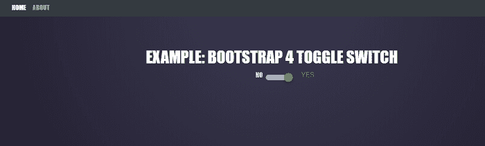

# Bootstrap4 拨动开关

> 原文：<https://www.javatpoint.com/bootstrap-4-toggle-switch>

在本文中，我们将借助各种示例来了解 bootstrap 4 拨动开关的功能。

### Bootstrap 4 拨动开关是什么意思？

Bootstrap Toggle 是一个小部件，它将普通的复选框转换成响应的切换开关按钮。Bootstrap 有一个内置的数据切换属性，用于切换 Bootstrap 元素。

在 bootstrapToggle 4 中，bootstraptogle()方法用于执行任务。bootstrapToggle()方法允许切换开关。如果开关被禁用，并且用户单击复选框，则开关切换到启用状态。

**我们来看一下 Bootstrap4 拨动开关的各种例子。**

### 例 1:

```

<! DOCTYPE html>
<html lang="en">
<head>
<meta charset="utf-8">
<meta name="viewport" content="width=device-width, initial-scale=1">
<title> Bootstrap 4 Toggle Switch Example </title>
<link rel="stylesheet" href="https://cdn.jsdelivr.net/npm/bootstrap@4.6.0/dist/css/bootstrap.min.css">
<script src="https://code.jquery.com/jquery-3.5.1.min.js"> </script>
<script src="https://cdn.jsdelivr.net/npm/bootstrap@4.6.0/dist/js/bootstrap.bundle.min.js"> </script>
<style>
body {
  color: #FFFFFF;
 font-family: 'League Gothic',Impact,sans-serif;
 text-transform: uppercase;
 text-align: center;
 font-size: 1em;
 text-align: center;
 line-height: 12px;
 margin: 120px;
 background: #282537;
 background-image: -webkit-radial-gradient(top, circle cover, #3c3b52 0%, #252233 80%);
 background-image: -moz-radial-gradient(top, circle cover, #3c3b52 0%, #252233 80%);
 background-image: -o-radial-gradient(top, circle cover, #3c3b52 0%, #252233 80%);
 background-image: radial-gradient(top, circle cover, #3c3b52 0%, #252233 80%);
}
h2 {
font-family: "Segoe UI", Tahoma, Geneva, Verdana, sans-serif;
  top: 150px;
  left: 10px;
  text-decoration: none;
  color: var(--link);
  font-weight: bold;
  text-align: center;
  font-size: 48px;
	line-height: 1.2;
	font-weight: 700;
	text-align: center;
}
 .bs-example {
        margin: 20px;        
    }
</style>
</head>
<body>
<div class="bs-example">
<h2> Bootstrap 4 Toggle switch Example </h2>
    <form>
        <div class="custom-control custom-switch">
            <input type="checkbox" class="custom-control-input" id="customSwitch1">
            <label class="custom-control-label" for="customSwitch1"> Toggle switch </label>
        </div>
    </form>
    </div>
</body>
</html>

```

**说明:**

在上面的例子中，我们创建了一个Bootstrap4 拨动开关。

**输出:**

以下是该示例的输出:


### 例 2:

```

<! DOCTYPE html>
<html lang="en">
<head>
<meta charset="utf-8">
<meta name="viewport" content="width=device-width, initial-scale=1">
<title> Bootstrap 4 Toggle Switch Example </title>
<link rel="stylesheet" href="https://cdn.jsdelivr.net/npm/bootstrap@4.6.0/dist/css/bootstrap.min.css">
<script src="https://code.jquery.com/jquery-3.5.1.min.js"> </script>
<script src="https://cdn.jsdelivr.net/npm/bootstrap@4.6.0/dist/js/bootstrap.bundle.min.js"> </script>
<style>
body {
  color: #FFFFFF;
 font-family: 'League Gothic',Impact,sans-serif;
 text-transform: uppercase;
 text-align: center;
 font-size: 1em;
 text-align: center;
 line-height: 12px;
 margin: 120px;
 background: #282537;
 background-image: -webkit-radial-gradient(top, circle cover, #3c3b52 0%, #252233 80%);
 background-image: -moz-radial-gradient(top, circle cover, #3c3b52 0%, #252233 80%);
 background-image: -o-radial-gradient(top, circle cover, #3c3b52 0%, #252233 80%);
 background-image: radial-gradient(top, circle cover, #3c3b52 0%, #252233 80%);
}
h2 {
font-family: "Segoe UI", Tahoma, Geneva, Verdana, sans-serif;
  top: 150px;
  left: 10px;
  text-decoration: none;
  color: var(--link);
  font-weight: bold;
  text-align: center;
  font-size: 48px;
	line-height: 1.2;
	font-weight: 700;
	text-align: center;
}
 .bs-example {
        margin: 20px;        
    }
</style>
</head>
<body>
<div class="bs-example">
<h2> Bootstrap 4 Disabled Toggle switch Example </h2>
    <form>
        <div class="custom-control custom-switch mt-2">
            <input type="checkbox" class="custom-control-input" disabled id="customSwitch2">
            <label class="custom-control-label" for="customSwitch2"> Disabled switch element </label>
        </div>
    </form>
    </div>
</body>
</html>

```

**说明:**

在上面的例子中，我们创建了一个Bootstrap4 拨动开关。

**输出:**

以下是该示例的输出:


### 例 3:

```

<! DOCTYPE html>
<html lang="en">
<head>
<meta charset="utf-8">
<meta name="viewport" content="width=device-width, initial-scale=1">
<title> Bootstrap 4 Toggle Switch Example </title>
<link rel="stylesheet" href="https://cdn.jsdelivr.net/npm/bootstrap@4.6.0/dist/css/bootstrap.min.css">
<script src="https://code.jquery.com/jquery-3.5.1.min.js"> </script>
<script src="https://cdn.jsdelivr.net/npm/bootstrap@4.6.0/dist/js/bootstrap.bundle.min.js"> </script>
</head>
<style>
html {
    scroll-behavior: smooth;
}
body {
  color: #FFFFFF;
 font-family: 'League Gothic',Impact,sans-serif;
 text-transform: uppercase;
 text-align: center;
 font-size: 1em;
 text-align: center;
 line-height: 12px;
 margin: 120px;
 background: #282537;
 background-image: -webkit-radial-gradient(top, circle cover, #3c3b52 0%, #252233 80%);
 background-image: -moz-radial-gradient(top, circle cover, #3c3b52 0%, #252233 80%);
 background-image: -o-radial-gradient(top, circle cover, #3c3b52 0%, #252233 80%);
 background-image: radial-gradient(top, circle cover, #3c3b52 0%, #252233 80%);
}
h2 {
font-family: "Segoe UI", Tahoma, Geneva, Verdana, sans-serif;
  top: 150px;
  left: 10px;
  font-size: 10px;
  text-decoration: none;
  color: var(--link);
  font-weight: bold;
  text-align: center;
}
#fat {
  background: #00BCD4;
  height: 400px;
}
.icon-bar {
    width: 22px; 
    height: 3px;
    background-color: #C59B6D;
    display: block;
    -webkit-transition: all 0.2s;
    transition: all 0.2s;
    margin-top: 4px
}
.navbar-toggler {
    border: none;
    margin: 20px 10px 0 0;
    width: 45px;
    height: 45px;
    border-radius: 50%;
    transition: all ease .4s;
    background: #C59B6D;
}
.navbar-toggler:focus {
    outline: 0px;
}
.navbar-toggler .top-bar {
    transform: rotate(45deg);
    transform-origin: 10% 190%;
    background-color: white;
}
.navbar-toggler .middle-bar {
    opacity: 0;
}
.navbar-toggler .bottom-bar {
    transform: rotate(-45deg);
    transform-origin: 10% -80%;
    background-color: white;
}
.navbar-toggler.collapsed {
    background: #fafafa;
    transition: all ease .4s;
}
.navbar-toggler.collapsed .top-bar {
    transform: rotate(0);
    background-color: #C59B6D;
}
.navbar-toggler.collapsed .middle-bar {
    opacity: 1;
}
.navbar-toggler.collapsed .bottom-bar {
    transform: rotate(0);
    background-color: #C59B6D;
}
.switch input { 
    display: none;
}
.switch {
    display: inline-block;
    width: 50px;
    height: 14px;
    margin: 5px;
    margin-left: 25px;
    -webkit-transform: translateY(50%);
    transform: translateY(50%);
    position: relative;
}
.slider {
    position: absolute;
    top: 0px;
    bottom: 0;
    left: 0;
    right: 0;
    border-radius: 20px;
    background: #B7B7B7;
    cursor: pointer;
    border: 4px solid transparent;
    overflow: visible;
    -webkit-transition: .4s;
    transition: .4s;
}
.slider:before {
    position: absolute;
    content: "";
    width: 22px;
    height: 22px;
    background: #706F6F;
    border-radius: 100px;
    top: -8px;
    -webkit-transform: translateX(-0px);
    transform: translateX(-0px);
    -webkit-transition: .4s;
    transition: .4s;
    -webkit-box-shadow: 0px 3px 6px rgba(0, 0, 0, 0.23);
    box-shadow: 0px 3px 6px rgba(0, 0, 0, 0.23);
}
.switch input:checked + .slider:before {
    -webkit-transform: translateX(20px);
    transform: translateX(20px);
    background: #43AD50;
}
.off {
    position: absolute;
    left: -25px;
    top: -5px;
    color: #706F6F;
  -webkit-transition: all ease .4s;
    transition: all ease .4s;
}
.on {
    position: absolute;
    right: -70px;
    top: -5px;
     color: #d3d3d3;
    font-family: 'roboto_light',sans-serif;
    -webkit-transition: all ease .4s;
    transition: all ease .4s;
}
.switch input:checked ~ .off {
    color: #d3d3d3;
      top: -5px;
}
.switch input:checked ~ .on {
    color: #43AD50;
}
</style>
<body>
<h1> Example: Bootstrap 4 Toggle Switch </h1>
<nav class="navbar navbar-expand-lg navbar-dark bg-dark fixed-top">
  <a class="navbar-brand" href="#"> </a>

  <button class="navbar-toggler collapsed" type="button" data-toggle="collapse" data-target="#navbarSupportedContent" aria-controls="navbarSupportedContent" aria-expanded="false" aria-label="Toggle navigation">
    <span class="icon-bar top-bar"> </span>
	<span class="icon-bar middle-bar"> </span>
	<span class="icon-bar bottom-bar"> </span>		
  </button>

  <div class="collapse navbar-collapse" id="navbarSupportedContent">
    <ul class="navbar-nav mr-auto">
      <li class="nav-item active">
        <a class="nav-link" href="#fat"> Home <span class="sr-only"> (current) </span> </a>
      </li>
      <li class="nav-item">
        <a class="nav-link" href="#mdo"> About </a>
      </li>
    </ul>
  </div>
</nav>
<div class="container">
  <div>
    <label class="switch">
      <input type="checkbox">           
      <span class="slider"> </span>
      <p class="off"> No </p>
      <p class="on"> Yes </p>
    </label>
  </div>
</div>
</body>
</html>

```

**说明:**

在上面的例子中，我们创建了一个Bootstrap4 拨动开关。

**输出:**

以下是该示例的输出:



* * *