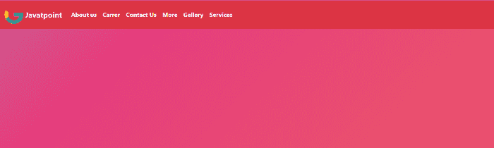
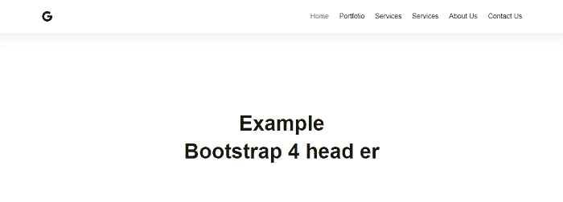

# 引导 4 报头

> 原文：<https://www.javatpoint.com/bootstrap-4-header>

在本文中，我们将详细了解 bootstrap4 头。

### Bootstrap 4 Header 是什么意思？

在 Bootstrap 4 中，标题是位于页面顶部的导航栏。导航栏可以扩展或折叠，具体取决于屏幕大小。标准导航栏是在的帮助下创建的

```

<nav class="navbar navbar-default">

```

**我们来看看 Bootstrap 4 Header 的各种例子。**

### 例 1:

```

<! DOCTYPE html>  
<html lang="en">  
<head>  
  <title> Bootstrap 4 header Example </title>  
  <meta charset="utf-8">  
  <meta name="viewport" content="width=device-width, initial-scale=1">  
  <link rel="stylesheet" href="https://maxcdn.bootstrapcdn.com/bootstrap/4.1.3/css/bootstrap.min.css">  
  <script src="https://ajax.googleapis.com/ajax/libs/jquery/3.3.1/jquery.min.js"> </script>  
  <script src="https://cdnjs.cloudflare.com/ajax/libs/popper.js/1.14.3/umd/popper.min.js"> </script>  
  <script src="https://maxcdn.bootstrapcdn.com/bootstrap/4.1.3/js/bootstrap.min.js"> </script>  
   <link href="https://maxcdn.bootstrapcdn.com/font-awesome/4.7.0/css/font-awesome.min.css" rel="stylesheet">  
</head>  
<body>
<style>
.img-fluid {
      width: 60px;
      height: 60px;
    } 
    .navbar .navbar-collapse .nav-item .nav-link {
  overflow-y: auto;
  color: white;
}
body {
	background: linear-gradient(-45deg, #ee7752, #e73c7e, #23a6d5, #23d5ab);
	background-size: 400% 400%;
           margin: 2rem;
	animation: gradient 15s ease infinite;
	height: 100vh;
}

@keyframes gradient {
	0% {
		background-position: 0% 50%;
	}
	50% {
		background-position: 100% 50%;
	}
	100% {
		background-position: 0% 50%;
	}
}

</style>
<body>
<div class="container">
  <div class="row  ">
      <div class="col  ">
        <nav class="navbar navbar-expand-lg navbar-light bg-danger  text-danger fixed-top font-weight-bold ">
        
        <a href="#" class=" d-lg-none  navbar-brand text-light"> Home </a>
        <a href="#" class="d-none d-lg-block navbar-brand text-light"> Javatpoint </a>        
      <button class="navbar-toggler" type="button" data-toggle="collapse" data-target="#navbarCollapse" aria-controls="navbarCollapse" aria-expanded="false" aria-label="Toggle navigation">
        <span class="navbar-toggler-icon"> </span>
      </button>
      <div class="collapse navbar-collapse" id="navbarCollapse">
        <div class="dropdown-divider"> </div>
        <ul class="navbar-nav ">
          <li class="nav-item ">
            <a class="nav-link" href="#"> About us </a>
          </li>
          <li class="nav-item">
            <a class="nav-link" href="#"> Carrer </a>
          </li>
          <li class="nav-item">
            <a class="nav-link" href="#"> Contact Us </a>
          </li>
          <li class="nav-item">
            <a class="nav-link" href="#"> More </a>
          </li>
          <li class="nav-item">
            <a class="nav-link" href="#"> Gallery </a>
          </li>
          <li class="nav-item">
            <a class="nav-link" href="#"> Services </a>
          </li>
           </ul>
       </div>
   </nav>
</div>
</div>
</div>
</body>
</html>

```

**说明:**

在上面的例子中，我们创建了一个 Bootstrap 4 头。

**输出:**

以下是该示例的输出:



### 例 2:

```

<! DOCTYPE html>  
<html lang="en">  
<head>  
  <title> Bootstrap 4 header Example </title>  
  <meta charset="utf-8">  
  <meta name="viewport" content="width=device-width, initial-scale=1">  
  <link rel="stylesheet" href="https://maxcdn.bootstrapcdn.com/bootstrap/4.1.3/css/bootstrap.min.css">  
  <script src="https://ajax.googleapis.com/ajax/libs/jquery/3.3.1/jquery.min.js"> </script>  
  <script src="https://cdnjs.cloudflare.com/ajax/libs/popper.js/1.14.3/umd/popper.min.js"> </script>  
  <script src="https://maxcdn.bootstrapcdn.com/bootstrap/4.1.3/js/bootstrap.min.js"> </script>  
   <link href="https://maxcdn.bootstrapcdn.com/font-awesome/4.7.0/css/font-awesome.min.css" rel="stylesheet">  
</head>  
@import url('https://fonts.googleapis.com/css?family=Poppins:100,100i,200,200i,300,300i,400,400i,500,500i,600,600i,700,700i,800,800i,900,900i&subset=devanagari,latin-ext');
body {
    font-family: 'Poppins', sans-serif;
	font-size: 16px;
	line-height: 24px;
	font-weight: 400;
	color: #212112;
	background-position: center;
	background-repeat: repeat;
	background-size: 7%;
	background-color: #fff;
	overflow-x: hidden;
    transition: all 200ms linear;
}
::selection {
	color: #fff;
	background-color: #8167a9;
}
::-moz-selection {
	color: #fff;
	background-color: #8167a9;
}
.start-header {
	opacity: 1;
	transform: translateY(0);
	padding: 20px 0;
	box-shadow: 0 10px 30px 0 rgba(138, 155, 165, 0.15);
	-webkit-transition : all 0.3s ease-out;
	transition : all 0.3s ease-out;
}
.start-header.scroll-on {
	box-shadow: 0 5px 10px 0 rgba(138, 155, 165, 0.15);
	padding: 10px 0;
	-webkit-transition : all 0.3s ease-out;
	transition : all 0.3s ease-out;
}
.start-header.scroll-on .navbar-brand img{
	height: 24px;
	-webkit-transition : all 0.3s ease-out;
	transition : all 0.3s ease-out;
}
.navigation-wrap {
	position: fixed;
	width: 100%;
	top: 0;
	left: 0;
	z-index: 1000;
	-webkit-transition : all 0.3s ease-out;
	transition : all 0.3s ease-out;
}
.navbar{
	padding: 0;
}
.navbar-brand img{
	height: 28px;
	width: auto;
	display: block;
  filter: brightness(10%);
	-webkit-transition : all 0.3s ease-out;
	transition : all 0.3s ease-out;
}
.navbar-toggler {
	float: right;
	border: none;
	padding-right: 0;
}
.navbar-toggler:active,
.navbar-toggler:focus {
	outline: none;
}
.navbar-light .navbar-toggler-icon {
	width: 24px;
	height: 17px;
	background-image: none;
	position: relative;
	border-bottom: 1px solid #000;
    transition: all 300ms linear;
}
.navbar-light .navbar-toggler-icon:after, 
.navbar-light .navbar-toggler-icon:before{
	width: 24px;
	position: absolute;
	height: 1px;
	background-color: #000;
	top: 0;
	left: 0;
	content: '';
	z-index: 2;
    transition: all 300ms linear;
}
.navbar-light .navbar-toggler-icon:after{
	top: 8px;
}
.navbar-toggler[aria-expanded="true"] .navbar-toggler-icon:after {
	transform: rotate(45deg);
}
.navbar-toggler[aria-expanded="true"] .navbar-toggler-icon:before {
	transform: translateY(8px) rotate(-45deg);
}
.navbar-toggler[aria-expanded="true"] .navbar-toggler-icon {
	border-color: transparent;
}
.nav-link{
	color: #212121 !important;
	font-weight: 500;
    transition: all 200ms linear;
}
.nav-item:hover .nav-link{
	color: #8167a9 !important;
}
.nav-item.active .nav-link{
	color: #777 !important;
}
.nav-link {
	position: relative;
	padding: 5px 0 !important;
	display: inline-block;
}
.nav-item:after{
	position: absolute;
	bottom: -5px;
	left: 0;
	width: 100%;
	height: 2px;
	content: '';
	background-color: #8167a9;
	opacity: 0;
    transition: all 200ms linear;
}
.nav-item:hover:after{
	bottom: 0;
	opacity: 1;
}
.nav-item.active:hover:after{
	opacity: 0;
}
.nav-item {
	position: relative;
    transition: all 200ms linear;
}

.bg-light {
	background-color: #fff !important;
    transition: all 200ms linear;
}
.section {
    position: relative;
	width: 100%;
	display: block;
}
.full-height {
    height: 100vh;
}
.over-hide {
    overflow: hidden;
}
.absolute-center {
	position: absolute;
	top: 50%;
	left: 0;
	width: 100%;
  margin-top: 40px;
	transform: translateY(-50%);
	z-index: 20;
}
h1 {
	font-size: 48px;
	line-height: 1.2;
	font-weight: 700;
	color: #212112;
	text-align: center;
}
p {
	text-align: center;
	margin: 0;
	padding-top: 10px;
	opacity: 1;
	transform: translate(0);
    transition: all 300ms linear;
    transition-delay: 1700ms;
}
body.hero-anime p{
	opacity: 0;
	transform: translateY(40px);
    transition-delay: 1700ms;
}
h1 span{
	display: inline-block;
    transition: all 300ms linear;
	opacity: 1;
	transform: translate(0);
}
body.hero-anime h1 span:nth-child(1){
	opacity: 0;
	transform: translateY(-20px);
}
body.hero-anime h1 span:nth-child(2){
	opacity: 0;
	transform: translateY(-30px);
}
body.hero-anime h1 span:nth-child(3){
	opacity: 0;
	transform: translateY(-50px);
}
body.hero-anime h1 span:nth-child(4){
	opacity: 0;
	transform: translateY(-10px);
}
body.hero-anime h1 span:nth-child(5){
	opacity: 0;
	transform: translateY(-50px);
}
body.hero-anime h1 span:nth-child(6){
	opacity: 0;
	transform: translateY(-20px);
}
body.hero-anime h1 span:nth-child(7){
	opacity: 0;
	transform: translateY(-40px);
}
body.hero-anime h1 span:nth-child(8){
	opacity: 0;
	transform: translateY(-10px);
}
body.hero-anime h1 span:nth-child(9){
	opacity: 0;
	transform: translateY(-30px);
}
body.hero-anime h1 span:nth-child(10){
	opacity: 0;
	transform: translateY(-20px);
}
h1 span:nth-child(1){
    transition-delay: 1000ms;
}
h1 span:nth-child(2){
    transition-delay: 700ms;
}
h1 span:nth-child(3){
    transition-delay: 900ms;
}
h1 span:nth-child(4){
    transition-delay: 800ms;
}
h1 span:nth-child(5){
    transition-delay: 1000ms;
}
h1 span:nth-child(6){
    transition-delay: 700ms;
}
h1 span:nth-child(7){
    transition-delay: 900ms;
}
h1 span:nth-child(8){
    transition-delay: 800ms;
}
h1 span:nth-child(9){
    transition-delay: 600ms;
}
h1 span:nth-child(10){
    transition-delay: 700ms;
}
body.hero-anime h1 span:nth-child(11){
	opacity: 0;
	transform: translateY(30px);
}
body.hero-anime h1 span:nth-child(12){
	opacity: 0;
	transform: translateY(50px);
}
body.hero-anime h1 span:nth-child(13){
	opacity: 0;
	transform: translateY(20px);
}
body.hero-anime h1 span:nth-child(14){
	opacity: 0;
	transform: translateY(30px);
}
body.hero-anime h1 span:nth-child(15){
	opacity: 0;
	transform: translateY(50px);
}
h1 span:nth-child(11){
    transition-delay: 1300ms;
}
h1 span:nth-child(12){
    transition-delay: 1500ms;
}
h1 span:nth-child(13){
    transition-delay: 1400ms;
}
h1 span:nth-child(14){
    transition-delay: 1200ms;
}
h1 span:nth-child(15){
    transition-delay: 1450ms;
}
.dropdown-toggle::after {
	display: none;
}
body.dark {
	color: #fff;
	background-color: #1f2029;
}
body.dark .navbar-brand img{
  filter: brightness(100%);
}
body.dark h1 {
	color: #fff;
}
body.dark h1 span{
    transition-delay: 0ms !important;
}
body.dark p {
	color: #fff;
    transition-delay: 0ms !important;
}
body.dark .bg-light {
	background-color: #14151a !important;
}
body.dark .start-header {
	box-shadow: 0 10px 30px 0 rgba(0, 0, 0, 0.15);
}
body.dark .start-header.scroll-on {
	box-shadow: 0 5px 10px 0 rgba(0, 0, 0, 0.15);
}
body.dark .nav-link {
	color: #fff !important;
}
body.dark .nav-item.active .nav-link {
	color: #999 !important;
}
body.dark .dropdown-menu {
	color: #fff;
	background-color: #1f2029;
	box-shadow: 0 5px 10px 0 rgba(0, 0, 0, 0.25);
}
body.dark .dropdown-item {
	color: #fff;
}
body.dark .navbar-light .navbar-toggler-icon {
	border-bottom: 1px solid #fff;
}
body.dark .navbar-light .navbar-toggler-icon:after, 
body.dark .navbar-light .navbar-toggler-icon:before{
	background-color: #fff;
}
body.dark .navbar-toggler[aria-expanded="true"] .navbar-toggler-icon {
	border-color: transparent;
}
@media (max-width: 767px) { 
	h1{
		font-size: 38px;
	}
	.nav-item:after{
		display: none;
	}
	.nav-item::before {
		position: absolute;
		display: block;
		top: 15px;
		left: 0;
		width: 11px;
		height: 1px;
		content: "";
		border: none;
		background-color: #000;
		vertical-align: 0;
	}
	.dropdown-toggle::after {
		position: absolute;
		display: block;
		top: 10px;
		left: -23px;
		width: 1px;
		height: 11px;
		content: "";
		border: none;
		background-color: #000;
		vertical-align: 0;
		transition: all 200ms linear;
	}
	.dropdown-toggle[aria-expanded="true"]::after{
		transform: rotate(90deg);
		opacity: 0;
	}

	.dropdown-toggle[aria-expanded="true"] + .dropdown-menu {
		margin-top: 10px !important;
		margin-bottom: 20px !important;
	}
	body.dark .nav-item::before {
		background-color: #fff;
	}
	body.dark .dropdown-toggle::after {
		background-color: #fff;
	}

}
.logo {
	position: absolute;
	bottom: 30px;
	right: 30px;
	display: block;
	z-index: 100;
	transition: all 250ms linear;
}
.logo img {
	height: 26px;
	width: auto;
	display: block;
  filter: brightness(10%);
	transition: all 250ms linear;
}
body.dark .logo img {
  filter: brightness(100%);
}
</style>
<body>
         <body class="hero-anime">
            <div class="navigation-wrap bg-light start-header start-style">
               <div class="container">
                  <div class="row">
                     <div class="col-12">
                        <nav class="navbar navbar-expand-md navbar-light">
                           <a class="navbar-brand" href="#" target="_blank"></a>	
                           <button class="navbar-toggler" type="button" data-toggle="collapse" data-target="#navbarSupportedContent" aria-controls="navbarSupportedContent" aria-expanded="false" aria-label="Toggle navigation">
                           <span class="navbar-toggler-icon"> </span>
                           </button>
                           <div class="collapse navbar-collapse" id="navbarSupportedContent">
                              <ul class="navbar-nav ml-auto py-4 py-md-0">
                                 <li class="nav-item pl-4 pl-md-0 ml-0 ml-md-4 active">
                                    <a class="nav-link dropdown-toggle" data-toggle="dropdown" href="#" role="button" aria-haspopup="true" aria-expanded="false"> Home </a>
                                 </li>
                                 <li class="nav-item pl-4 pl-md-0 ml-0 ml-md-4">
                                    <a class="nav-link" href="#"> Portfolio </a>
                                 </li>
                                 <li class="nav-item pl-4 pl-md-0 ml-0 ml-md-4">
                                    <a class="nav-link" href="#"> Services </a>
                                 </li>
                                 <li class="nav-item pl-4 pl-md-0 ml-0 ml-md-4">
                                    <a class="nav-link dropdown-toggle" data-toggle="dropdown" href="#" role="button" aria-haspopup="true" aria-expanded="false"> Services </a>
                                 </li>
                                 <li class="nav-item pl-4 pl-md-0 ml-0 ml-md-4">
                                    <a class="nav-link" href="#"> About Us </a>
                                 </li>
                                 <li class="nav-item pl-4 pl-md-0 ml-0 ml-md-4">
                                    <a class="nav-link" href="#"> Contact Us </a>
                                 </li>
                              </ul>
                           </div>
                        </nav>
                     </div>
                  </div>
               </div>
            </div>
            <div class="section full-height">
               <div class="absolute-center">
                  <div class="section">
                     <div class="container">
                        <div class="row">
                           <div class="col-12">
                              <h1> Example </h1>
                              <h1><span>B</span><span>o</span><span>o</span><span>t</span><span>s</span><span>t</span><span>r</span><span>a</span><span>p</span> <span>4</span> 
                                 <span>h</span><span>e</span><span>a</span><span>d</span> <span>e</span><span>r</span>
                              </h1>
                           </div>
                        </div>
                     </div>
                  </div>
               </div>
            </div>
            <div class="my-5 py-5">
            </div>
            <script>
               (function($) { "use strict";

               $(function() {
               	var header = $(".start-style");
               	$(window).scroll(function() {    
               		var scroll = $(window).scrollTop();
               		if (scroll >= 10) {
               			header.removeClass('start-style').addClass("scroll-on");
               		} else {
               			header.removeClass("scroll-on").addClass('start-style');
               		}
               	});
               });	

               $(document).ready(function() {
               	$('body.hero-anime').removeClass('hero-anime');
               });
               $('body').on('mouseenter mouseleave','.nav-item',function(e){
               		if ($(window).width() > 750) {
               			var _d=$(e.target).closest('.nav-item');_d.addClass('show');
               			setTimeout(function(){
               			_d[_d.is(':hover')?'addClass':'removeClass']('show');
               			},1);
               		}
               });	

                })(jQuery); 
            </script>
   </body>
</html>

```

**说明:**

在上面的例子中，我们创建了一个 Bootstrap 4 头。

**输出:**

以下是该示例的输出:



* * *