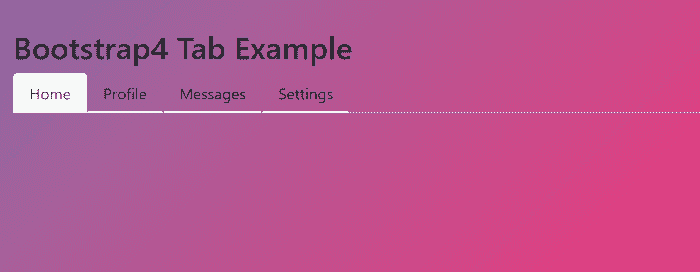
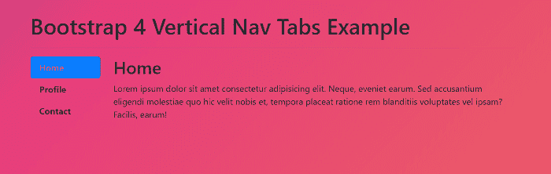
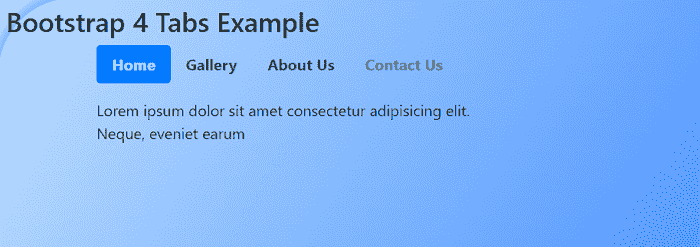

# 引导 4 选项卡

> 原文：<https://www.javatpoint.com/bootstrap-4-tabs>

在本文中，我们将借助一些示例详细了解 Bootstrap 4 选项卡。

### 你说的引导 4 标签是什么意思？

在 Bootstrap 4 中，标签是分隔内容材料的组件，这些内容材料位于相同的包装内，但位于单独的窗格内。一次只显示一个选项卡。这是创建选项卡的一种流畅而快捷的方式。

**我们来看一下 Bootstrap 4 标签的各种例子。**

### 示例 1:

```

<! DOCTYPE html>  
<html lang="en">  
<head>  
  <title> Bootstrap 4 Tab Example </title>  
  <meta charset="utf-8">  
  <meta name="viewport" content="width=device-width, initial-scale=1">  
  <link rel="stylesheet" href="https://maxcdn.bootstrapcdn.com/bootstrap/4.1.3/css/bootstrap.min.css">  
  <script src="https://ajax.googleapis.com/ajax/libs/jquery/3.3.1/jquery.min.js"> </script>  
  <script src="https://cdnjs.cloudflare.com/ajax/libs/popper.js/1.14.3/umd/popper.min.js"> </script>  
  <script src="https://maxcdn.bootstrapcdn.com/bootstrap/4.1.3/js/bootstrap.min.js"> </script>  
   <link href="https://maxcdn.bootstrapcdn.com/font-awesome/4.7.0/css/font-awesome.min.css" rel="stylesheet">  
</head>  
<style>
body {
	background: linear-gradient(-45deg, #ee7752, #e73c7e, #23a6d5, #23d5ab);
	background-size: 400% 400%;
           margin: 2rem;
	animation: gradient 15s ease infinite;
	height: 100vh;
}
@keyframes gradient {
	0% {
		background-position: 0% 50%;
	}
	50% {
		background-position: 100% 50%;
	}
	100% {
		background-position: 0% 50%;
	}
}
html {
	font-size: 125%;
	font-family: "Helvetica Neue", "HelveticaNeue", Arial, sans-serif;
	font-weight: 300;
	line-height: 1.6;
}
 a {
	color: inherit;
	text-decoration: none;
	box-shadow: inset 0 -.1em 0 0 #ddd;
	transition: box-shadow .2s cubic-bezier(0,0,.58,1);
	transition: color .4s cubic-bezier(0,0,.58,1);
    transition-property: box-shadow, color;
	transition-duration: .2s, .4s;
	trasition-timing-function: cubic-bezier(0,0,.58,1);
}
 a:hover {
	color: #888;
	box-shadow: inset 0 -.25em 0 0 #ddd;
}
</style>
<body>
<h2> Bootstrap4 Tab Example </h2>
<ul class="nav nav-tabs" role="tablist">
  <li class="nav-item">
    <a class="nav-link active" data-toggle="tab" href="#home" role="tab"> Home </a>
  </li>
  <li class="nav-item">
    <a class="nav-link" data-toggle="tab" href="#profile" role="tab"> Profile </a>
  </li>
  <li class="nav-item">
    <a class="nav-link" data-toggle="tab" href="#messages" role="tab"> Messages </a>
  </li>
  <li class="nav-item">
    <a class="nav-link" data-toggle="tab" href="#settings" role="tab"> Settings </a>
  </li>
</ul>
    <div class="tab-content">
    <div class="tab-pane" id="profile" role="tabpanel">
      <h1> User Profile </h1>
      <table>
      <thead class="thead-inverse">
        <tr>
          <th> </th>
          <th> User </th>
          <th> Description </th>
          <th> Order Details </th>
          <th> Date </th>
          <th> Payment </th>
        </tr>
      </thead>
      <tbody>
        <tr>
          <td><input type="checkbox" class="check"></td>
          <td>
            <div class="chip-user d-flex flex-items-md-middle">
              <div class="chip-user__img mr-1">
                
              </div>
              <div class="chip-username">
                <span class="real-name d-block"> My Name </span>
                <span class="alias-name d-block"> Other Name </span>
              </div>
            </div>
          </td>
          <td class="text-primary text-bold"> Amazon </td>
          <td class="text-primary text-bold"> #1234 </td>
          <td> 1/8/2018 </td>
          <td> <i class="fa fa-cc-paypal"> </i> </td>
        </tr>
    </tbody>
      </table>
    </div>
    <div class="tab-pane" id="messages" role="tabpanel">
      <h1> Messages </h1>
      <p> Lorem ipsum dolor sit amet, consectetur adipisicing elit. </p>
      <hr />
      <p> Lorem ipsum dolor sit amet, consectetur adipisicing elit. </p>
    </div>
    <div class="tab-pane" id="settings" role="tabpanel">
      <h1> Settings </h1>
      <p> Lorem ipsum dolor sit amet, consectetur adipisicing elit.</p>
    </div>
  </div>
</body>
</html>

```

**说明:**

在上面的示例中，我们创建了 Bootstrap 4 选项卡。



**输出:**

下面是这个例子的输出。

### 例 2:

```

<! DOCTYPE html>  
<html lang="en">  
<head>  
  <title> Bootstrap 4 Tabs Example </title>  
  <meta charset="utf-8">  
  <meta name="viewport" content="width=device-width, initial-scale=1">  
  <link rel="stylesheet" href="https://maxcdn.bootstrapcdn.com/bootstrap/4.1.3/css/bootstrap.min.css">  
  <script src="https://ajax.googleapis.com/ajax/libs/jquery/3.3.1/jquery.min.js"> </script>  
  <script src="https://cdnjs.cloudflare.com/ajax/libs/popper.js/1.14.3/umd/popper.min.js"> </script>  
  <script src="https://maxcdn.bootstrapcdn.com/bootstrap/4.1.3/js/bootstrap.min.js"> </script>  
   <link href="https://maxcdn.bootstrapcdn.com/font-awesome/4.7.0/css/font-awesome.min.css" rel="stylesheet">  
</head>  
<style>
body {
	background: linear-gradient(-45deg, #ee7752, #e73c7e, #23a6d5, #23d5ab);
	background-size: 400% 400%;
           margin: 2rem;
	animation: gradient 15s ease infinite;
	height: 100vh;
}
@keyframes gradient {
	0% {
		background-position: 0% 50%;
	}
	50% {
		background-position: 100% 50%;
	}
	100% {
		background-position: 0% 50%;
	}
}
html {
	font-size: 125%;
	font-family: "Helvetica Neue", "HelveticaNeue", Arial, sans-serif;
	font-weight: 300;
	line-height: 1.6;
}
 a {
    padding: 10px;
    color: #237546;
    font-weight: 700;
    text-shadow: none;
    -webkit-transition: color 0.3s;
    -moz-transition: color 0.3s;
    transition: color 0.3s;
}
</style>
<body>
<div class="container">
    <h1> Bootstrap 4 Vertical Nav Tabs Example </h1>
  <hr>
  <div class="row">
    <div class="col-md-2 mb-3">
        <ul class="nav nav-pills flex-column" id="myTab" role="tablist">
  <li class="nav-item">
    <a class="nav-link active" id="home-tab" data-toggle="tab" href="#home" role="tab" aria-controls="home" aria-selected="true"> Home </a>
  </li>
  <li class="nav-item">
    <a class="nav-link" id="profile-tab" data-toggle="tab" href="#profile" role="tab" aria-controls="profile" aria-selected="false"> Profile </a>
  </li>
  <li class="nav-item">
    <a class="nav-link" id="contact-tab" data-toggle="tab" href="#contact" role="tab" aria-controls="contact" aria-selected="false"> Contact </a>
  </li>
</ul>
    </div>
        <div class="col-md-10">
      <div class="tab-content" id="myTabContent">
  <div class="tab-pane fade show active" id="home" role="tabpanel" aria-labelledby="home-tab">
  <h2> Home </h2>
    <p> Lorem ipsum dolor sit amet consectetur adipisicing elit. </p>
  </div>
  <div class="tab-pane fade" id="profile" role="tabpanel" aria-labelledby="profile-tab">
  <h2> Profile </h2>
    <p>Lorem ipsum dolor sit amet consectetur adipisicing elit. </p>
  </div>
  <div class="tab-pane fade" id="contact" role="tabpanel" aria-labelledby="contact-tab">
  <h2> Contact </h2>
    <p> Lorem ipsum dolor sit amet consectetur adipisicing elit. </p>
  </div>
</div>
    </div>    
  </div>
</div>
</body>
</html>

```

**说明:**

在上面的例子中，我们已经创建了引导 4 垂直导航标签。

**输出:**

下面是这个例子的输出。



### 例 3:

```

<! DOCTYPE html>  
<html lang="en">  
<head>  
  <title> Bootstrap 4 Tabs Example </title>  
  <meta charset="utf-8">  
  <meta name="viewport" content="width=device-width, initial-scale=1">  
  <link rel="stylesheet" href="https://maxcdn.bootstrapcdn.com/bootstrap/4.1.3/css/bootstrap.min.css">  
  <script src="https://ajax.googleapis.com/ajax/libs/jquery/3.3.1/jquery.min.js"> </script>  
  <script src="https://cdnjs.cloudflare.com/ajax/libs/popper.js/1.14.3/umd/popper.min.js"> </script>  
  <script src="https://maxcdn.bootstrapcdn.com/bootstrap/4.1.3/js/bootstrap.min.js"> </script>  
   <link href="https://maxcdn.bootstrapcdn.com/font-awesome/4.7.0/css/font-awesome.min.css" rel="stylesheet">  
</head>  
<style>
body {
  padding : 10px ;
  border-radius: 100px;
  box-shadow: 1px 0 10px 10px rgba(15,122,255,0.3);
  background:
	linear-gradient( rgba(180,220,255,0.9), transparent ),
	linear-gradient( -15deg, rgba(15,122,255,0.3), transparent ),
	linear-gradient( -45deg, rgba(15,122,255,0.9), transparent );
  background-blend-mode: multiply;
}
#exTab1 .tab-content {
  color : white;
  background-color: #428bca;
  padding: 5px 15px;
}
#exTab2 h3 {
  color : white;
  background-color: #428bca;
  padding : 5px 15px;
}
html {
	font-size: 125%;
	font-family: "Helvetica Neue", "HelveticaNeue", Arial, sans-serif;
	font-weight: 300;
	line-height: 1.6;
}
 a {
    padding: 10px;
    color: #237546;
    font-weight: 700;
    text-shadow: none;
    -webkit-transition: color 0.3s;
    -moz-transition: color 0.3s;
    transition: color 0.3s;
}
#exTab1 .nav-pills > li > a {
  border-radius: 0;
}
#exTab3 .nav-pills > li > a {
  border-radius: 4px 4px 0 0 ;
}
#exTab3 .tab-content {
  color : white;
  background-color: #428bca;
  padding : 5px 15px;
}
</style>
<body>
<h3> Bootstrap 4 Tabs Example </h3>
<div class="container">
  <div class="row">
      <div class="col-12 col-md-8 col-lg-6">
        <ul class="nav nav-pills">
          <li class="nav-item">
            <a class="nav-link active" href="#"> Home </a>
          </li>
          <li class="nav-item">
            <a class="nav-link" href="#"> Gallery </a>
          </li>
          <li class="nav-item">
            <a class="nav-link" href="#"> About Us </a>
          </li>
          <li class="nav-item">
            <a class="nav-link disabled" href="#"> Contact Us </a>
          </li>
        </ul>
      <div class="tab-content mt-3">
        <div class="tab-pane active" id="f" role="tabpanel" aria-labelledby="f-tab">
          Lorem ipsum dolor sit amet consectetur adipisicing elit. 
        </div>
        <div class="tab-pane" id="cuckoo" role="tabpanel" aria-labelledby="profile-tab">
          Lorem ipsum dolor sit amet consectetur adipisicing elit. 
        </div>
        <div class="tab-pane" id="o" role="tabpanel" aria-labelledby="o-tab">
          Lorem ipsum dolor sit amet consectetur adipisicing elit. 
        </div>
        <div class="tab-pane" id="t" role="tabpanel" aria-labelledby="t-tab">
          Lorem ipsum dolor sit amet consectetur adipisicing elit. 
        </div>
      </div>        
      </div>
  </div>
</div>
</body>
</html> 

```

**说明:**

在上面的示例中，我们创建了 Bootstrap 4 选项卡。

**输出:**

下面是这个例子的输出。



* * *