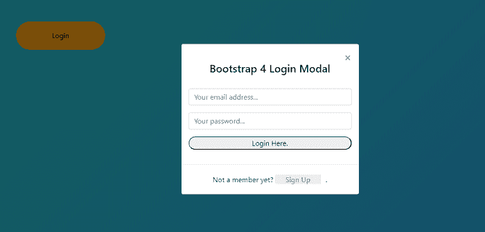
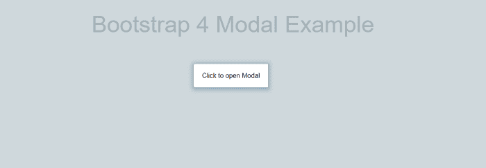
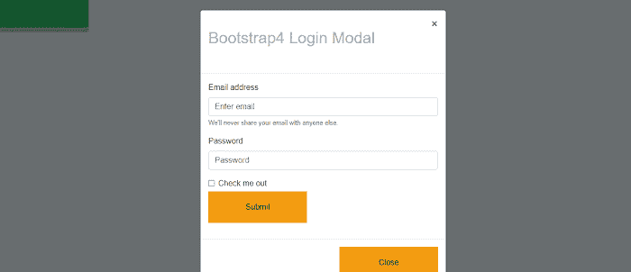

# Bootstrap4 模式

> 原文：<https://www.javatpoint.com/bootstrap-4-modal>

在本文中，我们将详细了解 bootstrap 4 模式。

### Bootstrap 4 Modal 是什么意思？

在 [Bootstrap 4](https://www.javatpoint.com/bootstrap-4) 中，modal 是一个对话框，用于显示在当前页面的顶部。Bootstrap 4 modals 分为三个部分:页眉部分、正文部分和页脚部分。

**我们来详细讨论一下 Bootstrap 4 Modal 的各种例子。**

### 例 1:

```

<! DOCTYPE html>  
<html lang="en">  
<head>  
  <title> Bootstrap 4 modal Example </title>  
  <meta charset="utf-8">  
  <meta name="viewport" content="width=device-width, initial-scale=1">  
  <link rel="stylesheet" href="https://maxcdn.bootstrapcdn.com/bootstrap/4.1.3/css/bootstrap.min.css">  
  <script src="https://ajax.googleapis.com/ajax/libs/jquery/3.3.1/jquery.min.js"> </script>  
  <script src="https://cdnjs.cloudflare.com/ajax/libs/popper.js/1.14.3/umd/popper.min.js"> </script>  
  <script src="https://maxcdn.bootstrapcdn.com/bootstrap/4.1.3/js/bootstrap.min.js"> </script>  
  <link rel="stylesheet" href="https://cdnjs.cloudflare.com/ajax/libs/font-awesome/5.7.2/css/font-awesome.min.css">
</head>  
<style>
.container {
padding: 2rem 0rem;
}
@media (min-width: 576px) {
  .modal-dialog {
max-width: 400px;
    .modal-content {
padding: 1rem;
    }
  }
}
.modal-header {
  .close {
margin-top: -1.5rem;
  }
}
.form-title {
margin: -2rem 0rem 2rem;
}
.btn-round {
border-radius: 3rem;
}
.delimiter {
padding: 1rem;  
}

.signup-section {
padding: 0.3rem 0rem;
}
body {
	background: linear-gradient(-45deg, #ee7752, #e73c7e, #23a6d5, #23d5ab);
	background-size: 400% 400%;
           margin: 2rem;
	animation: gradient 15s ease infinite;
	height: 100vh;
}
@keyframes gradient {
	0% {
		background-position: 0% 50%;
	}
	50% {
		background-position: 100% 50%;
	}
	100% {
		background-position: 0% 50%;
	}
}
a {
  background: #eee;
  border-radius: 3px 0 0 3px;
  color: #999;
  line-height: 26px;
  padding: 0 20px 0 23px;
  position: relative;
  margin: 0 10px 10px 0;
  text-decoration: none;
  -webkit-transition: color 0.2s;
}
a:hover {
 text-decoration: none;
}
.button-three {
    position: relative;
    background-color: #f39c12;
    border: none;
    padding: 20px;
    width: 200px;
    text-align: center;
    -webkit-transition-duration: 0.4s;
    transition-duration: 0.4s;
    text-decoration: none;
    overflow: hidden;
}
.button-three:hover {
   background:#fff;
   box-shadow:0px 2px 10px 5px #97B1BF;
   color:#000;
}
.button-three:after {
    content: "";
    background: #f1c40f;
    display: block;
    position: absolute;
    padding-top: 300%;
    padding-left: 350%;
    margin-left: -20px !important;
    margin-top: -120%;
    opacity: 0;
    transition: all 0.8s
}
</style>
<body>
<div class="container">
<button type="button" class="button-three btn-round" data-toggle="modal" data-target="#loginModal">
    Login
</button>
</div>
<div class="modal fade" id="loginModal" tabindex="-1" role="dialog" aria-labelledby="exampleModalLabel" aria-hidden="true">
<div class="modal-dialog modal-dialog-centered" role="document">
<div class="modal-content">
<div class="modal-header border-bottom-0">
<button type="button" class="close" data-dismiss="modal" aria-label="Close">
<span aria-hidden="true">  </span>
</button>
</div>
<div class="modal-body">
<div class="form-title text-center">
<h4> Bootstrap 4 Login Modal </h4>
</div>
<div class="d-flex flex-column text-center">
<form>
<div class="form-group">
<input type="email" class="form-control" id="email1"placeholder="Your email address...">
</div>
<div class="form-group">
<input type="password" class="form-control" id="password1" placeholder="Your password...">
</div>
<button type="button" class="btnbtn-info btn-block btn-round"> Login Here. </button>
</form>
</div>
</div>
<div class="modal-footer d-flex justify-content-center">
<div class="signup-section"> Not a member yet? <a href="#a" class="text-info"> Sign Up </a>.</div>
</div>
</div>
</div>
<script>
$(document).ready(function() {            
 $('#loginModal').modal('show');
  $(function () {
    $('[data-toggle="tooltip"]').tooltip()
  })
});
</script>
</body>
</html>

```

**说明:**

在上面的例子中，我们创建了一个 Bootstrap 4 模式。

**输出:**

以下是一个示例的输出:



### 例 2:

```

<! DOCTYPE html>  
<html lang="en">  
<head>  
  <title> Bootstrap 4 Modal Example </title>  
  <meta charset="utf-8">  
  <meta name="viewport" content="width=device-width, initial-scale=1">  
  <link rel="stylesheet" href="https://maxcdn.bootstrapcdn.com/bootstrap/4.1.3/css/bootstrap.min.css">  
  <script src="https://ajax.googleapis.com/ajax/libs/jquery/3.3.1/jquery.min.js"> </script>  
  <script src="https://cdnjs.cloudflare.com/ajax/libs/popper.js/1.14.3/umd/popper.min.js"> </script>  
  <script src="https://maxcdn.bootstrapcdn.com/bootstrap/4.1.3/js/bootstrap.min.js"> </script>  
   <link href="https://maxcdn.bootstrapcdn.com/font-awesome/4.7.0/css/font-awesome.min.css" rel="stylesheet">  
</head>  
<style>
<style>
.img-size {
 	padding: 0;
	margin: 0; 
	height: 450px;
	width: 500px;
	background-size: cover;
	overflow: hidden;
}
.modal-content {
   width: 700px;
  border:none;
}
.modal-body {
   padding: 0;
}
body {
	background: #cfd8dc;
	color: #37474f;
	font-weight: 400;
	font-size: 1em;
	font-family: 'Raleway', Arial, sans-serif;
}
.button-three {
    position: relative;
    background-color: #f39c12;
    border: none;
    padding: 20px;
    width: 200px;
    text-align: center;
    -webkit-transition-duration: 0.4s; /* Safari */
    transition-duration: 0.4s;
    text-decoration: none;
    overflow: hidden;
}
.button-three:hover {
   background:#fff;
   box-shadow:0px 2px 10px 5px #97B1BF;
   color:#000;
}
.button-three:after {
    content: "";
    background: #f1c40f;
    display: block;
    position: absolute;
    padding-top: 300%;
    padding-left: 350%;
    margin-left: -20px !important;
    margin-top: -120%;
    opacity: 0;
    transition: all 0.8s
}
h1 {
display: block;
	font-size: 2em;
	letter-spacing: 0;
	padding: 0.5em 0 1em 0;
	color: #A8B3B8; 
	}
.button-three:active:after {
    padding: 0;
    margin: 0;
    opacity: 1;
    transition: 0s
}
.carousel-control-prev-icon {
	background-image: url("data:image/svg+xml;charset=utf8,%3Csvg xmlns='http://www.w3.org/2000/svg' fill='%23009be1' viewBox='0 0 8 8'%3E%3Cpath d='M5.25 0l-4 4 4 4 1.5-1.5-2.5-2.5 2.5-2.5-1.5-1.5z'/%3E%3C/svg%3E");
	width: 30px;
	height: 48px;
}
.carousel-control-next-icon {
	background-image: url("data:image/svg+xml;charset=utf8,%3Csvg xmlns='http://www.w3.org/2000/svg' fill='%23009be1' viewBox='0 0 8 8'%3E%3Cpath d='M2.75 0l-1.5 1.5 2.5 2.5-2.5 2.5 1.5 1.5 4-4-4-4z'/%3E%3C/svg%3E");
	width: 30px;
	height: 48px;
}
a {
  background: #eee;
  border-radius: 3px 0 0 3px;
  color: #999;
  line-height: 26px;
  padding: 0 20px 0 23px;
  position: relative;
  margin: 0 10px 10px 0;
  text-decoration: none;
  -webkit-transition: color 0.2s;
}
a:hover {
 text-decoration: none;
}
</style>
<body>
<div class="container">
  <h1 class="display-4 text-center mb-4"> Bootstrap 4 Modal Example </h1>

  <div class="row mb-4">
    <div class="col text-center">
      <a href="#" class="button-three" data-toggle="modal" data-target="#largeModal"> Click to open Modal </a>
    </div>
  </div>
  <div class="modal fade" id="largeModal" tabindex="-1" role="dialog" aria-labelledby="basicModal" aria-hidden="true">
    <div class="modal-dialog modal-lg">
      <div class="modal-content">
        <div class="modal-body">
          <div
               id='carouselExampleIndicators'
               class='carousel slide'
               data-ride='carousel'
               >
            <ol class='carousel-indicators'>
         <li
                  data-target='#carouselExampleIndicators'
                  data-slide-to='0'
                  class='active'
                  > </li>
              <li
                  data-target='#carouselExampleIndicators'
                  data-slide-to='1'
                  > </li>
              <li
                  data-target='#carouselExampleIndicators'
                  data-slide-to='2'
                  > </li>
            </ol>
            <div class='carousel-inner'>
              <div class='carousel-item active'>
                
              </div>
              <div class='carousel-item'>
                
              </div>
              <div class='carousel-item'>
                
              </div>
            </div>
            <a
               class='carousel-control-prev'
               href='#carouselExampleIndicators'
               role='button'
               data-slide='prev' >
              <span class='carousel-control-prev-icon'
                    aria-hidden='true'
                    ></span>
              <span class='sr-only'> Previous </span>
            </a>
            <a
               class='carousel-control-next'
               href='#carouselExampleIndicators'
               role='button'
               data-slide='next'
               >
              <span
                    class='carousel-control-next-icon'
                    aria-hidden='true'
                    ></span>
              <span class='sr-only'> Next </span>
            </a>
          </div>
        </div>
        <div class="modal-footer">
          <button type="button" class="button-three" data-dismiss="modal"> Close </button>
        </div>
      </div>
    </div>
  </div>
</body>
</html>

```

**说明:**

在上面的例子中，我们创建了一个 bootstrap 4 模式。

**输出:**

以下是一个示例的输出:



当用户点击按钮时，弹出滑块就会显示出来。


### 例 3:

```

<! DOCTYPE html>  
<html lang="en">  
<head>  
  <title> Bootstrap 4 header Example </title>  
  <meta charset="utf-8">  
  <meta name="viewport" content="width=device-width, initial-scale=1">  
  <link rel="stylesheet" href="https://maxcdn.bootstrapcdn.com/bootstrap/4.1.3/css/bootstrap.min.css">  
  <script src="https://ajax.googleapis.com/ajax/libs/jquery/3.3.1/jquery.min.js"> </script>  
  <script src="https://cdnjs.cloudflare.com/ajax/libs/popper.js/1.14.3/umd/popper.min.js"> </script>  
  <script src="https://maxcdn.bootstrapcdn.com/bootstrap/4.1.3/js/bootstrap.min.js"> </script>  
   <link href="https://maxcdn.bootstrapcdn.com/font-awesome/4.7.0/css/font-awesome.min.css" rel="stylesheet">  
</head>  
<style>
body {
	background: #cfd8dc;
	color: #37474f;
	font-weight: 400;
	font-size: 1em;
	font-family: 'Raleway', Arial, sans-serif;
}
.button-three {
    position: relative;
    background-color: #f39c12;
    border: none;
    padding: 20px;
    width: 200px;
    text-align: center;
    -webkit-transition-duration: 0.4s; /* Safari */
    transition-duration: 0.4s;
    text-decoration: none;
    overflow: hidden;
}
.button-three:hover {
   background:#fff;
   box-shadow:0px 2px 10px 5px #97B1BF;
   color:#000;
}
.button-three:after {
    content: "";
    background: #f1c40f;
    display: block;
    position: absolute;
    padding-top: 300%;
    padding-left: 350%;
    margin-left: -20px !important;
    margin-top: -120%;
    opacity: 0;
    transition: all 0.8s
}
h5 {
display: block;
	font-size: 2em;
	letter-spacing: 0;
	padding: 0.5em 0 1em 0;
	color: #A8B3B8; 
	}
.button-three:active:after {
    padding: 0;
    margin: 0;
    opacity: 1;
    transition: 0s
}
.button-one {
  padding:20px 60px;
  outline: none;
  background-color: #27ae60;
  border: none;
  border-radius:5px;
  box-shadow: 0 9px #95a5a6;
}

.button-one:hover{
  background-color: #2ecc71;
}

.button-one:active {
  background-color: #2ecc71;
  box-shadow: 0 5px #95a5a6;
  transform: translateY(4px);
}

.invalid input:required:invalid {
  background: #BE4C54;
}
.invalid input:required:valid {
  background: #17D654;
}
</style>
<body>
<button type="button" class="button-one" data-toggle="modal" data-target="#exampleModal">
  Open modal
</button>
<div class="modal fade" id="exampleModal" tabindex="-1" role="dialog" aria-labelledby="exampleModalLabel" aria-hidden="true">
  <div class="modal-dialog" role="document">
    <div class="modal-content">
      <div class="modal-header">
        <h5 class="modal-title" id="exampleModalLabel"> Bootstrap4 Login Modal </h5>
        <button type="button" class="close" data-dismiss="modal" aria-label="Close">
          <span aria-hidden="true">  </span>
        </button>
      </div>
      <div class="modal-body">
        <form class="needs-validation" novalidate>
          <div class="form-group">
            <label for="exampleInputEmail1">Email address</label>
            <input type="email" class="form-control" id="exampleInputEmail1" aria-describedby="emailHelp" placeholder="Enter email" required>
            <div class="invalid-feedback">
              Please enter a valid email address
            </div>
            <small id="emailHelp" class="form-text text-muted"> We'll never share your email with anyone else. </small>
          </div>
          <div class="form-group">
            <label for="exampleInputPassword1">Password</label>
            <input type="password" class="form-control" id="exampleInputPassword1" placeholder="Password" required>
            <div class="invalid-feedback">
              Please enter a password
            </div>
          </div>
          <div class="form-check mb-1">
            <input type="checkbox" class="form-check-input" id="exampleCheck1">
            <label class="form-check-label" for="exampleCheck1"> Check me out </label>
          </div>
          <button type="submit" class="button-three"> Submit </button>
        </form>
      </div>
      <div class="modal-footer">
        <button type="button" class="button-three" data-dismiss="modal"> Close </button>
      </div>
    </div>
  </div>
</div>
<script>
  (function() {
    'use strict';
    window.addEventListener('load', function() {
      var forms = document.getElementsByClassName('needs-validation');
      var validation = Array.prototype.filter.call(forms, function(form) {
        form.addEventListener('submit', function(event) {
          if (form.checkValidity() === false) {
            event.preventDefault();
            event.stopPropagation();
          }
          form.classList.add('was-validated');
        }, false);
      });
    }, false);
  })();
</script>
</body>
</html>

```

**说明:**

在上面的例子中，我们创建了一个 bootstrap 4 模式。

**输出:**

以下是一个示例的输出。



* * *