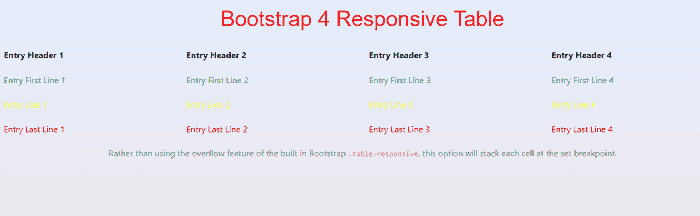
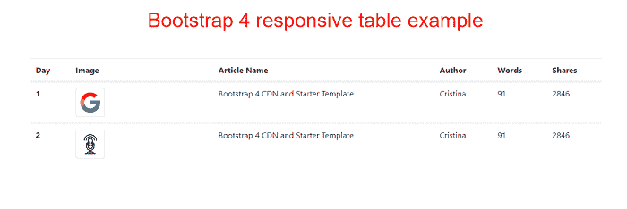
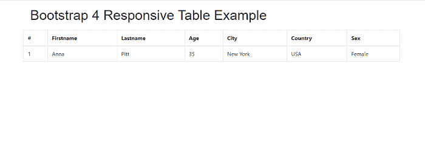
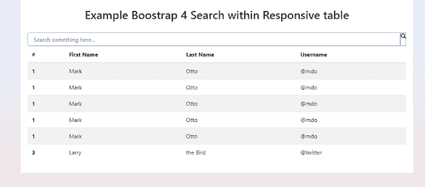

# Bootstrap4 响应表

> 原文：<https://www.javatpoint.com/bootstrap-4-responsive-table>

在本文中，我们将了解 Bootstrap 4 中的响应表。

### Bootstrap 4 响应表是什么意思？

表是行和列的组合。行代表水平方向，列代表垂直方向。在 bootstrap 4 中，响应表允许以简单的方式水平滚动表。责任表在所有设备中都能正常工作，因为它会根据设备的分辨率进行调整。

**我们举 Bootstrap 4 响应表的各种例子。**

### 例 1:

```

<! DOCTYPE html>    
<html lang="en">    
<head>    
  <title> Bootstrap 4  Responsive Table Example </title>    
  <meta charset="utf-8">    
  <meta name="viewport" content="width=device-width, initial-scale=1">    
  <link rel="stylesheet" href="https://maxcdn.bootstrapcdn.com/bootstrap/4.1.3/css/bootstrap.min.css">    
  <script src="https://ajax.googleapis.com/ajax/libs/jquery/3.3.1/jquery.min.js"> </script>    
  <script src="https://cdnjs.cloudflare.com/ajax/libs/popper.js/1.14.3/umd/popper.min.js"> </script>    
  <script src="https://maxcdn.bootstrapcdn.com/bootstrap/4.1.3/js/bootstrap.min.js"> </script>    
   <link href="https://maxcdn.bootstrapcdn.com/font-awesome/4.7.0/css/font-awesome.min.css" rel="stylesheet">    
</head>    
<style>
body {
    background-image: linear-gradient(to top, #f3e7e9 0%, #e3eeff 99%, #e3eeff 100%);
}
h1 {
  position: relative;
  padding: 10;
  margin: 10;
  font-family: "Raleway", sans-serif;
  font-weight: 300;
  font-size: 40px;
  color: red;
  -webkit-transition: all 0.4s ease 0s;
  -o-transition: all 0.4s ease 0s;
  transition: all 0.4s ease 0s;
}

@media screen and (max-width: 575px) {
.table-xs-responsive th {
    width: 100% !important;
    display: block !important;
    box-sizing: border-box;
}
.table-xs-responsive td {
    width: 100% !important;
    display: block !important;
    box-sizing: border-box;
}
}
@media screen and (max-width: 767px) {
.table.table-sm-responsive th {
    width: 100% !important;
    display: block !important;
    box-sizing: border-box;
}
.table.table-sm-responsive td {
    width: 100% !important;
    display: block !important;
    box-sizing: border-box;
}
}
@media screen and (max-width: 992px) {
.table.table-sm-responsive th {
    width: 100% !important;
    display: block !important;
    box-sizing: border-box;
}
.table.table-sm-responsive td {
    width: 100% !important;
    display: block !important;
    box-sizing: border-box;
}
}
@media screen and (max-width: 1200px) {
.table.table-sm-responsive th {
    width: 100% !important;
    display: block !important;
    box-sizing: border-box;
}
.table.table-sm-responsive td {
    width: 100% !important;
    display: block !important;
    box-sizing: border-box;
}
}
.info {
color: yellow;
}
.success {
    color: #00C851; 
}
.warning {
color: red;
}
</style>
<body>	
<table class="table table-xs-responsive table-hover" summary="An example of a responsive table using Bootstrap breakpoints." aria-role="table">
<h1 class="text-center"> Bootstrap 4 Responsive Table </h1>
<caption class="text-center">Rather than using the overflow feature of the built in Bootstrap <code>.table-responsive</code>, this option will stack each cell at the set breakpoint. </caption>
  <thead>  
  <tr>
    <th> Entry Header 1 </th>
    <th> Entry Header 2 </th>
    <th> Entry Header 3 </th>
    <th> Entry Header 4 </th>
  </tr>
  </thead>
  <tbody>
  <tr class="success">
    <td> Entry First Line 1 </td>
    <td> Entry First Line 2 </td>
    <td> Entry First Line 3 </td>
    <td> Entry First Line 4 </td>
  </tr>
  <tr class="info">
    <td> Entry Line 1 </td>
    <td> Entry Line 2 </td>
    <td> Entry Line 3 </td>
    <td> Entry Line 4 </td>
  </tr>
  <tr class="warning">
    <td> Entry Last Line 1 </td>
    <td> Entry Last Line 2 </td>
    <td> Entry Last Line 3 </td>
    <td> Entry Last Line 4 </td>
  </tr>
  </tbody>
</table>
</body>
</html>

```

**说明:**

在上面的示例中，我们使用创建了一个 bootstrap 4 响应表的示例。表响应类。

**输出:**

以下是该示例的输出:



### 例 2:

```

<! DOCTYPE html>    
<html lang="en">    
<head>    
  <title> Bootstrap 4 header Example </title>    
  <meta charset="utf-8">    
  <meta name="viewport" content="width=device-width, initial-scale=1">    
  <link rel="stylesheet" href="https://maxcdn.bootstrapcdn.com/bootstrap/4.1.3/css/bootstrap.min.css">    
  <script src="https://ajax.googleapis.com/ajax/libs/jquery/3.3.1/jquery.min.js"> </script>    
  <script src="https://cdnjs.cloudflare.com/ajax/libs/popper.js/1.14.3/umd/popper.min.js"> </script>    
  <script src="https://maxcdn.bootstrapcdn.com/bootstrap/4.1.3/js/bootstrap.min.js"> </script>    
   <link href="https://maxcdn.bootstrapcdn.com/font-awesome/4.7.0/css/font-awesome.min.css" rel="stylesheet">    
</head>    
<style>
.container {
  padding: 2rem 0rem;
}

h4 {
  margin: 2rem 0rem 1rem;
}

.table-image {
  td, th {
    vertical-align: middle;
  }
}
h1 {
  position: relative;
  padding: 10;
  margin: 10;
  font-family: "Raleway", sans-serif;
  font-weight: 300;
  font-size: 40px;
  color: red;
  -webkit-transition: all 0.4s ease 0s;
  -o-transition: all 0.4s ease 0s;
  transition: all 0.4s ease 0s;
  text-align: center;
}

</style>
<body>
<h1> Bootstrap 4 responsive table example </h1>
<div class="container">
  <div class="row">
    <div class="col-12">
		<table class="table table-image">
		  <thead>
		    <tr>
		      <th scope="col"> Day </th>
		      <th scope="col"> Image </th>
		      <th scope="col"> Article Name </th>
		      <th scope="col"> Author </th>
		      <th scope="col"> Words </th>
		      <th scope="col"> Shares </th>
		    </tr>
		  </thead>
		  <tbody>
		    <tr>
		      <th scope="row"> 1 </th>
		      <td class="w-25">
			      
		      </td>
		      <td> Bootstrap 4 CDN and Starter Template </td>
		      <td> Cristina </td>
		      <td> 91 </td>
		      <td> 2846 </td>
		    </tr>
		    <tr>
		      <th scope="row"> 2 </th>
		      <td class="w-25">
			      
		      </td>
		      <td> Bootstrap 4 CDN and Starter Template </td>
		      <td> Cristina </td>
		      <td> 91 </td>
		      <td> 2846 </td>
		    </tr>
		  </tbody>
		</table>   
    </div>	
  </div>
</div>
</body>
</html>

```

**说明:**

在上面的示例中，我们创建了一个 Bootstrap4 响应表的示例。

**输出:**

以下是该示例的输出:



### 例 3:

```

<! DOCTYPE html>
<html lang="en">
 <head>
<title> Bootstrap 4 Responsive Table Example </title>
 <meta charset="utf-8">
 <meta name="viewport" content="width=device-width, initial-scale=1"> 
 <link rel="stylesheet" href="https://stackpath.bootstrapcdn.com/bootstrap/4.3.1/css/bootstrap.min.css" integrity="sha384-ggOyR0iXCbMQv3Xipma34MD+dH/1fQ784/j6cY/iJTQUOhcWr7x9JvoRxT2MZw1T" crossorigin="anonymous">
        <script src="https://code.jquery.com/jquery-3.3.1.slim.min.js" integrity="sha384-q8i/X+965DzO0rT7abK41JStQIAqVgRVzpbzo5smXKp4YfRvH+8abtTE1Pi6jizo" crossorigin="anonymous"> </script>
        <script src="https://cdnjs.cloudflare.com/ajax/libs/popper.js/1.14.7/umd/popper.min.js" integrity="sha384-UO2eT0CpHqdSJQ6hJty5KVphtPhzWj9WO1clHTMGa3JDZwrnQq4sF86dIHNDz0W1" crossorigin="anonymous"> </script>
        <script src="https://stackpath.bootstrapcdn.com/bootstrap/4.3.1/js/bootstrap.min.js" integrity="sha384-JjSmVgyd0p3pXB1rRibZUAYoIIy6OrQ6VrjIEaFf/nJGzIxFDsf4x0xIM+B07jRM" crossorigin="anonymous"></script>
</head>
<style>
h2 {
  position: relative;
  padding: 10;
  margin: 10;
  font-family: "Raleway", sans-serif;
  font-weight: 300;
  font-size: 40px;c
  color: red;
  -webkit-transition: all 0.4s ease 0s;
  -o-transition: all 0.4s ease 0s;
  transition: all 0.4s ease 0s;
}
</style>
<body>
<div class="container">
  <h2> Bootstrap 4 Responsive Table Example </h2>                                                                                
    <div class="table-responsive">
    <table class="table table-bordered">
      <thead>
        <tr>
          <th>#</th>
          <th>Firstname</th>
          <th>Lastname</th>
          <th>Age</th>
          <th>City</th>
          <th>Country</th>
          <th>Sex</th>
                 </tr>
      </thead>
      <tbody>
        <tr>
          <td>1</td>
          <td>Anna</td>
          <td>Pitt</td>
          <td>35</td>
          <td>New York</td>
          <td>USA</td>
          <td>Female</td>
             </tr>
      </tbody>
    </table>
  </div>
</div>
</body>
</html>

```

**说明:**

在上面的例子中，我们创建了一个带有滚动条的 bootstrap 4 响应表的例子。

**输出:**

以下是该示例的输出:



### 例 4:

```

<! DOCTYPE html>    
<html lang="en">    
<head>    
  <title> Bootstrap 4 Responsive Table Example </title>    
  <meta charset="utf-8">    
  <meta name="viewport" content="width=device-width, initial-scale=1">    
  <link rel="stylesheet" href="https://maxcdn.bootstrapcdn.com/bootstrap/4.1.3/css/bootstrap.min.css">    
  <script src="https://ajax.googleapis.com/ajax/libs/jquery/3.3.1/jquery.min.js"> </script>    
  <script src="https://cdnjs.cloudflare.com/ajax/libs/popper.js/1.14.3/umd/popper.min.js"> </script>    
  <script src="https://maxcdn.bootstrapcdn.com/bootstrap/4.1.3/js/bootstrap.min.js"> </script>    
   <link href="https://maxcdn.bootstrapcdn.com/font-awesome/4.7.0/css/font-awesome.min.css" rel="stylesheet">    
</head>    
<style>
.hm-gradient {
    background-image: linear-gradient(to top, #f3e7e9 0%, #e3eeff 99%, #e3eeff 100%);
}
.darken-grey-text {
    color: #2E2E2E;
}
.input-group.md-form.form-sm.form-2 input {
    border: 1px solid #bdbdbd;
    border-top-left-radius: 0.25rem;
    border-bottom-left-radius: 0.25rem;
}
.input-group.md-form.form-sm.form-2 input.purple-border {
    border: 1px solid #9e9e9e;
}
.input-group.md-form.form-sm.form-2 input[type=text]:focus:not([readonly]).purple-border {
    border: 1px solid #ba68c8;
    box-shadow: none;
}
.form-2 .input-group-addon {
    border: 1px solid #ba68c8;
}
.danger-text {
    color: #ff3547; 
}  
.success-text {
    color: #00C851; 
}
.table-bordered.red-border, .table-bordered.red-border th, .table-bordered.red-border td {
    border: 1px solid #ff3547!important;
}        
.table.table-bordered th {
    text-align: center;
}
</style>
<body>	
<body class="hm-gradient">    
    <main>        
        <div class="container mt-4">         
            <div class="card mb-4">
                <div class="card-body">
                         <div class="row">
                        <div class="col-md-12">
                            <h2 class="pt-3 pb-4 text-center font-bold font-up deep-purple-text"> Example Boostrap 4 Search within Responsive table </h2>
                            <div class="input-group md-form form-sm form-2 pl-0">
                                <input class="form-control my-0 py-1 pl-3 purple-border" type="text" placeholder="Search something here..." aria-label="Search">
                                <span class="input-group-addon waves-effect purple lighten-2" id="basic-addon1"><a><i class="fa fa-search white-text" aria-hidden="true"> </i> </a> </span>
                            </div>
                        </div>
                    </div>
                    <table class="table table-striped">
                        <thead>
                            <tr>
                                <th> # </th>
                                <th> First Name </th>
                                <th> Last Name </th>
                                <th> Username </th>
                            </tr>
                        </thead>
                             <tbody>
                            <tr>
                                <th scope="row">1 </th>
                                <td> Mark </td>
                                <td> Otto </td>
                                <td> @mdo </td>
                            </tr>
                            <tr>
                                <th scope="row">1 </th>
                                <td> Mark </td>
                                <td> Otto </td>
                                <td> @mdo </td>
                            </tr>
                            <tr>
                                <th scope="row">1 </th>
                                <td> Mark </td>
                                <td> Otto </td>
                                <td> @mdo </td>
                            </tr>
                            <tr>
                                <th scope="row">1 </th>
                                <td> Mark </td>
                                <td> Otto </td>
                                <td> @mdo </td>
                            </tr>
                             <tr>
                                <th scope="row">1 </th>
                                <td> Mark </td>
                                <td> Otto </td>
                                <td> @mdo </td>
                            </tr>
                            <tr>
                                <th scope="row">3</th>
                                <td> Larry </td>
                                <td> the Bird </td>
                                <td> @twitter </td>
                            </tr>
                        </tbody>
                    </table>
                </div>
            </div>                        
        </div>     
    </main> 
</body>
</body>
</html>

```

**说明:**

在上面的示例中，我们创建了一个带有搜索选项的 bootstrap 4 响应表的示例。

**输出:**

以下是该示例的输出:



* * *