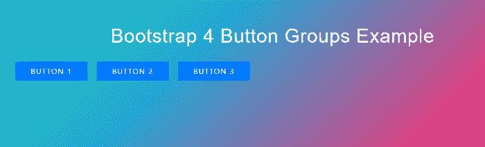
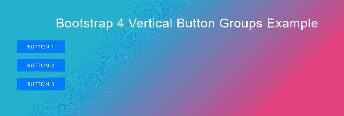
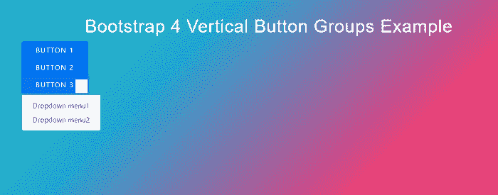
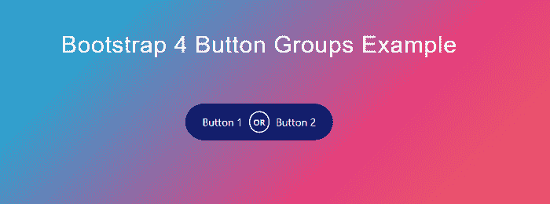

# Bootstrap4 按钮组

> 原文：<https://www.javatpoint.com/bootstrap-4-button-groups>

在本文中，我们将详细了解 Bootstrap 4 按钮组。

### Bootstrap 4 中的按钮组是什么意思？

在 Bootstrap 4 中，按钮组允许在一行中将多个按钮组合在一起。当您想要将对齐按钮等项目放在一起时，这很有用。

**我们举Bootstrap4 个按钮组的各种例子。**

### 例 1:

```

<! DOCTYPE html>
<html lang="en">
<head>
  <title> Bootstrap 4 Button Groups Example </title>
  <meta charset="utf-8">
  <meta name="viewport" content="width=device-width, initial-scale=1">
  <link rel="stylesheet" href="https://maxcdn.bootstrapcdn.com/bootstrap/4.5.2/css/bootstrap.min.css">
  <script src="https://ajax.googleapis.com/ajax/libs/jquery/3.5.1/jquery.min.js"> </script>
  <script src="https://cdnjs.cloudflare.com/ajax/libs/popper.js/1.16.0/umd/popper.min.js"> </script>
  <script src="https://maxcdn.bootstrapcdn.com/bootstrap/4.5.2/js/bootstrap.min.js"> </script>
</head>
<style>  
h2 {  
  position: relative;  
  padding: 10;  
  margin: 10;  
  font-size: 2.5em;
  padding: 70px 0 0 0;
  color: white;
  font-weight: 300;
  letter-spacing: 1px;
  font-family: "Raleway", sans-serif;  
  font-weight: 300;    
  text-align: center;  
  -webkit-transition: all 0.4s ease 0s;  
  -o-transition: all 0.4s ease 0s;  
  transition: all 0.4s ease 0s;  
}  
button {
  display: inline-flex;
  height: 40px;
  width: 150px;
  border: 2px solid #BFC0C0;
  margin: 20px 20px 20px 20px;
  color: #BFC0C0;
  text-transform: uppercase;
  text-decoration: none;
  font-size: .8em;
  letter-spacing: 1.5px;
  align-items: center;
  justify-content: center;
  overflow: hidden;
}
button:hover {
  color: #3498db;
}
button::after {
  content: "";
  background: #ecf0f1;
  position: absolute;
  z-index: -1;
  padding: 0.85em 0.75em;
  display: block;
}
body {  
    background-size: 400% 400%;  
           margin: 2rem;  
background: linear-gradient(-45deg, #ee7752, #e73c7e, #23a6d5, #23d5ab);  
    animation: gradient 15s ease infinite;  
    height: 100vh;  
	color: black;
}  
@keyframes gradient {  
    0% {  
        background-position: 0% 50%;  
    }  
    50% {  
        background-position: 100% 50%;  
    }  
    100% {  
        background-position: 0% 50%;  
    }  
} 
</style> 
<body>
<div class="container">
  <h2> Bootstrap 4 Button Groups Example </h2>
 <div class="btn-group">
    <button type="button" class="btn btn-primary"> Button 1 </button>
    <button type="button" class="btn btn-primary"> Button 2 </button>
    <button type="button" class="btn btn-primary"> Button 3 </button>
  </div>
</div>
</body>
</html>

```

**说明:**

在上面的示例中，我们创建了一个按钮组示例。为此，我们使用了一个. btn 组类来创建一个按钮组。

**输出:**

以下是该示例的输出:



### 例 2:

```

<! DOCTYPE html>
<html lang="en">
<head>
  <title> Bootstrap 4 vertical Button Groups Example </title>
  <meta charset="utf-8">
  <meta name="viewport" content="width=device-width, initial-scale=1">
  <link rel="stylesheet" href="https://maxcdn.bootstrapcdn.com/bootstrap/4.5.2/css/bootstrap.min.css">
  <script src="https://ajax.googleapis.com/ajax/libs/jquery/3.5.1/jquery.min.js"> </script>
  <script src="https://cdnjs.cloudflare.com/ajax/libs/popper.js/1.16.0/umd/popper.min.js"> </script>
  <script src="https://maxcdn.bootstrapcdn.com/bootstrap/4.5.2/js/bootstrap.min.js"> </script>
</head>
<style>  
h2 {  
  position: relative;  
  padding: 10;  
  margin: 10;  
  font-size: 2.5em;
  padding: 70px 0 0 0;
  color: white;
  font-weight: 300;
  letter-spacing: 1px;
  font-family: "Raleway", sans-serif;  
  font-weight: 300;    
  text-align: center;  
  -webkit-transition: all 0.4s ease 0s;  
  -o-transition: all 0.4s ease 0s;  
  transition: all 0.4s ease 0s;  
}  
button {
  display: inline-flex;
  height: 40px;
  width: 150px;
  border: 2px solid #BFC0C0;
  margin: 20px 20px 20px 20px;
  color: #BFC0C0;
  text-transform: uppercase;
  text-decoration: none;
  font-size: .8em;
  letter-spacing: 1.5px;
  align-items: center;
  justify-content: center;
  overflow: hidden;
}
button:hover {
  color: #3498db;
}
button::after {
  content: "";
  background: #ecf0f1;
  position: absolute;
  z-index: -1;
  padding: 0.85em 0.75em;
  display: block;
}
body {  
    background-size: 400% 400%;  
           margin: 2rem;  
background: linear-gradient(-45deg, #ee7752, #e73c7e, #23a6d5, #23d5ab);  
    animation: gradient 15s ease infinite;  
    height: 100vh;  
	color: black;
}  
@keyframes gradient {  
    0% {  
        background-position: 0% 50%;  
    }  
    50% {  
        background-position: 100% 50%;  
    }  
    100% {  
        background-position: 0% 50%;  
    }  
} 
</style> 
<body>
<div class="container">
  <h2> Bootstrap 4 Vertical Button Groups Example </h2>
  <div class="btn-group-vertical">
    <button type="button" class="btn btn-primary"> Button 1 </button>
    <button type="button" class="btn btn-primary"> Button 2 </button>
    <button type="button" class="btn btn-primary"> Button 3 </button>
  </div>
</div>
</body>
</html>

```

**说明:**

在上面的例子中，我们创建了一个垂直输入按钮组的例子。为此，我们使用了一个. btn-group- vertical 类来创建一个垂直的按钮组。

**输出:**

以下是该示例的输出:



### 例 3:

```

<! DOCTYPE html>
<html lang="en">
<head>
  <title> Bootstrap 4 Button Groups Example </title>
  <meta charset="utf-8">
  <meta name="viewport" content="width=device-width, initial-scale=1">
  <link rel="stylesheet" href="https://maxcdn.bootstrapcdn.com/bootstrap/4.5.2/css/bootstrap.min.css">
  <script src="https://ajax.googleapis.com/ajax/libs/jquery/3.5.1/jquery.min.js"> </script>
  <script src="https://cdnjs.cloudflare.com/ajax/libs/popper.js/1.16.0/umd/popper.min.js"> </script>
  <script src="https://maxcdn.bootstrapcdn.com/bootstrap/4.5.2/js/bootstrap.min.js"> </script>
</head>
<style>  
h2 {  
  position: relative;  
  padding: 10;  
  margin: 10;  
  font-size: 2.5em;
  padding: 70px 0 0 0;
  color: white;
  font-weight: 300;
  letter-spacing: 1px;
  font-family: "Raleway", sans-serif;  
  font-weight: 300;    
  text-align: center;  
  -webkit-transition: all 0.4s ease 0s;  
  -o-transition: all 0.4s ease 0s;  
  transition: all 0.4s ease 0s;  
}  
button {
  display: inline-flex;
  height: 40px;
  width: 150px;
  border: 2px solid #BFC0C0;
  color: #BFC0C0;
  text-transform: uppercase;
  text-decoration: none;
  font-size: .8em;
  letter-spacing: 1.5px;
  align-items: center;
  justify-content: center;
  overflow: hidden;
}
button:hover {
  color: #3498db;
}
button::after {
  content: "";
  background: #ecf0f1;
  position: absolute;
  z-index: -1;
  padding: 0.85em 0.75em;
  display: block;
}
body {  
    background-size: 400% 400%;  
           margin: 2rem;  
background: linear-gradient(-45deg, #ee7752, #e73c7e, #23a6d5, #23d5ab);  
    animation: gradient 15s ease infinite;  
    height: 100vh;  
	color: black;
}  
@keyframes gradient {  
    0% {  
        background-position: 0% 50%;  
    }  
    50% {  
        background-position: 100% 50%;  
    }  
    100% {  
        background-position: 0% 50%;  
    }  
} 
</style> 
<body>
<div class="container">
  <h2> Bootstrap 4 Vertical Button Groups Example </h2>
 <div class="btn-group-vertical">
  <button type="button" class="btn btn-primary"> Button 1 </button>
  <button type="button" class="btn btn-primary"> Button 2 </button>
  <div class="btn-group">
    <button type="button" class="btn btn-primary dropdown-toggle" data-toggle="dropdown">
    Button 3
    </button>
    <div class="dropdown-menu">
      <a class="dropdown-item" href="#"> Dropdown menu1 </a>
      <a class="dropdown-item" href="#"> Dropdown menu2 </a>
    </div>
  </div>
</div>
</div>
</body>
</html>

```

**说明:**

在上面的示例中，我们创建了一个按钮组示例。为此，我们使用了一个. btn-group 类来创建一个按钮组。

**输出:**

以下是该示例的输出:



### 例 4:

```

<! DOCTYPE html>
<html lang="en">
<head>
  <title> Bootstrap 4 Button Groups Example </title>
  <meta charset="utf-8">
  <meta name="viewport" content="width=device-width, initial-scale=1">
  <link rel="stylesheet" href="https://maxcdn.bootstrapcdn.com/bootstrap/4.5.2/css/bootstrap.min.css">
  <script src="https://ajax.googleapis.com/ajax/libs/jquery/3.5.1/jquery.min.js"> </script>
  <script src="https://cdnjs.cloudflare.com/ajax/libs/popper.js/1.16.0/umd/popper.min.js"> </script>
  <script src="https://maxcdn.bootstrapcdn.com/bootstrap/4.5.2/js/bootstrap.min.js"> </script>
</head>
<style>  
h2 {  
  position: relative;  
  padding: 10;  
  margin: 10;  
  font-size: 2.5em;
  padding: 70px 0 0 0;
  color: white;
  font-weight: 300;
  letter-spacing: 1px;
  font-family: "Raleway", sans-serif;  
  font-weight: 300;    
  text-align: center;  
  -webkit-transition: all 0.4s ease 0s;  
  -o-transition: all 0.4s ease 0s;  
  transition: all 0.4s ease 0s;  
}  
button {
  display: inline-flex;
  height: 40px;
  width: 150px;
  border: 2px solid #BFC0C0;
  color: #BFC0C0;
  text-transform: uppercase;
  text-decoration: none;
  font-size: .8em;
  letter-spacing: 1.5px;
  align-items: center;
  justify-content: center;
  overflow: hidden;
}
body {  
    background-size: 400% 400%;  
           margin: 2rem;  
background: linear-gradient(-45deg, #ee7752, #e73c7e, #23a6d5, #23d5ab);  
    animation: gradient 15s ease infinite;  
    height: 100vh;  
	color: black;
}  
@keyframes gradient {  
    0% {  
        background-position: 0% 50%;  
    }  
    50% {  
        background-position: 100% 50%;  
    }  
    100% {  
        background-position: 0% 50%;  
    }  
} 
body,
html {
  height: 100%;
}
.main {
  width: 100%;
  height: 100%;
  position: relative;
  color: #111e6c;
  transition: all 1s ease;
  padding-top: 70px;
}
.main:before {
  bottom: 0;
  left: 0;
  right: 0;
  top: 0;
  position: absolute;
  content: "";
  width: 100%;
  height: 100%;
  opacity: 0.2;
  filter: alpha(opacity=90);
}
.main-text {
  top: 20%;
  left: auto;
  right: auto;
  position: relative;
  color: #111e6c;
}
.btn-circle
{
  border-radius: 50%;
  background: #111e6c;
  padding: 6px;
  font-size: 14px;
  box-shadow: 0 2px 5px 0 rgba(0, 0, 0, 0.16), 0 2px 10px 0 rgba(0, 0, 0, 0.12);
  color: #fff;
  text-align: center;
  font-weight: 600;
  text-transform: uppercase;
}
.btn-lg {
  padding: 18px 28px;
  font-size: 18px;
  line-height: 1.3333333;
  border-radius: 50px;
}
.c2a-btn {
  margin: 48px auto 0;
  margin: 4.8rem auto 0;
}
.btn-default {
  color: #fff;
  background-color: #111e6c;
  border-color: #111e6c;
  transition: all 1s ease;
}
.btn-group-lg > .btn
{
  padding: 18px 28px;
  font-size: 18px;
  line-height: 1.3333333;
  border-radius: 50px;
}
.btn-lg {
  padding: 18px 28px;
  font-size: 18px;
  line-height: 1.3333333;
  border-radius: 50px;
}
.btn-group .btn-or {
  top: 50%;
  left: 50%;
  position: absolute;
  -webkit-transform: translate(-50%, -50%);
  -ms-transform: translate(-50%, -50%);
  transform: translate(-50%, -50%);
  z-index: 99;
  box-shadow: 0;
  border: 2px solid #fff;
}
</style> 
<body>
<div class="container-fluid main">
  <div class="text-center main-text">
     <h2> Bootstrap 4 Button Groups Example </h2>
    <div class="c2a-btn footer-c2a-btn">
      <div class="btn-group btn-group-lg" role="group" aria-label="Call to action">
        <a type="button" class="btn btn-default btn-lg" href="#"> Button 1 </a>
        <span class="btn-circle btn-or">or</span>
        <a type="button" class="btn btn-default btn-lg" href="#"> Button 2 </a>
      </div>
    </div>
  </div>
</div>
</body>
</html>

```

**说明:**

在上面的示例中，我们创建了一个按钮组示例。为此，我们使用了一个. btn 组类来创建一个按钮组。

**输出:**

以下是该示例的输出:



* * *