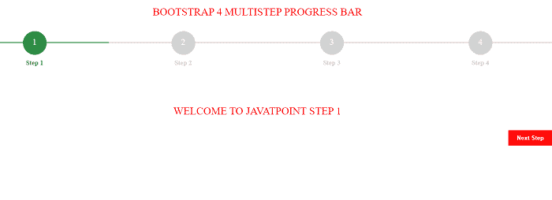
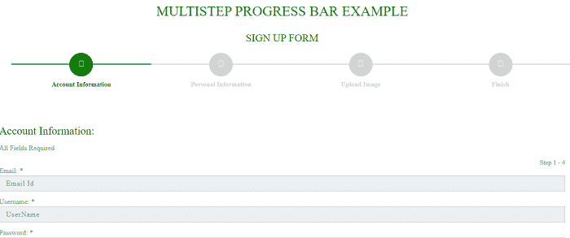
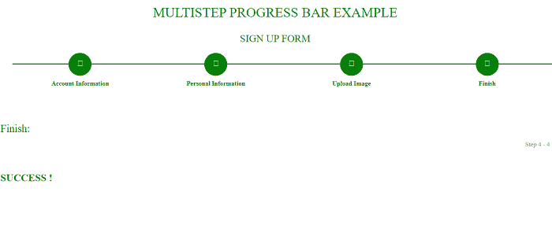

# 引导程序 4 中的多步进度条

> 原文：<https://www.javatpoint.com/multi-step-progress-bar-bootstrap-4>

在本文中，我们将借助 Bootstrap 4 和 jquery 创建一个多步进度条。

**bootstrap 4 中的多步进度条是什么意思？**

在 Bootstrap 4 中，一种多步骤表单，其中长表单被分解为多个步骤，进度条用于检查已完成的工作量。

**我们来看一下 bootstrap 4 中多步进度条的各种例子。**

### 例 1:

```

<! DOCTYPE html>
<html>
<head>
<title> Multistep Progress bar Bootstrap 4 Example </title>  
  <meta charset="utf-8">  
  <meta name="viewport" content="width=device-width, initial-scale=1">
	<link href=
'https://stackpath.bootstrapcdn.com/bootstrap/4.3.1/css/bootstrap.min.css'>
	<script src='https://stackpath.bootstrapcdn.com/bootstrap/4.3.1/js/bootstrap.bundle.min.js'>
	</script>
	<script src=
'https://cdnjs.cloudflare.com/ajax/libs/jquery/3.2.1/jquery.min.js'>
	</script>
</head>
<style>
html {
	height: 100%
}
#form {
	text-align: center;
	position: relative;
	margin-top: 20px
}
#form fieldset {
	background: white;
	border: 0 none;
	border-radius: 0.5rem;
	box-sizing: border-box;
	width: 100%;
	margin: 0;
	padding-bottom: 20px;
	position: relative
}
.finish {
	text-align: center
}
#form fieldset:not(:first-of-type) {
	display: none
}
#form .pre-step {
	width: 100px;
	font-weight: bold;
	color: white;
	border: 0 none;
	border-radius: 0px;
	cursor: pointer;
	padding: 10px 5px;
	margin: 10px 5px 10px 0px;
	float: right
}
.next-step {
	width: 100px;
	font-weight: bold;
	color: white;
	border: 0 none;
	border-radius: 0px;
	cursor: pointer;
	padding: 10px 5px;
	margin: 10px 5px 10px 0px;
	float: right
}
.form, .pre-step {
	background: #616161;
}
.form, .next-step {
	background: red;
}
#form .pre-step:hover
{
	background-color: #000000
}
#form .pre-step:focus {
	background-color: #000000
}
#form .next-step:hover
{
	background-color: #2F8D46
}
#form .next-step:focus {
	background-color: #2F8D46
}
.text {
	color: red;
	font-weight: normal
}
#progressbar {
	margin-bottom: 30px;
	overflow: hidden;
	color: lightgrey
}
#progressbar .active {
	color: #2F8D46
}
#progressbar li {
	list-style-type: none;
	font-size: 15px;
	width: 25%;
	float: left;
	position: relative;
	font-weight: 400
}
#progressbar #step1:before {
	content: "1"
}
#progressbar #step2:before {
	content: "2"
}
#progressbar #step3:before {
	content: "3"
}
#progressbar #step4:before {
	content: "4"
}
#progressbar li:before {
	width: 50px;
	height: 50px;
	line-height: 45px;
	display: block;
	font-size: 20px;
	color: #ffffff;
	background: lightgray;
	border-radius: 50%;
	margin: 0 auto 10px auto;
	padding: 2px
}
#progressbar li:after {
	content: '';
	width: 100%;
	height: 2px;
	background: lightgray;
	position: absolute;
	left: 0;
	top: 25px;
	z-index: -1
}
#progressbar li.active:before
{
	background: #2F8D46
}
#progressbar li.active:after {
	background: #2F8D46
}
#progressbar li.active:after {
	background: #2F8D46
}
h2 {
text-transform: uppercase;
   font-weight: normal;
text-align: center;
 margin: 10;
   padding: 10
color: red;
}
.progress {
	height: 20px
}
.pbar {
	background-color: #2F8D46
}
</style>
<body>
	<div class="container">
	<h2> Bootstrap 4 Multistep Progress Bar </h2>
		<div class="row justify-content-center">
			<div class="col-11 col-sm-9 col-md-7
				col-lg-6 col-xl-5 text-center p-0 mt-3 mb-2">
				<div class="px-0 pt-4 pb-0 mt-3 mb-3">
					<form id="form">
					<ul id="progressbar">
					<li class="active" id="step1">
					<strong> Step 1 </strong>
					</li>
					<li id="step2"> <strong> Step 2 </strong> </li>
					<li id="step3"> <strong> Step 3 </strong> </li>
					<li id="step4"> <strong> Step 4 </strong> </li>
						</ul>
				<div class="progress">
				<div class="pbar"> </div>
					</div> <br>
					<fieldset>
					<h2> Welcome to JavaTpoint Step 1 </h2>
<input type="button" name="next-step" class="next-step" value="Next Step" />
				</fieldset>
				<fieldset>
		<h2> Welcome To JavaTpoint Step 2 </h2>
	<input type="button" name="next-step" class="next-step" value="Next Step" />
	<input type="button" name="pre-step" class="pre-step"
	value="Pre Step" />
			</fieldset>
			<fieldset>
			<h2> Welcome To JavaTpoint Step 3 </h2> <input type="button" name="next-step" class="next-step" value="Final Step" />
	<input type="button" name="pre-step" class="pre-step"
	value="Pre Step" />
		</fieldset>
		<fieldset>
		<div class="finish">
		<h2 class="text text-center">
		<strong> FINISHED </strong>
			</h2>
	    </div>
	<input type="button" name="pre-step"
					class="pre-step"
					value="Pre Step" />
					</fieldset>
					</form>
				</div>
			</div>
		</div>
	</div>
<script>
$(document).ready(function () {
	var currentGfgStep, nextGfgStep, preGfgStep;
	var opacity;
	var current = 1;
	var steps = $("fieldset").length;
	setProgressBar(current);
	$(".next-step").click(function () {
		currentGfgStep = $(this).parent();
		nextGfgStep = $(this).parent().next();
		$("#progressbar li").eq($("fieldset")
			.index(nextGfgStep)).addClass("active");
		nextGfgStep.show();
		currentGfgStep.animate({ opacity: 0 }, {
			step: function (now) {
				opacity = 1 - now;
				currentGfgStep.css({
					'display': 'none',
					'position': 'relative'
				});
				nextGfgStep.css({ 'opacity': opacity });
			},
			duration: 500
		});
		setProgressBar(++current);
	});
	$(".pre-step").click(function () {
		currentGfgStep = $(this).parent();
		preGfgStep = $(this).parent().prev();
		$("#progressbar li").eq($("fieldset")
		.index(currentGfgStep)).removeClass("active");
		preGfgStep.show();
		currentGfgStep.animate({ opacity: 0 }, {
			step: function (now) {
				opacity = 1 - now;
				currentGfgStep.css({
					'display': 'none',
					'position': 'relative'
				});
				preGfgStep.css({ 'opacity': opacity });
			},
			duration: 500
		});
		setProgressBar(--current);
	});
	function setProgressBar(currentStep) {
		var percent = parseFloat(100 / steps) * current;
		percent = percent.toFixed();
		$(".pbar")
			.css("width", percent + "%")
	}
	$(".submit").click(function () {
		return false;
	})
});
</script>
</body>
</html>

```

**说明:**

在上面的例子中，我们在 bootstrap 4 和 jQuery 的帮助下创建了一个多步骤进度条。

**输出:**

以下是该示例的输出:



### 例 2:

```

<! DOCTYPE html>
<html>
<head>
<title> Multistep Progress bar Bootstrap 4 Example </title>  
  <meta charset="utf-8">  
  <meta name="viewport" content="width=device-width, initial-scale=1">
	<link href=
'https://stackpath.bootstrapcdn.com/bootstrap/4.3.1/css/bootstrap.min.css'>
	<script src=
'https://stackpath.bootstrapcdn.com/bootstrap/4.3.1/js/bootstrap.bundle.min.js'>
	</script>
	<script src=
'https://cdnjs.cloudflare.com/ajax/libs/jquery/3.2.1/jquery.min.js'>
	</script>
	</head>
<style>

html {
    height: 100%
}
p {
    color: grey
}
h1 {
text-transform: uppercase;
    color: green;
    font-weight: normal;
	text-align: center;
	 margin: 10;
    padding: 10
}
#heading {
    text-transform: uppercase;
    color: green;
    font-weight: normal
}
#msform {
    text-align: center;
    position: relative;
    margin-top: 20px
}
#msform fieldset {
    background: white;
    border: 0 none;
    border-radius: 0.5rem;
    box-sizing: border-box;
    width: 100%;
    margin: 0;
    padding-bottom: 20px;
    position: relative
}
.form-card {
    text-align: left
}
#msform fieldset:not(:first-of-type) {
    display: none
}
#msform input
 {
    padding: 8px 15px 8px 15px;
    border: 1px solid #ccc;
    border-radius: 0px;
    margin-bottom: 15px;
    margin-top: 2px;
    width: 100%;
    box-sizing: border-box;
    font-family: montserrat;
    color: #2C3E50;
    background-color: #ECEFF1;
    font-size: 16px;
    letter-spacing: 1px
}
#msform textarea {
    padding: 8px 15px 8px 15px;
    border: 1px solid #ccc;
    border-radius: 0px;
    margin-bottom: 15px;
    margin-top: 2px;
    width: 100%;
    box-sizing: border-box;
    font-family: montserrat;
    color: #2C3E50;
    background-color: #ECEFF1;
    font-size: 16px;
    letter-spacing: 1px
}
#msform input:focus
{
    -moz-box-shadow: none !important;
    -webkit-box-shadow: none !important;
    box-shadow: none !important;
    border: 1px solid green;
    outline-width: 0
}
#msform textarea:focus {
    -moz-box-shadow: none !important;
    -webkit-box-shadow: none !important;
    box-shadow: none !important;
    border: 1px solid green;
    outline-width: 0
}
#msform .action-button {
    width: 100px;
    background: green;
    font-weight: bold;
    color: white;
    border: 0 none;
    border-radius: 0px;
    cursor: pointer;
    padding: 10px 5px;
    margin: 10px 0px 10px 5px;
    float: right
}
#msform .action-button:hover
{
    background-color: #311B92
}
#msform .action-button:focus {
    background-color: #311B92
}
#msform .action-button-pre {
    width: 100px;
    background: #616161;
    font-weight: bold;
    color: white;
    border: 0 none;
    border-radius: 0px;
    cursor: pointer;
    padding: 10px 5px;
    margin: 10px 5px 10px 0px;
    float: right
}
#msform .action-button-pre:hover
{
    background-color: #000000
}
#msform .action-button-pre:focus {
    background-color: #000000
}
.card {
    z-index: 0;
    border: none;
    position: relative
}
.fs-title {
    font-size: 25px;
    color: green;
    margin-bottom: 15px;
    font-weight: normal;
    text-align: left
}
.purple-text {
    color: green;
    font-weight: normal
}
.steps {
    font-size: 15px;
    color: gray;
    margin-bottom: 1px;
    font-weight: normal;
    text-align: right
}
.fieldlabels {
    color: gray;
    text-align: left
}
#progressbar {
    margin-bottom: 20px;
    overflow: hidden;
    color: lightgrey
}
#progressbar .active {
    color: green
}
#progressbar li {
    list-style-type: none;
    font-size: 15px;
    width: 25%;
    float: left;
    position: relative;
    font-weight: 400
}
#progressbar #account:before {
    font-family: FontAwesome;
    content: "\f13e"
}
#progressbar #personal:before {
    font-family: FontAwesome;
    content: "\f007"
}
#progressbar #payment:before {
    font-family: FontAwesome;
    content: "\f030"
}

#progressbar #confirm:before {
    font-family: FontAwesome;
    content: "\f00c"
}
#progressbar li:before {
    width: 50px;
    height: 50px;
    line-height: 45px;
    display: block;
    font-size: 20px;
    color: #ffffff;
    background: lightgray;
    border-radius: 50%;
    margin: 0 auto 10px auto;
    padding: 2px
}

#progressbar li:after {
    content: '';
    width: 100%;
    height: 2px;
    background: lightgray;
    position: absolute;
    left: 0;
    top: 25px;
    z-index: -1
}
#progressbar li.active:before
{
    background: green
}
#progressbar li.active:after {
    background: green
}
.progress {
    height: 20px
}

.pbar {
    background-color: green
}
.fit-image {
    width: 100%;
    object-fit: cover
}
</style>
<body>
<div class="container-fluid">
<h1> Multistep progress Bar example </h1>
    <div class="row justify-content-center">
        <div class="col-11 col-sm-9 col-md-7 col-lg-6 col-xl-5 text-center p-0 mt-3 mb-2">
            <div class="card px-0 pt-4 pb-0 mt-3 mb-3"
                <form id="msform">
				 <h2 id="heading"> Sign Up Form </h2>
                    <ul id="progressbar">
                        <li class="active" id="account"><strong> Account Information </strong></li>
                        <li id="personal"><strong> Personal Information </strong></li>
                        <li id="payment"><strong> Upload Image </strong></li>
                        <li id="confirm"><strong> Finish </strong></li>
                    </ul>
                    <div class="progress">
                        <div class="pbar pbar-striped pbar-animated" role="progressbar" aria-valuemin="0" aria-valuemax="100"> </div>
                    </div> <br> 
                    <fieldset>
                        <div class="form-card">
                            <div class="row">
                                <div class="col-7">
                                    <h2 class="fs-title"> Account Information: </h2>
		<p> All Fields Required </p>
                                </div>
                                <div class="col-5">
                                    <h2 class="steps"> Step 1 - 4 </h2>
                                </div>
                            </div> <label class="fieldlabels"> Email: * </label> <input type="email" name="email" placeholder="Email Id" /> 
							<label class="fieldlabels"> Username: * </label> <input type="text" name="uname" placeholder="UserName" /> 
							<label class="fieldlabels"> Password: * </label> <input type="password" name="pwd" placeholder="Password" /> 
							<label class="fieldlabels"> Confirm Password: * </label> <input type="password" name="cpwd" placeholder="Confirm Password" />
                        </div> <input type="button" name="next" class="next action-button" value="Next" />
                    </fieldset>
                    <fieldset>
                        <div class="form-card">
                            <div class="row">
                                <div class="col-7">
                                    <h2 class="fs-title"> Personal Information: </h2>
                                </div>
                                <div class="col-5">
                                    <h2 class="steps"> Step 2 - 4 </h2>
                                </div>
                            </div> <label class="fieldlabels"> First Name: * </label> <input type="text" name="fname" placeholder="First Name" />
							<label class="fieldlabels"> Last Name: * </label> <input type="text" name="lname" placeholder="Last Name" /> 
							<label class="fieldlabels"> Contact No.: * </label> <input type="text" name="phno" placeholder="Contact No." /> 
							<label class="fieldlabels"> Alternate Contact No.: * </label> <input type="text" name="phno_2" placeholder="Alternate Contact No." />
                        </div> <input type="button" name="next" class="next action-button" value="Next" /> <input type="button" name="pre" class="pre action-button-pre" value="Pre" />
                    </fieldset>
                    <fieldset>
                        <div class="form-card">
                            <div class="row">
                                <div class="col-7">
                                    <h2 class="fs-title"> Image Upload: </h2>
                                </div>
                                <div class="col-5">
                                    <h2 class="steps"> Step 3 - 4 </h2>
                                </div>
                            </div> <label class="fieldlabels"> Upload Your Photo: </label> <input type="file" name="pic" accept="image/*"> 
		<label class="fieldlabels"> Upload Signature Photo: </label> <input type="file" name="pic" accept="image/*">
                        </div> <input type="button" name="next" class="next action-button" value="Submit" /> <input type="button" name="pre" class="pre action-button-pre" value="Pre" />
                    </fieldset>
                    <fieldset>
                        <div class="form-card">
                            <div class="row">
                                <div class="col-7">
                                    <h2 class="fs-title"> Finish: </h2>
                                </div>
                                <div class="col-5">
                                    <h2 class="steps"> Step 4 - 4 </h2>
                                </div>
                            </div> <br> <br>
                            <h2 class="purple-text text-center"><strong> SUCCESS ! </strong></h2> <br>
                            <div class="row justify-content-center">
                                <div class="col-3">  </div>
                            </div> <br><br>
                            <div class="row justify-content-center">
                                <div class="col-7 text-center">
                                    <h5 class="purple-text text-center"> You Have Successfully Signed Up </h5>
                                </div>
                            </div>
                        </div>
                    </fieldset>
                </form>
            </div>
        </div>
    </div>
</div>
<script>
$(document).ready(function() {
var current_fs, next_fs, pre_fs; 
var opacity;
var current = 1;
var steps = $("fieldset").length;
setProgressBar(current);
$(".next").click(function() {
current_fs = $(this).parent();
next_fs = $(this).parent().next();
$("#progressbar li").eq($("fieldset").index(next_fs)).addClass("active");
next_fs.show();
current_fs.animate({opacity: 0}, {
step: function(now) {
opacity = 1 - now;
current_fs.css({
'display': 'none',
'position': 'relative'
});
next_fs.css({'opacity': opacity});
},
duration: 500
});
setProgressBar(++current);
});
$(".pre").click(function() {
current_fs = $(this).parent();
pre_fs = $(this).parent().prev();
$("#progressbar li").eq($("fieldset").index(current_fs)).removeClass("active");
pre_fs.show();
current_fs.animate({opacity: 0}, {
step: function(now) {
opacity = 1 - now;
current_fs.css({
'display': 'none',
'position': 'relative'
});
pre_fs.css({'opacity': opacity});
},
duration: 500
});
setProgressBar(--current);
});
function setProgressBar(curStep) {
var percent = parseFloat(100 / steps) * curStep;
percent = percent.toFixed();
$(".pbar")
.css("width",percent+"%")
}
$(".submit").click(function() {
return false;
})
});
</script>
</body>
</html>

```

在上面的例子中，我们在 bootstrap 4 和 jQuery 的帮助下创建了一个多步骤进度条。

**输出:**

以下是该示例的输出:



完成所有步骤后，将显示成功消息。



* * *