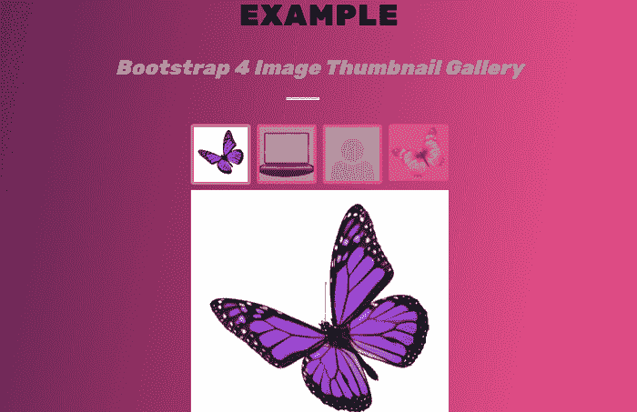

# 引导 4 图像缩略图

> 原文：<https://www.javatpoint.com/bootstrap-4-image-thumbnail>

在本文中，我们将了解如何在 Bootstrap 4 中创建图像缩略图。

### 你说的图像缩略图是什么意思？

在 Bootstrap 4 中，图像缩略图是由图像包围的边界。

若要创建此图像缩略图，可以使用。缩略图类。

**以下是图像缩略图的语法。**

### 语法:

```


```

**在上面的语法中，**

*   **img** 是用于在 html 中添加图像的标签。
*   **Src** 是图像的来源。
*   **Alt** 用于给出图像的替代名称，代替不加载图像。
*   **img-缩略图**是用于在图像中添加缩略图的类。

**我们来看一下 bootstrap 4 中图像缩略图的各种例子。**

### 例 1:

```

<! DOCTYPE html>          
<html lang="en">          
<head>          
  <title> Bootstrap 4 Image thumbnail Example </title>          
  <meta charset="utf-8">          
  <meta name="viewport" content="width=device-width, initial-scale=1">          
  <link rel="stylesheet" href="https://maxcdn.bootstrapcdn.com/bootstrap/4.0.0-alpha.6/css/bootstrap.min.css">          
  <script src="https://ajax.googleapis.com/ajax/libs/jquery/3.3.1/jquery.min.js"> </script>          
  <script src="https://cdnjs.cloudflare.com/ajax/libs/popper.js/1.14.3/umd/popper.min.js"> </script>          
  <script src="https://maxcdn.bootstrapcdn.com/bootstrap/4.1.3/js/bootstrap.min.js"> </script>          
   <link href="https://maxcdn.bootstrapcdn.com/font-awesome/4.3.0/css/font-awesome.min.css" rel="stylesheet">    
</head>
<style type="text/css">
@import url("https://fonts.googleapis.com/css2?family=Rubik:wght@900&display=swap");
.heading h1 {
  text-align: center;
  color: #222; 
  font-size: 40px; 
  font-weight: 400;
  text-transform: uppercase;
  word-spacing: 1px; 
  letter-spacing: 2px; 
  color: black;
font-family: "Rubik", sans-serif;
  margin: 20px;
}
.heading h1 span {
  line-height: 2em; 
  padding-bottom: 15px;
  text-transform: none;
  font-size: .7em;
  margin: 20px;
  font-weight: normal;
  font-style: italic; 
font-family: "Rubik", sans-serif;
  color: #999; 
  word-spacing: 1px;
  letter-spacing: none;
}
.heading h1:after {
  position: absolute;
  left: 0;
  bottom: 0;
  width: 45px;
  height: 4px;
  content: "";
  right: 45px; 
  margin: auto;
  background-color: #ccc;
}
heading h1:before {
  position: absolute;
  left: 0;
  bottom: 0;
  width: 45px;
  height: 4px;
  content: "";
  right: 45px; 
  margin: auto;
  background-color: #ccc;
}
.heading h1:before { 
background-color: #d78b8b;
  left: 45px; 
  width: 90px;
}
   body {
  color: #fff;
  font-family: "Rubik", sans-serif;
  font-size: 1.6rem;
  font-weight: 700;
  letter-spacing: 1px;
  height: 100vh;
  margin: 0;
  text-transform: uppercase;
}
.gradient-background {
  background: linear-gradient(100deg,#200c32,#e74d89,#febaa6);
  background-size: 180% 180%;
  animation: gradient-animation 9s ease infinite;
}
@keyframes gradient-animation {
  0% {
    background-position: 0% 50%;
  }
  50% {
    background-position: 100% 50%;
  }
  100% {
    background-position: 0% 50%;
  }
}
h1 {
  position: relative;
  padding: 0;
  margin: 0;
  font-family: "Rubik", sans-serif;
  font-weight: 300;
  font-size: 40px;
  color: #080808;
  -webkit-transition: all 0.4s ease 0s;
  -o-transition: all 0.4s ease 0s;
  transition: all 0.4s ease 0s;
}
h1 span {
  display: block;
  font-size: 0.5em;
  line-height: 1.3;
}
</style>
<body class = "gradient-background">
	<center>
<div class="heading">
  <h1> Example
    <span> Bootstrap 4 Image Thumbnail
 </span>
  </h1>
</div>
		<div class = "container">						
		
	</div>
	</center>
</body>
</html>

```

**说明:**

在上面的例子中，我们在 bootstrap 4 中创建了一个图像缩略图。

**输出:**

下面是这个例子的输出。


### 例 2:

```

<! DOCTYPE html>          
<html lang = "en">          
<head>          
  <title> Bootstrap 4 Image thumbnail Example </title>          
  <meta charset="utf-8">          
  <meta name="viewport" content="width=device-width, initial-scale=1">          
  <link rel="stylesheet" href="https://maxcdn.bootstrapcdn.com/bootstrap/4.0.0-alpha.6/css/bootstrap.min.css">          
  <script src="https://ajax.googleapis.com/ajax/libs/jquery/3.3.1/jquery.min.js"> </script>          
  <script src="https://cdnjs.cloudflare.com/ajax/libs/popper.js/1.14.3/umd/popper.min.js"> </script>          
  <script src="https://maxcdn.bootstrapcdn.com/bootstrap/4.1.3/js/bootstrap.min.js"> </script>          
   <link href="https://maxcdn.bootstrapcdn.com/font-awesome/4.3.0/css/font-awesome.min.css" rel = "stylesheet">    
</head>
<style type="text/css">
@import url("https://fonts.googleapis.com/css2?family=Rubik:wght@900&display=swap");
.heading h1 {
  text-align: center;
  color: #222; 
  font-size: 40px; 
  font-weight: 400;
  text-transform: uppercase;
  word-spacing: 1px; 
  letter-spacing: 2px; 
  color: black;
  margin: 20px;
  font-family: "Rubik", sans-serif;
}
.heading h1 span {
  line-height: 2em; 
  padding-bottom :15px;
  text-transform: none;
  font-size: .7em;
  margin: 20px;
  font-weight: normal;
  font-style: italic; 
  font-family: "Rubik", sans-serif;
  color: #999; 
 letter-spacing: -0.005em; 
  word-spacing: 1px;
}
.heading h1:after {
  position: absolute;
  left: 0;
  bottom: 0;
  width: 45px;
  height: 4px;
  content: "";
  right: 45px; 
  margin: auto;
  background-color: #ccc;
}
heading h1:before {
  position: absolute;
  left: 0;
  bottom: 0;
  width: 45px;
  height: 4px;
  content: "";
  right: 45px; 
  margin: auto;
  background-color: #ccc;
}
.heading h1:before { 
background-color: #d78b8b;
  left: 45px; 
  width: 90px;
}
   body {
  color: #fff;
  font-family: 'Raleway';
  font-size: 1.6rem;
  font-weight: 700;
  letter-spacing: 1px;
  height: 100vh;
  margin: 0;
  text-transform: uppercase;
}
.gradient-background {
  background: linear-gradient(100deg,#200c32,#e74d89,#febaa6);
  background-size: 180% 180%;
  animation: gradient-animation 9s ease infinite;
}
@keyframes gradient-animation {
  0% {
    background-position: 0% 50%;
  }
  50% {
    background-position: 100% 50%;
  }
  100% {
    background-position: 0% 50%;
  }
}
h1 {
  position: relative;
  padding: 0;
  margin: 0;
  font-family: "Raleway", sans-serif;
  font-weight: 300;
  font-size: 40px;
  color: #080808;
  -webkit-transition: all 0.4s ease 0s;
  -o-transition: all 0.4s ease 0s;
  transition: all 0.4s ease 0s;
}
h1 span {
  display: block;
  font-size: 0.5em;
  line-height: 1.3;
}
*,  ::after, ::before {
	box-sizing: inherit;
}
html {
	box-sizing: border-box;
}
article {
	padding: 1rem 1rem 0;
}
footer {
	padding: 1rem 1rem 0;
}

.container {
	width: 100%;
	margin: 0 auto;
}

.gallery {
	margin: 2rem auto 5rem;
	width: 100%;
	display: grid;
	grid-template-columns: repeat(4, 80px);	
	grid-template-rows: 80px 360px;
	gap: 8px;
	justify-content: center;
	align-content: end;
}
@media (min-width: 576px) {
	.gallery {max-width: 540px; 
}
}
@media (min-width: 768px) {
	.gallery { max-width: 720px; 
}
	article {
		margin-left: 3rem;
	}
}
@media (min-width: 992px) {
	.gallery { max-width: 960px; }
}
.gallery div {
	position: relative;
	grid-column: span 4;	
}
.img-thumb {
	padding: 0.25rem;
	max-width: 100%;
	height: auto;
	background-color: LightSalmon;
	border-radius: 0.25rem;
}
.gallery img {
	width: 100%;
	max-width: 100%;
	height: auto;
	vertical-align: middle;
	-webkit-animation: animatezoom 600ms;
	animation: animatezoom 600ms;
}
@keyframes animatezoom
	{ from{ transform:scale(0.3) } to { transform:scale(1) } }
@-webkit-keyframes animatezoom {
	from{ -webkit-transform:scale(0.3) }
	to{ -webkit-transform:scale(1) } }

.transluz {
	opacity: 0.5;
	filter: alpha(opacity=50);
	-webkit-backface-visibility: hidden;
}
.solid {
	opacity: 1;
	filter: alpha(opacity=100);
}
.brand {
	position: fixed;
	bottom: 0;
	width: calc(100% - 16px);
	text-align: center;
}
</style>
<body class="gradient-background">
	<center>
<div class="heading">
  <h1> Example
    <span> Bootstrap 4 Image Thumbnail Gallery
 </span>
  </h1>
</div>
	<div class = "container">	
	<div class = "gallery">	
		
		
		
		

		<div class = "mySlides">
			
		</div>
		<div class = "mySlides" style = "display: none;">
			
		</div>
		<div class = "mySlides" style = "display: none;">
			
		</div>
		<div class = "mySlides" style = "display: none;">
			
		</div>

	</div>
</div>

<script>
var slideIndex = 1;
showDivs(slideIndex);
function plusDivs(n) {
	showDivs(slideIndex += n);
}
function currentDiv(n) {
	showDivs(slideIndex = n);
}
function showDivs(n) {
	var i;
	var x = document.getElementsByClassName("mySlides");
	var items = document.getElementsByClassName("img-thumb");

	if (n > x.length) { slideIndex = 1 }
	if (n < 1) { slideIndex = x.length }
	for (i = 0; i < x.length; i++) {
		x[i].style.display = "none";
	}
	for (i = 0; i < items.length; i++) {
		items[i].className = items[i].className.replace(" solid", "");
	}
	x[slideIndex-1].style.display = "block";
	items[slideIndex-1].className += " solid";
}
</script>
</body>
</html>

```

**说明:**

在上面的例子中，我们在 bootstrap 4 中创建了一个图片库缩略图。

**输出:**

下面是这个例子的输出。



* * *