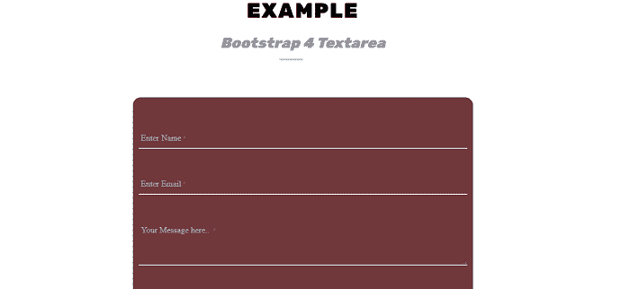
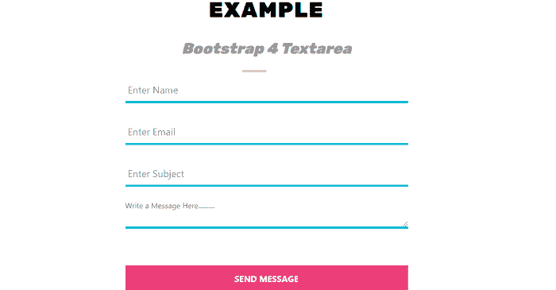

# 引导 4 文本区

> 原文：<https://www.javatpoint.com/bootstrap-4-textarea>

在本文中，我们将详细了解 bootstrap 4 textarea 示例。

### 你说的文本区是什么意思？

在 Bootstrap 4 中，textarea 是用于大量文本的多行纯文本编辑控件。它可以用于各种组件，如联系人表单、评论部分和反馈表单。

**我们来看下 bootstrap 4 中 textarea 的例子。**

### 例 1:

```

<! DOCTYPE html>        
<html lang = "en">        
<head>        
  <title> Bootstrap 4 typography Example </title>        
  <meta charset = "utf-8">        
  <meta name = "viewport" content="width=device-width, initial-scale=1">        
  <link rel = "stylesheet" href = "https://maxcdn.bootstrapcdn.com/bootstrap/4.1.3/css/bootstrap.min.css">        
  <script src = "https://ajax.googleapis.com/ajax/libs/jquery/3.3.1/jquery.min.js"> </script>        
  <script src = "https://cdnjs.cloudflare.com/ajax/libs/popper.js/1.14.3/umd/popper.min.js"> </script>        
  <script src = "https://maxcdn.bootstrapcdn.com/bootstrap/4.1.3/js/bootstrap.min.js"> </script>        
   <link href = "https://maxcdn.bootstrapcdn.com/font-awesome/4.7.0/css/font-awesome.min.css" rel = "stylesheet">        
</head>        
<style>  
@import url("https://fonts.googleapis.com/css2?family=Rubik:wght@900&display=swap");
.heading h1 {
  text-align: center;
  color: #222; 
  font-size: 40px; 
  font-weight: 300;
  text-transform: uppercase;
  word-spacing: 1px; 
  letter-spacing: 2px; 
  color: black;
  margin: 10px;
  font-family: "Rubik", sans-serif;
}
.heading h1 span {
  line-height: 2em; 
  padding-bottom :5px;
  text-transform: none;
  font-size: .7em;
  margin: 10px;
  font-weight: normal;
  font-style: italic; 
  font-family: "Rubik", sans-serif;
  color: #999; 
 letter-spacing: -0.005em; 
  word-spacing: 1px;
}
.heading h1:after {
  position: absolute;
  left: 0;
  bottom: 0;
  width: 45px;
  height: 4px;
  content: "";
  right: 45px; 
  margin: auto;
  background-color: #ccc;
}
heading h1:before {
  position: absolute;
  left: 0;
  bottom: 0;
  width: 45px;
  height: 4px;
  content: "";
  right: 45px; 
  margin: auto;
  background-color: #ccc;
}
.heading h1:before { 
background-color: #d78b8b;
  left: 45px; 
  width: 90px;
}
.form-group.input-material {
  position: relative;
  margin-top: 50px;
  margin-bottom: 25px;
}
.form-group.input-material label {
  color: #b1bbc4;
  font-size: 16px;
  font-weight: normal;
  position: absolute;
  pointer-events: none;
  left: 5px;
  bottom: 1px;
  transition: 0.1s ease all;
  -moz-transition: 0.1s ease all;
  -webkit-transition: 0.1s ease all;
}
.form-group.input-material textarea.form-control ~ label {
  bottom: 90%;
  bottom: calc(100% - 38px);
}
.form-group.input-material .form-control {
  border: none;
  border-bottom: 2px solid #ced4da;
  border-radius: 0px;
  background-color: transparent;
  padding-left: 5px;
  box-shadow: none;
}
.form-group.input-material .form-select {
  border: none;
  border-bottom: 2px solid #ced4da;
  border-radius: 0px;
  background-color: transparent;
  padding-left: 5px;
  box-shadow: none;
}
.form-group.input-material .form-control:required ~ label::after
{
  content: "*";
  color: #dc3545;
  padding-left: 2px;
  font-size: 0.8em;
}
.form-group.input-material .form-select:required ~ label::after {
  content: "*";
  color: #dc3545;
  padding-left: 2px;
  font-size: 0.8em;
}
.form-group.input-material .form-control:focus {
  border-bottom-color: #007bff;
  color: #000;
}
.form-group.input-material .form-control[value]:not([value=""]) {
  border-bottom-color: #007bff;
  color: #000;
}
.form-group.input-material .form-select:focus {
  border-bottom-color: #007bff;
  color: #000;
}
.form-group.input-material .form-select[value]:not([value=""]) {
  border-bottom-color: #007bff;
  color: #000;
}
.form-group.input-material .form-control:focus ~ label {
  top: unset;
  bottom: 100%;
  bottom: calc(100% - 16px);
  font-size: 14px;
  color: #007bff;
  font-weight: 500;
}
.form-group.input-material .form-control[value]:not([value=""]) ~ label {
  top: unset;
  bottom: 100%;
  bottom: calc(100% - 16px);
  font-size: 14px;
  color: #007bff;
  font-weight: 500;
}
.form-group.input-material .form-select:focus ~ label {
  top: unset;
  bottom: 100%;
  bottom: calc(100% - 16px);
  font-size: 14px;
  color: #007bff;
  font-weight: 500; }
.form-group.input-material .form-select[value]:not([value=""]) ~ label {
  top: unset;
  bottom: 100%;
  bottom: calc(100% - 16px);
  font-size: 14px;
  color: #007bff;
  font-weight: 500;
}
.form-group.input-material .form-control:focus.invalid {
  border-bottom-color: #dc3545;
}
.form-group.input-material .form-control.invalid {
  border-bottom-color: #dc3545;
}
.form-group.input-material .form-control:focus.parsley-error {
  border-bottom-color: #dc3545;
}
.form-group.input-material .form-control[value]:not([value=""]).parsley-error {
  border-bottom-color: #dc3545;
}
.form-group.input-material .form-select:focus.invalid {
  border-bottom-color: #dc3545;
}
.form-group.input-material .form-select.invalid {
  border-bottom-color: #dc3545;
}
.form-group.input-material .form-select:focus.parsley-error {
  border-bottom-color: #dc3545;
}
.form-group.input-material .form-select[value]:not([value=""]).parsley-error {
  border-bottom-color: #dc3545;
}
.form-group.input-material .form-control:focus.invalid ~ label {
  color: #dc3545;
}
.form-group.input-material .form-control.invalid ~ label {
  color: #dc3545;
}
.form-group.input-material .form-control:focus.parsley-error ~ label {
  color: #dc3545;
}
.form-group.input-material .form-control[value]:not([value=""]).parsley-error ~ label {
  color: #dc3545;
}
.form-group.input-material .form-select:focus.invalid ~ label {
  color: #dc3545;
}
.form-group.input-material .form-select.invalid ~ label {
  color: #dc3545;
}
.form-group.input-material .form-select:focus.parsley-error ~ label {
  color: #dc3545;
}
.form-group.input-material .form-select[value]:not([value=""]).parsley-error ~ label {
  color: #dc3545;
}
.form-group.input-material .form-select {
  background-position: right 0 center;
  padding-left: 0;
}
.form-group.input-material .parsley-errors-list {
  color: #dc3545;
  list-style: none;
  font-size: 0.7em;
  padding-left: 5px;
  position: absolute;
  top: 107%;
}
h1 {
  position: relative;
  padding: 0;
  margin: 0;
  font-family: "Raleway", sans-serif;
  font-weight: 200;
  font-size: 40px;
  color: #080808;
  -webkit-transition: all 0.4s ease 0s;
  -o-transition: all 0.4s ease 0s;
  transition: all 0.4s ease 0s;
}
h1 span {
  display: block;
  font-size: 0.5em;
  line-height: 1.3;
}
#contact-form {
  font-family: 'Open Sans';
  font-weight: 400;
  font-size: 14px;
  color: #323232;
  width: 650px;
  height: auto;
  margin: 10% auto;
  padding: 10px;
  background-color: #5c1b1fde;
  border: 1px solid #262b4c8c;
  border-radius: 15px;
  -webkit-box-shadow:  0px 0px 10px 0px #f5f5f5;
  box-shadow:  0px 0px 10px 0px #f5f5f5;
}
button {  
  margin: 20px;  
}  
.custom-btn {  
  width: 130px;  
  height: 40px;  
  color: #fff;  
  border-radius: 5px;  
  padding: 10px 25px;  
  font-family: 'Lato', sans-serif;  
  font-weight: 500;  
  background: transparent;  
  cursor: pointer;  
  transition: all 0.3s ease;  
  position: relative;  
  display: inline-block;  
   box-shadow: inset 2px 2px 2px 0px rgba(255,255,255,.5),  
   7px 7px 20px 0px rgba(0,0,0,.1),  
   4px 4px 5px 0px rgba(0,0,0,.1);  
  outline: none;  
}  
#button {  
  display: inline-block;  
  background-color: #FF9800;  
  width: 50px;  
  height: 50px;  
  text-align: center;  
  border-radius: 4px;  
  position: fixed;  
  bottom: 30px;  
  right: 30px;  
  transition: background-color .3s,   
    opacity .5s, visibility .5s;  
  opacity: 0;  
  visibility: hidden;  
  z-index: 1000;  
}  
#button::after {  
  content: "\f077";  
  font-family: FontAwesome;  
  font-weight: normal;  
  font-style: normal;  
  font-size: 2em;  
  line-height: 50px;  
  color: #fff;  
}  
#button:hover {  
  cursor: pointer;  
  background-color: #333;  
}  
#button:active {  
  background-color: #555;  
}  
#button.show {  
  opacity: 1;  
  visibility: visible;  
}  
.btn-2 {  
  background: rgb(96,9,240);  
  background: linear-gradient(
0deg, #e9ecef 0%, rgb(87 65 106) 100%);  
  border: none;  
}  
.btn-2:before {  
  height: 0%;  
  width: 2px;  
}  
.btn-2:hover {  
  box-shadow:  4px 4px 6px 0 rgba(255,255,255,.5),  
              -4px -4px 6px 0 rgba(116, 125, 136, .5),   
    inset -4px -4px 6px 0 rgba(255,255,255,.2),  
    inset 4px 4px 6px 0 rgba(0, 0, 0, .4);  
}  
</style>
<body>
	<center>
<div class = "heading">
  <h1> Example
    <span> Bootstrap 4 Textarea 
 </span>
  </h1>
<div class = "container">
        <div class = "col-lg-8">
            <form id = "contact-form">
                <div class = "form-group input-material">
                    <input type = "text" class = "form-control" id = "name-field" required>
                    <label for = "name-field"> Enter Name </label>
                </div>
                <div class = "form-group input-material">
                    <input type = "email" class="form-control" id = "email-field" required>
                    <label for = "email-field"> Enter Email </label>
                </div>
                <div class = "form-group input-material">
                    <textarea class="form-control" id="textarea-field" rows = "3" required> </textarea>
                    <label for = "textarea-field"> Your Message here ..  </label>
                </div>
                <div class = "form-group input-material">
                    <div class = "form-group input-material">
                        <select class = "form-control" id="personality" required>
                            <option value =" " selected> </option>
                            <option value = "bca"> BCA </option>
                            <option value = "ba"> BA </option>
		  <option value="bca"> BSC </option>
                            <option value = "ba"> BCOM </option>
		<option value = "bca"> MCA </option>
                            <option value = "ba"> MA </option>
		  <option value = "bca"> MCOM </option>
                            <option value = "ba"> MSC IT </option>
                        </select>
                        <label for = "personality" class = "form-label"> Select Course </label>
                    </div>
                </div>
                <div class = "text-center">
                    <button type=  "submit" class = "custom-btn btn-2"> Submit </button>  
                </div>
            </form>
        </div>
    </div>
	<script>
	$.fn.materializeInputs = function(selectors) {
    if (typeof(selectors)==='undefined') selectors = "input, textarea, select";
    function setInputValueAttr(element) {
        element.setAttribute('value', element.value);
    }
    this.find(selectors).each(function () {
        setInputValueAttr(this);
    });
    this.on("keyup change", selectors, function() {
        setInputValueAttr(this);
    });
};
$('body').materializeInputs();
</script>
</body>
</html>

```

**说明:**

在上面的例子中，我们创建了一个 Bootstrap 4 textarea 的例子。

**输出:**

下面是这个例子的输出。



### 例 2:

```

<! DOCTYPE html>        
<html lang = "en">        
<head>        
  <title> Bootstrap 4 typography Example </title>        
  <meta charset = "utf-8">        
  <meta name = "viewport" content = "width=device-width, initial-scale = 1">        
  <link rel = "stylesheet" href = "https://maxcdn.bootstrapcdn.com/bootstrap/4.1.3/css/bootstrap.min.css">        
  <script src = "https://ajax.googleapis.com/ajax/libs/jquery/3.3.1/jquery.min.js"> </script>        
  <script src = "https://cdnjs.cloudflare.com/ajax/libs/popper.js/1.14.3/umd/popper.min.js"> </script>        
  <script src = "https://maxcdn.bootstrapcdn.com/bootstrap/4.1.3/js/bootstrap.min.js"> </script>        
   <link href = "https://maxcdn.bootstrapcdn.com/font-awesome/4.7.0/css/font-awesome.min.css" rel = "stylesheet">        
</head>        
<style>  
@import url("https://fonts.googleapis.com/css2?family=Rubik:wght@900&display=swap");
.heading h1 {
  text-align: center;
  color: #222; 
  font-size: 40px; 
  font-weight: 400;
  text-transform: uppercase;
  word-spacing: 1px; 
  letter-spacing: 2px; 
  color: black;
  margin: 20px;
  font-family: "Rubik", sans-serif;
}
.heading h1 span {
  line-height: 2em; 
  padding-bottom :15px;
  text-transform: none;
  font-size: .7em;
  margin: 20px;
  font-weight: normal;
  font-style: italic; 
  font-family: "Rubik", sans-serif;
  color: #999; 
 letter-spacing: -0.005em; 
  word-spacing: 1px;
}
.heading h1:after {
  position: absolute;
  left: 0;
  bottom: 0;
  width: 45px;
  height: 4px;
  content: "";
  right: 45px; 
  margin: auto;
  background-color: #ccc;
}
heading h1:before {
  position: absolute;
  left: 0;
  bottom: 0;
  width: 45px;
  height: 4px;
  content: "";
  right: 45px; 
  margin: auto;
  background-color: #ccc;
}
.heading h1:before { 
background-color: #d78b8b;
  left: 45px; 
  width: 90px;
}
.contact-h {
    font-size: 24px;
    text-transform: uppercase;
    font-weight: 700;
    margin-bottom: 40px;
    color: #EC407A;
}
.contact .form-group {
    margin-bottom: 40px;
}
.contact .form-control {
    border-radius: 0;
    border: none;
    border-bottom: 4px solid #00BCD4;
    box-shadow: none;
}
.contact .btn-primary {
    background-color: #EC407A;
    border-color: #EC407A;
    border-radius: 0;
    text-transform: uppercase;
    font-weight: bold;
}
.contact .btn {
    padding: 12px 15px;
}
.group {
    position: relative;
    margin-bottom: 45px;
}
input:focus {
    outline: none;
}
label {
    color: #999;
    font-size: 18px;
    font-weight: normal;
    position: absolute;
    pointer-events: none;
    left: 5px;
    top: 0;
    transition: 0.2s ease all;
    -moz-transition: 0.2s ease all;
    -webkit-transition: 0.2s ease all;
}
input:focus ~ label
 {
    top: -20px;
    font-size: 14px;
    color: #96c93d;
}
input:valid ~ label {
    top: -20px;
    font-size: 14px;
    color: #96c93d;
}
.bar {
    position: relative;
    display: block;
    width: 100%;
}
.bar:before
{
    content: '';
    height: 4px;
    width: 0;
    bottom: 0px;
    position: absolute;
    background: #96c93d;
    transition: 0.2s ease all;
    -moz-transition: 0.2s ease all;
    -webkit-transition: 0.2s ease all;
}
.bar:after {
    content: '';
    height: 4px;
    width: 0;
    bottom: 0px;
    position: absolute;
    background: #96c93d;
    transition: 0.2s ease all;
    -moz-transition: 0.2s ease all;
    -webkit-transition: 0.2s ease all;
}
.bar:before {
    left: 50%;
}
.bar:after {
    right: 50%;
}
input:focus ~ .bar:before
{
    width: 50%;
}
input:focus ~ .bar:after {
    width: 50%;
}
.highlight {
    position: absolute;
    width: 100px;
    top: 25%;
    left: 0;
    pointer-events: none;
    opacity: 0.5;
}
input:focus ~ .highlight {
    -webkit-animation: inputHighlighter 0.3s ease;
    -moz-animation: inputHighlighter 0.3s ease;
    animation: inputHighlighter 0.3s ease;
}
@-webkit-keyframes inputHighlighter {
    from {
        background: #5264AE;
    }
    to {
        width: 0;
        background: transparent;
    }
}
@-moz-keyframes inputHighlighter {
    from {
        background: #5264AE;
    }
    to {
        width: 0;
        background: transparent;
    }
}
@keyframes inputHighlighter {
    from {
        background: #5264AE;
    }
    to {
        width: 0;
        background: transparent;
    }
}
.text-group textarea {
    display: block;
    background: none;
    padding: 0.12rem 0.12rem 0.062rem;
    border-width: 0;
    border-color: transparent;
    line-height: 1.9;
    width: 100%;
    -webkit-transition: all 0.28s ease;
    transition: all 0.28s ease;
    box-shadow: none;
}
.text-group textarea:focus ~ .input-label
{
    font-size: 14px;
    color: gray;
    top: -1rem;
    left: 0;
}
.text-group textarea:valid ~ .input-label
{
    font-size: 14px;
    color: gray;
    top: -1rem;
    left: 0;
}
.text-group textarea.form-file ~ .input-label
{
    font-size: 14px;
    color: gray;
    top: -1rem;
    left: 0;
}
.text-group textarea.has-value ~ .input-label {
    font-size: 14px;
    color: gray;
    top: -1rem;
    left: 0;
}
.text-group textarea:focus ~ .input-label {
    color: #96c93d;
}
.text-group textarea:focus ~ .bar::before {
    width: 100%;
    left: 0;
}
.text-group {
    position: relative;
    margin-top: 2.25rem;
    margin-bottom: 4.25rem;
}
h1 {
  position: relative;
  padding: 0;
  margin: 0;
  font-family: "Raleway", sans-serif;
  font-weight: 300;
  font-size: 40px;
  color: #080808;
  -webkit-transition: all 0.4s ease 0s;
  -o-transition: all 0.4s ease 0s;
  transition: all 0.4s ease 0s;
}
h1 span {
  display: block;
  font-size: 0.5em;
  line-height: 1.3;
}
</style>
<body>
	<center>
<div class="heading">
  <h1> Example
    <span> Bootstrap 4 Textarea 
 </span>
  </h1>
<div class="container">
         <div class="contact">
            <div class = "col-md-6 col-md-offset-3">
               <div class = "form-area">
                  <form>
                     <div class = "group form-group">      
                        <input type = "text" class = "form-control" id = "name" required>
                        <span class = "highlight"> </span>
                        <span class = "bar"> </span>
                        <label> Enter Name </label>
                     </div>
                     <div class = "group form-group">      
                        <input type = "mail" class = "form-control" id = "email" required>
                        <span class = "highlight"> </span>
                        <span class = "bar"> </span>
                        <label> Enter Email </label>
                     </div>
                     <div class="form-group group">
                        <input type = "text" class = "form-control" id = "subject" name = "subject" required>
                        <span class = "highlight"> </span>
                        <span class = "bar"> </span>
                        <label> Enter Subject </label>
                     </div>
                     <div class = "form-group group">
                        <div class = "text-group">
                           <textarea required = "required" class = "form-control" rows="6"> </textarea>
                           <label for = "textarea" class = "input-label"> Write a Message Here.......... </label> <i class="bar"> </i>
                        </div>
                     </div>
                     <button type = "button" id = "submit" name = "submit" class = "btn btn-primary col-md-12"> Send Message </button>              
                  </form>
               </div>
            </div>
         </div>
</div>
</body>
</html>

```

**说明:**

在上面的例子中，我们创建了一个 Bootstrap 4 textarea 的例子。

**输出:**

下面是这个例子的输出。



* * *