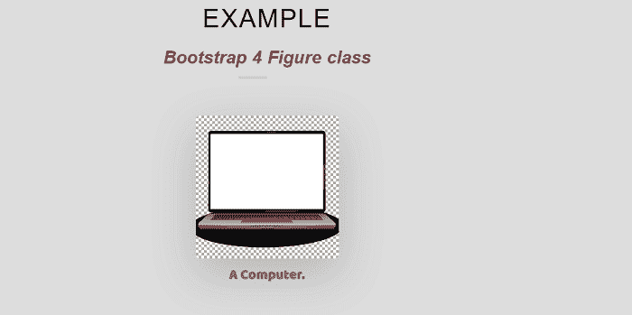
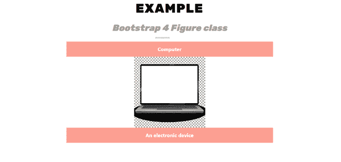
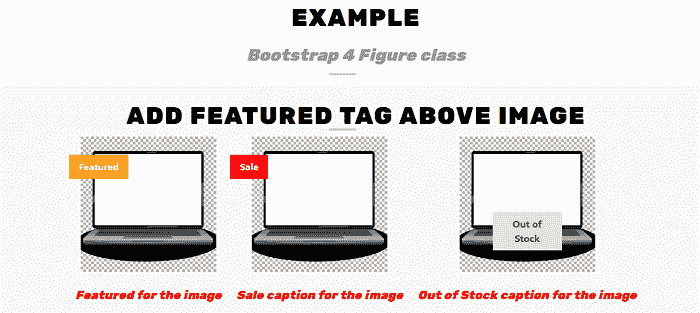

# 引导图 4 类

> 原文：<https://www.javatpoint.com/bootstrap-4-figure-class>

本文将详细了解 bootstrap 4 数字示例。

### bootstrap 4 中的图形类是什么意思？

在 bootstrap 4 中，图形类为默认图形元素添加样式，并显示带有附加标题的图像。

**Bootstrap4 图类中使用了以下元素:**

*   **。图:**这个类用来表示一个图形元素。
*   **。图-img:** 用于表示图元素中使用的图像。
*   **。图-标题:**这个类用来在图元素下面显示一个标题。

**我们来看下 Bootstrap 4 图类的例子。**

### 例 1:

```

<! DOCTYPE html>        
<html lang = "en">        
<head>        
  <title> Bootstrap 4 Figure class Example </title>        
  <meta charset = "utf-8">        
  <meta name = "viewport" content="width = device-width, initial-scale = 1">        
  <link rel = "stylesheet" href = "https://maxcdn.bootstrapcdn.com/bootstrap/4.1.3/css/bootstrap.min.css">        
  <script src = "https://ajax.googleapis.com/ajax/libs/jquery/3.3.1/jquery.min.js"> </script>        
  <script src="https://cdnjs.cloudflare.com/ajax/libs/popper.js/1.14.3/umd/popper.min.js"> </script>        
  <script src="https://maxcdn.bootstrapcdn.com/bootstrap/4.1.3/js/bootstrap.min.js"> </script>        
   <link href="https://maxcdn.bootstrapcdn.com/font-awesome/4.7.0/css/font-awesome.min.css" rel="stylesheet">        
</head>        
<style>  
@import 'https://fonts.googleapis.com/css?family=Baloo+Tamma';
* {
  padding: 0;
  margin: 0;
  font-family: "Baloo Tamma", cursive;
  font-size: 24px;
}
body {
  background: #ddd;
  width: 100%;
  height: 100%;
  padding: 50px;
  box-sizing: border-box;
}
.heading h1 {
  text-align: center;
  color: #222; 
  font-size: 40px; 
  font-weight: 300;
  text-transform: uppercase;
  word-spacing: 1px; 
  letter-spacing: 2px; 
  color: black;
  margin: 10px;
  font-family: "Rubik", sans-serif;
}
.heading h1 span {
  line-height: 2em; 
  padding-bottom :5px;
  text-transform: none;
  font-size: .7em;
  margin: 10px;
  font-weight: bold;
  font-style: italic; 
  font-family: "Rubik", sans-serif;
  color: #a12626;
 letter-spacing: -0.005em; 
  word-spacing: 1px;
}
.heading h1:after {
  position: absolute;
  left: 0;
  bottom: 0;
  width: 45px;
  height: 4px;
  content: "";
  right: 45px; 
  margin: auto;
  background-color: #ccc;
}
heading h1:before {
  position: absolute;
  left: 0;
  bottom: 0;
  width: 45px;
  height: 4px;
  content: "";
  right: 45px; 
  margin: auto;
  background-color: #ccc;
}
.heading h1:before { 
background-color: #d78b8b;
  left: 45px; 
  width: 90px;
}
.container {
  padding: 2rem 0rem;
}
h4 {
  margin: 3rem 0rem 2rem;
}
.image-parent {
  background-color: #E9E9E9;
  max-width: 400px;
  min-height: 300px;
}
.img-wrapper {
  width: 10%;
  margin: 0rem 1.5rem 0rem 0rem;
}
.img-wrapper-20 {
  width: 20%;
  margin: 0rem 1.5rem 0rem 0rem;
}
.c-container {
  background-color: #E9E9E9;
  border-radius: 0.5rem;
  padding: 1.2rem 1.2rem;
  margin: 1rem 0rem;
}
.overlay-dark {
  background-color: rgba(0, 0, 0, 0.4);
}
.overlay-grey {
  background-color: rgba(89, 97, 100, 0.4);
}
.overlay-yellow {
  background-color: rgba(254, 225, 64, 0.4);
}
.overlay-orange {
  background-color: rgba(196, 58, 48, 0.4);
}
.overlay-blue-gradient {
  background-image: linear-gradient(135deg, rgba(150, 222, 218, 0.5) 0%, rgba(83, 120, 149, 0.7) 100%);
}
h1 {
  position: relative;
  padding: 0;
  margin: 0;
  font-family: "Raleway", sans-serif;
  font-weight: 200;
  font-size: 40px;
  color: red;
  -webkit-transition: all 0.4s ease 0s;
  -o-transition: all 0.4s ease 0s;
  transition: all 0.4s ease 0s;
}
h1 span {
  display: block;
  font-size: 0.5em;
  line-height: 1.3;
  color: #232323;
}
</style>
<body>
	<center>
<div class="heading">
  <h1> Example
    <span> Bootstrap 4 Figure class
 </span>
  </h1>
<div class = "container">
  <div class = "d-flex justify-content-center">
    <figure class = "figure w-25">
      
      <figcaption class = "figure-caption text-center font-weight-bold"> A Computer. </figcaption>
    </figure>
  </div>
</div>
</body>
</html>

```

**说明:**

在上面的例子中，我们创建了一个 bootstrap 4 图形类的例子。

**输出:**

下面是这个例子的输出。



### 例 2:

```

<! DOCTYPE html>        
<html lang = "en">        
<head>        
  <title> Bootstrap 4 Figure class Example </title>        
  <meta charset = "utf-8">        
  <meta name = "viewport" content="width = device-width, initial-scale = 1">        
  <link rel = "stylesheet" href = "https://maxcdn.bootstrapcdn.com/bootstrap/4.1.3/css/bootstrap.min.css">        
  <script src = "https://ajax.googleapis.com/ajax/libs/jquery/3.3.1/jquery.min.js"> </script>        
  <script src="https://cdnjs.cloudflare.com/ajax/libs/popper.js/1.14.3/umd/popper.min.js"> </script>        
  <script src="https://maxcdn.bootstrapcdn.com/bootstrap/4.1.3/js/bootstrap.min.js"> </script>        
   <link href="https://maxcdn.bootstrapcdn.com/font-awesome/4.7.0/css/font-awesome.min.css" rel="stylesheet">        
</head>        
<style>  
@import url("https://fonts.googleapis.com/css2?family=Rubik:wght@900&display=swap");
.heading h1 {
  text-align: center;
  color: #222; 
  font-size: 40px; 
  font-weight: 300;
  text-transform: uppercase;
  word-spacing: 1px; 
  letter-spacing: 2px; 
  color: black;
  margin: 10px;
  font-family: "Rubik", sans-serif;
}
.heading h1 span {
  line-height: 2em; 
  padding-bottom :5px;
  text-transform: none;
  font-size: .7em;
  margin: 10px;
  font-weight: normal;
  font-style: italic; 
  font-family: "Rubik", sans-serif;
  color: #999; 
 letter-spacing: -0.005em; 
  word-spacing: 1px;
}
.heading h1:after {
  position: absolute;
  left: 0;
  bottom: 0;
  width: 45px;
  height: 4px;
  content: "";
  right: 45px; 
  margin: auto;
  background-color: #ccc;
}
heading h1:before {
  position: absolute;
  left: 0;
  bottom: 0;
  width: 45px;
  height: 4px;
  content: "";
  right: 45px; 
  margin: auto;
  background-color: #ccc;
}
.heading h1:before { 
background-color: #d78b8b;
  left: 45px; 
  width: 70px;
}
figure figcaption {
  padding: 1em;
  text-align: center;
  color: #fff;
  height: 3em;
  line-height: 1em;
  background-color: rgb(249 65 38 / 50%);
  font-weight: bold;
}
img + figcaption {
  color: white;
  font-weight: bold;
}
h1 {
  position: relative;
  padding: 0;
  margin: 0;
  font-family: "Raleway", sans-serif;
  font-weight: 200;
  font-size: 40px;
  color: #080808;
  -webkit-transition: all 0.4s ease 0s;
  -o-transition: all 0.4s ease 0s;
  transition: all 0.4s ease 0s;
}
h1 span {
  display: block;
  font-size: 0.5em;
  line-height: 1.3;
}
</style>
<body>
	<center>
<div class="heading">
  <h1> Example
    <span> Bootstrap 4 Figure class
 </span>
  </h1>
<div class="row-fluid">
<div class="col-md-6 col-md-push-3">
<figure>
  <figcaption> Computer </figcaption>
  
  <figcaption> An electronic device </figcaption>
</figure>
</div>
</div>
</body>
</html>

```

**说明:**

我们已经创建了一个 bootstrap 4 图形类的例子，在上面的例子中有上面和下面的图形标题。

**输出:**

下面是这个例子的输出。



### 例 3:

```

<! DOCTYPE html>        
<html lang = "en">        
<head>        
  <title> Bootstrap 4 Figure class Example </title>        
  <meta charset = "utf-8">        
  <meta name = "viewport" content="width = device-width, initial-scale = 1">        
  <link rel = "stylesheet" href = "https://maxcdn.bootstrapcdn.com/bootstrap/4.1.3/css/bootstrap.min.css">        
  <script src = "https://ajax.googleapis.com/ajax/libs/jquery/3.3.1/jquery.min.js"> </script>        
  <script src="https://cdnjs.cloudflare.com/ajax/libs/popper.js/1.14.3/umd/popper.min.js"> </script>        
  <script src="https://maxcdn.bootstrapcdn.com/bootstrap/4.1.3/js/bootstrap.min.js"> </script>        
   <link href="https://maxcdn.bootstrapcdn.com/font-awesome/4.7.0/css/font-awesome.min.css" rel="stylesheet">        
</head>        
<style>  
@import url("https://fonts.googleapis.com/css2?family=Rubik:wght@900&display=swap");
.heading h1 {
  text-align: center;
  color: #222; 
  font-size: 40px; 
  font-weight: 300;
  text-transform: uppercase;
  word-spacing: 1px; 
  letter-spacing: 2px; 
  color: black;
  margin: 10px;
  font-family: "Rubik", sans-serif;
}
.heading h1 span {
  line-height: 2em; 
  padding-bottom :5px;
  text-transform: none;
  font-size: .7em;
  margin: 10px;
  font-weight: normal;
  font-style: italic; 
  font-family: "Rubik", sans-serif;
  color: #999; 
 letter-spacing: -0.005em; 
  word-spacing: 1px;
}
.heading h1:after {
  position: absolute;
  left: 0;
  bottom: 0;
  width: 45px;
  height: 4px;
  content: "";
  right: 45px; 
  margin: auto;
  background-color: #ccc;
}
heading h1:before {
  position: absolute;
  left: 0;
  bottom: 0;
  width: 45px;
  height: 4px;
  content: "";
  right: 45px; 
  margin: auto;
  background-color: #ccc;
}
.heading h1:before { 
background-color: #d78b8b;
  left: 45px; 
  width: 90px;
}
h1 {
  position: relative;
  padding: 0;
  margin: 0;
  font-family: "Raleway", sans-serif;
  font-weight: 200;
  font-size: 40px;
  color: #080808;
  -webkit-transition: all 0.4s ease 0s;
  -o-transition: all 0.4s ease 0s;
  transition: all 0.4s ease 0s;
}
h1 span {
  display: block;
  font-size: 0.5em;
  line-height: 1.3;
}
.figure.tag {
  position: relative;
}
.figure.tag::before {
  position: absolute;
  top: 10%;
  display: block;
  color: white;
  padding: 0.5rem 1rem;
  font-weight: bold;
}
.figure.tag-featured::before {
  content: "Featured";
  background: orange;
}
.figure.tag-sale::before {
  content: "Sale";
  background: red;
}
.figure.tag-out::before {
  content: "Out of Stock";
  background: #e2e2e2;
  border: #ccc;
  color: #444;
  top: 42%;
  right: 0;
  left: 0;
  width: 30%;
  margin: 0 auto;
  text-align: center;
}
.figure-caption {
line-height: 2em; 
  padding-bottom :5px;
  text-transform: none;
  font-size: 20px;
  margin: 10px;
  font-weight: normal;
  font-style: italic; 
  font-family: "Rubik", sans-serif;
  color: red; 
 letter-spacing: -0.005em; 
  word-spacing: 1px;
}
</style>
<body>
	<center>
<div class="heading">
  <h1> Example
    <span> Bootstrap 4 Figure class
 </span>
  </h1>
<div class = "container-fluid bg-light p-4">
  <h1> Add Featured Tag above Image </h1>
  <figure class = "figure tag tag-featured">
    
    <figcaption class = "figure-caption"> Featured for the image </figcaption>
  </figure>
  <figure class = "figure tag tag-sale">
    
    <figcaption class = "figure-caption"> Sale caption for the image </figcaption>
  </figure>
  <figure class = "figure tag tag-out">
    
    <figcaption class = "figure-caption"> Out of Stock caption for the image </figcaption>
  </figure>
</div>
</body>
</html>

```

**说明:**

在上面的例子中，我们创建了一个带有特色标签的 bootstrap 4 图形类的例子。

**输出:**

下面是这个例子的输出。



* * *