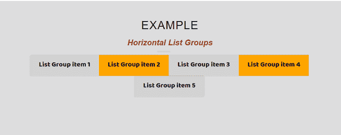
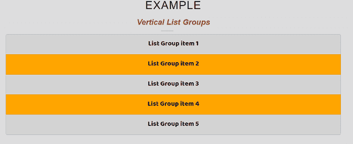
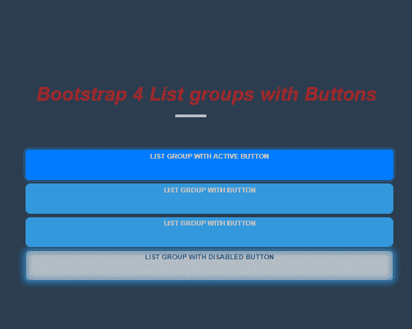
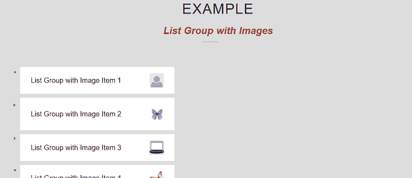
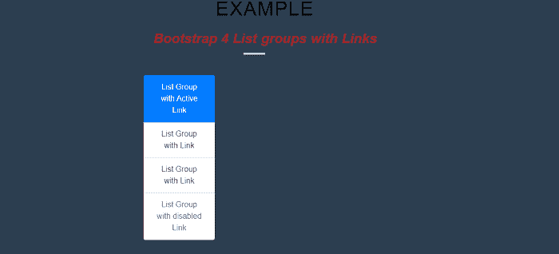

# 引导 4 列表组

> 原文：<https://www.javatpoint.com/bootstrap-4-list-groups>

本文将了解如何在 bootstrap 4 中创建列表组。

### 在引导 4 中列出组是什么意思？

在引导程序 4 中，列表组显示一系列内容。列表-组用于显示一系列或一系列有组织的内容。

**以下是 Bootstrap 4 列表组的各种示例。**

### 示例 1:引导 4 水平列表组项目

```

<! DOCTYPE html>          
<html lang = "en">          
<head>          
  <title> Bootstrap 4 Horizontal List Groups Example </title>          
  <meta charset = "utf-8">          
  <meta name = "viewport" content = "width = device-width, initial-scale = 1">          
  <link rel = "stylesheet" href = "https://maxcdn.bootstrapcdn.com/bootstrap/4.1.3/css/bootstrap.min.css">          
  <script src = "https://ajax.googleapis.com/ajax/libs/jquery/3.3.1/jquery.min.js"> </script>          
  <script src = "https://cdnjs.cloudflare.com/ajax/libs/popper.js/1.14.3/umd/popper.min.js"> </script>          
  <script src = "https://maxcdn.bootstrapcdn.com/bootstrap/4.1.3/js/bootstrap.min.js"> </script>          
   <link href = "https://maxcdn.bootstrapcdn.com/font-awesome/4.7.0/css/font-awesome.min.css" rel = "stylesheet">          
</head>          
<style>    
@import 'https://fonts.googleapis.com/css?family=Baloo+Tamma';  
* {  
  padding: 0.2;  
    font-family: "Baloo Tamma", cursive;  
  font-size: 24px;  
margin: 0;  
}  
body {  
  background: #ddd;  
  width: 100%;  
  height: 100%;  
  padding: 60px;  
  box-sizing: border-box;  
}  
.list-group-horizontal .list-group-item:last-child {
	border-top-right-radius: 4px;
	border-bottom-left-radius: 0;
	border-right-width: 1px;
}
.head h1 {  
  text-align: center;  
  color: #242;   
  font-size: 30px;   
  font-weight: 310;  
  text-transform: uppercase;  
  word-spacing: 2px;   
  letter-spacing: 1px;   
  color: black;  
  margin: 11px;  
  font-family: "Rubik", sans-serif;  
}  
.list-group-horizontal li:nth-child(odd) {
  background-color: lightgrey;
}
.list-group-horizontal li:nth-child(even) {
  background-color: orange;
}
.head h1 span {  
  line-height: 2em;   
  padding-bottom : 6px;  
  text-transform: none;  
  font-size: .8em;  
  margin: 11px;  
  word-spacing: 1px;  
  font-weight: bold;  
  font-style: italic;   
  font-family: "Rubik";  
  color: #a12626;  
 letter-spacing: -0.5em;   
}  
.head h1:after {  
  position: absolute;  
  left: 0;  
  bottom: 0;  
  width: 35px;  
  height: 4px;  
  content: " ";  
  right: 54px;   
  margin: auto;  
  background-color: #ccc;  
}  
head h1:before {  
  position: absolute;  
  left: 0;  
  bottom: 0;  
  height: 4px;  
  content: " ";  
  right: 45px;   
  margin: auto;  
  width: 45px;  
  background-color: #ccc;  
}  
.list-group-horizontal .list-group-item {
	display: inline-block;
}
.head h1:before {   
background-color: #d78b8b;  
  left: 45px;   
  width: 90px;  
}  
.container {  
  padding: 2rem 0rem;  
}  
h1 {  
  position: relative;  
  padding: 0;  
  margin: 0;  
  font-family: "Raleway", sans-serif;  
  font-weight: 200;  
  font-size: 40px;  
  color: red;  
  -webkit-transition: all 0.4s ease 0s;  
  -o-transition: all 0.4s ease 0s;  
  transition: all 0.4s ease 0s;  
}  
h1 span {  
  display: block;  
  font-size: 0.5em;  
  line-height: 1.3;  
  color: #232323;  
}  
.list-group-horizontal .list-group-item {
	margin-bottom: 0;
	margin-left: -4px;
	margin-right: 0;
 	border-right-width: 0;
}
.list-group-horizontal .list-group-item:first-child {
	border-top-right-radius: 0;
	border-bottom-left-radius: 4px;
}
</style>  
<body>  
    <center>  
<div class = "head">  
  <h1> Example  
    <span>  Horizontal List Groups  
 </span>  
  </h1>  
  </div>
<ul class = "list-group-horizontal">
  <li class = "list-group-item"> List Group item 1 </li>
  <li class = "list-group-item"> List Group item 2 </li>
  <li class = "list-group-item"> List Group item 3 </li>
  <li class = "list-group-item"> List Group item 4 </li>
  <li class = "list-group-item"> List Group item 5 </li>
</ul>
</body>
</html>

```

**说明:**

在上面的示例中，我们创建了。列表-组-水平类。此类水平显示项目列表。

**输出:**

下面是这个例子的输出。



### 示例 2:引导 4 垂直列表组项目

```

<! DOCTYPE html>          
<html lang = "en">          
<head>          
  <title> Bootstrap 4 vertical List Groups Example </title>          
  <meta charset = "utf-8">          
  <meta name = "viewport" content = "width = device-width, initial-scale = 1">          
  <link rel = "stylesheet" href = "https://maxcdn.bootstrapcdn.com/bootstrap/4.1.3/css/bootstrap.min.css">          
  <script src = "https://ajax.googleapis.com/ajax/libs/jquery/3.3.1/jquery.min.js"> </script>          
  <script src = "https://cdnjs.cloudflare.com/ajax/libs/popper.js/1.14.3/umd/popper.min.js"> </script>          
  <script src = "https://maxcdn.bootstrapcdn.com/bootstrap/4.1.3/js/bootstrap.min.js"> </script>          
   <link href = "https://maxcdn.bootstrapcdn.com/font-awesome/4.7.0/css/font-awesome.min.css" rel = "stylesheet">          
</head>          
<style>    
@import 'https://fonts.googleapis.com/css?family=Baloo+Tamma';  
* {  
  padding: 0;  
  font-family: "Baloo Tamma", cursive;  
  font-size: 24px;  
  margin: 0;  
}  
body {  
  background: #ddd;  
  width: 100%;  
  height: 100%;  
  padding: 50px;  
  box-sizing: border-box;  
}  
.head h1 {  
  text-align: center;  
  color: #222;   
  font-size: 42px;   
  text-transform: uppercase;  
  word-spacing: 1.2px;   
  letter-spacing: 1px; 
  font-weight: 310;    
  color: black;  
  margin: 10px;  
  font-family: "Rubik";  
}  
.head h1 span {  
  line-height: 2em;   
  padding-bottom :5px;  
  text-transform: none;  
  font-size: .7em;  
  margin: 10px;  
  font-weight: bold;  
  font-style: italic;   
  font-family: "Rubik", sans-serif;  
  color: #a12626;  
 letter-spacing: -0.005em;   
  word-spacing: 1px;  
}  
.head h1:after {  
  position: absolute;  
  left: 0;  
  bottom: 0;  
  width: 45px;  
  height: 4px;  
  content: " ";  
  right: 45px;   
  margin: auto;  
  background-color: #ccc;  
}  
head h1:before {  
  position: absolute;  
  left: 0;  
  bottom: 0;  
  width: 45px;  
  content: " ";  
  right: 52px;   
  margin: auto;  
  background-color: #ccc;  
  height: 4px;  
} 
.list-group li:nth-child(odd) {
  background-color: lightgrey;
}
.list-group li:nth-child(even) {
  background-color: orange;
}
.head h1:before {   
background-color: #d78b8b;  
  left: 45px;   
  width: 90px;  
}  
.container {  
  padding: 2rem 0rem;  
}  
h1 {  
  position: relative;  
  padding: 0;  
  margin: 0;  
  font-family: "Raleway", sans-serif;  
  font-weight: 300;  
  font-size: 10px;  
  color: red;  
  -webkit-transition: all 0.4s ease 0s;  
  -o-transition: all 0.4s ease 0s;  
  transition: all 0.4s ease 0s;  
}  
h1 span {  
  display: block;  
  line-height: 1.4;  
  color: #232323;  
  font-size: 0.5em;  
}  
</style>  
<body>  
    <center>  
<div class = "head">  
  <h1> Example  
    <span> Vertical List Groups  
 </span>  
  </h1>  
  </div>
<ul class = "list-group">
  <li class = "list-group-item"> List Group item 1 </li>
  <li class = "list-group-item"> List Group item 2 </li>
  <li class = "list-group-item"> List Group item 3 </li>
  <li class = "list-group-item"> List Group item 4 </li>
  <li class = "list-group-item"> List Group item 5 </li>
</ul>
</body>
</html>

```

**说明:**

在上面的例子中，我们创建了一个垂直列表组项目的例子。在该列表中，项目显示为垂直组。

**输出:**

下面是这个例子的输出。



### 示例 3:引导 4 带按钮的列表组

```

<! DOCTYPE html>          
<html lang = "en">          
<head>          
  <title> Bootstrap 4 List groups with Buttons </title>          
  <meta charset = "utf-8">          
  <meta name = "viewport" content="width = device-width, initial-scale = 1">          
  <link rel = "stylesheet" href = "https://maxcdn.bootstrapcdn.com/bootstrap/4.1.3/css/bootstrap.min.css">          
  <script src = "https://ajax.googleapis.com/ajax/libs/jquery/3.3.1/jquery.min.js"> </script>          
  <script src = "https://cdnjs.cloudflare.com/ajax/libs/popper.js/1.14.3/umd/popper.min.js"> </script>          
  <script src = "https://maxcdn.bootstrapcdn.com/bootstrap/4.1.3/js/bootstrap.min.js"> </script>          
   <link href = "https://maxcdn.bootstrapcdn.com/font-awesome/4.7.0/css/font-awesome.min.css" rel = "stylesheet">          
</head>          
<style>    
html, body {
  margin: 0;
  padding: 0;
  width: 100%;
  height: 100%;
  background: #2c3e50;
  font-family: "Montserrat", sans-serif;
  font-size: 16px;
}
body {
  display: flex;
  flex-wrap: wrap;
  justify-content: space-around;
  align-items: center;
  align-content: center;
} 
.head h1 {  
  text-align: center;  
  color: #222;   
  font-weight: 320;  
  text-transform: uppercase;
  font-size: 40px;     
  word-spacing: 1px;   
  letter-spacing: 2.1px;   
  color: black;  
  margin: 10px;  
  font-family: "Rubik", sans-serif;  
}  
.head h1 span {  
  line-height: 2.1em;   
  padding-bottom : 5px;  
  text-transform: none;  
  font-size: .9em;  
  margin: 11px;  
  font-weight: bold;  
  font-style: italic;   
  font-family: "Rubik", sans-serif;  
  color: #a12626;  
 letter-spacing: -0.05em;   
  word-spacing: 1px;  
}  
.head h1:after {  
  position: absolute;  
  left: 0;  
  bottom: 0;  
  width: 45px;  
  height: 3px;  
  content: "";  
  right: 45px;   
  margin: auto;  
  background-color: #ccc;  
}  
head h1:before {  
  position: absolute;  
  left: 0;  
  bottom: 0;  
  width: 45px;  
  height: 3px;  
  content: "";  
  right: 45px;   
  margin: auto;  
  background-color: #ccc;  
}  
.head h1:before {   
background-color: #d78b8b;  
  left: 45px;   
  width: 80px;  
}  
.container {  
  padding: 2rem 0rem;  
}  
h1 {  
  position: relative;  
  padding: 0;  
  margin: 0;  
  font-family: "Raleway", sans-serif;  
  font-weight: 200;  
  color: red;  
  -webkit-transition: all 0.4s ease 0s;  
  -o-transition: all 0.4s ease 0s;  
  transition: all 0.4s ease 0s;  
  font-size: 40px;  
}  
h1 span {  
  display: block;  
  font-size: 0.6em;  
  line-height: 1.4;  
  color: #232323;  
} 
.btn {
  box-sizing: border-box;
  -webkit-appearance: none;
     -moz-appearance: none;
          appearance: none;
  background-color: transparent;
  border: 1px solid #e74c3c;
  border-radius: 0.6em;
  color: #e74c3c;
  cursor: pointer;
  align-self: center;
  font-weight: 700;
  margin: 5px;
  padding: 0.9.1em 2.6em;
  text-decoration: none;
  text-align: center;
  text-transform: uppercase;
  font-family: "Montserrat", sans-serif;
  font-size: 10px;
}
.btn:hover {
  outline: 0;
}
btn:focus {
  outline: 0;
}
.third {
  border-color: #3498db;
  color: #fff;
  box-shadow: 0 0 50px 45px #3498db inset, 0 0 0 0 #3498db;
  transition: all 150ms ease-in-out;
}
.third:hover {
  box-shadow: 0 0 10px 0 #3498db inset, 0 0 10px 4px #3498db;
} 
</style>  
<body>  
    <center>  
<div class = "head">  
  <h1> Example  
    <span> Bootstrap 4 List groups with Buttons  </span>  
  </h1>  
<div class = "container">
  <div class = "row">
 <div class = "col-12 col-md-6 col-lg-4">
      <div class = "list-group">
        <button type = "button" class = "list-group-item list-group-item-action btn third active">
          List Group with Active Button
          </button>
          <button type = "button" class = "list-group-item list-group-item-action btn third"> List Group with Button </button>
          <button type = "button" class = "list-group-item list-group-item-action btn third"> List Group with Button </button>
          <button type = "button" class = "list-group-item list-group-item-action btn third" disabled> List Group with Disabled Button </button>
      </div>
    </div>
  </div>
</div>
</body>
</html>

```

**说明:**

在上面的示例中，我们创建了一个带有按钮的示例引导 4 列表组项目。在这里，我们使用了像按钮一样的列表项。

**输出:**

下面是这个例子的输出。



### 示例 4:用图像列出组

```

<! DOCTYPE html>          
<html lang = "en">          
<head>          
  <title> Bootstrap 4 List Group with Images  Example </title>          
  <meta charset = "utf-8">          
  <meta name = "viewport" content="width = device-width, initial-scale = 1">          
  <link rel = "stylesheet" href = "https://maxcdn.bootstrapcdn.com/bootstrap/4.1.3/css/bootstrap.min.css">          
  <script src = "https://ajax.googleapis.com/ajax/libs/jquery/3.3.1/jquery.min.js"> </script>          
  <script src = "https://cdnjs.cloudflare.com/ajax/libs/popper.js/1.14.3/umd/popper.min.js"> </script>          
  <script src = "https://maxcdn.bootstrapcdn.com/bootstrap/4.1.3/js/bootstrap.min.js"> </script>          
   <link href = "https://maxcdn.bootstrapcdn.com/font-awesome/4.7.0/css/font-awesome.min.css" rel = "stylesheet">          
</head>          
<style>    
@import 'https://fonts.googleapis.com/css?family=Baloo+Tamma';  
* {  
  padding: 0;  
  margin: 0;  
  font-family: "Baloo Tamma", cursive;  
  font-size: 24px;  
}  
body {  
  background: #ddd;  
  width: 100%;  
  height: 100%; 
  box-sizing: border-box;  
padding: 50px;  
}  
body {
  padding: 2rem 0rem;
}
.image-parent {
  max-width: 40px;
}
div ul li:nth-child(2):before {
 content: "\1F89D";
 font-size: 30px;
 left: -21px;
 top: -1px;
}
.head h1 {  
  text-align: center;  
  color: #222;   
  font-size: 50px;   
  font-weight: 200;  
  text-transform: uppercase;  
  word-spacing: 1px;   
  letter-spacing: 1px;   
  color: black;  
  margin: 10px;  
  font-family: "Rubik", sans-serif;  
}  
.head h1 span {  
  line-height: 2em;   
  padding-bottom :5px;  
  text-transform: none;  
  font-size: .9em;  
  margin: 10px;  
  font-weight: bold;  
  font-style: italic;   
  font-family: "Rubik", sans-serif;  
  color: #a12626;  
 letter-spacing: -0.05em;   
  word-spacing: 2px;  
}  
.head h1:after {  
  position: absolute;  
  left: 0;  
  width: 45px;  
  height: 4px;  
  content: "";  
  right: 45px;   
  margin: auto;  
  bottom: 0;  
  background-color: #ccc;  
}  
head h1:before {  
  position: absolute;  
  left: 0;  
  bottom: 0;  
  height: 4px;  
  content: "";  
  right: 45px;   
  margin: auto; 
  width: 45px;   
  background-color: #ccc;  
}  
div ul li:nth-child(3):before {
 content: "\1F892";
 font-size: 30px;
 left: -18px;
 top: -12px;
}
.head h1:before {   
background-color: #d78b8b;  
  left: 45px;   
  width: 90px;  
}  
.container {  
  padding: 2rem 0rem;  
}  
h1 {  
  position: relative;  
  padding: 0;  
  margin: 0;  
  font-family: "Raleway", sans-serif;  
  color: red;  
  -webkit-transition: all 0.4s ease 0s;  
  -o-transition: all 0.4s ease 0s; 
font-weight: 200;  
  font-size: 40px;  
  transition: all 0.4s ease 0s;  
}  
h1 span {  
  display: block;  
  font-size: 0.5em;  
  line-height: 1.3;  
  color: #232323;  
}  
div ul {
  list-style: none;
}
div li {
  position: relative;
  font-family: Arial;
  font-size: 20px;
  margin: 10px;
}
div ul li::before {
  content: "\2022";
  color: #6CAC38;
  position: absolute;
  font-size: 25px;
  left: -19px;
  top: - 3px;
}
div ul li:first-child:before {
}
</style>  
<body>  
    <center>  
<div class = "head">  
  <h1> Example  
    <span> List Group with Images   
 </span>  
  </h1>  
<div class = "container">
  <div class = "row">
    <div class = "col-12 col-sm-8 col-lg-5">
      <ul class = "list-group">
        <li class = "list-group-item d-flex justify-content-between align-items-center">
          List Group with Image Item 1
          <div class = "image-parent">
              
          </div>
        </li>
        <li class = "list-group-item d-flex justify-content-between align-items-center">
          List Group with Image Item 2
          <div class = "image-parent">
              
          </div>
        </li>
        <li class = "list-group-item d-flex justify-content-between align-items-center">
         List Group with Image Item 3
          <div class = "image-parent">
              
          </div>
        </li>
<li class = "list-group-item d-flex justify-content-between align-items-center">
          List Group with Image Item 4
          <div class = "image-parent">
              
          </div>
        </li>
<li class = "list-group-item d-flex justify-content-between align-items-center">
        List Group with Image Item 5
          <div class = "image-parent">
              
          </div>
        </li>
      </ul>
    </div>
  </div>
</div>
</body>
</html>

```

**说明:**

在上面的例子中，我们创建了一个带有图像的列表组的例子。

**输出:**

下面是这个例子的输出。



### 示例 5:引导 4 列出带有链接的组

```

<! DOCTYPE html>          
<html lang = "en">          
<head>          
  <title> Bootstrap 4 List groups with  Links </title>          
  <meta charset = "utf-8">          
  <meta name = "viewport" content="width = device-width, initial-scale = 1">          
  <link rel = "stylesheet" href = "https://maxcdn.bootstrapcdn.com/bootstrap/4.1.3/css/bootstrap.min.css">          
  <script src = "https://ajax.googleapis.com/ajax/libs/jquery/3.3.1/jquery.min.js"> </script>          
  <script src = "https://cdnjs.cloudflare.com/ajax/libs/popper.js/1.14.3/umd/popper.min.js"> </script>          
  <script src = "https://maxcdn.bootstrapcdn.com/bootstrap/4.1.3/js/bootstrap.min.js"> </script>          
   <link href = "https://maxcdn.bootstrapcdn.com/font-awesome/4.7.0/css/font-awesome.min.css" rel = "stylesheet">          
</head>          
<style>    
html, body {
  margin: 0;
  padding: 0;
  width: 100%;
  height: 100%;
  background: #2c3e50;
  font-family: "Montserrat", sans-serif;
  font-size: 16px;
}
body {
  display: flex;
  flex-wrap: wrap;
  justify-content: space-around;
  align-items: center;
  align-content: center;
} 
.head h1 {  
  text-align: center;  
  color: #222;   
  font-size: 50px;   
  font-weight: 310;  
  text-transform: uppercase;  
  word-spacing: 1px;   
  letter-spacing: 2px;   
  color: black;  
  margin: 11px;  
  font-family: "Rubik";  
}  
.head h1 span {  
  line-height: 2em;   
  padding-bottom : 5px;  
  text-transform: none;  
  font-size: .9em;  
  margin: 10px;  
  font-weight: bold;  
  font-style: italic;   
  font-family: "Rubik", sans-serif;  
  color: #a12626;  
 letter-spacing: -0.05em;   
  word-spacing: 1px;  
}  
.head h1:after {  
  position: absolute;  
  left: 0;  
  bottom: 0;  
  width: 45px;  
  height: 5px;  
  content: "";  
  right: 45px;   
  margin: auto;  
  background-color: #ccc;  
}  
head h1:before {  
  position: absolute;  
  left: 0;  
  bottom: 0;  
  width: 45px;  
    content: "";  
  right: 45px;   
  margin: auto;  
  background-color: #ccc;  
height: 4px;  
}  
.head h1:before {   
background-color: #d78b8b;  
  left: 45px;   
  width: 90px;  
}  
.container {  
  padding: 2rem 0rem;  
}  
h1 {  
  position: relative;  
  padding: 0;  
  margin: 0;  
  font-family: "Raleway", sans-serif;  
  font-weight: 200;  
  font-size: 40px;  
  color: red;  
  -webkit-transition: all 0.4s ease 0s;  
  -o-transition: all 0.4s ease 0s;  
  transition: all 0.4s ease 0s;  
}  
h1 span {  
  display: block;  
  font-size: 0.5em;  
  line-height: 1.3;  
  color: #232323;  
} 
.btn {
  box-sizing: border-box;
  -webkit-appearance: none;
     -moz-appearance: none;
          appearance: none;
  background-color: transparent;
  border: 1px solid #e74c3c;
  border-radius: 0.6em;
  color: #e74c3c;
  cursor: pointer;
  align-self: center;
  font-size: 10px;
  font-weight: 700;
  margin: 5px;
  padding: 0.9.1em 2.6em;
  text-decoration: none;
  text-align: center;
  text-transform: uppercase;
  font-family: "Montserrat", sans-serif;
}
.btn:hover {
  outline: 0;
}
.btn:focus {
  outline: 0;
}
.third {
  border-color: #3498db;
  color: #fff;
  box-shadow: 0 0 50px 45px #3498db inset, 0 0 0 0 #3498db;
  transition: all 150ms ease-in-out;
}
.third:hover {
  box-shadow: 0 0 10px 0 #3498db inset, 0 0 10px 4px #3498db;
} 
</style>  
<body>  
    <center>  
<div class = "head">  
  <h1> Example  
    <span> Bootstrap 4 List groups with Links
 </span>  
  </h1>  
<div class = "container">
  <div class = "row">
    <div class = "col-12 col-md-6 col-lg-4">
      <div class = "list-group">
        <a href = "#" class = "list-group-item list-group-item-action active">
          List Group with Active Link
        </a>
        <a href = "#" class= "list-group-item list-group-item-action"> List Group with Link </a>
        <a href = "#" class = "list-group-item list-group-item-action"> List Group with Link </a>
        <a href = "#" class = "list-group-item list-group-item-action disabled"> List Group with disabled Link </a>
      </div>
    </div>
  </div>
</div>
</body>
</html>

```

**说明:**

在上面的例子中，我们创建了一个带有链接的示例引导 4 列表组项目。在本文中，我们使用了列表项作为链接。

**输出:**

下面是这个例子的输出。



* * *