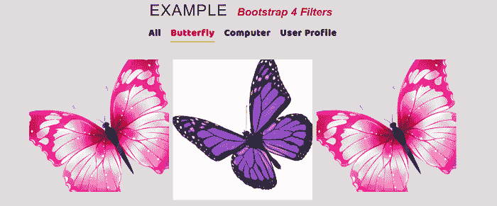
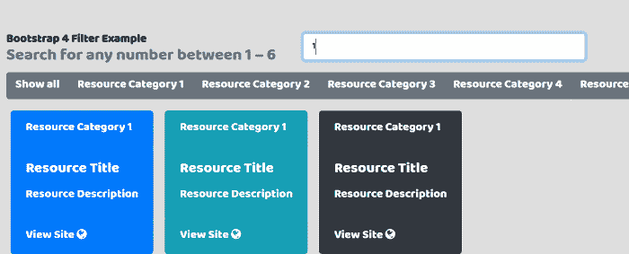

# 自举 4 过滤器

> 原文：<https://www.javatpoint.com/bootstrap-4-filters>

在本文中，我们将讨论 bootstrap 4 中的过滤器功能。

### 你说的过滤器是什么意思？

在 bootstrap 4 中，没有数据过滤器的特殊组件。所以在这里我们需要额外的 jQuery 库，比如同位素等等。用于过滤表格、列表和菜单等中的数据。

**我们举以下 bootstrap 4 过滤器的例子。**

### 例 1:

```

<! DOCTYPE html>          
<html lang = "en">          
<head>          
  <title> Bootstrap 4 filters Example </title>          
  <meta charset = "utf-8">          
  <meta name = "viewport" content = "width = device-width, initial-scale = 1">          
  <link rel = "stylesheet" href = "https://maxcdn.bootstrapcdn.com/bootstrap/4.1.3/css/bootstrap.min.css">          
  <script src = "https://ajax.googleapis.com/ajax/libs/jquery/3.3.1/jquery.min.js"> </script>          
  <script src = "https://cdnjs.cloudflare.com/ajax/libs/popper.js/1.14.3/umd/popper.min.js"> </script>          
  <script src = "https://maxcdn.bootstrapcdn.com/bootstrap/4.1.3/js/bootstrap.min.js"> </script>          
   <link href = "https://maxcdn.bootstrapcdn.com/font-awesome/4.7.0/css/font-awesome.min.css" rel = "stylesheet">      
<script src="https://unpkg.com/isotope-layout@3/dist/isotope.pkgd.min.js"></script>   
</head>          
<style>    
@import 'https://fonts.googleapis.com/css?family=Baloo+Tamma';  
* {  
  padding: 0;  
  margin: 0;  
  font-family: "Baloo Tamma", cursive;  
  font-size: 24px;  
}  
body {  
  background: #ddd;  
  width: 100%;  
  height: 100%;  
  padding: 50px;  
  box-sizing: border-box;  
}  
.heading h1 {  
  text-align: center;  
  color: #222;   
  font-size: 40px;   
  font-weight: 300;  
  text-transform: uppercase;  
  word-spacing: 1px;   
  letter-spacing: 2px;   
  color: black;  
  margin: 10px;  
  font-family: "Rubik", sans-serif;  
}  
.heading h1 span {  
  line-height: 2em;   
  padding-bottom :5px;  
  text-transform: none;  
  font-size: .7em;  
  margin: 10px;  
  font-weight: bold;  
  font-style: italic;   
  font-family: "Rubik", sans-serif;  
  color: #a12626;  
 letter-spacing: -0.005em;   
  word-spacing: 1px;  
}  
.heading h1:after {  
  position: absolute;  
  left: 0;  
  bottom: 0;  
  width: 45px;  
  height: 4px;  
  content: " ";  
  right: 45px;   
  margin: auto;  
  background-color: #ccc;  
}  
body{ margin-top:20px; }
.filtering {
    margin-bottom: 40px;
}
.filtering span {
    border-bottom: 2px solid transparent;
    color: #282b2d;
    cursor: pointer;
    font-size: 25px;
    font-weight: 600;
    letter-spacing: 1px;
    margin-right: 20px;
    display: inline-block;
    margin-bottom: 5px;
}
.filtering span:last-child {
    margin: 0;
}
.filtering .active {
    border-color: #ccde02;
    color: red;
}
.portfolio-wrapper {
    position: relative;
    overflow: hidden;
}
.portfolio-overlay {
    position: absolute;
    left: 0;
    top: 0;
    height: 100%;
    width: 100%;
    transition: all 500ms ease;
}
.portfolio-wrapper .portfolio-image img {
    transform: scale(1.2);
    will-change: transform;
    transition: all 0.5s ease;
    width: 100%;
}
.portfolio-wrapper:hover .portfolio-image img {
    transform: none;
}
.portfolio-overlay:before {
    position: absolute;
    display: inline-block;
    top: 15px;
    right: 15px;
    bottom: 15px;
    left: 15px;
    border: 1px solid rgba(0, 0, 0, 0.36);
    content: "";
    opacity: 0;
    transition: all 0.5s ease;
    transform: scale(0.85);
}
.portfolio-overlay .portfolio-content {
    position: absolute;
    bottom: 50%;
    left: 0;
    width: 100%;
    text-align: center;
    opacity: 0;
    padding: 0 35px;
}
.portfolio-content h4 {
    color: #000;
    font-weight: 600;
    font-size: 20px;
    text-transform: capitalize;
    letter-spacing: 1px;
    margin-bottom: 15px;
}
.portfolio-content p {
    color: #000;
    font-weight: 500;
    letter-spacing: 1px;
    margin-bottom: 0;
}
.portfolio-content > a {
    line-height: 42px;
    width: 40px;
    height: 40px;
    border-radius: 50%;
    color: #000;
    display: inline-block;
    text-align: center;
    margin-bottom: 15px;
    font-weight: 800;
}
.portfolio-wrapper:hover .portfolio-overlay {
    background-color: rgba(204, 222, 2, 0.85);
}
.portfolio-wrapper:hover .portfolio-overlay:before {
    opacity: 1;
    visibility: visible;
    transform: none;
}
.portfolio-wrapper:hover .portfolio-overlay .portfolio-content {
    transform: translateY(50%);
    transition: transform 0.5s ease;
    opacity: 1;
}
@media screen and (max-width: 1199px) {
    .portfolio-content h4 {
        font-size: 18px;
    }
}
@media screen and (max-width: 991px) {
    .portfolio-content h4 {
        margin-bottom: 10px;
    }
    .portfolio-content p {
        font-size: 15px;
    }
    .portfolio-content > a {
        margin-bottom: 10px;
    }
}
@media screen and (max-width: 767px) {
    .portfolio-content h4 {
        font-size: 17px;
    }
    .portfolio-content p {
        font-size: 14px;
    }
}
@media screen and (max-width: 575px) {
    .portfolio-content h4 {
        font-size: 16px;
    }
}
.grid .grid-item {
    position: relative;
    overflow: hidden;
}
.grid .grid-item .portfolio-wrapper {
    position: relative;
    overflow: hidden;
}
.grid .grid-item .portfolio-overlay {
    position: absolute;
    left: 0;
    top: 0;
    height: 100%;
    width: 100%;
    transition: all 500ms ease;
}
.grid .grid-item .portfolio-wrapper .portfolio-image img {
    transform: none;
    will-change: transform;
    transition: none;
    width: 100%;
}
.grid .grid-item .portfolio-wrapper:hover .portfolio-image img {
    transform: none;
}
.grid .grid-item .portfolio-overlay:before {
    position: absolute;
    display: inline-block;
    top: 15px;
    right: 15px;
    bottom: 15px;
    left: 15px;
    border: 1px solid rgba(0, 0, 0, 0.36);
    content: "";
    opacity: 0;
    transition: all 0.5s ease;
    transform: scale(0.85);
}
.grid .grid-item .portfolio-overlay .portfolio-content {
    position: absolute;
    bottom: 50%;
    left: 0;
    width: 100%;
    text-align: center;
    opacity: 0;
}
.grid .grid-item .portfolio-content h4 {
    color: #000;
    font-weight: 600;
    letter-spacing: 1px;
    font-size: 20px;
    margin-bottom: 10px;
}
.grid .grid-item .portfolio-content p {
    color: #000;
    font-weight: 500;
    letter-spacing: 1px;
    margin-bottom: 0;
}
.grid .grid-item .portfolio-content a {
    line-height: 36px;
    width: 36px;
    height: 36px;
    border-radius: 50%;
    color: #000;
    display: inline-block;
    text-align: center;
    margin-bottom: 10px;
    font-weight: 800;
}
.grid .grid-item .portfolio-wrapper:hover .portfolio-overlay {
    background-color: rgba(204, 222, 2, 0.85);
}
.grid .grid-item .portfolio-wrapper:hover .portfolio-overlay:before {
    opacity: 1;
    visibility: visible;
    transform: none;
}
.grid .grid-item .portfolio-wrapper:hover .portfolio-overlay .portfolio-content {
    transform: translateY(50%);
    transition: transform 0.5s ease;
    opacity: 1;
}
@media screen and (max-width: 1199px) {
    .grid .grid-item .portfolio-content h4 {
        font-size: 18px;
    }
}
@media screen and (max-width: 991px) {
    .grid .grid-item .portfolio-content h4 {
        margin-bottom: 10px;
    }
    .grid .grid-item .portfolio-content p {
        font-size: 15px;
    }
    .grid .grid-item .portfolio-content a {
        margin-bottom: 10px;
    }
}
@media screen and (max-width: 767px) {
    .grid .grid-item .portfolio-content h4 {
        font-size: 17px;
    }
    .grid .grid-item .portfolio-content p {
        font-size: 14px;
    }
}
@media screen and (max-width: 575px) {
    .grid .grid-item .portfolio-content h4 {
        font-size: 16px;
    }
    .grid .grid-item .portfolio-overlay:before {
        top: 10px;
        right: 10px;
        bottom: 10px;
        left: 10px;
    }
}
</style>
<script src="https://cdnjs.cloudflare.com/ajax/libs/jquery.isotope/3.0.6/isotope.pkgd.min.js" integrity="sha512-Zq2BOxyhvnRFXu0+WE6ojpZLOU2jdnqbrM1hmVdGzyeCa1DgM3X5Q4A/Is9xA1IkbUeDd7755dNNI/PzSf2Pew==" crossorigin="anonymous"> </script>
<section>
<center>  
<div class = "heading">  
  <h1> Example  
    <span> Bootstrap 4 Filters
 </span>  
  </h1> 
    <div class="container">
        <div class="row no-gutters">
            <div class="filtering col-sm-12 text-center">
                <span data-filter="*" class="active"> All </span>
                <span data-filter= ".architecture" class=""> Butterfly </span>
                <span data-filter=".decor" class=""> Computer </span>
                <span data-filter=".interior" class=""> User Profile </span>
            </div>
            <div class="col-12 text-center w-100">
                <div class="form-row gallery">
                    <div class="col-sm-6 col-lg-4 mb-2 interior">
                        <div class="portfolio-wrapper">
                            <div class="portfolio-image">
                                
                            </div>
                            <div class="portfolio-overlay">
                                <div class="portfolio-content">
                                    <a class="popimg ml-0" href="#">
                                        <i class="ti-zoom-in display-24 display-md-23 display-lg-22 display-xl-20"></i>
                                    </a>
                                    <h4> User Profile </h4>
                                  </div>
                            </div>
                        </div>
                    </div>
                    <div class="col-sm-6 col-lg-4 mb-2 decor ">
                        <div class="portfolio-wrapper">
                            <div class="portfolio-image">
                                
                            </div>
                            <div class="portfolio-overlay">
                                <div class="portfolio-content">
                                    <a class="popimg ml-0" href="#">
                                        <i class="ti-zoom-in display-24 display-md-23 display-lg-22 display-xl-20"></i>
                                    </a>
                                    <h4> Computer Desktop </h4>
                                </div>
                            </div>
                        </div>
                    </div>
                    <div class="col-sm-6 col-lg-4 mb-2 architecture">
                        <div class="portfolio-wrapper">
                            <div class="portfolio-image">
                                
                            </div>
                            <div class="portfolio-overlay">
                                <div class="portfolio-content">
                                    <a class="popimg ml-0" href="#">
                                        <i class="ti-zoom-in display-24 display-md-23 display-lg-22 display-xl-20"></i>
                                    </a>
                                    <h4> Butterfly </h4>
                                </div>
                            </div>
                        </div>
                    </div>
                    <div class="col-sm-6 col-lg-4 mb-2 mb-lg-0 architecture">
                        <div class="portfolio-wrapper">
                            <div class="portfolio-image">
                                
                            </div>
                            <div class="portfolio-overlay">
                                <div class="portfolio-content">
                                    <a class="popimg ml-0" href="#">
                                        <i class="ti-zoom-in display-24 display-md-23 display-lg-22 display-xl-20"></i>
                                    </a>
                                    <h4> Butterfly </h4>
                                </div>
                            </div>
                        </div>
                    </div>
                    <div class="col-sm-6 col-lg-4 mb-2 mb-sm-0 architecture">
                        <div class="portfolio-wrapper">
                            <div class="portfolio-image">
                                
                            </div>
                            <div class="portfolio-overlay">
                                <div class="portfolio-content">
                                    <a class="popimg ml-0" href="#">
                                        <i class="ti-zoom-in display-24 display-md-23 display-lg-22 display-xl-20"></i>
                                    </a>
                                    <h4> Butterfly </h4>
                                </div>
                            </div>
                        </div>
                    </div>
                    <div class="col-sm-6 col-lg-4 interior">
                        <div class="portfolio-wrapper">
                            <div class="portfolio-image">
                                
                            </div>
                            <div class="portfolio-overlay">
                                <div class="portfolio-content">
                                    <a class="popimg ml-0" href="#">
                                        <i class="ti-zoom-in display-24 display-md-23 display-lg-22 display-xl-20"></i>
                                    </a>
                                    <h4> Logo </h4>

                                </div>
                            </div>
                        </div>
                    </div>
                </div>
            </div>
        </div>
    </div>
</section>
<script>
$(function(){
    $(".filtering").on("click", "span", function () {
        var a = $(".gallery").isotope({});
        var e = $(this).attr("data-filter");
        a.isotope({ filter: e });
    });
    $(".filtering").on("click", "span", function () {
        $(this).addClass("active").siblings().removeClass("active");
    });
})
</script>
</body>
</html> 

```

**说明:**

在上面的例子中，我们创建了一个 bootstrap 4 过滤器的例子。在此，我们借助同位素库创建了过滤器功能。

**输出:**

下面是这个例子的输出。



### 例 2

```

<! DOCTYPE html>          
<html lang = "en">          
<head>          
  <title> Bootstrap 4 filters Example </title>          
  <meta charset = "utf-8">          
  <meta name = "viewport" content = "width = device-width, initial-scale = 1">          
  <link rel = "stylesheet" href = "https://maxcdn.bootstrapcdn.com/bootstrap/4.1.3/css/bootstrap.min.css">          
  <script src = "https://ajax.googleapis.com/ajax/libs/jquery/3.3.1/jquery.min.js"> </script>          
  <script src = "https://cdnjs.cloudflare.com/ajax/libs/popper.js/1.14.3/umd/popper.min.js"> </script>          
  <script src = "https://maxcdn.bootstrapcdn.com/bootstrap/4.1.3/js/bootstrap.min.js"> </script>          
   <link href = "https://maxcdn.bootstrapcdn.com/font-awesome/4.7.0/css/font-awesome.min.css" rel = "stylesheet">      
<script src="https://unpkg.com/isotope-layout@3/dist/isotope.pkgd.min.js"></script>   
</head>          
<style>    
@import 'https://fonts.googleapis.com/css?family=Baloo+Tamma';  
* {  
  padding: 0;  
  margin: 0;  
  font-family: "Baloo Tamma", cursive;  
  font-size: 24px;  
}  
body {  
  background: #ddd;  
  width: 100%;  
  height: 100%;  
  padding: 50px;  
  box-sizing: border-box;  
}  
.heading h1 {  
  text-align: center;  
  color: #222;   
  font-size: 40px;   
  font-weight: 300;  
  text-transform: uppercase;  
  word-spacing: 1px;   
  letter-spacing: 2px;   
  color: black;  
  margin: 10px;  
  font-family: "Rubik", sans-serif;  
}  
.heading h1 span {  
  line-height: 2em;   
  padding-bottom :5px;  
  text-transform: none;  
  font-size: .7em;  
  margin: 10px;  
  font-weight: bold;  
  font-style: italic;   
  font-family: "Rubik", sans-serif;  
  color: #a12626;  
 letter-spacing: -0.005em;   
  word-spacing: 1px;  
}  
.heading h1:after {  
  position: absolute;  
  left: 0;  
  bottom: 0;  
  width: 45px;  
  height: 4px;  
  content: "";  
  right: 45px;   
  margin: auto;  
  background-color: #ccc;  
}  
* { box-sizing: border-box; }

body {
  font-family: sans-serif;
}
input[type="text"] {
  font-size: 20px;
}

.container {
  max-width: 100%;
  padding: 1rem;
  margin-bottom: 10px;
}
.button {
  display: inline-block;
  padding: 0.5em 1.0em;
  margin-bottom: 10px;
  background: #EEE;
  border: none;
  border-radius: 7px;
  background-image: linear-gradient( to bottom, hsla(0, 0%, 0%, 0), hsla(0, 0%, 0%, 0.2) );
  color: #222;
  font-family: sans-serif;
  font-size: 16px;
  text-shadow: 0 1px white;
  cursor: pointer;
}
.button:hover {
  background-color: #8CF;
  text-shadow: 0 1px hsla(0, 0%, 100%, 0.5);
  color: #222;
}
.button:active {
. background-color: #28F;
  }
.button.is-checked {
  color: white;
background-color: #28F;
  text-shadow: 0 -1px hsla(0, 0%, 0%, 0.8);
}
.button:active {
  box-shadow: inset 0 1px 10px hsla(0, 0%, 0%, 0.8);
}
.bg-primary
.bg-secondary
.bg-success
.bg-danger
.bg-info
.bg-dark, a:link, a:visited, a:hover, a:active {
  color: #ffffff;
}
.bg-primary
.bg-secondary
.bg-success
.bg-danger
.bg-info
.bg-dark
.bg-warning {
  color: #ffffff;
}
.card {
  margin: 0 1em 1em 0;
}
</style>
<body>
<div class = "container">
  <div class = "row">
    <div class = "col-lg-6">
      <h3> <strong> Bootstrap 4 Filter Example </strong> <br>
        <small class = "text-muted"> Search for any number between 1 ? 6 </small>
      </h3>
    </div>
    <div class = "col-lg-6">
      <input type = "text" class = "form-control" id = "quicksearch" aria-describedby = "filterIt" placeholder = "Search">
    </div>    
  </div>
  <div class = "row">
     <div class = "col-lg-12">
        <div id = "filters" class = "btn-group" role = "group" aria-label = "Basic example">
          <button type = "button" class = "btn btn-secondary is-checked" data-filter = "*"> Show all </button>
          <button type = "button" class = "btn btn-secondary" data-filter = ".metal"> Resource Category 1 </button>
          <button type = "button" class = "btn btn-secondary" data-filter = ".transition"> Resource Category 2 </button>
          <button type = "button" class = "btn btn-secondary" data-filter = ".alkali, .alkaline-earth"> Resource Category 3 </button>
          <button type = "button" class = "btn btn-secondary" data-filter = ":not(.transition)"> Resource Category 4 </button>
          <button type = "button" class = "btn btn-secondary" data-filter = ".metal:not(.transition)"> Resource Category 5 </button> 
        </div>  
    </div>
  </div>
  <div class = "row">  
    <div class = "col-sm-12 col-lg-12">
      <div class = "card text-white bg-primary">
          <div class = "card-header"> Resource Category 1 </div>
          <div class = "card-body">
            <h5 class = "card-title"> Resource Title </h5>
            <p class = "card-text"> Resource Description </p>
          </div>
          <div class = "card-footer">
            <a href = "#" class = "card-link" target = "_blank"> View Site 
              <i class = "fa fa-globe" aria-hidden = "true"> </i>
            </a>            
          </div>
        </div>
      <div class="card text-white bg-secondary">
<div class = "card-header"> Resource Category 2 </div>
          <div class = "card-body">
            <h5 class = "card-title"> Resource Title </h5>
            <p class = "card-text"> Resource Description </p>
          </div>
          <div class = "card-footer">
            <a href = "#" class = "card-link" target = "_blank"> View Site 
              <i class = "fa fa-globe" aria-hidden = "true"> </i>
            </a>            
          </div>
        </div>
        <div class="card text-white bg-danger">
          <div class = "card-header"> Resource Category 3 </div>
          <div class = "card-body">
            <h5 class = "card-title"> Resource Title </h5>
            <p class = "card-text"> Resource Description </p>
          </div>
          <div class = "card-footer">
            <a href = "#" class = "card-link" target = "_blank"> View Site 
              <i class = "fa fa-globe" aria-hidden = "true"> </i>
            </a>            
          </div>
        </div>
              <div class="card text-white bg-info">
          <div class = "card-header"> Resource Category 1 </div>
          <div class = "card-body">
            <h5 class = "card-title"> Resource Title </h5>
            <p class = "card-text"> Resource Description </p>
          </div>
          <div class = "card-footer">
            <a href = "#" class = "card-link" target = "_blank"> View Site 
              <i class = "fa fa-globe" aria-hidden = "true"> </i>
            </a>            
          </div>
        </div>
              <div class="card text-white bg-dark">
          <div class = "card-header"> Resource Category 1 </div>
          <div class = "card-body">
            <h5 class = "card-title"> Resource Title </h5>
            <p class = "card-text"> Resource Description </p>
          </div>
          <div class = "card-footer">
            <a href = "#" class = "card-link" target = "_blank"> View Site 
              <i class = "fa fa-globe" aria-hidden = "true"> </i>
            </a>            
          </div>
        </div>
        <div class="card text-white bg-primary">
          <div class = "card-header"> Resource Category 1 </div>
          <div class = "card-body">
            <h5 class = "card-title"> Resource Title </h5>
            <p class = "card-text"> Resource Description </p>
          </div>
          <div class = "card-footer">
            <a href = "#" class = "card-link" target = "_blank"> View Site 
              <i class = "fa fa-globe" aria-hidden = "true"> </i>
            </a>            
          </div>
        </div>
              <div class="card text-white bg-dark">
<div class = "card-header"> Resource Category 1 </div>
          <div class = "card-body">
            <h5 class = "card-title"> Resource Title </h5>
            <p class = "card-text"> Resource Description </p>
          </div>
          <div class = "card-footer">
            <a href = "#" class = "card-link" target = "_blank"> View Site 
              <i class = "fa fa-globe" aria-hidden = "true"> </i>
            </a>            
          </div>
        </div> 
              <div class="card text-white bg-success">
<div class = "card-header"> Resource Category 1 </div>
          <div class = "card-body">
            <h5 class = "card-title"> Resource Title </h5>
            <p class = "card-text"> Resource Description </p>
          </div>
          <div class = "card-footer">
            <a href = "#" class = "card-link" target = "_blank"> View Site 
              <i class = "fa fa-globe" aria-hidden = "true"> </i>
            </a>            
          </div>
        </div>     

        <div class="card text-white bg-secondary">
          <div class = "card-header"> Resource Category 1 </div>
          <div class = "card-body">
            <h5 class = "card-title"> Resource Title </h5>
            <p class = "card-text"> Resource Description </p>
          </div>
          <div class = "card-footer">
            <a href = "#" class = "card-link" target = "_blank"> View Site 
              <i class = "fa fa-globe" aria-hidden = "true"> </i>
            </a>            
          </div>
        </div>
<div class="card text-white bg-secondary">
          <div class = "card-header"> Resource Category 1 </div>
          <div class = "card-body">
            <h5 class = "card-title"> Resource Title </h5>
            <p class = "card-text"> Resource Description </p>
          </div>
          <div class = "card-footer">
            <a href = "#" class = "card-link" target = "_blank"> View Site 
              <i class = "fa fa-globe" aria-hidden = "true"> </i>
            </a>            
          </div>
        </div>
<div class="card text-white bg-secondary">
          <div class = "card-header"> Resource Category 1 </div>
          <div class = "card-body">
            <h5 class = "card-title"> Resource Title </h5>
            <p class = "card-text"> Resource Description </p>
          </div>
          <div class = "card-footer">
            <a href = "#" class = "card-link" target = "_blank"> View Site 
              <i class = "fa fa-globe" aria-hidden = "true"> </i>
            </a>            
          </div>
        </div>
<div class="card text-white bg-secondary">
          <div class = "card-header"> Resource Category 1 </div>
          <div class = "card-body">
            <h5 class = "card-title"> Resource Title </h5>
            <p class = "card-text"> Resource Description </p>
          </div>
          <div class = "card-footer">
            <a href = "#" class = "card-link" target = "_blank"> View Site 
              <i class = "fa fa-globe" aria-hidden = "true"> </i>
            </a>            
          </div>
        </div>
<div class="card text-white bg-secondary">
          <div class = "card-header"> Resource Category 1 </div>
          <div class = "card-body">
            <h5 class = "card-title"> Resource Title </h5>
            <p class = "card-text"> Resource Description </p>
          </div>
          <div class = "card-footer">
            <a href = "#" class = "card-link" target = "_blank"> View Site 
              <i class = "fa fa-globe" aria-hidden = "true"> </i>
            </a>            
          </div>
        </div>
<div class="card text-white bg-secondary">
          <div class = "card-header"> Resource Category 1 </div>
          <div class = "card-body">
            <h5 class = "card-title"> Resource Title </h5>
            <p class = "card-text"> Resource Description </p>
          </div>
          <div class = "card-footer">
            <a href = "#" class = "card-link" target = "_blank"> View Site 
              <i class = "fa fa-globe" aria-hidden = "true"> </i>
            </a>            
          </div>
        </div>
                <div class="card text-white bg-primary">
<div class = "card-header"> Resource Category 1 </div>
          <div class = "card-body">
            <h5 class = "card-title"> Resource Title </h5>
            <p class = "card-text"> Resource Description </p>
          </div>
          <div class = "card-footer">
            <a href = "#" class = "card-link" target = "_blank"> View Site 
              <i class = "fa fa-globe" aria-hidden = "true"> </i>
            </a>            
          </div>
        </div>   
        <div class = "card text-white bg-primary">
          <div class = "card-header"> Resource Category 3 </div>
          <div class = "card-body">
            <h5 class = "card-title"> Resource Title </h5>
            <p class = "card-text"> Resource Description </p>
          </div>
          <div class = "card-footer">
            <a href = "#" class = "card-link" target = "_blank"> View Site 
              <i class = "fa fa-globe" aria-hidden = "true"> </i>
            </a>            
          </div>
        </div>      
    </div>
  </div>
</div>     
<script>
var qsRegex;
var buttonFilter;
var $grid = $(".container").isotope({
  itemSelector: ".card",
  layoutMode: "fitRows",
  filter: function () {
    var $this = $(this);
    var searchResult = qsRegex ? $this.text().match(qsRegex) : true;
    var buttonResult = buttonFilter ? $this.is(buttonFilter) : true;
    return searchResult && buttonResult;
  }
});
$("#filters").on("click", "button", function () {
  buttonFilter = $(this).attr("data-filter");
  $grid.isotope();
});
var $quicksearch = $("#quicksearch").keyup(
  debounce(function () {
    qsRegex = new RegExp($quicksearch.val(), "gi");
    $grid.isotope();
  })
);
$(".btn-group").each(function (i, buttonGroup) {
  var $buttonGroup = $(buttonGroup);
  $buttonGroup.on("click", "button", function () {
    $buttonGroup.find(".is-checked").removeClass("is-checked");
    $(this).addClass("is-checked");
  });
});
function debounce(fn, threshold) {
  var timeout;
  return function debounced() {
    if (timeout) {
      clearTimeout(timeout);
    }
    function delayed() {
      fn();
      timeout = null;
    }
    setTimeout(delayed, threshold || 100);
  };
}
</script>
</body>
</html>

```

**说明:**

在上面的例子中，我们创建了一个 bootstrap 4 过滤器的例子。在这里，我们创建了一个带有搜索栏和同位素的过滤器功能。

**输出:**

下面是这个例子的输出。



* * *