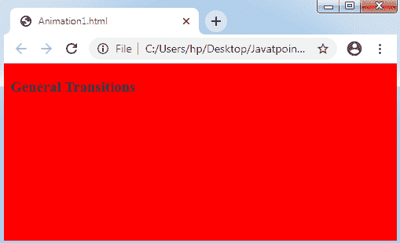
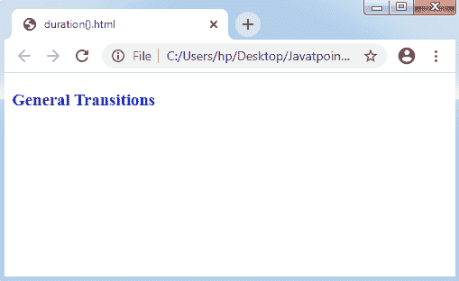
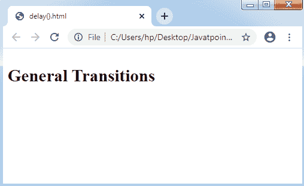

# D3.js 中的动画

> 原文：<https://www.javatpoint.com/animation-in-d3-js>

D3.js 通过转换为动画提供支持。我们可以创建动画以及一个很好的过渡应用。过渡是**关键帧动画**的任意有限模式，以及两个关键帧，即**开始**和**结束**。

**关键帧开始**通常是 DOM 的当前状态，而**关键帧结束**是我们描述的一组样式、属性和其他属性。该转换非常适合于任何新视图的转换，而不需要任何依赖于开始视图的复杂代码。

考虑下面的例子:

**示例:**

在下面的示例中，文档背景的颜色从白色修改为石灰色，再修改为红色。

让我们通过下图来理解这个概念:

```

 <!DOCTYPE html>
<html>
<head>
<script type= "text/javascript" src= "https://d3js.org/d3.v4.min.js">
</script>
</head>
<body>
<h3> General Transitions </h3>
<script>
d3.select("body").style("background-color","lime")
//set the background-color lime.transition()
.style("background-color","red");
//set the background-color red
</script>
</body>
</html>

```

**输出:**



## 方法

下面列出了三种方法:

### 1.持续时间()方法

此方法允许属性更改在任何指定的持续时间内有效显示，而不是立即显示。

让我们用下面的例子创建一个 5 秒钟的转换:

**示例:**

```

<!DOCTYPE html>
<html>
<head>
<script type= "text/javascript" src= "https://d3js.org/d3.v4.min.js">
</script>
</head>
<body>
<h3> General Transitions </h3>
<script>
d3.select("body").transition().style("color","blue").duration(5000);
</script>
</body>
</html>

```

**输出**



在上图中，过渡看起来均匀而有效。此外，我们可以使用以下代码直接分配 RGB 颜色的代码值:

### 2.插值()方法

[D3.js](d3-js) 支持以下基本插值类型:

*   **插值字符串:**支持字符串。
*   **插值器:**支持颜色。
*   **插值编号:**支持数值。

D3 提供了使用适当插值技术和一些高级情况的工具。此外，我们可以直接应用插值技术来获取我们的基本结果。如果需要，我们甚至可以制定任何新的插值方法。

**语法:**

```

d3.interpolate(a, b)

```

### 3.延迟()方法

该方法允许在任何特定时间段后转换到抓取位置。

请看下图:

**示例:**

```

<!DOCTYPE html>
<html>
<head>
<script type= "text/javascript" src= "https://d3js.org/d3.v4.min.js">
</script>
</head>
<body>
<h3> General Transitions </h3>
<script>
d3.selectAll("h3").transition()
.style("font-size","29px").delay(2000).duration(2000);
</script>
</body>
</html>

```

**输出:**



## 过渡生命周期

过渡的生命周期分为以下四个阶段:

*   已计划过渡
*   过渡开始
*   过渡运行
*   过渡结束

### 已计划过渡

创建转换时，会对其进行调度。如果我们调用 selection.transition 方法，那么我们就安排了一个转换。如果我们调用 style()，attr()，以及另一个过渡来描述关键帧结束，也可能发生这种情况。

### 过渡开始

任何转换都是根据其延迟开始的，如果计划了转换，则会对延迟进行描述。如果没有描述任何延迟，转换会在几毫秒后尽早开始。

当转换包含延迟时，必须在转换开始时设置开始值。因此，我们可以通过监听任何 start 事件来实现它:

```

d3.select("body")
.transition()
 .delay(200)
.each("start", function() { d3.select(this).style("color", "green"); })
 .style("color", "red");

```

### 过渡运行

如果转换执行，那么它将重复调用转换的值，范围从 0 到 1。过渡很容易管理时间，扭曲时间，就像慢进慢出。一些简单的函数可以暂时提供小于 0 和大于 1 的 t 值。

### 过渡结束

生命周期的这个阶段代表着结束的时间总是恰好是一个。因此，如果转换将精确结束，则结束中的任何值都将被设置。过渡根据其持续时间和延迟结束。过渡结束时，将调度结束事件。

* * *