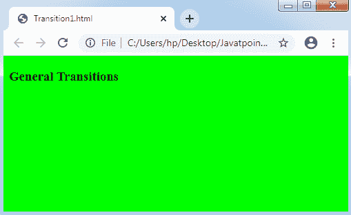

# D3.js 转换

> 原文：<https://www.javatpoint.com/d3-js-transition>

转换是将元素的单个状态修改为其他状态的过程。D3.js 给出了 transition()技术来执行 [HTML](https://www.javatpoint.com/html-tutorial) 页面内部的转换过程。

让我们在这个 [D3.js](d3-js) 过渡章节中了解一下过渡()技术的过程。

### 过渡()方法

该方法存在于每个选择器中，并启动转换过程。支持**风格()、**和 **attr()** 等多种选择方式。但是，transition()方法不支持 data()和 append()方法。它还给出了过渡的具体技巧，如**轻松()、**T6】持续时间等。

一般过渡可以表示如下:

```

d3.select("body")
   .transition()
   .style("background-color", "lime");

```

也可以通过一个名为 d3.transition()的方法直接创建转换，然后使用如下所示的选择器进行应用:

```

var t = d3.transition()
   .duration(2000);
d3.select("body")
   .transition(t)
   .style("background-color", "lime");

```

让我们考虑一个例子。

**示例:**

在下面的示例中，我们将选择主体项，并通过调用 transition()方法启动转换。之后，我们将指示将背景颜色从白色转换为石灰色。

让我们创建一个插图来确定 transition()方法是如何工作的。

```

<!DOCTYPE html>
<html>
<head>
<script type= "text/javascript" src= "https://d3js.org/d3.v4.min.js">
</script>
</head>
<body>
<h3> General Transitions </h3>
<script>
d3.select("body").transition().style("background-color","lime");
</script>
</body>
</html>

```

**输出:**



如果我们进一步想将背景的颜色从石灰色更改为另一种颜色，我们可以简单地更改颜色如下:

```

d3.select("body").transition().style("background-color", "red");

```

* * *