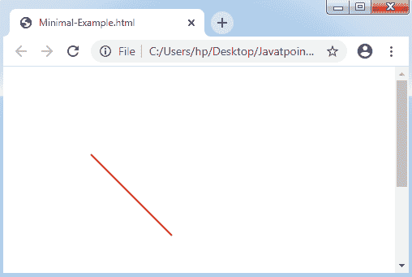
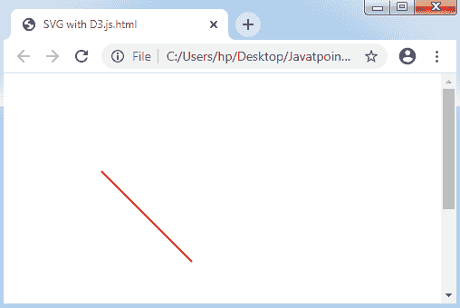
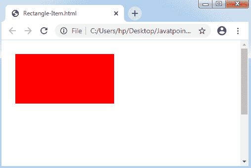
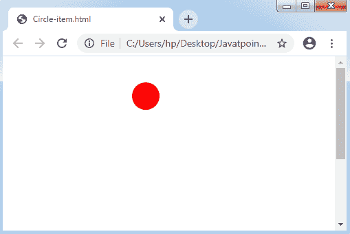
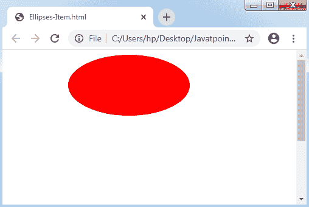

# What is SVG？

> 哎哎哎:# t0]https://www . javatppoint . com/D3-js-SVG

SVG 的完整形式是**可伸缩矢量图形**。它是一种基于 XML 的矢量图形类型格式。它提供了各种选项来设计不同的形状，如**椭圆、圆、矩形、**和**线**。因此，沿着 SVG 的可视化设计为我们提供了更多的灵活性和力量。

## 奇异值分解特征

一些 [SVG](https://www.javatpoint.com/svg-tutorial) 特性如下:

*   SVG 是基于文本的，是一种基于矢量的图像格式。
*   SVG 与 HTML 结构相同。
*   可以用 **DOM(文档对象模型)**来说明。
*   SVG 的属性可以用属性来描述。
*   SVG 必须包含相对于原点位置(0，0)的绝对位置。
*   SVG 可以像在任何 HTML 文档中一样添加。

### 最小插图

让我们制作一个 SVG 图像，并将其添加到一个 [HTML](https://www.javatpoint.com/html-tutorial) 文档中。

**第一步:**制作 SVG 图像。我们将设置此图像的高度为 400 像素，宽度为 400 像素。

```

<svg width = "300" height = "300">
</svg>

```

上面的 **< svg >** 标记开始了 svg 图像。它以高度和宽度作为属性。SVG 有默认格式，即**像素**。

**第二步:**使线从点(100，100)开始，到点(200，100)结束，并固定线的颜色。

```

<line x1 = "100" y1 = "100" x2 = "200" y2 = "200" 
   style = "stroke:rgb(255,0,0);stroke-width:2"/>

```

哪里，

**x1:** 第一点的 x 坐标

**y1:** 第一点的 y 坐标

**x2:** 第二点的 x 坐标

**y2:** 第二点的 y 坐标

**笔画:**线条的颜色

**笔画宽度:**线条粗细

**第三步:**制作任意 HTML 文档，将 SVG(如上所述)组合如下:

```

<!DOCTYPE html>
<html>
<head>
<script type = "text/javascript" src = "https://d3js.org/d3.v4.min.js">
</script>
<style>
body {font-family: Arial;}
</style> 
</head>
<body>
<div id= "svgcontainer">
<svg width= "400" height= "400">
<line x1= "100" y1= "100" 
x2= "200" y2= "200" style= "stroke:rgb(255,0,0);
stroke-width:2"/>
</svg>
</div>
<p></p>
<p></p>
</body>
</html> 

```

**输出:**



### SVG 在 D3 上。联署材料

为了创建带有 [D3.js](d3-js) 的 SVG，让我们看下面的插图:

**示例:**

SVG 容器将获取 SVG 图像。我们可以借助名为 select()方法的**方法**来选择 SVG 容器。之后，将使用名为 append()方法的方法注入 SVG 元素。使用 style()和 attr()方法包含样式和属性。

```

<!DOCTYPE html>
<html>
<head>
<script type = "text/javascript" src = "https://d3js.org/d3.v4.min.js">
</script>
<style>
body {font-family: Arial;}
</style> 
</head>
<body>
<div id= "svgcontainer">
</div>  
<script language= "javascript">
var width= 400;
var height= 400;
var svg= d3.select("#svgcontainer")
.append("svg")
.attr("width", width)
.attr("height", height);
svg.append("line")
.attr("x1", 100)
.attr("y1", 100)
.attr("x2", 200)
.attr("y2", 200)
.style("stroke", "rgb(255,0,0)")
.style("stroke-width", 2);
</script>
</body>
</html>

```

**输出:**



### 矩形项目

矩形可以用<rect>来表示，如下例所示:</rect>

**示例:**

```

<!DOCTYPE html>
<html>
<head>
<script type = "text/javascript" src = "https://d3js.org/d3.v4.min.js">
</script>
</head>
<body>
<div id= "svgcontainer">
</div>  
<script>
var width= 400;
var height= 400;
// Making a SVG Item
var svg= d3.select("#svgcontainer")
.append("svg")
.attr("width", width)
.attr("height", height);
// Appending and making rectangle item
svg.append("rect")
.attr("x", 20)
.attr("y", 20)
.attr("width", 200)
.attr("height", 100)
.attr("fill", "red");
</script>
</body>
</html>

```

**属性-**

**x:** 矩形左上角的 x 坐标。

**y:** 矩形左上角的 y 坐标。

**宽度:**表示矩形的宽度。

**高度:**代表矩形的高度。

**输出:**



### 圆形项目

一个圆可以用一个标签<circle>来表示，如下例所示:</circle>

**示例:**

```

<!DOCTYPE html>
<html>
<head>
<script type = "text/javascript" src = "https://d3js.org/d3.v4.min.js">
</script>
</head>
<body>
<div id= "svgcontainer">
</div>  
<script>
var width= 400;
var height= 400;
// Making a SVG Item
var svg= d3.select("#svgcontainer")
.append("svg")
.attr("width", width)
.attr("height", height);
// Appending the Circle Item
svg.append("circle")
.attr("cx", 200)
.attr("cy", 50)
.attr("r", 20)
.attr("fill", "red");
</script>
</body>
</html> 

```

**属性-**

**cx:** 圆心的 x 坐标。

**cy:** 圆心的 y 坐标。

**r:** 代表圆的半径。

**输出:**



### 省略号

它可以由标签<ellipses>表示，如下例所述:</ellipses>

```

<!DOCTYPE html>
<html>
<head>
<script type = "text/javascript" src = "https://d3js.org/d3.v4.min.js">
</script>
</head>
<body>
<div id= "svgcontainer">
</div>  
<script>
var width= 400;
var height= 400;
// Making a SVG Item
var svg= d3.select("#svgcontainer")
.append("svg")
.attr("width", width)
.attr("height", height);
// Appending the Ellipses Item
svg.append("ellipse")
.attr("cx", 200)
.attr("cy", 50)
.attr("rx", 100)
.attr("ry", 50)
.attr("fill", "red");
</script>
</body>
</html>   

```

**属性-**

**cx:** 椭圆中心的 x 坐标。

**cy:** 椭圆中心的 y 坐标。

**rx:** 是圆的 x 半径。

**ry:** 是圆的 y 半径。

**输出:**



* * *