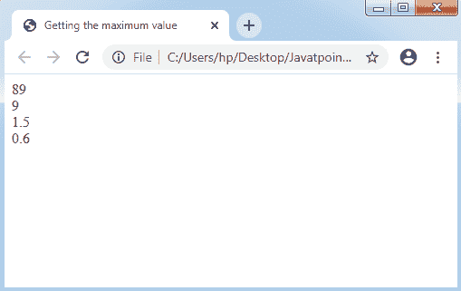
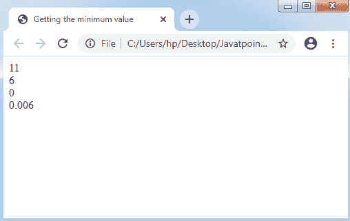
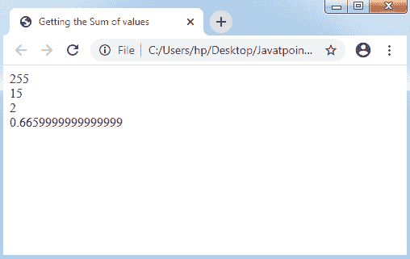
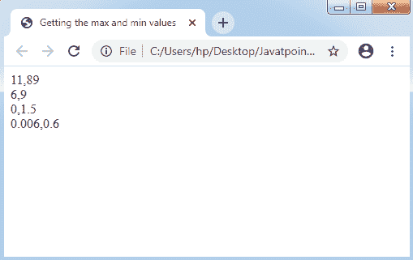
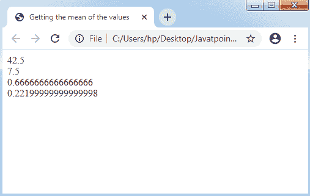
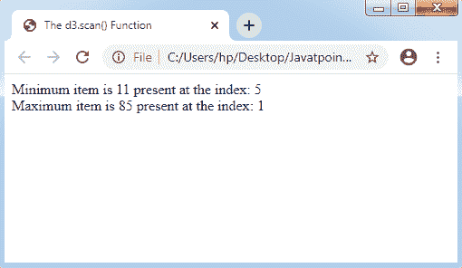
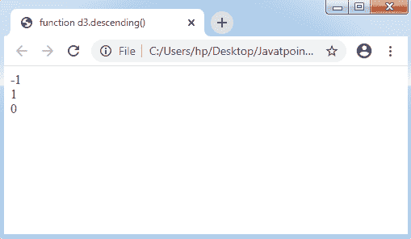
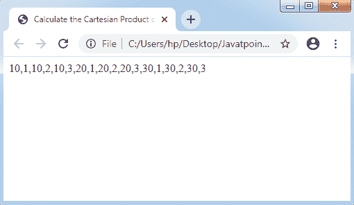
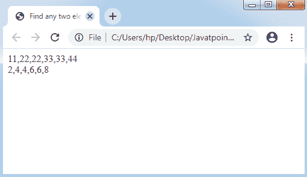
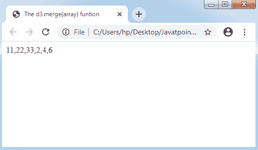

# D3.js 中的数组 API

> 原文：<https://www.javatpoint.com/array-api-in-d3-js>

D3 包括一组模块。独立地，我们可以一起使用每个模块或一组模块来实现操作。

我们开始吧。

## 数组简介

该数组包含类似类型的元素的固定大小的有序集合。任何数组都可以用来存储一组数据。换句话说，我们可以定义一个类似于一组相似类型的变量的数组。

## 应用编程接口配置

借助以下脚本，我们可以高效地配置[应用编程接口](https://www.javatpoint.com/api-full-form):

```

<script src = "https://d3js.org/d3-array.v1.min.js"></script>
<body>
<script>
</script>
</body>

```

## API 的数组统计方法

API 的一些基本数组统计方法如下:

*   d3.max(数组)
*   d3.min(数组)
*   d3.sum(数组)
*   d3 .范围(数组)
*   d3 .平均值(数组)
*   d3 .方差(数组)
*   d3 .分位数(数组)
*   d3 .偏差(数组)

让我们解释一下上面所有的方法。

### d3.max(数组)

d3.max(数组)返回所提供数组中的任何最大值。

让我们考虑一个例子。

**示例:**

```

<!DOCTYPE html>
<html> 
<head> 
<title> Getting the maximum value </title> 
</head> 
<body> 
<script src='https://d3js.org/d3.v4.min.js'> 
</script> 

<script> 
// initialising the arrays
var Array1 = [11, 12, 23, 54, 66, 89]; 
var Array2 = [6, 9]; 
var Array3 = [0, 0.5, 1.5]; 
var Array4 = [.6, .06, .006]; 

// Calling the d3.max() function 
A = d3.max(Array1); 
B = d3.max(Array2); 
C = d3.max(Array3); 
D = d3.max(Array4); 

// Getting the maximum value 
document.write(A + "<br>"); 
document.write(B + "<br>"); 
document.write(C + "<br>"); 
document.write(D + "<br>"); 
</script> 
</body> 
</html>

```

**输出:**



### d3.min(数组)

d3.min(数组)在自然顺序的帮助下返回任何最小值。

让我们考虑一个例子。

**示例:**

```

<!DOCTYPE html>
<html> 
<head> 
<title> Getting the minimum value </title> 
</head> 
<body> 
<script src='https://d3js.org/d3.v4.min.js'> 
</script> 

<script> 
// initialising the arrays
var Array1 = [11, 12, 23, 54, 66, 89]; 
var Array2 = [6, 9]; 
var Array3 = [0, 0.5, 1.5]; 
var Array4 = [.6, .06, .006]; 

// Calling the d3.min() function 
A = d3.min(Array1); 
B = d3.min(Array2); 
C = d3.min(Array3); 
D = d3.min(Array4); 

// Getting the minimum value 
document.write(A + "<br>"); 
document.write(B + "<br>"); 
document.write(C + "<br>"); 
document.write(D + "<br>"); 
</script> 
</body> 
</html>

```

**输出:**



### d3.sum(数组)

它将返回提供的数组数的总和。如果数组为空，它将返回 0。

让我们考虑一个例子。

**示例:**

```

<!DOCTYPE html>
<html> 
<head> 
<title> Getting the Sum of values </title> 
</head> 
<body> 
<script src='https://d3js.org/d3.v4.min.js'> 
</script> 

<script> 
// initialising the arrays
var Array1 = [11, 12, 23, 54, 66, 89]; 
var Array2 = [6, 9]; 
var Array3 = [0, 0.5, 1.5]; 
var Array4 = [.6, .06, .006]; 

// Calling the d3.sum() function 
A = d3.sum(Array1); 
B = d3.sum(Array2); 
C = d3.sum(Array3); 
D = d3.sum(Array4); 

// Getting the sum of values 
document.write(A + "<br>"); 
document.write(B + "<br>"); 
document.write(C + "<br>"); 
document.write(D + "<br>"); 
</script> 
</body> 
</html>

```

**输出:**



### d3 .范围(数组)

它将返回所提供数组中的最大值和最小值。

让我们考虑一个例子。

**示例:**

```

<!DOCTYPE html>
<html> 
<head> 
<title> Getting the max and min values </title> 
</head> 
<body> 
<script src='https://d3js.org/d3.v4.min.js'> 
</script> 

<script> 
// initialising the arrays
var Array1 = [11, 12, 23, 54, 66, 89]; 
var Array2 = [6, 9]; 
var Array3 = [0, 0.5, 1.5]; 
var Array4 = [.6, .06, .006]; 

// Calling the d3.extent() function 
A = d3.extent(Array1); 
B = d3.extent(Array2); 
C = d3.extent(Array3); 
D = d3.extent(Array4); 

// Getting the max and min values 
document.write(A + "<br>"); 
document.write(B + "<br>"); 
document.write(C + "<br>"); 
document.write(D + "<br>"); 
</script> 
</body> 
</html>

```

**输出:**



### d3 .平均值(数组)

d3.mean 方法返回提供的数组数的平均值。

让我们考虑一个例子。

**示例:**

```

<!DOCTYPE html>
<html> 
<head> 
<title> Getting the mean of the values </title> 
</head> 
<body> 
<script src='https://d3js.org/d3.v4.min.js'> 
</script> 

<script> 
// initialising the arrays
var Array1 = [11, 12, 23, 54, 66, 89]; 
var Array2 = [6, 9]; 
var Array3 = [0, 0.5, 1.5]; 
var Array4 = [.6, .06, .006]; 

// Calling the d3.mean() function 
A = d3.mean(Array1); 
B = d3.mean(Array2); 
C = d3.mean(Array3); 
D = d3.mean(Array4); 

// Getting the mean of the values 
document.write(A + "<br>"); 
document.write(B + "<br>"); 
document.write(C + "<br>"); 
document.write(D + "<br>"); 
</script> 
</body> 
</html>

```

**输出:**



### d3 .方差(数组)

d3.variance 方法返回提供的数组的方差。

### d3 .分位数(数组)

它返回所提供的排序数组数的 p 分位数，其中 p 是[0，1]范围内的任何数字。

**例如:**中值可以用 p= 0.5 来求解，p=0.25 是第一个分位数，p= 0.75 是第三个分位数。

该执行应用了 R-7 技术，默认情况下考虑 Excel 和 R 编程语言。

### d3 .偏差(数组)

它返回提供的数组的标准偏差。当一个数组包含两个值时，它将作为未定义返回。

## 数组搜索中的应用编程接口方法

下面是 API 搜索的两种基本方法。

1.  d3 .扫描(阵列、比较器)
2.  d3 .升序(a，b)

### d3 .扫描(阵列、比较器)

d3.scan(array)方法可用于说明指定阵列的线性扫描。它会将当前元素的索引返回给任何指定的比较器。

让我们考虑一个例子。

**示例:**

下面的代码将使用带有比较器的 d3.scan(array)函数来实现。

```

<!DOCTYPE html> 
<html> 
<head> 
<title> The d3.scan() Function </title> 

<script src='https://d3js.org/d3.v4.min.js'></script> 
</head> 

<body> 
<script> 
var array = [54, 85, 21, 56, 34, 11, 23]; 
// To get minimum item in an array 
var ans1 = d3.scan(array, function(a, b) { 
return a - b; 
}); 
document.write("Minimum item is " + array[ans1] + 
" present at the index: " + ans1 + "<br>"); 

// To get maximum item in an array 
var ans2 = d3.scan(array, function(a, b) { 
return b - a; 
}); 
document.write("Maximum item is " + array[ans2] + 
" present at the index: " + ans2); 
</script> 
</body> 
</html>

```

**输出:**



### d3 .下降(a，b)

应用上述方法，即 d3.descending(a，b)来执行比较器功能。它可以执行为:

```

 d3.descending(a, b)

```

这里 a，b 是两个值。当任何内置排序技术没有指定函数时，默认顺序是字母顺序。如果按降序取两个参数(第一个参数的值大于第二个参数)，将返回 **-1** 值。

我们可以用类似的方法来说明降序(a，b)方法。如果以升序取两个参数，它将返回 1(第一个参数的值小于第二个参数的值)。当它包含两个相同的参数时，它将返回 0。

让我们考虑一个例子。

**示例:**

```

<!DOCTYPE html> 
<html> 
<head> 
<title> function d3.descending() </title> 
<script src='https://d3js.org/d3.v4.min.js'></script> 
</head> 

<body> 
<script> 

// Calling d3.descending() along with two values as integer parameters 
A = d3.descending(50, 20); 
B = d3.descending(2, 5); 
C = d3.descending(5, 5); 

// Getting output 
document.write(A + "<br>"); 
document.write(B + "<br>"); 
document.write(C + "<br>"); 
console.log(A); 
</script> 
</body> 
</html>                  

```

**输出:**



## 数组应用编程接口转换

以下是一些最关键的数组 API 转换方法。

*   d3 .十字(a，b[，减速器])
*   d3.pairs(array[，reducer])
*   d3 .合并(数组)
*   d3.zip(数组)
*   d3.permute(数组、索引)

### d3 .十字(a，b[，减速器])

***d3.cross(a，b[，reductor])***方法可以应用于返回任意两个给定数组的(像 a 和 b)笛卡尔乘积。

一般说明如下:

**示例:**

```

<!DOCTYPE html>
<html> 
<head> 
<title> 
Calculate the Cartesian Product of two array 
</title> 
</head> 

<body> 
<script src='https://d3js.org/d3.v4.min.js'> 
</script> 

<script> 
// Array Initialization
var Array1 = [10, 20, 30]; 
var Array2 = [1, 2, 3]; 

// Calling the d3.cross() function 
A = d3.cross(Array1, Array2); 

document.write(A + "<br>"); 
</script> 
</body> 
</html>

```

**输出:**



### d3.pairs(array[，reducer])

它适用于对数组的元素进行配对，如下所示:

**示例:**

```

<!DOCTYPE html>
<html> 
<head> 
<title> 
Find any two element's pair from the given arrays
</title> 
</head> 

<body> 
<script src='https://d3js.org/d3.v4.min.js'> 
</script> 

<script> 
// Array Initialization
var Array1 = [11, 22, 33, 44]; 
var Array2 = [2, 4, 6, 8]; 

// Calling the d3.pairs() function 
A = d3.pairs(Array1); 
B = d3.pairs(Array2); 

document.write(A + "<br>"); 
document.write(B + "<br>"); 
</script> 
</body> 
</html>

```

**输出:**



### d3 .合并(数组)

它是为数组合并而定义的，可以描述为:

**示例:**

```

<!DOCTYPE html>
<html> 
<head> 
<title> The d3.merge(array) funtion </title> 
</head> 

<body> 
<script src='https://d3js.org/d3.v4.min.js'> 
</script> 

<script> 
// Array initialization
var Array1 = [11, 22, 33]; 
var Array2 = [2, 4, 6]; 

// Calling the d3.merge() function 
A = d3.merge([ 
[Array1], 
[Array2] 
]); 

document.write(A + "<br>"); 
</script> 
</body> 
</html>

```

**输出:**



### d3.zip(数组)

上述方法适用于返回数组的数组。如果数组由单个数组组成，那么返回的数组也将包括单元素数组。当没有描述参数时，返回的数组将为空。

### d3.permute(数组、索引)

它用于实现从指定的索引和数组开始的置换过程。我们还可以将对象中的各种值实现到一个数组中。

它可以定义如下:

**语法:**

```

d3.permute(array, Index)

```

* * *