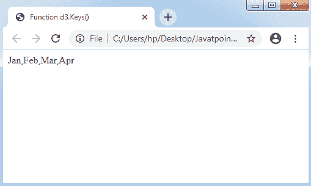
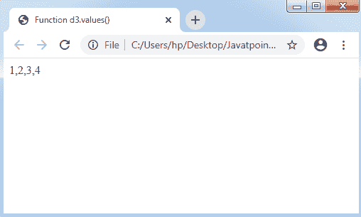
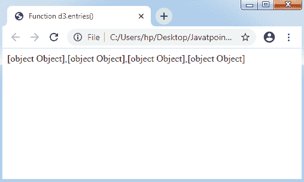
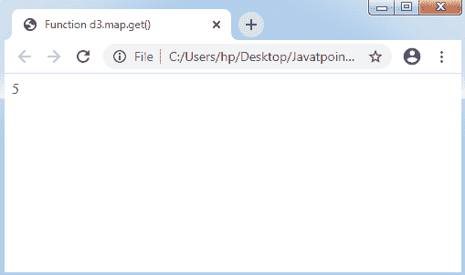

# D3.js 中的集合 API

> 原文：<https://www.javatpoint.com/collection-api-in-d3-js>

集合是可以定义为对象的东西，它将各种元素组合成一个独立的单元。它也被称为**容器**。D3 的这个划分会帮助我们学习收藏 API。

### 配置应用编程接口

我们可以在脚本的帮助下配置应用编程接口，如下所述:

```

<script src = "https://d3js.org/d3-collection.v1.min.js"></script>
<script>
</script>

```

## 原料药的收集方法

采集 API 有**嵌套、集合、地图**、**对象**。以下是收集应用编程接口的四种基本且广泛使用的方法。

*   对象应用编程接口
*   设置应用编程接口
*   地图应用编程接口
*   Nests API

### 对象应用编程接口

集合应用编程接口中的对象应用编程接口是一种基本的数据类型。它支持下面列出的几个重要方法:

**1。d3.keys(对象):**它有对象的属性键，它会返回属性名的数组。

考虑下面的例子。

**示例:**

```

<!DOCTYPE html> 
<html> 
<head> 
<title> 
Function d3.Keys() 
</title> 

<script src = "https://d3js.org/d3.v4.min.js"></script> 
</head> 

<body> 
<script> 

// Object initialization 
var month = { "Jan": 1, "Feb": 2, "Mar": 3, "Apr": 4}; 

// Calling the function d3.values() 
A= d3.keys(month);

document.write(A); 
</script> 
</body> 
</html>                 

```

**输出:**



**2。d3.values(对象):**它有对象的值，并将返回属性名的数组。

考虑下面的例子。

**示例:**

```

<!DOCTYPE html> 
<html> 
<head> 
<title> 
Function d3.values() 
</title> 

<script src = "https://d3js.org/d3.v4.min.js"></script> 
</head> 

<body> 
<script> 

// Object initialization 
var month = { "Jan": 1, "Feb": 2, "Mar": 3, "Apr": 4}; 

// Calling the function d3.values() 
A= d3.values(month);

document.write(A); 
</script> 
</body> 
</html>                 

```

**输出:**



**3。d3.entries(object):** 它将返回具有指定对象的值和键的任何数组。所有条目都是对象以及值和键。

考虑下面的例子。

**示例:**

```

<!DOCTYPE html> 
<html> 
<head> 
<title> 
Function d3.entries() 
</title> 

<script src = "https://d3js.org/d3.v4.min.js"></script> 
</head> 

<body> 
<script> 

// Object initialization 
var month = { "Jan": 1, "Feb": 2, "Mar": 3, "Apr": 4}; 

// Calling the function d3.values() 
A= d3.entries(month);

document.write(A); 
</script> 
</body> 
</html>                 

```

**输出:**



### 设置应用编程接口

该集合是任何不能包含重复项目的组。它设计了一个**数学集合抽象**。

让我们讨论集合的各种 API 方法，如下所示:

*   **d3.set([array[，accessor]]):** 用于制作任何新的集合。应用数组来包含字符串值，其中访问器是可选的。
*   **set.has(值):**用于检查该集合是否包含任何指定字符串值的条目。
*   **set.add(值):**它将描述的字符串值包含到一个集合中。
*   **set.remove(值):**可以应用于移除可以添加任何指定字符串值的集合。
*   **set.clear(值):**它可以清除任何集合中的每一个值。
*   **set.values(值):**如果我们想将数组值设置为一个集合，可以应用这个方法。
*   **set.empty(值):**当一个集合只包含零值时，它将返回真值。
*   **set.size(值):**它会将值的数字返回到一个集合中。

### 地图应用编程接口

以下是地图应用编程接口:

*   **d3.map([object[，key]]):** 如果我们想设计什么新的地图，可以用这个方法。使用对象可以复制每个可枚举属性。
*   **map.has(键):**用于确保映射包含任何指定字符串键的条目。
*   **map.get(key):** 如果我们想获取任意指定字符串键的值，可以使用这个方法。
*   **map.set(键，值):**用于将任意值设置为指定的字符串键。如果以前的映射有类似字符串键的条目，旧条目将被新值替换。
*   **地图移除(键):**可用于移除任何地图条目。如果没有指定键，它将返回值 false。
*   **Map.clear():** 使用此方法可以删除地图中的所有条目。
*   **map.keys():** 它会将字符串的数组键返回给一个映射中的所有条目。
*   **map.values():** 它会将值的数组返回给地图中的所有条目。
*   **map.entries():** 它会将键值对象的数组返回给一个映射中的所有条目。
*   **map.each(function):** 如果我们想对一个地图中的所有条目调用任何指定的函数，那么我们可以使用这个方法。
*   **map.empty():** 如果一个映射包含零个条目，那么它返回值 true。
*   **map.size():** 它将返回地图中条目的编号。

考虑下面的例子。

**示例:**

```

<!DOCTYPE html> 
<html> 
<head> 
<title> Function d3.map.get() </title> 
<script src='https://d3js.org/d3.v4.min.js'></script> 
</head> 
<body> 
<script> 

// Map Creation
var map = d3.map({"Ram": 5}); 

// Calling the map.get() function 
A = map.get("Ram"); 

// We will get the "Ram" key's value 
document.write(A); 
</script> 
</body> 
</html>

```

**输出:**



### Nests API

nests API 中的一些基本方法定义如下:

*   **d3.nest():** 如果我们要做什么新的巢，那么可以用这个方法。
*   **nest.key(key):** 任何新的按键功能都可以用这个方法初始化。
*   **nest.sortValues(比较器):**用于对任何指定比较器内的值进行排序。叶元素可以通过比较器函数进行排序。
*   **nest.map(array):** 可应用于返回嵌套的 map 和指定的 array。
*   **nest.object(array):** 可应用于返回嵌套对象，并对指定数组使用任意 nest 运算符。
*   **nest.entries(数组):**它将返回键值数组条目，并对任何指定的数组应用 nest 运算符。

* * *