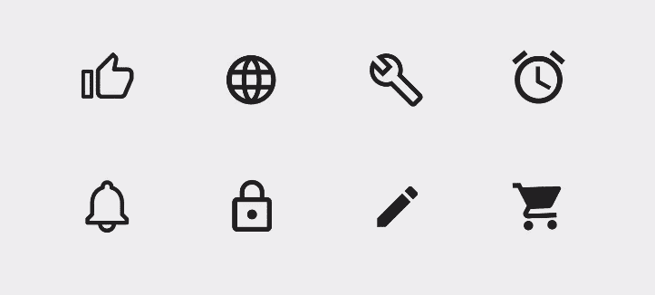
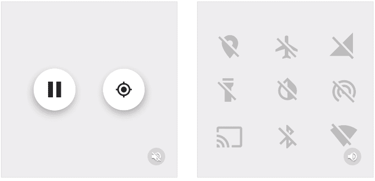
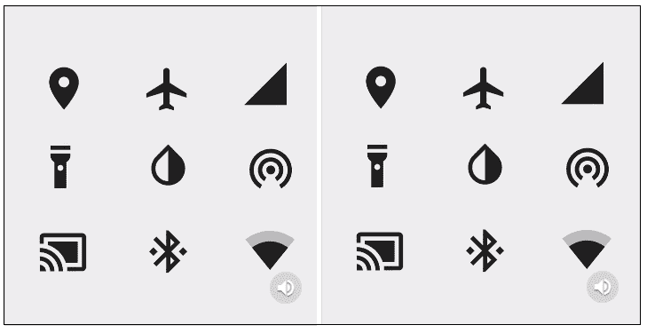
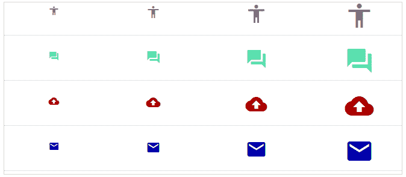

# 有角度的材质图标

> 原文：<https://www.javatpoint.com/angular-material-icons>

角度**材质图标**是一个组件，用于在应用程序中显示基于矢量的图标。除了使用谷歌内容图标外，它还支持图标字体和 SVG 图标。

下表列出了 **md-icon** 不同功能的参数和说明。

| Sr.No | 因素 | 描述 |
| one | *** md-font-icon** | CSS 图标的字符串与用于呈现图标的字体相关联。它需要加载字体和命名的 CSS 样式。 |
| Two | *** md-font-set** | CSS 样式名与指定为字体图标类的字体库相关联。该值也可用于查找类名；请使用$ mdIconProvider.fontSet 来确定样式名称。 |
| three | *** md-svg-src** | 字符串 URL(或表达式)用于加载、缓存和显示任何外部 SVG。 |
| four | *** md-svg-icon** 。 | 字符串名称用于从内部缓存中搜索图标；这里也可以使用投影字符串或表达式。具体的集合名称可以使用语法 <set name="">: <icon name="">。为了使用该图标集，开发人员使用$ mdIconProvider 服务预先注册该图标集。</icon>T3】</set> |
| five | 空气标签 | 它为辅助功能标记了一个图标。如果提供了一个空字符串，该图标将通过 aria-hidden = "true "从访问层隐藏。如果图标上没有 Ari 标签，父元素上也没有标签，控制台上将记录一条警告。 |
| six | 年龄 | 它为辅助功能标记了一个图标。如果提供了空字符串，图标将通过 aria-hidden = "true "从辅助功能层隐藏。如果父元素的图标上没有 alt，控制台上将弹出警告。 |

### 字体图标

有些字体设计为通过将文本显示为家庭图像来使用连字显示图标。要使用连字图标，请将文本插入遮罩图标组件的内容中。默认情况下， **< mat-icon >** 需要内容图标字体。

**字体图标带 CSS**

字体还可以通过为每个图标图定义一个 CSS 类来显示图标，该类位于选择器图标之前。如果我们想使用这样的字体，将字体输入设置为字体的 CSS 类，并将该类的字体图标输入设置为显示特定的图标。

您可以通过对两种类型的字体图标说**MatticonRegistry . SetDefaultFontSetClass**来指定字体集未显式设置时要使用的默认字体类。

### SVG icons

<mat-icon>通过将 SVG 内容作为自己的子对象插入 DOM 来显示 SVG 图标。这种方法提供了优于标签或 CSS 背景图像的优势，因为它允许使用 [CSS](https://www.javatpoint.com/css-tutorial) 来设计 SVG 的样式。 **SVG** 内容的默认颜色是 CSS currentColor 值。SVG 图标具有与周围文本相同的颜色，并允许通过设置无光图标元素的颜色样式来更改颜色。</mat-icon>

为了避免 XSS 漏洞，任何在 MatIconRegistry 中传递的 SVG URL 和 [HTML](https://www.javatpoint.com/html-tutorial) 字符串都必须使用 Angular 的 dommelic 服务标记为可信。

### 命名图标

使用 AddSvgIconLiteralInNamespace 的 AddSvgIcon、addSvgIconInNamespace、addsvgiconliteralintry 或 MatSconRegistry 方法将图标与图标网址相关联。直接在默认命名空间中使用该名称。但是在非默认的名称空间中，使用格式**[名称空间]:[名称]。**

### 图标集

图标集允许将许多图标组合成一个 SVG 文件。这是通过创建单个根 **< svg >** 标签来完成的，该标签在其 **< defs >** 部分包含一些嵌套的 [**< svg >** 标签](https://www.javatpoint.com/html-svg)。每个嵌套标签都用一个标识属性来标识。该标识用作图标的名称。

要显示图标集中的图标，请使用与注册图标相同的方式输入 SVG 图标。许多图标集也可以在同一个命名空间中注册。

### 主题

图标使用当前字体颜色(currentColor)。使用颜色属性更改颜色以匹配当前主题的颜色。可以改为“初级”、“发音”或“警告”。

### 易接近

图标本身并不能为屏幕阅读器用户提供任何有用的信息，例如 [< img >元素](https://www.javatpoint.com/html-image)。< mat-icon >的用户应提供关于图标使用的附加信息。在可访问性中，有三个类别:

图标本身并不能为屏幕阅读器用户提供任何有用的信息，例如元素。<mat-icon>的用户应提供关于图标使用的附加信息。在可访问性中，有三个类别:</mat-icon>

**装饰图标**

它没有真正的语义，纯粹是修饰。当一个图标是修饰性的，没有真正的语义含义时， **< mat-icon >** 元素用 aria-hidden =“true”标记。

**互动图标**

在交互式图标中，用户将点击图标或与图标交互以执行某些操作。符号本身并不是屏幕阅读器用户的交互元素。 **< mat-icon >** 元素必须是 **<按钮>** 或 **< a >** 元素的子元素。

父 [<按钮>](https://www.javatpoint.com/html-button-tag) 或 [< a >](https://www.javatpoint.com/html-anchor) 必须是由 aria-label 提供的直接文本内容、aria-label 或有意义的标签。

**指示器图标**

它传达一些信息，比如状态。它使用图标代替大邮件中的文本。当一个图标给用户一些信息时，无论是内置的指示器还是文本块，这些信息都可以提供给屏幕阅读器。添加一个 [< span >](https://www.javatpoint.com/html-span-tag) ，文本作为< mat-icon >元素的最接近的兄弟，它作为图标传达确切的信息。

它使信息不可见，但仍可供屏幕阅读器用户使用。

### 动画图标

动画反映了动作的表演方式，增加了趣味性。



每个图标的动画都与视觉设计保持一致。

### 过渡链接

过渡连接两种视觉状态之间的动画图标。两个图标之间的转换表示它们相互链接，按下第一个图标会生成另一个图标。



过渡在单个图标中显示两个图标之间的连接。



过渡具有在开和关状态之间切换的图标。

### 例子

该示例显示了 md-icons 指令的使用以及图标的使用。

***am_icons.htm***

```

<html lang = "en">
   <head>
      <link rel = "stylesheet"
         href = "https://ajax.googleapis.com/ajax/libs/angular_material/1.0.0/angular-material.min.css">
      <script src = "https://ajax.googleapis.com/ajax/libs/angularjs/1.4.8/angular.min.js"></script>
      <script src = "https://ajax.googleapis.com/ajax/libs/angularjs/1.4.8/angular-animate.min.js"></script>
      <script src = "https://ajax.googleapis.com/ajax/libs/angularjs/1.4.8/angular-aria.min.js"></script>
      <script src = "https://ajax.googleapis.com/ajax/libs/angularjs/1.4.8/angular-messages.min.js"></script>
      <script src = "https://ajax.googleapis.com/ajax/libs/angular_material/1.0.0/angular-material.min.js"></script>
      <link rel = "stylesheet" href = "https://fonts.googleapis.com/icon?family=Material+Icons">
      <style>
         .iconDemo .glyph {
            border-bottom: 1px dotted #ccc;
            padding: 10px 0 20px;
            margin-bottom: 20px; 
         }
         .iconDemo .preview-glyphs {
            display: flex;
            flex-direction: row; 
         }
         .iconDemo .step {
            flex-grow: 1;
            line-height: 0.5; 
         }
         .iconDemo .material-icons.md-18 {
            font-size: 18px; 
         }
         .iconDemo .material-icons.md-24 {
            font-size: 24px; 
         }
         .iconDemo .material-icons.md-36 {
            font-size: 36px; 
         }
         .iconDemo .material-icons.md-48 {
            font-size: 48px; 
         }
         .iconDemo .material-icons.md-dark {
            color: rgba(0, 0, 0, 0.54); 
         }
         .iconDemo .material-icons.md-dark.md-inactive {
            color: rgba(0, 0, 0, 0.26); 
         }
         .iconDemo .material-icons.md-light {
            color: white; 
         }
         .iconDemo .material-icons.md-light.md-inactive {
            color: rgba(255, 255, 255, 0.3); 
         }
      </style>
      <script language = "javascript">
         angular
            .module('firstApplication', ['ngMaterial'])
            .controller('iconController', iconController);
         function iconController ($scope) {
            var iconData = [
               {name: 'accessibility'  , color: "#777" },
               {name: 'question_answer', color: "rgb(89, 226, 168)" },
               {name: 'backup'         , color: "#A00" },
               {name: 'email'          , color: "#00A" }
            ];
            $scope.fonts = [].concat(iconData);            
            $scope.sizes = [
               {size:"md-18",padding:0},
               {size:"md-24",padding:2},
               {size:"md-36",padding:6},
               {size:"md-48",padding:10}
            ];
         }                 
      </script>     	  
   </head>
   <body ng-app = "firstApplication"> 
      <div id = "iconContainer" class = "iconDemo"
         ng-controller = "iconController as ctrl" ng-cloak>
         <div class = "glyph" ng-repeat = "font in fonts" layout = "row">
            <div ng-repeat = "it in sizes" flex layout-align = "center center"
               style = "text-align: center;" layout = "column">
            <div flex></div>
               <div class = "preview-glyphs">
                  <md-icon ng-style = "{color: font.color}"
                     aria-label = "{{ font.name }}"
                     class = "material-icons step"
                     ng-class = "it.size">
                     {{ font.name }}
                  </md-icon>
               </div>
            </div>
         </div>
      </div>
   </body>
</html>

```

[Test it Now](https://www.javatpoint.com/oprweb/test.jsp?filename=angular-material-icons1)

**输出:**



* * *