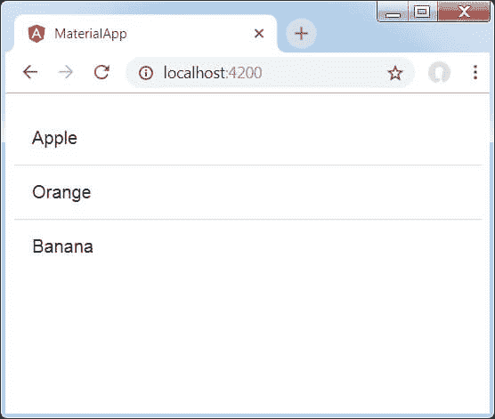
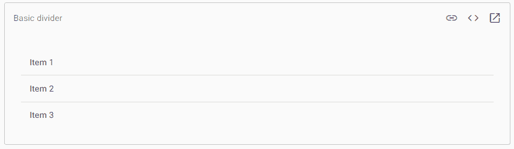

# AngularMaterial 分割器/内容

> 原文：<https://www.javatpoint.com/angular-material-divider-or-content>

<mat-divider>是一个 AngularMaterial 指令，允许我们用不同的方向选项来设计线条分隔符的内容。它用于创建具有内容设计样式和动画功能的分割线。它在两个对象之间提供了一个分隔符。</mat-divider>

**简单分频器**

一个<matte-divider>元素用于创建一条带有内容的水平线或垂直线。</matte-divider>

```

<mat-divider></mat-divider>

```

**嵌入分隔器**

我们添加插入属性来确定分割线是否是插入分割线。

```

<mat-divider [inset] ="true"></mat-divider>

```

**垂直分隔器**

添加垂直属性以设置分隔线是否垂直。

```

<mat-divider [vertical] ="true"></mat-divider>

```

**带内嵌分隔符的列表**

可以将分隔线添加到列表中，将内容分成不同的类别。还可以添加插入分隔线，以便在列表中提供独立的元素，而不会出现杂乱的内容，例如**化身图像**或图标。

```

<mat-list>
   <h3 mat-subheader>Folders</h3>
   <mat-list-item *ngFor="let folder of folders; last as last">
      <mat-icon mat-list-icon>folder</mat-icon>
      <h4 mat-line>{{folder.name}}</h4>
      <p mat-line class="demo-2"> {{folder.updated}} </p>
      <mat-divider [inset]="true" *ngIf="!last"></mat-divider>
   </mat-list-item>
   <mat-divider></mat-divider>
   <h3 mat-subheader>Notes</h3>
   <mat-list-item *ngFor="let note of notes">
      <mat-icon mat-list-icon>note</mat-icon>
      <h4 mat-line>{{note.name}}</h4>
      <p mat-line class="demo-2"> {{note.updated}} </p>
   </mat-list-item>
</mat-list>

```

### 例 1:

按照以下步骤更新我们在 Angular 中创建的 Angular 应用程序:

*   创建一个名为**的项目**
*   添加**模块. ts、app.component.ts、app.component.css、app.component.html**如下。
*   编译代码以验证结果。

以下是修改后的模块描述符 **app.module.ts** 的内容。

```

import { BrowserModule } from '@angular/platform-browser';
import { NgModule } from '@angular/core';
import { AppComponent } from './app.component';
import {BrowserAnimationsModule} from '@angular/platform-browser/animations';
import {MatDividerModule, MatListModule} from '@angular/material'
import {FormsModule, ReactiveFormsModule} from '@angular/forms';
@NgModule({
   declarations: [
      AppComponent
   ],
   imports: [
      BrowserModule,
      BrowserAnimationsModule,
      MatDividerModule, MatListModule,
      FormsModule,
      ReactiveFormsModule
   ],
   providers: [],
   bootstrap: [AppComponent]
})
export class AppModule { }

```

下面是修改后的 HTML 宿主文件**app.component.html**。

```

<mat-list>
   <mat-list-item>Apple</mat-list-item>
   <mat-divider></mat-divider>
   <mat-list-item>Orange</mat-list-item>
   <mat-divider></mat-divider>
   <mat-list-item>Banana</mat-list-item>
</mat-list>

```

**输出:**



**说明:**

*   之前，我们已经使用 mat-list 创建了一个列表。
*   然后，我们使用 mat-divider 在列表项之间添加了分隔线。

### 例 2:

**app.component.html**

```

<mat-list>
<mat-list-item>Item 1</mat-list-item>
 <mat-divider></mat-divider>
 <mat-list-item>Item 2</mat-list-item>
<mat-divider></mat-divider>
<mat-list-item>Item 3</mat-list-item>
</mat-list>

```

**app.component.ts**

```

import {Component} from '@angular/core';

/**
* @title Basic divider
 */
@Component({
  selector: 'divider-overview-example',
 templateUrl: 'divider-overview-example.html',
})
export class DividerOverviewExample {}

```

**输出:**



## AngularMaterial 含量

Angular 指令< **md-content >** 是一个用于可滚动内容的容器元素。布局填充功能被添加到填充 Material 中。

下面的例子还显示了 md-content 指令的使用和 Angular 内容显示的使用。

**am_content.htm**

```

<html lang = "en">
   <head>
      <link rel = "stylesheet"
         href = "https://ajax.googleapis.com/ajax/libs/angular_material/1.0.0/angular-material.min.css">
      <script src = "https://ajax.googleapis.com/ajax/libs/angularjs/1.4.8/angular.min.js"></script>
      <script src = "https://ajax.googleapis.com/ajax/libs/angularjs/1.4.8/angular-animate.min.js"></script>
      <script src = "https://ajax.googleapis.com/ajax/libs/angularjs/1.4.8/angular-aria.min.js"></script>
      <script src = "https://ajax.googleapis.com/ajax/libs/angularjs/1.4.8/angular-messages.min.js"></script>
      <script src = "https://ajax.googleapis.com/ajax/libs/angular_material/1.0.0/angular-material.min.js"></script>
      <script type = "text/javascript">    
         angular.module('firstApplication', ['ngMaterial']);
      </script>
   </head>
   <body ng-app = "firstApplication" ng-cloak>
      <md-toolbar class = "md-warn">
         <div class = "md-toolbar-tools">
            <h2 class = "md-flex">HTML 5</h2>
         </div>
      </md-toolbar>
       <md-content flex layout-padding>
         <p>HTML5 is the next major revision of the HTML standard superseding HTML
         4.01, XHTML 1.0, and XHTML 1.1\. HTML5 is a standard used for 
         presenting content on the World Wide Web.</p>
         <p>HTML5 is a cooperation between the World Wide Web Consortium and the Web Hypertext Application Technology Working Group</p>         
         <p>The new incorporates features like video playback and drag-and-drop
         that have been dependent on third-party browser plug-ins such as Adobe
         Flash, Microsoft Silverlight, and Google Gears.</p>
      </md-content>
   </body>
</html>

```

**输出:**


* * *