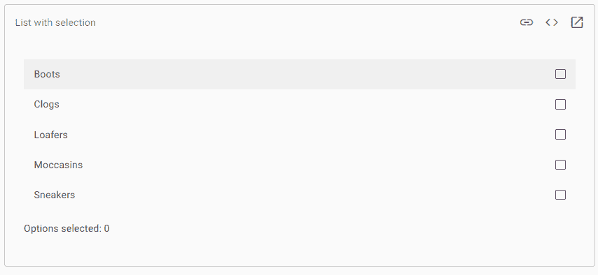
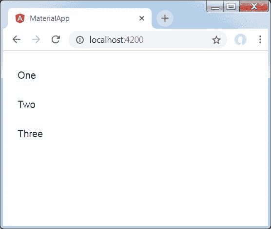
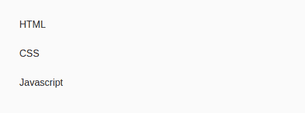
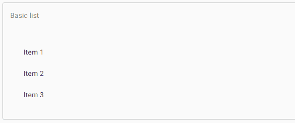

# AngularMaterial 列表

> 原文：<https://www.javatpoint.com/angular-material-list>

<mat-list>是一个 Angular 指令，用于创建一个容器来承载和格式化各种对象。<mat-list>是包装行项目的容器组件。它提供 Material 设计造型，但没有行为。</mat-list></mat-list>

Angular Content 是由 Angular 开发的用户界面组件库，用于为移动或桌面应用程序构建设计组件。在命令提示符下输入命令并下载。<mat-list>标签用于显示对象或记录的列表。</mat-list>

**语法:**

```

ng add @angular/material

```

## 安装步骤

*   使用上述命令安装 AngularMaterial。
*   安装后，从 **module.ts** 文件中的**“@ angular/material/list”**导入“**matlismodule**”。
*   导入“**matlistmule**”后，我们需要使用< **mat-list** >标签。
*   在<mat-list>标签中，我们需要对每个项目或标签使用<mat-list-item>标签。</mat-list-item></mat-list>
*   我们需要包括<**物品清单** >标签和< **物品清单** >的属性。
*   对于<mat-list>，我们用“list”字符串分配角色属性，对于<mat-list-item>，我们必须用“listitem”字符串值分配角色属性。</mat-list-item></mat-list>
*   完成这些步骤后，开始项目。

### 简单列表

<mat-list>元素包含许多<mat-list-item>元素。</mat-list-item></mat-list>

```

<mat-list>
 <mat-list-item> Pepper </mat-list-item>
 <mat-list-item> Salt </mat-list-item>
 <mat-list-item> Paprika </mat-list-item>
</mat-list>

```

### 导航列表

将 mat-nav-list 标签用于导航列表(即包含锚点标签的列表)。

```

<mat-nav-list>
   <a mat-list-item href="..." *ngFor="let link of links"> {{link}} </a>
</mat-nav-list>

```

对于更复杂的导航列表(每个项目有多个目标)，将锚点元素包装在<mat-list-item>中。</mat-list-item>

```

<mat-nav-list>
  <mat-list-item *ngFor="let link of links">
     <a matLine href="...">{{ link }}</a>
     <button mat-icon-button (click)="showInfo(link)">
        <mat-icon>info</mat-icon>
     </button>
  </mat-list-item>
</mat-nav-list>

```

### 动作列表

当列表中的每个项目执行某个动作时，使用<mat-action-list>元素。列表中的每个项目都是<**按钮** >元素。</mat-action-list>

简单动作列表将在按钮标签元素上使用 mat-list-item 属性:

```

<mat-action-list>
  <button mat-list-item (click)="save()"> Save </button>
  <button mat-list-item (click)="undo()"> Undo </button>
</mat-action-list>

```

### 选择列表

它提供了一个选择值的界面，其中每个列表项都是一个选项。

**app.component.html**

```

<mat-selection-list #shoes>
  <mat-list-option *ngFor="let shoe of typesOfShoes">
    {{shoe}}
  </mat-list-option>
</mat-selection-list>
<p>
  Options selected: {{shoes.selectedOptions.selected.length}}
</p>

```

**app.component.ts**

```

import {Component} from '@angular/core';

/**
 * @title List with selection
 */
@Component({
  selector: 'list-selection-example',
  styleUrls: ['list-selection-example.css'],
  templateUrl: 'list-selection-example.html',
})
export class ListSelectionExample {
  typesOfShoes: string[] = ['Boots', 'Clogs', 'Loafers', 'Moccasins', 'Sneakers'];
}

```

**输出:**



**选项选择:0**

选择列表选项可能没有进一步的交互控件，如按钮和锚点。

 **## 多行列表

每个项目需要多行的列表，用 matlin 属性注释每一行。

```

<mat-list>
  <mat-list-item *ngFor="let message of messages">
    <h3 matLine> {{message.from}} </h3>
    <p matLine>
      <span> {{message.subject}} </span>
      <span class="demo-2"> -- {{message.content}} </span>
    </p>
  </mat-list-item>
</mat-list>
<!-- three line list -->
<mat-list>
  <mat-list-item *ngFor="let message of messages">
    <h3 matLine> {{message.from}} </h3>
    <p matLine> {{message.subject}} </p>
    <p matLine class="demo-2"> {{message.content}} </p>
  </mat-list-item>
</mat-list>

```

## 带图标的列表

使用**列表图标**属性向列表项添加图标。

```

<mat-list>
  <mat-list-item *ngFor="let message of messages">
    <mat-icon matListIcon>folder</mat-icon>
    <h3 matLine> {{message.from}} </h3>
    <p matLine>
      <span> {{message.subject}} </span>
      <span class="demo-2"> -- {{message.content}} </span>
    </p>
  </mat-list-item>
</mat-list>

```

### 带有头像的列表

添加一个带有 matListAvatar 属性的图像标签，以包含一个头像图像。

```

<mat-list>
  <mat-list-item *ngFor="let message of messages">
    
    <h3 matLine> {{message.from}} </h3>
    <p matLine>
      <span> {{message.subject}} </span>
      <span class="demo-2"> -- {{message.content}} </span>
    </p>
  </mat-list-item>
</mat-list>

```

## 密集列表

要启用密集列表模式，请添加密集属性列表标签。

```

<mat-list dense>
 <mat-list-item> Pepper </mat-list-item>
 <mat-list-item> Salt </mat-list-item>
 <mat-list-item> Paprika </mat-list-item>
</mat-list>

```

### 具有多个部分的列表

子标题将通过一个带有 matSubheader 属性的标题标签添加到列表中。使用<mat-divider>添加分隔线。</mat-divider>

```

<mat-list>
   <h3 matSubheader>Folders</h3>
   <mat-list-item *ngFor="let folder of folders">
      <mat-icon matListIcon>folder</mat-icon>
      <h4 matLine>{{folder.name}}</h4>
      <p matLine class="demo-2"> {{folder.updated}} </p>
   </mat-list-item>
   <mat-divider></mat-divider>
   <h3 matSubheader>Notes</h3>
   <mat-list-item *ngFor="let note of notes">
      <mat-icon matListIcon>note</mat-icon>
      <h4 matLine>{{note.name}}</h4>
      <p matLine class="demo-2"> {{note.updated}} </p>
   </mat-list-item>
</mat-list>

```

### 易接近

任何情况下使用的列表类型都取决于与之交互的最终用户。

### 航行

当列表项导航到某个位置时，<mat-nav-list>应作为列表项使用，其元素为 **<列表项>。**新列表将使用 role = "navigation "进行渲染，并且可以给它一个区域标签来引用所呈现的导航选项集。附加的交互内容，像按钮，不会被添加到锚点里面。</mat-nav-list>

### 例 1:

以下是修改后的模块描述符 **app.module.ts** 的内容。

```

import { BrowserModule } from '@angular/platform-browser';
import { NgModule } from '@angular/core';
import { AppComponent } from './app.component';
import {BrowserAnimationsModule} from '@angular/platform-browser/animations';
import {MatListModule} from '@angular/material'
import {FormsModule, ReactiveFormsModule} from '@angular/forms';
@NgModule({
   declarations: [
      AppComponent
   ],
   imports: [
      BrowserModule,
      BrowserAnimationsModule,
      MatListModule,
      FormsModule,
      ReactiveFormsModule
   ],
   providers: [],
   bootstrap: [AppComponent]
})
export class AppModule { }

```

以下是修改后的 HTML 宿主文件**app.component.html**的内容。

```

<mat-list role = "list">
   <mat-list-item role = "listitem">One</mat-list-item>
   <mat-list-item role = "listitem">Two</mat-list-item>
   <mat-list-item role = "listitem">Three</mat-list-item>
</mat-list>

```

**输出:**



**说明:**

之前，我们已经使用 mat-list 创建了列表。然后，我们使用列表项添加了内容。

### 例 2:

**app.module.ts**

```

import { CommonModule } from '@angular/common'; 
import { NgModule } from '@angular/core'; 
import { FormsModule } from '@angular/forms'; 
import { MatListModule } from '@angular/material'; 
import { AppComponent } from './example.component'; 
@NgModule({ 
  declarations: [AppComponent], 
  exports: [AppComponent], 
  imports: [ 
    CommonModule, 
    FormsModule, 
    MatListModule
  ], 
}) 
export class AppModule {}

```

**app.component.html**

```

<mat-list role="list">
  <mat-list-item role="listitem">HTML</mat-list-item>
  <mat-list-item role="listitem">CSS</mat-list-item>
  <mat-list-item role="listitem">Javascript</mat-list-item>
</mat-list>

```

**输出:**



### 例 3:

**app.component.html**

```

<mat-list role="list">
  <mat-list-item role="listitem">Item 1</mat-list-item>
  <mat-list-item role="listitem">Item 2</mat-list-item>
  <mat-list-item role="listitem">Item 3</mat-list-item>
</mat-list>

```

**app.module.ts**

```

import {Component} from '@angular/core';
/**
 * @title Basic list
 */
@Component({
  selector: 'list-overview-example',
  templateUrl: 'list-overview-example.html',
})
export class ListOverviewExample {}

```

**输出:**



* * ***